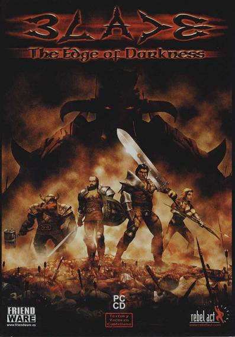
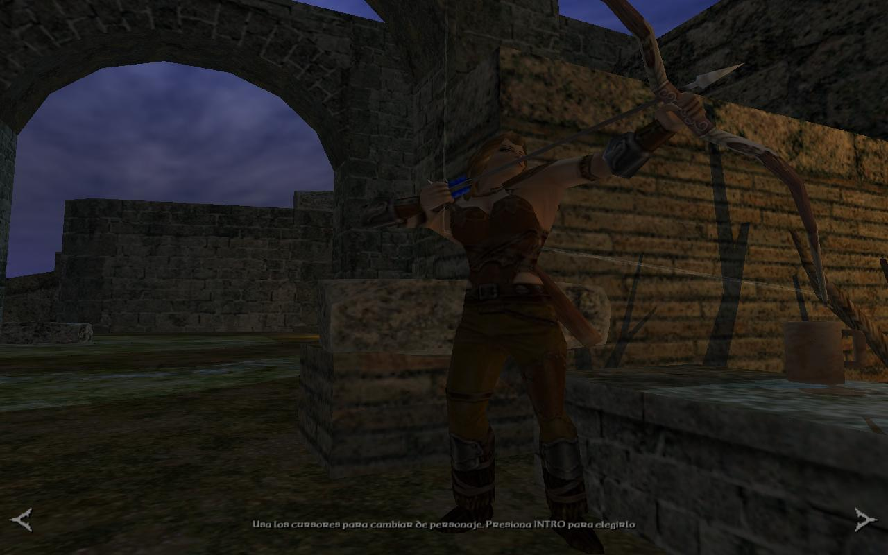
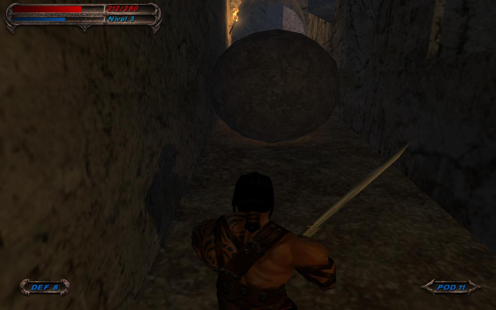
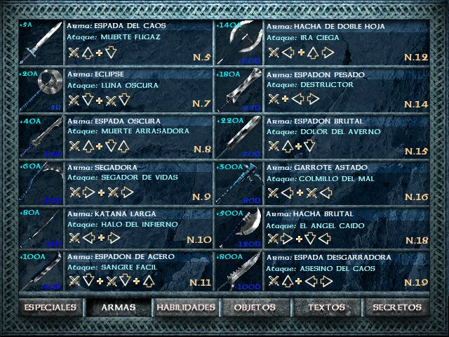
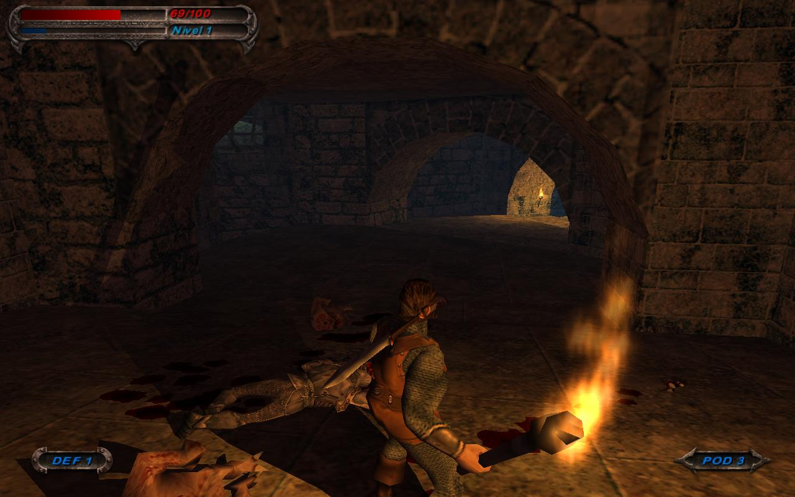

**Ficha técnica:**  
Título: Blade: The Edge of Darkness  
Desarrollador: RebelAct Studios  
Distribuidor: Friendware  
Pegi: +18  
Precio: 42.01 €

Ya a finales de la década de los 80, los estudios españoles eran de los más importantes a nivel internacional en lo que a producción de videojuegos se refiere. El éxito del software nacional venía desde las viejas aventuras conversacionales, pero fué con las primeras aventuras gráficas de apuntar y hacer clic con las que triunfaría. En los 90 se produjo un receso, hasta el punto de casi desaparecer por completo, y los lanzamientos relevantes se cuentan con los dedos de la mano, aunque han sido verdaderos juegazos: Commandos, PC Fútbol, Runaway y comenzando el milenio... Blade. Sagas distintas con propósitos muy distintos.

Blade: The Edge of Darkness comenzó a gestarse en 1998 con una expectación máxima creada gracias a las inspiradas capturas y las alabanzas de la crítica especializada. Se trata de un título realmente ambicioso y en el que se dan cita los ingredientes de una obra maestra. Hay cuatro personajes distintos con los que recorrer el mundo de Blade, para los que solo varía el primer nivel del juego. Son un bárbaro, un enano, una amazona y un caballero. Sus características están acorde con su estilo de lucha y las diferencias se notan al jugar. Dejo la elección a tu gusto.

De lo que no te librarás será de los intrincados niveles que componen la aventura. Este es uno de los juegos más difíciles e inusualmente largos que he probado. Todos los escenarios son enormes, y algunos requieren que los recorras un par de veces. Es más, como requieren un poco de exploración y encontrar ciertos objetos, lo más probable es que tardes horas (repito: horas) en completarlos. ¡Hasta tiene un final alternativo según tus acciones! En fin, lo de difícil es inherente a la ambientación del juego, así que prepárate.

La premisa de la que parte es la necesidad de que encuentres la mítica espada Blade para derrotar al príncipe de las tinieblas como ya hiciera Ianna eones atrás. De paso tendrás que mandar al cementerio a cientos y cientos de orcos de todo tipo, esqueletos, vampiros, trolls, golems, minotauros... y toda la fauna que puedas imaginar al estilo de "El Señor de Los Anillos". ¡Ah, bueno! Al señor de las tinieblas también vas a tener que darle matarile, pero eso es otro cantar... Esta es la principal causa de la dificultad del juego: los enemigos son numerosos, suelen estar bien armados y saben atacar. Quizás los más comunes no, pero cuando empiecen a acribillarte los esqueletos a tres bandas o los vampiros te tiendan una emboscada... Veamos por ejemplo como te pueden atacar los sacos de huesos. Atilano se coloca con su primo enfrente tuya, en diagonal, uno más adelantado que el otro. Atilano comienza entonces el combate sacandote la espada y provocandote. Tu bárbaro dice "Oh! ¡Con que esas tenemos!", asi que lo encaras. A continuación Atilano realiza un veloz movimiento con su espada que está a punto de darte, pero zafas por centímetros. Para evitar que te lo tomes a mal, el primo de Atilano avanza y te mantiene entretenido mientras el primero recupera la compostura y se cubre. Pero Atilano 2 no es tan hábil y en menos de nada le metes una estocada entre las costillas (literalmente), de modo que Atilano retoma el ataque mientras su primo se retuerce de dolor. Mantenerte ocupado y obligarte constantemente a cambiar entre un encare y otro es una buena forma de retar al jugador. Pero mejor aún es que entre un tercer esqueleto en discordia: es el tío de Atilano. El tío de Atilano ya está viejo y no puede acercarse mucho a tí porque lo desmenuzarías como migajas de pan, pero a distancia todavía puede ser un pasatiempo peligroso, de modo que con su espada lanza estocadas al aire esperando que en una de estas te pegues un corte involuntario con su filo. Pero no ocurre eso. En su lugar, Atilano se clava el acero de su tío sin querer y ambos se enzarzan en una pelea privada que solo puede acabar cuando uno de ellos caiga. Matas al primo de Atilano y esperas que el original se encargue de su tío. Cuando lo haga le das el pasaporte a él también y santas pascuas.

Pero tranquilo, a tu favor tienes una cantidad de combos que ya quisiera para sí Jackie Chan. Con armas como espadas a dos manos y un bárbaro puedes llegar a sentirte todopoderoso e invencible. Las armas... esas grandes desconocidas. Hay varias decenas: espadas, espadas a dos manos, hachas ligeras, hachas pesadas, hachas de guerra, mazas, garrotes, arcos, eclipse (para los más "exóticos"), cualquier objeto susceptible de ser empleado como melee o arma arrojadiza, lanzas... Tu personaje se adaptará mejor a un tipo concreto de armas, pero podrá usar cualquiera. Los escudos también son unos cuantos, y la interactividad está asegurada: ¿quemar cajas con una antorcha? Sí, hijo, sí. El dia a dia de un caballero cualquiera. Aprenderte los combos no es difícil, y su ejecución tampoco, pero requiere pericia, dedicación y un poco de práctica. Aunque acabas aprendiéndotelos y ejecutándolos casi intuitivamente, no está nunca de más pararse a practicar ese movimiento letal que se te resiste, porque si lo puedes hacer es porque lo vas a necesitar. Esto me sirve para comentar la pequeña vertiente rolera de Blade. Tu personaje tiene una barra de fuerza que va disminuyendo según enlazas combos uno detrás de otro, asi que tendrás que aprender a parar a tiempo para recuperar el resuello de tu aliento, porque si no lo haces te cansarás en medio de un combate y en menos de nada te destriparán. Según vas matando bichejos, tu experiencia aumenta y subes niveles que desbloquean nuevos combos y aumentan características como fuerza, vida o resistencia. Ten en cuenta los escudos y las pociones de salud diseminados a lo largo de los mapas porque son muy necesarios. Por cierto, ya que hablamos de las pociones de salud, no deja de ser curioso el detalle de que también el personaje puede comer carne seca, queso o mendrugos de pan que encuentra por el camino. El efecto es menor que el de la poción, pero el hecho se antoja realmente genuino e hilarante.

Hacer entrar en razón a un bárbaro que porta varios espadones, con tantas pociones que podría llenar (y seguramente vaciar) un minibar y que además está cabreado no debe ser fácil, pero en Blade puedes controlarlo directamente. Lo ideal es el teclado simplemente (aunque hay quien prefiere teclado y ratón) para poder mover con soltura los espadones y tener a mano las funciones más habituales: usar, saltar, lanzar, agacharse y encarar. Ésta es una clave de los combates del juego: encarar. Para no perder de vista a tus enemigos en ningún momento, puedes hacer que el personaje pase a moverse de forma relativa (acercarse, alejarse, moverse a su izquierda o a su derecha) al bicho en cuestión, y si tienes varios enfrente, rotar entre ellos. Así se evitan disgustos al jugador y se favorece la jugabilidad, porque de no encarar podrías terminar haciéndote un lio mientras cambias de arma, esquivas un ataque y miras a otro orco a un tiempo. La acción se desenvuelve en tercera persona, aunque puedes seleccionar varias cámaras e incluso una vista subjetiva en primera persona, pero no te la recomiendo porque es poco manejable. Conforme avanzas, pequeñas secuencias cinemáticas renderizadas en tiempo real con el propio motor del juego van mostrándote los pequeños entresijos de la trama, que tampoco es el colmo de la originalidad, pero está ahí y se agradece.

El apartado técnico brilla con fuerza en Blade. Unos gráficos realmente impactantes y con personalidad (aunque el agua no termine de convencer) y una banda sonora dinámica que se ajusta a la acción de cada momento. Mención especial para las voces (doblado al castellano perfectamente y con un narrador extraordinario) y para la física del juego. Está tan bien simulada que disfrutarás desmembrando a tus enemigos y luego arrojando su cabeza o sus extremidades a un precipicio, a lo alto de una torre, al agua para contar cuantas veces rebota antes de hundirse... Poder convertir a tus enemigos en carne picada es una de las señas de identidad de este juego. Incluso después de muertos, los cadáveres son susceptibles de ser movidos, despedazados, levantados, arrojados e incluso chorrean sangre cuando todavía están frescos. Y es que lo mires por donde lo mires, Blade es un juego violento y sangriento que muestra las vísceras y las amputaciones de tus adversarios sin tapujos. Disfrutar de una sangre realista, que cuenta incluso con la densidad de la sangre de verdad, es un placer; pero si te resulta desagradable o quieres que juegue alguien que no está preparado para semejante festín, siempre puedes activar el filtro parental que el propio juego incluye. Brillante.

Hasta dispones de un modo multijugador para luchar contra otros jugadores vía LAN o Internet, pero los combates se reservan para dos personas mientras el resto entra en un modo espectador hasta que llegue su turno. En definitiva, Blade es un juego rematadamente bueno. Tanto que no deberías dejarlo pasar y que se quedará durante mucho tiempo en tus retinas por su espectacularidad, pase el tiempo que pase tras su publicación. Si la piratería no hubiese acabado con RebelAct, habríamos disfrutado incluso de la versión para XBoX y de la segunda parte, pero ahora ya no hay remedio. Aprendamos de nuestros errores.

**NOTA: 8.5**

**Lo mejor de Blade: The Edge of Darkness:**  
Es largo y endemoniadamente desafiante gracias a la IA  
Los combates, los combos y los desmembramientos  
La ambientación, el nivel técnico y el control sencillo

**Lo peor de Blade: The Edge of Darkness:**  
Es dificil tanto en combate como en puzzles  
Los enfrentamientos limitados a 1 contra 1 en multijugador  
Algunos pequeños detalles técnicos

**Requisitos mínimos:**  
Pentium II 400 MHz  
Windows 95, 98, 2000, ME  
64 MB de RAM  
Tarjeta gráfica de 8 MB  
Tarjeta de sonido de 16 bits compatible con DirectX  
750 MB de espacio en Disco Duro (después de la instalación)

**Requisitos recomendados:**  
Pentium III 500 MHz  
Windows 95, 98, 2000, ME  
128 MB RAM  
Tarjeta gráfica 3D de 32 Mb compatible con DirectX 8.0  
Tarjeta de sonido de 16 bits compatible con DirectX  
750 MB de espacio en Disco Duro (después de la instalación)