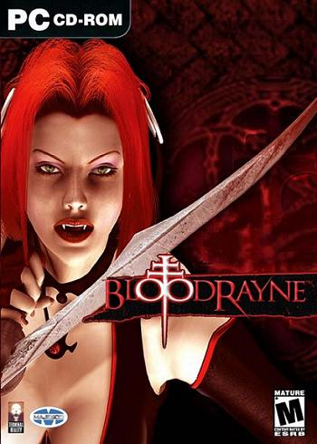
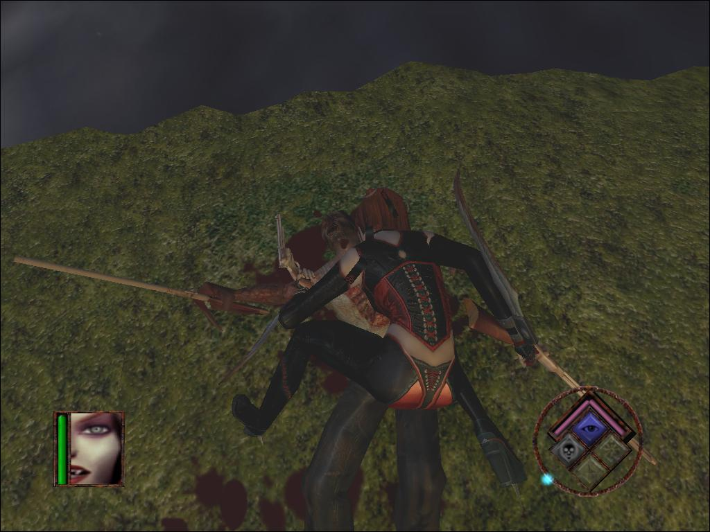
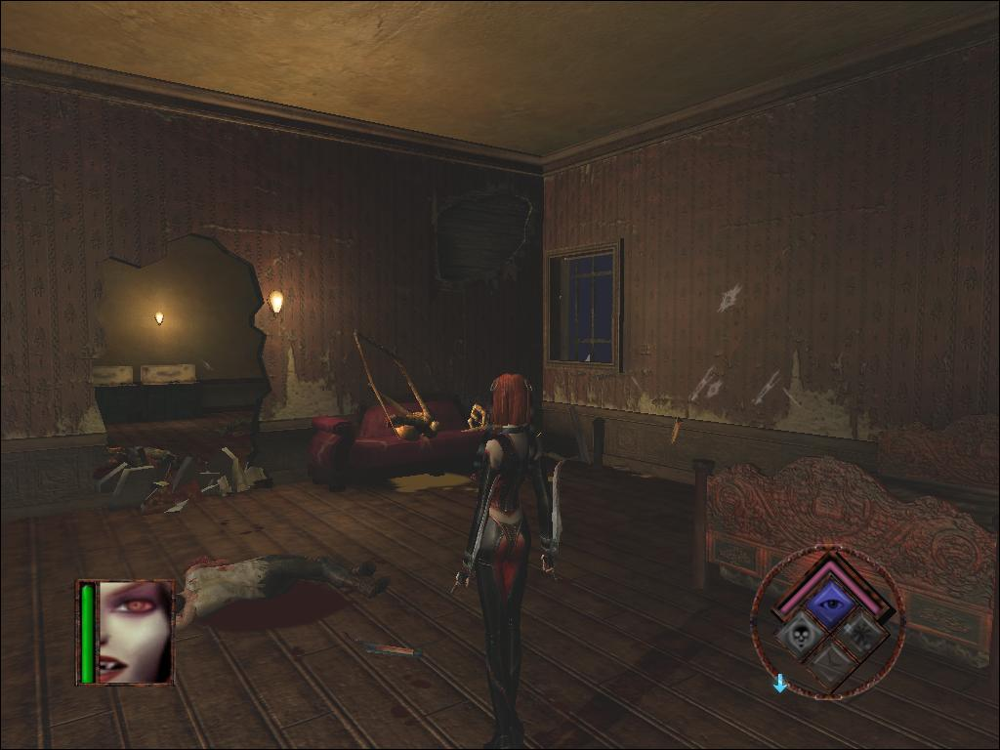
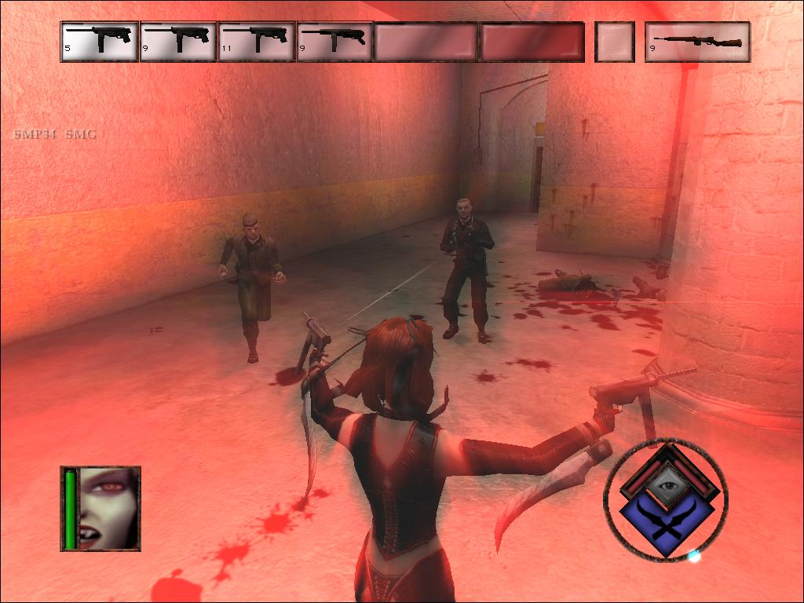
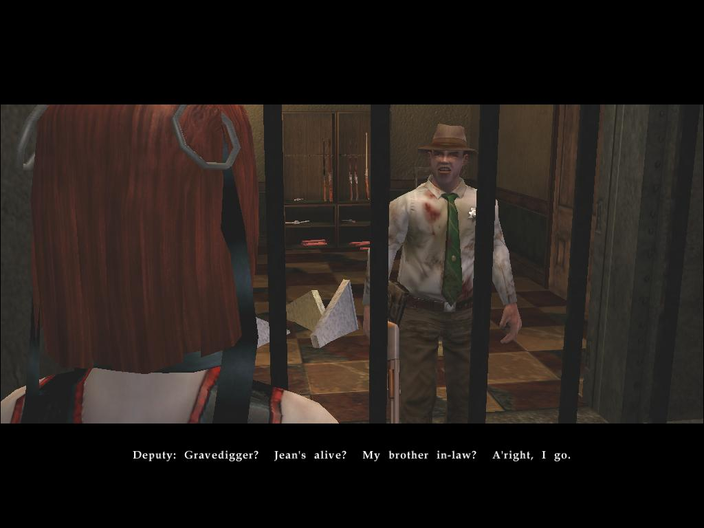
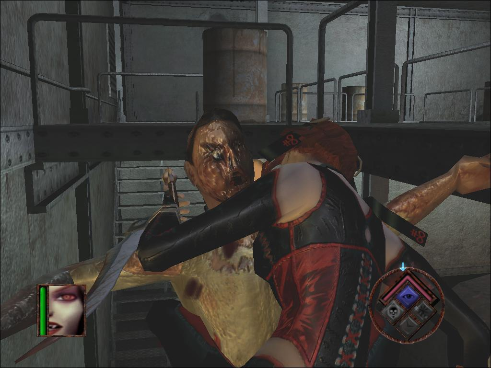

**Ficha Técnica:**  
Título: Bloodrayne  
Desarrollador: Terminal Reality  
Editor: Majesco  
Precio: 45,95 €  
Pegi: +18 Web: http://www.bloodrayne.com/

Bloodrayne es, como mínimo, un juego sangriento. Como mínimo. Simplemente cogiéndolo en tus manos entenderás el porqué: protagonista femenina de curvas increíbles ligerita de ropa, nazis y experimentos. Pero ándate con ojo, porque esto no es Wolfenstein.

A tu protagonista y a sus amigos les salen unos colmillos enormes y tienen la fea costumbre de beber sangre, cuanta más y más fresca mejor, y además poseen una serie de habilidades de lo más curiosas. Para iniciarte en la aventura, un pequeño tutorial te guía durante (al menos) media hora. En él encontrarás caracterizada a Rayne, la heroína, y a sus principales enemigos. Un apunte: procura practicar todos los movimientos que se te ocurran. Bloodrayne es un juego basado en combos y hay tantos que los tiempos muertos del tutorial (no muy abundantes aunque bien calibrados) serán el instante idóneo para practicarlos.  
Sin embargo, no todo se basa en aporrear teclas. Como en la mayoria de tutoriales, el juego te invita a enfrentarte a los principales tipos de puzzle diseminados en la historia. Aquí suelen basarse en alcanzar ciertos puntos del escenario caminando por el cable telefónico o saltando sobre los tejados de las casas. Es decir, se trata más de plataformas que puzzles, ya que apenas hay un par de "llave roja abre puerta roja". Otro punto que perjudica a los tutoriales es que en ellos se suele arriesgar demasiado. Se muestra lo que se debería descubrir jugando, se resta vida al juego. Porque en estas fases, se procura que el desarrollo sea fluido y adictivo, y por ello los programadores muestran todas sus cartas en los primeros instantes del juego.

La historia no es el punto fuerte de Bloodrayne (ya la has visto miles de veces), pero te envuelve gracias a una ambientación muy lograda y a unas escenas de video (algunas prerrenderizadas con una calidad pasmosa, otras cinemáticas en tiempo real) rodadas con un gusto y una calidad exquisitos. Son de notable alto, tal vez solo superadas por juegos de mayor empaque como [Max Payne 2](../../../2003/11/max-payne-2/) o Halo. Estas escenas nos irán revelando una trama oscura situada entre las dos Guerras Mundiales, donde Hitler pretende alcanzar la victoria utilizando un arma secreta venida del más allá. Pero claro, adivina quién tiene que impedirlo. Pues si: una vez más te tocará repartir leches al ejército alemán ("¡Por dios! ¿Cuando los venceré de verdad?") y, en consecuencia, llevar la Historia por el cauce adecuado.

Vayamos a la chicha. Lo más llamativo del juego (obviando a la atractiva protagonista) son los movimientos y los poderes que puedes utilizar.  
Lo primero es una especie de camara térmica, muy en la linea de Splinter Cell o Metal Gear Solid, llamada "Visión de Aura", con la que puedes ver a tus enemigos a través de las paredes o identificarlos a lo lejos. Su utilidad es relativa, porque Rayne tiene una velocidad punta envidiable para cualquier protagonista ([Serious Sam](../../../2005/11/serious-sam-2/) incluido) y el mejor método para acabar con un enemigo suele ser embestirlo y morderlo o bien dispararle con el botón secundario del ratón.  
Luego tienes una cámara lenta "bullet time" muy al estilo Max Payne aunque adaptada. No se acaba y puede suponer el mejor truco para terminar la aventura, aunque tardarías varias semanas. Créeme, cuando te digo que es lenta quiero decir que es lenta de veras. Inexplicablemente los enemigos también tardan más en morir (contabilizando los golpes recibidos) que a la velocidad estándar.  
También existe una vista de zoom en primera persona y, por último, dispones de la mejor herramienta para combatir efectivamente a tus oponentes. El modo "Blood Rage" (o modo sangriento) es un canto a Mátrix, Blade y Underwold. Cuando lo activas (solo puedes cuando te has cargado a suficientes enemigos), Rayne comienza a moverse a una velocidad de vértigo (Matrix), acuchilla con una facilidad pasmosa a sus enemigos (Blade) y sus balas resultan totalmente mortíferas (Underworld). La mención al cine también lleva de la mano una mención al videojuego. Los combates de Bloodrayne rayan a la altura de títulos de prestigio como los nuevos Prince of Persia.

Mención aparte merece también la factura técnica del título: graficos decentes (para un juego de 2003), sonido de calidad (soporte hasta 6.1 nativo, EAX) y suficientes opciones de ajuste gráfico (pudiendo correr bajo DirectX y OpenGL). Pero resulta increíble el nivel de física exhibido. Necesaria en un título de plataformas y destrucción, su aplicación está más que nunca a favor de la experiencia de juego. Calderas que explotan, cristales que se rompen, mesas que revientan con una patada de la vampiresa. No es [Half-life 2](../../../2007/10/half-life-2-episode-two-orange-box/). Tampoco [FEAR](../../../2005/11/fear/) y por supuesto, tampoco es [Crysis](../../../2007/12/crysis/). Pero resulta muy convincente y entretenido comprobar el estado de algunos escenarios tras algun enfrentamiento. Ni qué decir tiene que la sangre salta, salpica y mancha a borbotones, de forma exagerada pero acorde con la tónica general del juego.

Si algo se le puede echar en cara a Bloodrayne es su sencillez y su linealidad. En serio, salta al nivel medio de dificultad porque sino el juego te durará un suspiro. En cuanto a los escenarios, pecan de un encorsetado tal vez excesivo. Cierto es que en ocasiones puedes eliminar a los enemigos en el orden que prefieras (caso de la misión en la que tienes que matar a varios generales de III Reich), pero el juego se vuelve bastante pesado cuando no encuentras el camino, que no siempre es obvio. Peaje obligatorio por recibir un título de XBox. Compensa, eso si, el hecho de poder guardar la partida cuando quieras, algo que no todas las conversiones pueden permitirse. Incluso ese mito llamado GTA arrastra el tremendo lastre de los puntos de guardado.  
Por cierto, que otro error en el diseño artístico de los escenarios es la pobre decoración que a veces dificulta la orientación. Vale, los alemanes no eran muy simpaticos, pero sabían decorar sus casas o, al menos, colocar un par de socorridos cuadros. Aún así, es un problema menor que no empaña el resultado final. Tampoco las voces son un punto a su favor, pues el juego está totalmente en inglés. Falta un doblaje y una localización adecuada, porque no se han traducido ni los subtitulos. Eso si, no te perderás la sensual voz de Rayne y los espeluznantes gritos de aquellos mordidos por la chupasangres.

En resumen, un título más que correcto que no pretende ser innovador, sino aunar una serie de buenas ideas que lo catapultan en la puntuación final. Lástima del doblaje y de un personaje que podría haber dado mucho más de si; así que Bloodrayne será un título sencillamente agradable para el jugador casual. No está exento de fallos ni supone una revolución, pero sus pretensiones tampoco son esas.

**NOTA: 6** 

**Lo mejor de Bloodrayne:**  
Ambientación  
Combates  
Protagonista

**Lo peor de Bloodrayne:**  
Lineal  
Detalle de los escenarios  
Muy fácil

**Requisitos mínimos:**  
Windows 98, Windows 2000, Windows XP  
Procesador 733 MHz Intel o AMD  
128MB RAM  
2 GB de disco duro  
4x CD-ROM  
64MB GeForce2 o Radeon  
Microsoft DirectX 8.1

**Requisitos recomendados:**  
Windows XP  
Pentium 4 2.53GHz o AMD equivalente  
512MB RAM  
2 GB de disco duro  
24x CD-ROM  
GeForce4 Ti 4600  
Sound Blaster Audigy  
Microsoft DirectX 8.1