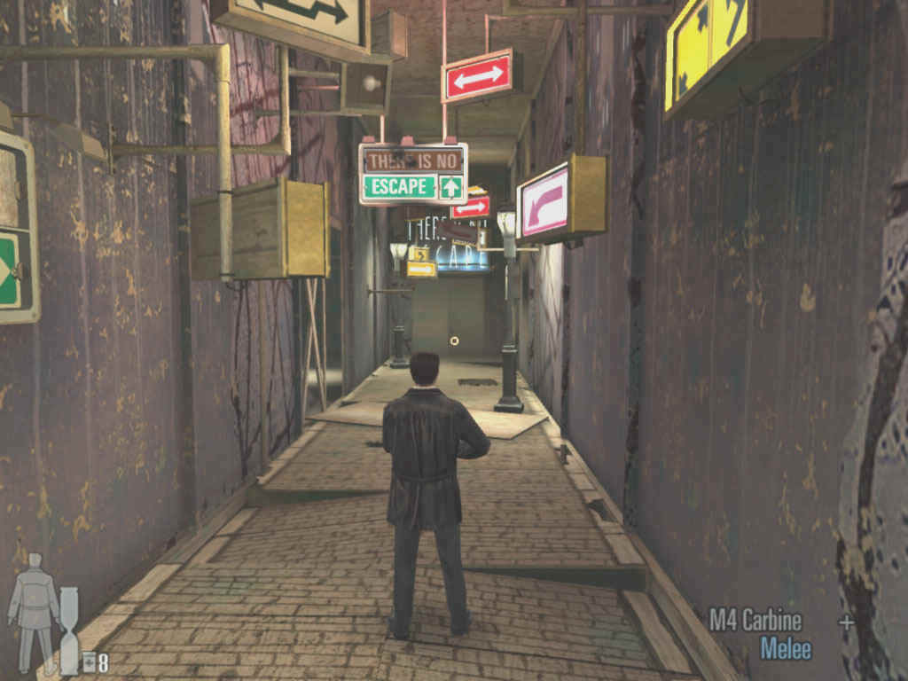

 

**Ficha Técnica**  
Título: Max Payne 2: The Fall of Max Payne  
Desarrollador: Remedy Entertainment  
Editor: Virgin Play  
Precio: 45,95 €  
Pegi: +18  
Web: http://www.maxpayne.com/

Bueno, hace unos días cayó en mi poder uno de los mejores juegos a los que he jugado nunca, aunque a mi me gusten la mayoría, ya sea por gráficos o por el argumento, la jugabilidad, etc... Pues bien, en este se juntan todos los aspectos que a mi mas me gustan. Y los cumplen a la perfección. Es decir, que mientras que no terminé el juego no pude dejar de jugar. Os estaréis preguntando de que juego estoy hablando, pues bien, el juego es "Max Payne 2". Sin duda es una de las mejores segundas partes de juegos, ya se sabe el dicho de que segundas partes nunca fueron buenas, esta es una de las excepciones.

Pasemos a examinar el juego. Para aquellos que no tuvieron el placer de jugar a la primera entrega, en esta les trae un pequeño prologo en el que se detalla la anterior trama. Vamos a dar nosotros también una introducción para hacer más la boca agua. Veamos, Max Payne es un agente de la Policía de Nueva York (NYPD), un buen agente, y un buen cabeza de familia. pero un día llega a casa y se encuentra con que su mujer y su hija han sido asesinadas por un grupo de yonkis colocados con un nuevo tipo de droga, Valkyr. Tras este suceso, la vida de Max da un giro y se infiltra en las redes de la mafia para descubrir y terminar con el responsable de esta droga. Pero es descubierto, le tienden una trampa, y matan a la única persona que sabe que Max es un policía de incógnito. Max decide seguir con la investigación, ahora perseguido por los dos bandos, la policía piensa que es un asesino, y la mafia quiere matarle por traidor. Max comienza a eliminar a los mafiosos mas poderosos de la ciudad hasta que llega al responsable total de la nueva droga, Nicole Horne. Tras saciar su sed de venganza, se entrega a la policía, y gracias a las pruebas que posee vuelve a incorporarse al NYPD. En la segunda entrega, el tiempo a transcurrido, y de estos hechos hace ya 3 años.

Bien, tras habernos centrado en la trama (ya se que no cuento nada de la trama de la segunda parte, pero es que no quiero contaros los entresijos del juego) jugadlo, os aseguro que no tiene desperdicio. Pasemos pues a las innovaciones hechas en esta nueva entrega. En el apartado grafico se observa una gran mejora. En primer lugar las texturas han mejorado mucho. El rostro de nuestro héroe ha cambiado, ya no tiene un rostro frío e insensible, ahora se pueden observar emociones y otros rasgos. El motor grafico cumple las leyes físicas más fielmente que su predecesor, así, en las explosiones el comportamiento de los objetos y los cuerpos de los cadáveres o enemigos, es mas real. Los escenarios tienen la misma ambientación oscura que en la primera parte, aunque son mas interactivos, pudiendo "manipular" casi todos los objetos, y también destruir ciertas partes de ellos, llegando en algunos casos a poder destruir habitaciones enteras. Los efectos con las luces están muy logrados, llegando en el caso de las explosiones a parecer casi reales. Aunque el fuego no esta tan cuidado para mi gusto. En el apartado de efectos, le falta algo que por el momento no he visto en ningún juego, de los que yo he disfrutado claro, (esto es para los desarrolladores, si es que alguno lo lee. :P) y es que cuando quemas a los enemigos, o los haces saltar por los aires, sus caras y sus cuerpos siguen tal y como estaban antes. Ya se que hay juegos en los que los cadáveres quedan mutilados, y hay sangre por todos lados, pero ¿acaso en algún juego aparece algún cadáver o persona quemada, con el rostro desfigurado por las quemaduras?

En esta segunda entrega también se ha incorporado el tiempo bala 2.0, han ampliado la duración de su efecto, y han añadido la posibilidad de recarga rápida, que es simplemente impresionante, muy al estilo "Matrix". En esta segunda entrega también jugaremos con un nuevo personaje, Mona Sax, a la que ya vimos en la primera parte, y que en esta tendrá una pequeña gran aventura con nuestro héroe. Su control es casi igual al de Max. En definitiva: este es un juego que podría ser considerado como uno de los mejores del año, por el momento, para mi el mejor. Como nota informativa, el juego esta recomendado para mayores de 18 años, y no es solo por las escenas de violencia que en el se pueden ver...

**NOTA: 8.5**

**Lo mejor de Max Payne 2:**  
Nivel de detalles  
Animaciones  
Efectos y sonido

**Lo peor de Max Payne 2:**  
Duración  
Los personajes se comportan igual  
Inteligencia artificial en ciertas ocasiones

**Requisitos mínimos:**   
Procesador 1 GHz Pentium III / Athlon o 1.2GHz si posees un procesador Celeron o Duron   
Tarjeta gráfica de 32 MB compatible con DirectX 9, con soporte AGP y HW T&L   
256 MB RAM   
1.7 GB de disco duro   
Windows 98, Windows ME, Windows 2000 o Windows XP   
DirectX 9.0   
Raton y teclado   

**Requisitos recomendados:**  
Procesador 1.4 GHz Athlon o 1.7 GHz Pentium 4, Celeron o Duron  
Tarjeta gráfica de 64 MB compatible con DirectX 9, con soporte AGP y HW T&L  
512 MB RAM  
1.7 GB de disco duro  
Windows 98, Windows ME, Windows 2000 o Windows XP  
DirectX 9.0  
Ratón y teclado