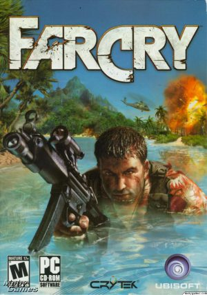
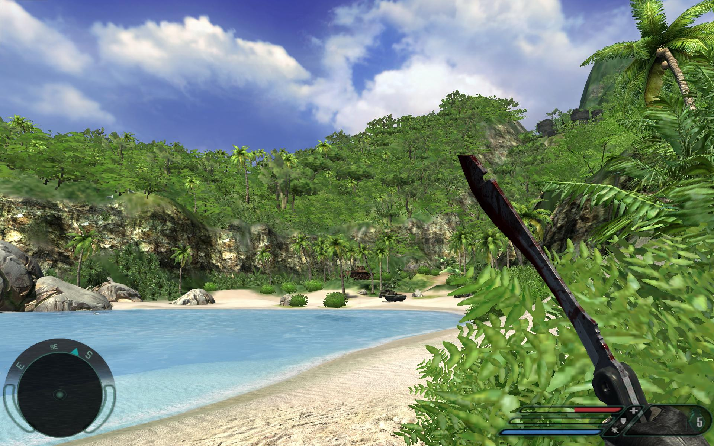
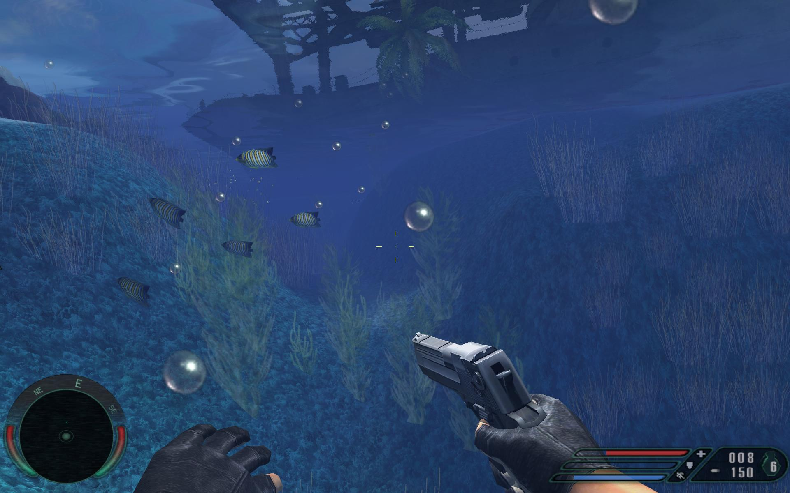
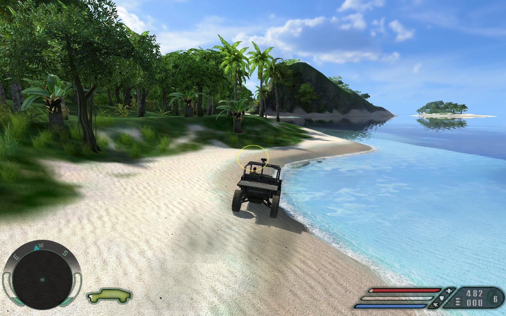
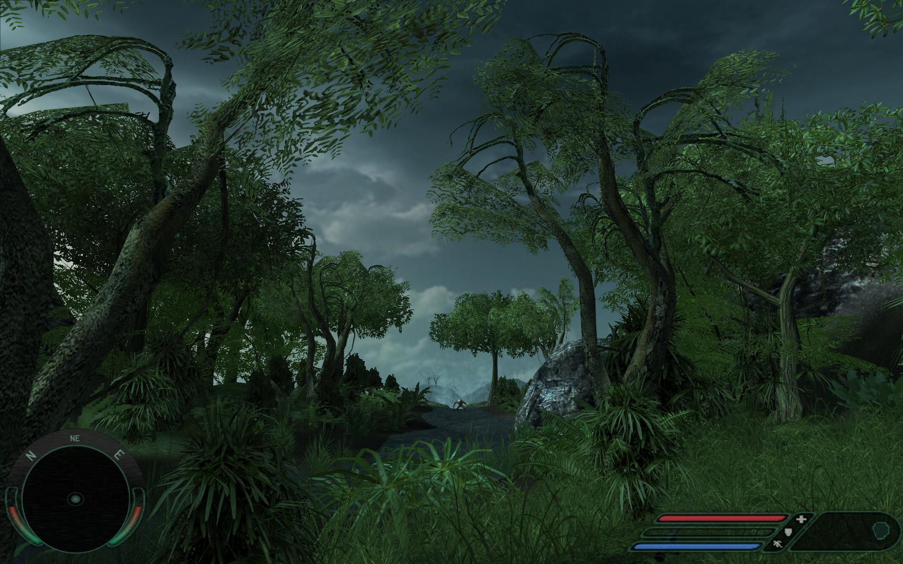
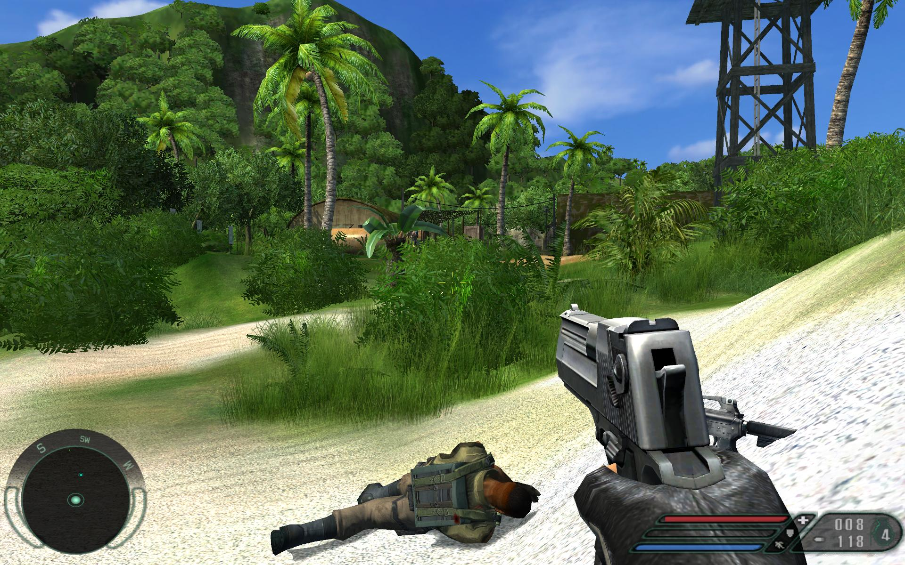
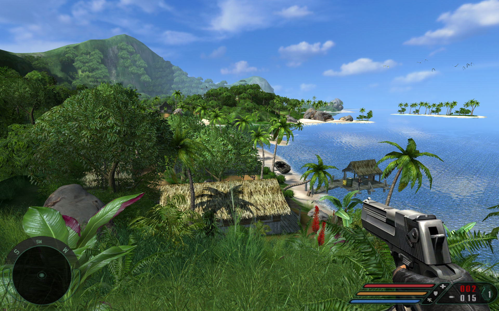
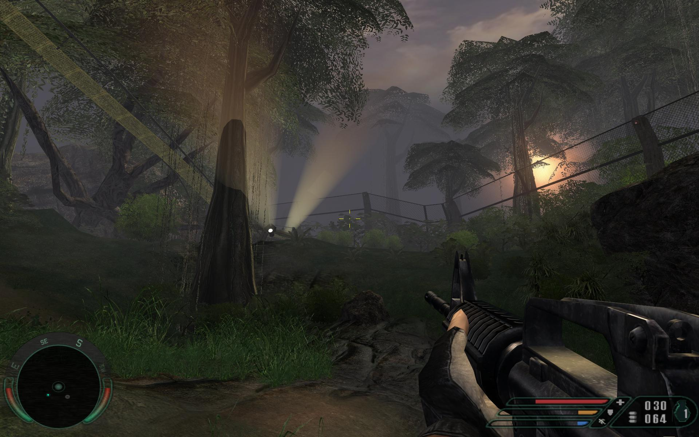

**Ficha Técnica:**  
Título: Far Cry  
Desarrollador: Crytek  
Editor: Ubisfot  
Precio: 49.95 €  
Pegi: +16  
Página web: http://www.farcry-thegame.com/

Far Cry es un juego de acción en primera persona, sus creadores son el equipo Crytek y este es su primer juego, así que para ellos es un todo o nada. Para ganar bazas a su favor, los programadores de esta compañía de la República Checa han desarrollado una tecnología realmente apabullante sobre la que exponer todos sus argumentos. La base es realmente sólida: el motor CryEngine es de lo mejorcito que hemos visto nunca. Aprovecha al máximo todos los recovecos que DirectX 9 proporciona y lleva al extremo el realismo gráfico. Este despliegue de potencial se traduce en unos ingredientes increíbles.

Tu nombre es Jack Carver, y te dedicas a hacer pequeños viajes para turistas en una zona concreta del Océano Pacífico. Todo normal hasta que llega la chica, Valerie Cortez, que te pide que la lleves a un archipiélago a sacar unas pocas fotos. Aceptas mientras miras las dos "razones" que te dá. Pero nada más lejos de la realidad. Cuando apenas estás llegando a tu destino un misil hace volar tu embarcación por los aires y sobrevives de casualidad. Valerie desaparece y claro, tú solo, en una isla desierta, con una dama en apuros y unos mercenarios con mala leche. Huele a chamusquina. ¡Ojo! Si eres de los que se saltan la escena introductoria de todos los juegos deberías hacer un esfuerzo. Los videos en Far Cry son como las películas de Tarantino. Pocos pero rematadamente buenos. Lo cierto es que hay un viejete con ganas de aguarte la fiesta: G. W. Kriegger. Bajo su mando, en esa isla se están llevando a cabo unos experimentos genéticos que acaban como todos los experimentos en la historia del videojuego: rotundamente mal. Como el rosario de la aurora, vamos. Ahora solo te falta adivinar quien salva a la chica y se carga al malo ;)

El primer vistazo a Far Cry deslumbra. Un mundo hiperrealista donde las olas del mar bañan la orilla, los pájaros salen volando cuando pasas por su lado, el viento meciendo las hojas de las palmeras... Un escenario paradisíaco inconfundible y que hasta ahora nadie ha conseguido imitar. Y no está ahí por pura casualidad. En frente tuya tienes todo un ejército de mercenarios que esquivar para llegar a buen puerto, pero la forma en que lo hagas depende básicamente de tres factores clave: tu habilidad con las armas, tu instinto de supervivencia y el escenario. Imagina que te encuentras oculto entre la hierba alta de la selva, y necesitas entrar en un bunker fuertemente custodiado y situado a unos 100 metros. A tu derecha hay una torreta con un francotirador y a tu izquierda un grupo de soldados charlando tranquilamente. En la puerta del búnker, otro par de mercenarios armados. Puedes salir a pecho descubierto y cargártelos a todos en un tiempo record, sufrir para evitar al francotirador y meterte de lleno en el subterráneo. Pero tus enemigos saben defenderse y tu salud no es infinita, amén de la habilidad que tu maniobra requiere. En Far Cry no. Tus neuronas pueden ser mucho más valiosas.

Con algo de experiencia aprenderás que tal vez lo mejor sea seguir ocultandote entre el follaje mientras te mueves sigilosamente, despacio y sin hacer ruido hasta la escalera de la torreta. Subes evitando llamar la atención, y al llegar arriba le cortas el gaznate al tirador con tu machete sin que tenga tiempo siquiera de pestañear. Con una granada puedes deshacerte del grupo de mercenarios y eliminar a los dos guardas usando el rifle de precisión que el buenazo del "franco" te ha dejado. El escenario cuenta, y mucho. Más que en ningún otro título, sin duda. De tu habilidad con las armas también depende la aventura. Cuanto más uses un arma mejor puntería tendrá Jack, pero sé precavido: las balas escasean y solo puedes llevar cuatro armas encima al mismo tiempo. Por otra parte, los enemigos aprenden. La IA de tus oponentes se adapta a tu estilo y a tu nivel de juego. Si entras a saco muy a menudo, acabarán por utilizar la fuerza bruta. Si por el contrario te gusta ir a lo "Enemigo a las puertas" y apuntar a la cabecita desde el otro extremo de la isla, el juego se convertirá en un infierno donde un paso es una pista para los tiradores; porque un ruido o una sombra es suficiente para alertarlos. Se cubren, atinan bastante bien, tratan de rodearte, emplean tácticas complejas, protegen a sus superiores, piden refuerzos por tierra, mar y aire... Los mercenarios son realmente duros de pelar. Y eso no es nada. Cuando topes con los primeros mutantes verás lo que es bueno. Sencillamente brillante.

Por otra parte, tienes unos estupendos vehículos a tu disposición: el boggie, todoterrenos, camionetas, zodiacs, lanchas y ¡¡¡hasta un ala delta!!!. El manejo es realmente sencillo, son útiles, la fisica está bien calculada, suelen estar equipados con armamento y permiten atropellar mercenarios. ¿Qué más se puede pedir? En cuanto a las armas (pese a la ya mencionada limitación de llevar 4 al mismo tiempo) son muy variadas. Comienzas con el machete, la pistola, un subfusil... y terminas con metralletas, francotiradores y lanzacohetes (amén de las granadas aturdidoras, las de humo y las de fragmentación). Ah! Y no te olvides de las cajas y barriles explosivos, que nunca pueden faltar en un juego de acción :D

La creación de Crytek es una obra larguísima, en parte debido a un escenario de unos cuantos kilómetros cuadrados en el que a veces solo apetece pasear, que te mantiene en tensión desde el primer hasta el último segundo, y sería descabellado revelarte el argumento. No va para oscar ni los protagonistas ganarán nada por sus actuaciones, pero resulta tan inmersivo y la sensación es tan contundente que siempre quieres más. Por delante tienes 20 niveles. Un pequeño pero: la dificultad. A veces la curva de aprendizaje no es lo suficientemente suave, y los últimos niveles son dificilísimos, incluso con dificultades bajas. Por cierto, que este inconveniente se vé afectado también porque no puedes guardar la partida cuando te da la gana, sino que lo hace el juego por el famoso sistema de los puntos de control, o al completar un objetivo. ¿Cansado? Pues aún tienes un modo multijugador. La pena es que se parece a los chicles de fresa. Comienza muy bien, y moverse por la isla junto a otros es realmente divertido. Pero cuando ya has masticado un poco te dás cuenta de que no es nada que no hayas visto antes. Tienes tres modos de juego: Deathmatch, Deathmatch por equipos y una especie de modo torneo en el que debes controlar puntos del escenario o dar apoyo a tus compañeros según el rol que hayas preferido encarnar. Con solo ocho escenarios y tan poca variedad, el multijugador parece un añadido de última hora; pero eso sí, Far Cry es un título que no lo necesita. Si lo incorpora, aunque sea discreto, pues bienvenido; pero en absoluto es algo que haya que probar de forma obligatoria. Guárdalo solo para momentos puntuales.

Para mover esta maravilla necesitas un PC decente, sobretodo si lo llevas al extremo. Los posteriores parches han incluso mejorado el juego, añadiendo más efectos si cabe. Lo más destacable es que para rebajar los requisitos de unos gráficos así se ha recurrido a una técnica interesante. Los modelos 3D no cuentan con tropecientos polígonos, pero usando texturas de alta resolución y los sistemas de iluminación adecuados aparecen como si tuviesen mucha más geometría en su diseño. Con esto se pretende reducir la carga sobre la tarjeta gráfica, si bien en la práctica los resultados son algo menores de los prometidos. Si tu PC cuenta con un procesador de 64bits puedes incluso disfrutar de una versión especialmente creada para gozar de mejor representación de detalles y una línea de horizonte aún más lejana. Presta atención también al sonido. Si alertas a un guarda por mover unas ramas o tropezar con una silla puede que estés perdido. Lo mejor en estos casos es disponer del sonido multicanal que ofrece el juego, con aceleración por hardware, EAX y Doppler. Recuérdalo, el sonido es importantísimo en esta aventura. Como ves, jugar a Far Cry es toda una experiencia. Más allá de las armas, los enemigos y los vehículos, tienes un juego que inspira LIBERTAD con mayúsculas. Si ves un punto del escenario (que llega hasta la línea del horizonte) puedes ir. Si ves una edificación puedes entrar. Si prefieres subirte a la colina más alta, adelante. No hay muros ni laberintos para ratones, ni caminos distintos que acaban siendo el mismo. Todo eso junto a una factura técnica impecable, que vá mucho más allá de los simples gráficos (por otra parte colosales) o de detalles puntuales. Pisa la arena y sabrás a qué me estoy refiriendo. Sumérgete en un arrecife y sabrás que te quiero decir. Es realismo puro y duro. Una bofetada a todo lo anterior. Poder resolver la aventura de la forma que te plazca es, a fin de cuentas, la consecuencia directa última y racional de todo este esfuerzo tecnológico.

Como decíamos al principio, Far Cry es el primer juego de Crytek. Alcanzar la cima con la ópera prima es algo que solo ha conseguido una compañía: Valve Software con Half-Life. Pero lo mejor es que, de hecho, nada se parece más a Far Cry que el propio Far Cry; aunque el próximo titulo de Crytek, [Crysis](../../../2007/12/crysis/), será una revisión de muchos conceptos y una puesta al día de otros. Y ya para terminar, Far Cry se deja rejugar perfectamente y técnicamente le puede dar un repaso a títulos que vengan en los siguientes meses. Es una roca tirada con catapulta hacia tus retinas. Espectacular, adictivo y con tanta, tanta personalidad que no te olvidarás de el en mucho tiempo. Una obra maestra instantánea. Si todavía no lo has jugado, hazlo.

**NOTA: 9.5**

**Lo mejor de Far Cry:**  
La tecnología es brutal  
Sensación total de libertad  
Su personalidad y jugabilidad

**Lo peor de Far Cry:**  
Los requisitos  
La curva de dificultad  
El sistema de guardado

**Requisitos mínimos:**  
Windows 98/2000/ME/XP  
Pentium 4 1.0 Ghz o AMD equivalente  
256 MB RAM  
4 GB de disco duro  
16x CD-ROM o 4x DVD-ROM  
GeForce 2 o ATI 8500 con 64 MB  
Microsoft DirectX 9.0

**Requisitos recomendados:**  
Windows XP  
Pentium 4 2.0 GHz o AMD equivalente  
512 MB RAM  
4 GB de disco duro  
32x CD-ROM o 8x DVD-ROM  
GeForce 4Ti/ ATI 9500 128 MB  
Microsoft DirectX 9.0