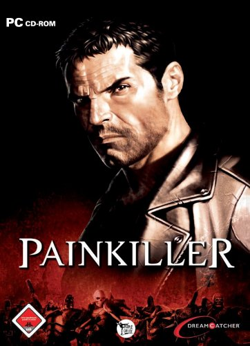

**Ficha Técnica:**  
Título: Painkiller  
Desarrollador: People Can Fly  
Editor: Virgin Play  
Pegi: +16  
Precio: 44 €  
Página web: http://www.painkillergame.com/

Painkiller es un videojuego destinado a ser complicado. No me refiero a que terminarlo sea más dificil de lo normal, sino a que resulta complicado entender sus pretensiones. Se trata de un título de acción clásica: mata-muere-resucita. Nada más y nada menos. ¿Divierte?

La premisa de la que parte es tu propia muerte, Daniel Garner. Estas muerto por culpa de un accidente de tráfico, pero las puertas del cielo no se han abierto para tí. Tampoco eres un mal tipo (a pesar de tu rudo aspecto), por lo que no irás al infierno. Así que de buenas a primeras te ves en medio de un purgatorio en el que todos los bichos van a por tu sangre. Es un guión ciertamente estúpido e irrelevante, pero el recurso del purgatorio da mucho de sí. Nota: el doblaje es pésimo. Como por ejemplo para enfrentarte a monstruos de lo más variopinto en escenarios oníricos de toda clase. Tienes unas cincuenta clases distintas de enemigos que te asaltarán a lo largo de 5 capítulos y 20 niveles, utilizando un armamento digno de Van Helsing. Y estos tres factores (enemigos, armas y escenarios) son los que pueden determinar la calidad de un juego, así que observémoslos a fondo. Sobre los primeros... son muchos, muy muchos. Painkiller simplemente los va enviando en oleadas hacia tí. Muchos de estos enemigos gozan de un diseño artístico de primera calidad, como por ejemplo los monjes o los cardenales. Son simplemente carne de cañón mientras no llegues al final del nivel, dónde Painkiller muestra su verdadero "Yo".

Los monstruos de final de nivel son unas moles espectaculares de peso astronómico y altura tendiendo a infinito más uno. Inolvidables es el mejor calificativo, y entre ellos encontrarás un enorme muerto viviente, un ogro... todos y cada uno de ellos con su particular forma de atacarte y sus pequeños puntos débiles, que deberás descubrir antes de que acaben contigo. Entre jefe y jefe de nivel, las hordas de oponentes funcionan como en [Serious Sam](../../../2005/11/serious-sam-2/): superada la primera y la segunda (y a veces sucesivas) oleadas de enemigos, se abre la puerta de la siguiente estancia en la que se repetirá la jugada. Es cierto que el juego anda sobre raíles porque dispones de la omnipresente flecha que te indica el camino, pero evita que te atasques o que no sepas donde está ese ultimo bichito esperando tu plomo.

Las armas no son nada del otro mundo (suponemos que se las habrán llevado de importación al susodicho purgatorio :D) porque las conocemos de otras aventuras: la cuchilla giratoria a modo de batidora, una escopeta, la ametralladora reglamentaria y unas ballestas muy interesantes: la clásica, la múltiple y una que envía misiles que rebotan en las paredes. Son seis. Pocas. Sin embargo cuentas con el disparo secundario, en el cual te reencontrarás con auténticos mitos como "el congelador" con el que puedes convertir a tu enemigo en un cubito de hielo para luego eliminarlo a placer de la forma que más te apetezca. O unas granadas que nunca vienen mal. Todo el armamento es útil, pero se echa en falta un poquito más de variedad y achacan pequeños defectos como que la ametralladora consume los cargadores demasiado rápido o que la cuchilla es innecesaria superada la primera hora de juego. Si las armas y los enemigos no están mal, los escenarios tienen algo especial. Cuentan con un nivel de detalle alto y son enormes, pero destacan también por ser una especie de recopilación de los mejores platós de rodaje: el típico cementerio, la casi obligada iglesia (o en su variante, catedral), unas ruinas... No han derrochado imaginación, pero por lo menos no desentonan ni tienen fallos graves. Otra característica muy interesante es que ofrecen una complejidad superior a la normal: estructuras, escaleras, objetos destructibles y unos efectos de iluminación que rozan el sobresaliente.

Lo más divertido de todo el juego, amén de masacrar enemigos, es el hecho de ir superando pequeños objetivos que te exige el nivel para obtener una carta del Tarot Negro, que no significa más que la posibilidad de utilizar bonificaciones de vida, armadura, velocidad, resistencia, etc. Debes recojer almas, encontrar objetos mágicos, oro, destruir cosas y otra clase de trabajitos por el estilo para conseguir las cartas y de paso ayudarte a avanzar: los botiquines no abundan, pero recojer las almas de tus enemigos alivia en cierta medida tu sufrimiento. Y cuando se activa el modo berseker... muahahahaa!! Temblad!! Es demoledor. La pena es que se haya desaprovechado un punto de partida interesante, pero al menos las 7 u 8 horas que dura Painkiller se sobrellevan la mar de bien.

Si tenemos en cuenta sus (muchas) virtudes técnicas, sus graficos colosales, su banda sonora, su excelente mecánica; Painkiller se convierte en un peso pesado. Por mucho que sea una fórmula caduca, siempre apetece volver a probar lo mismo, como el coche que ya has tenido pero que te gusta y quieres otro igual. No es revolucionario, no es histórico ni tampoco una obra maestra. Tiene defectos y puntos oscuros, pero aun así divierte exageradamente, como en su dia lo hicieron los clásicos. Painkiller huele a tributo a una época pasada con una tecnología solvente. Jugarlo es una buena idea.

**NOTA: 8**

**Lo mejor de Painkiller:**  
Velocidad  
Escenarios y enemigos  
Nivel técnico

**Lo peor de Painkiller:**  
A veces dificil  
Armas insuficientes  
Guión desaprovechado y doblaje horroroso

**Requisitos mínimos:**  
Windows 98/ME/2000/XP  
DirectX 9.0  
Pentium 4 1.5 GHz o equivalente  
384 MB de RAM  
Tarjeta Gráfica 64 MB  
3.5 GB de espacio libre en disco  
Tarjeta de sonido 16-bit compatible con DirectX 8.1

**Requisitos recomendados:**  
Windows XP  
DirectX 9.0  
Pentium 4 2.4 GHz o equivalente  
512 MB de RAM  
Tarjeta gráfica de 128 MB compatible DirectX 9.0  
3.5 GB de espacio libre en disco  
Tarjeta de sonido 16-bit compatible con DirectX 8.1