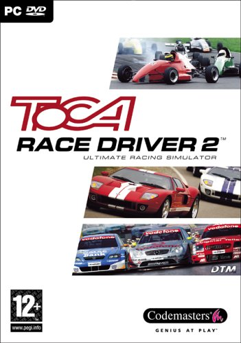
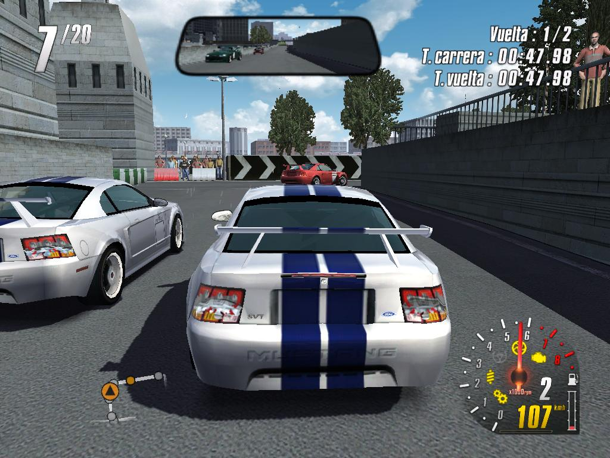
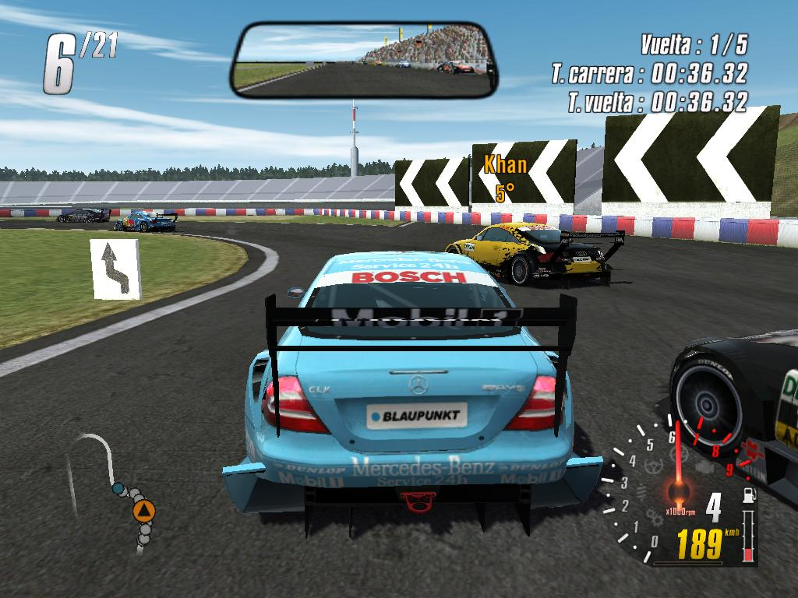
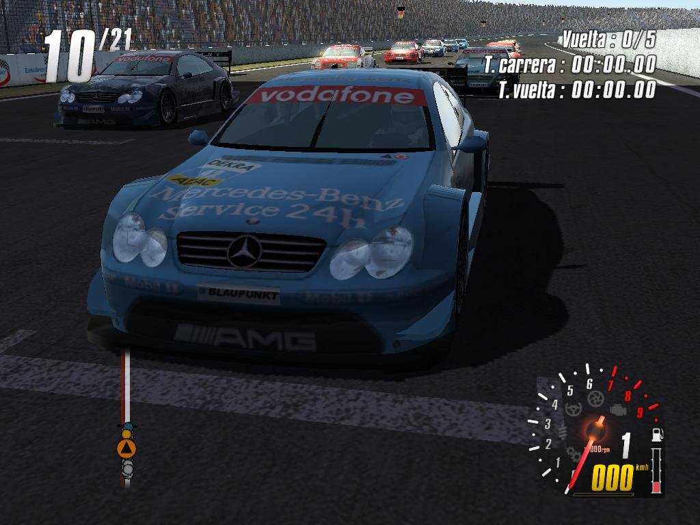
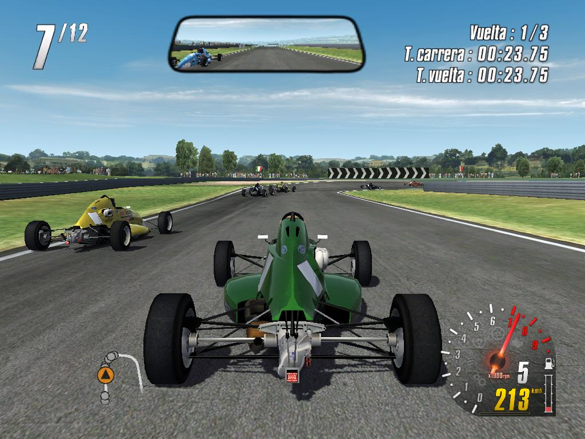
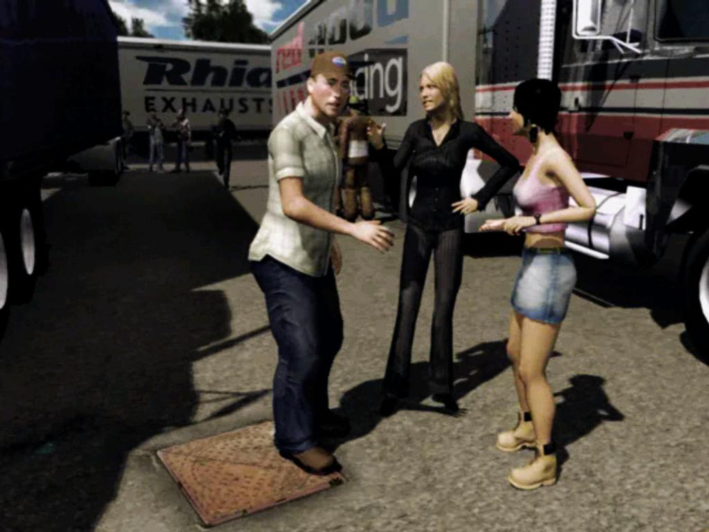
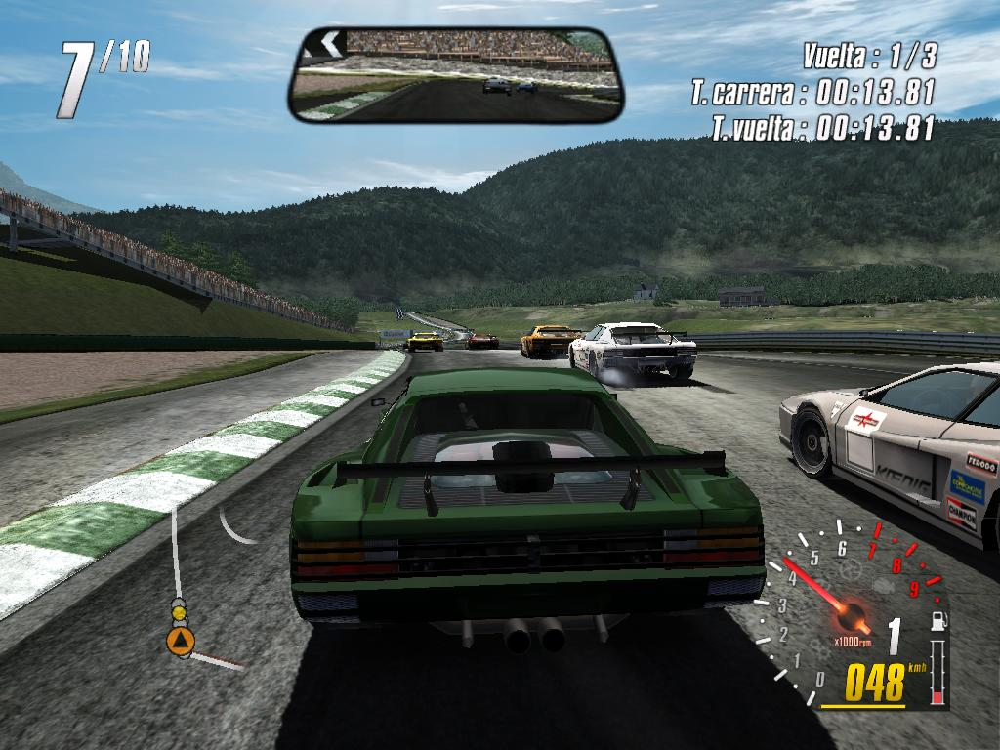
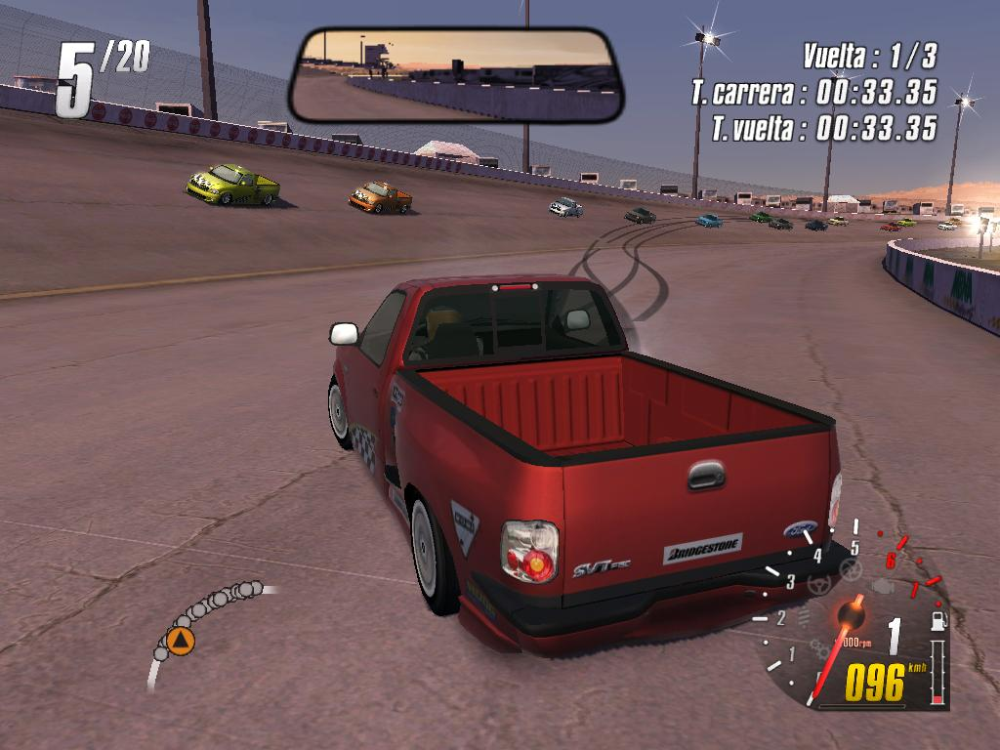
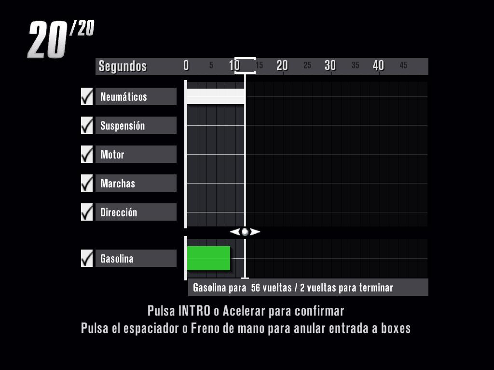

**Ficha técnica:**  
Título: TOCA Race Driver 2  
Desarrollador: Codemasters  
Editor: Codemasters  
Pegi: +12  
Precio: 49.95 €  
Página web: http://www.codemasters.com/tocaracedriver2/

Hablar de Codemasters es hablar de una compañía con solera en esto de los juegos de conducción. En su haber está la excelente saga Colin McRae Rally, con 5 entregas a sus espaldas en diferentes plataformas, lo que ya de por sí supone toda una carta de presentación notable. TOCA Race Driver 2 es la secuela casi perfecta de otro de sus títulos de velocidad, y sin lugar a dudas su proyecto más ambicioso.

Arranca la historia y te ves en mitad de una carrera con un bólido entre manos. Claro, en esta situación lo más sencillo es estamparse a los pocos giros de haber comenzado. No te preocupes. Cuando te bajas del coche comienzas a ser consciente del gran trabajo llevado a cabo: tu entrenador te está esperando. Un vídeo introductorio muy bien disimulado que te transporta a una realidad donde eres un piloto novato con futuro pero sin dinero, que solo tiene ganas de competir. Tu mánager te pone sobre aviso: o ganas o ganas. Sino, no hay dinero. Lo realmente atractivo de los videos es la espléndida interpretación y una calidad pasmosa. Tienen ritmo, el doblaje es de película y están bien conectados con el rasgo distintivo del juego.

Este rasgo distintivo no es otro que tu evolución no solo dentro de la pista, sino también fuera de ella. Te ganarás el respeto o la enemistad del resto de participantes en función de tus habilidades al volante. Si ganas todo serán felicitaciones y sonrisas. Si te llevas a alguien por delante, tendrás algunas palabras con él al pararte en el box. Estos videos también te presentarán a unas curiosas compañeras, que te pueden ofrecer mejores carreras y un papel en un reality show televisivo. Pero vayamos a lo importante en un juego de esta naturaleza: los coches, los circuitos y la sensación al volante. Las máquinas a las que te puedes subir son el sueño húmedo de cualquier aficcionado al automovilismo: desde un Mustang del 68 a un Audi TT pasando por los CLK AMG de Mercedes o los Jaguar XKR. Pero no todo son "coches" en este título, porque a medida que progreses tendrás que participar en carreras de Pin-Up's (camionetas al más puro estilo americano), los endiablados "mosquitos" de la Fórmula Ford, camiones de gran tonelaje, NASCAR's, etc. Te llevarás alguna que otra sorpresa, te lo aseguro.

Su manejo es delicioso, en parte gracias a una física muy realista (aunque no nos gusta del todo el efecto del freno de mano, pues no da la sensación de "clavar" los coches) ya sea sobre pista, en ciudad o en el barro y la gravilla de las etapas de Rally. Con un buen conjunto de volante y pedales (recomendado de 3 pedales y con caja de cambio) es maravilloso y la conducción virtual alcanza su cénit. Pisar correctamente el embrague o acelerar al ritmo adecuado son maniobras a las que tendrás que acostumbrarte. Si por la contra usas teclado y ratón... encomiéndate a San Cristóbal porque lo vas a pasar muy mal. Sobretodo porque las teclas no permiten acelerar y frenar progresivamente, sino que o aceleras a tope o frenas a tope, y por otra parte porque el juego derrite tus muñecas. Conducir en TOCA no es dificil, pero para que te salgan bien las cosas requiere pericia y dedicación. Es simulación pura y dura, colega.

Sobre los escenarios, son bastante variados, aunque pueden llegar a parecer repetitivos, pues muchos de ellos son variaciones del mismo (tramos alternativos, por ejemplo). La diferencia de conducción entre asfalto y tierra es más que evidente (más allá de las propias características del vehículo), y salirse de la trazada o pisar el césped puede hacerte perder valiosos segundos. Las entradas a boxes también están muy bien resueltas: olvídate de tener que pulsar 100 teclas mientras conduces. Aquí te metes al box y luego seleccionas los cambios a realizar. Según el número saldrás antes o después. Un detalle interesante es que puedes ver las marcas de neumáticos tanto tuyas como de tus rivales, que te pueden servir de punto de referencia para frenar en el sitio justo al llegar a una curva, por ejemplo. Recuerda que si el circuito es muy ancho podrás adelantar en casi cualquier curva, pero si es estrecho... ¡Ay, amigo! ¡Vete comprando pintura para los rayazos de tu chapa!

Graficamente, TRD2 está varios enteros por delante de la mayoría de títulos del mercado. Los efectos de luz son gratificantes, las texturas hiperrealistas, el sonido de tu motor rugiendo a través de tus altavoces (si tienes un subwoofer, dale caña) y el de tus rivales merodeando a tu alrededor, un modelado de vehículos increíble y unos escenarios dignos de una superproducción de Hollywood. Lo tiene todo y más. El sistema de daños y colisiones es tan preciso que dá verdadero miedo cualquier "beso" aunque al final solo rompas un faro o te quedes sin un retrovisor. Las lunas saltando en cientos de pedazos, el escape vomitando fuego al reducir, las ruedas deslizándose al derrapar y el vapor saliendo de tu capó. Un único pero: la dificultad puede ser estremecedora si nunca has probado un simulador de coches.

TOCA Race Driver 2 es un título adictivo, supone un reto constante y siempre te deja con ganas de más, de apurar siempre la frenada, de despegarte un segundo más de tu perseguidor o de enseñarle el morro a quien tengas delante. Es espectacular e intuitivo. Un título impecable.

**NOTA: 8.5**

**Lo mejor de TOCA Race Driver 2:**  
Largo y técnicamente brillante   
La simulación   
El desarrollo y los vídeos

**Lo peor de TOCA Race Driver 2:**   
A veces una dificultad elevada  
El control si no tienes volante  
El freno de mano en algunos coches

**Requisitos mínimos:**  
Windows XP/Vista  
DirectX 9.0  
Pentium 3 800 MHz o equivalente  
256 MB de RAM  
Tarjeta Gráfica 32 MB  
3.5 GB de espacio libre en disco  
2x DVD-ROM  
Tarjeta de sonido 16-bit compatible con DirectX 9.0

**Requisitos recomendados:**  
Windows XP/Vista  
DirectX 9.0  
Pentium 4 1.4 GHz o equivalente  
512 GB de RAM  
Tarjeta gráfica de 128 MB  
3.5 GB de espacio libre en disco  
2x DVD-ROM  
Tarjeta de sonido 16-bit compatible con DirectX 9.0