Ripear un dvd supone, a grandes rasgos, extraer su contenido y convertirlo a un formato más sencillo de manejar en un ordenador, lo que implica reducir su tamaño. Para esto se codifican la imagen y el sonido según unos estándares (códecs) de los cuales resaltaremos DivX (muy completo y potente) y Xvid (de gran calidad y gratuito). Estos a su vez se engloban bajo los estándares MPEG-4 compilación h.263 (del Motion Pictures Experts Group) e implican pérdidas de calidad con respecto al MPEG-2 (formato de imagen de los dvd), pero se ajustan para que el ojo humano no lo note. Dado su gran potencial y su compatibilidad con reproductores, nos centraremos más concretamente en DivX, un códec que en su versión 5 ya asegura una calidad de imagen equivalente a la de un dvd en un tamaño unas 5 veces menor.

**Necesitamos:**  
- DVD Decrypter: http://www.dvddecrypter.com/
- DVDx: http://dvdx.sourceforge.net/
- DivX 5.x (Versión Pro): http://www.divx.com/
- VirtualDub: http://www.virtualdub.org/

**Descripción del proceso**  
Ripear un DVD es un proceso bastante complicado de llevar a cabo si no se sabe muy bien que hace cada opción de los diferentes programas y códecs, pero básicamente hay que extraer el contenido del disco y convertirlo. Extraerlo no supone problema pero convertirlo requiere tener en cuenta muchos aspectos (bitrate, relación de aspecto, resolucion y filtros, audio y subtítulos). Vamos a ver el proceso.

**Extraer el contenido**  
Generalmente al ripear una película se usa una sola pista de audio (español en nuestro caso) y la pista de video. Sin embargo, es recomendable incluir los subtítulos “de situación”, que son los que aparecen por ejemplo para indicar la cuidad en la que ocurre la acción, el tiempo, etc. No se subtitulan los diálogos. Para conocer cual es la pista adecuada, abrimos el reproductor de dvd y comenzamos la reproducción. En el menú de subtítulos del programa se indican los subtítulos que el programa tiene activados en ese momento y que son, efectivamente, los de situación.

Ahora que sabemos cuales son (por ejemplo, los terceros de la lista de subtítulos) abrimos el DVD Decrypter. En la ventana principal (figura 1) escogemos la carpeta en la que se copiarán los archivos, en el menú “Mode” seleccionamos “IFO” y en la pestaña “Stream Processing” marcamos la opción “Enable Stream Processing” Ahora es el momento de seleccionar las pistas que vamos a necesitar. Por norma general son:  
- 0xE0 Video (la pista de video) 
- 0x8\* (la pista de audio en español. \* es un número que puede variar según la película) 
- 0x2\* (los subtítulos de situación que necesitamos. Si eran los terceros será 0x23 Español)

Ahora es el momento de pulsar sobre el dibujo que hay abajo a la izquierda para que empiece el proceso. Cuando acabe, acepta el cuadro de diálogo que aparece confirmando el resultado y cierra el programa.

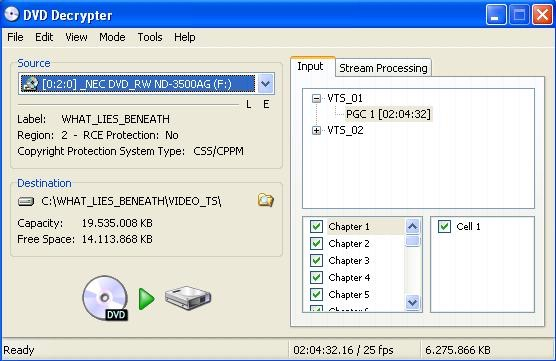

**Configurar el Códec DivX Decoder**  
Tras instalarlo normalmente, en la carpeta divx del menú inicio encontrarás “Decoder Configuration Utility”. Pincha y en la ventana que se abre ajusta los parámetros como en las figuras 2 y 3. Al acabar haz clic en aplicar y en aceptar.

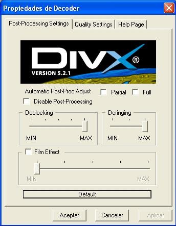

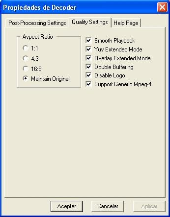

**Ripeando con DVDx**  
Tras instalar el programa, abrelo desde el icono del escritorio. Lo primero será ajustar el programa a nuestro antojo. En el menú “File/Load Language File” podrás seleccionar un archivo que traducirá el programa al español “lang\_spanish.txt”. En “File/Themes” puedes seleccionar una skin para trabajar con el programa (para aplicarlas es necesario cerrar y volver a abrir el programa). Es momento de abrir los archivos del DVD. Selecciona “abrir IFO” dentro de “Archivo” y busca la carpeta donde has extraído el DVD. Abre el archivo IFO que encontrarás.

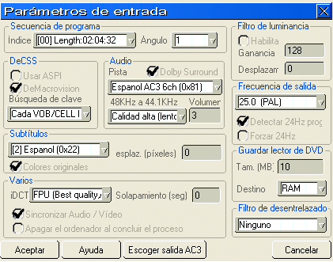

Ahora haz clic en aceptar y dirígete a la opción Parámetros de salida” del menú “Configuración”. Ajústala como en la Figura 5, pero si tienes un Pentium 4 selecciona TAP bilinear SSE2. Por último cierra la ventana haciendo clic en aceptar. No te preocupes por los valores de la resolución, más adelante los variaremos. Vamos a ello.

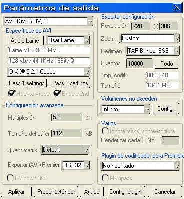

**Ajustando el campo de imagen**  
Este paso te lo puedes saltar si tu película está en formato 4:3 (ocupa toda la pantalla cuando la reproduces) ya que solo es interesante en codificaciones de 16/9 o panorámicas. Si codificas a 4:3 pasa al apartado “La resolución”. Ahora en la ventana principal tenemos unas lineas verdes. En la barra de tiempo de abajo, avanza la película hasta una escena en la que veas los límites de las bandas negras con claridad. Ahora mueve los extremos de las lineas verdes hasta ese límite, encuadrando la imagen y dejando fuera las bandas negras. Procura ser lo más preciso posible (un ejemplo lo tienes en la figura 6).

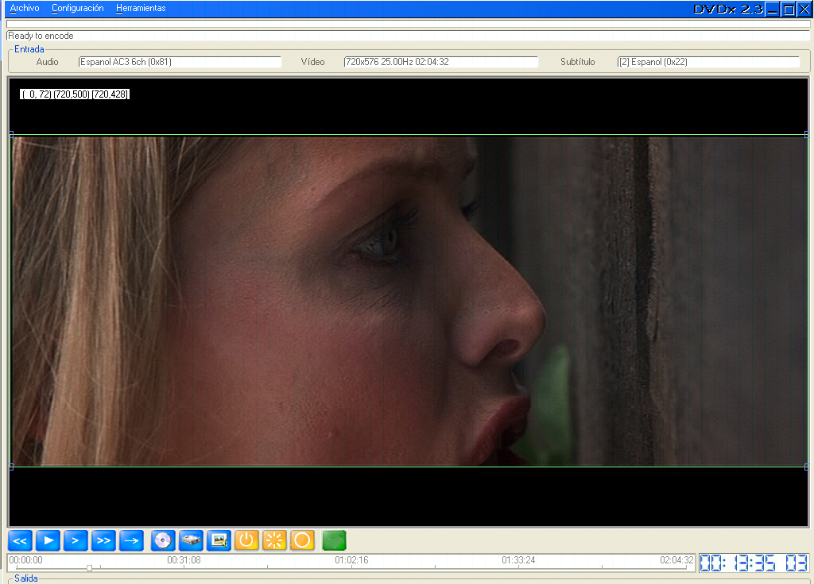

Como ves, la imagen realmente importante se queda en los límites del marco establecido. Recuerda que lo debes ajustar correctamente para cada película.

**La resolución**  
Pincha con el botón derecho sobre la imagen y haz clic en “Ajustar Resolucion de Salida/ Selección” y luego repite la operación para “Ajustar Resolución de salida/4:3 corregido” (salvo que tengas una pantalla –o tv si lo vas a ver en el salón por ejemplo- de 16/9 que no debes hacer este segundo ajuste). Ahora si haces clic con el botón derecho y marcas “Mostrar salida”, las bandas negras deben desaparecer y la imagen debe conservar su relación de aspecto (16/9 o 2.35:1 widescreen) (Figura 7). Ahora vuelve al principio de la barra de tiempo. En los parámetros de salida puedes ajustar la resolución manualmente e incluso reducirla, pero hazlo siempre después de seguir estos dos pasos y procura que no sean valores muy bajos. De cualquier forma, aunque tardas más, la calidad es mucho mayor si no se reduce la resolución y hoy en día cualquier ordenador de gama media o incluso media-baja son lo suficientemente rápidos para hacerlo en un tiempo aceptable.

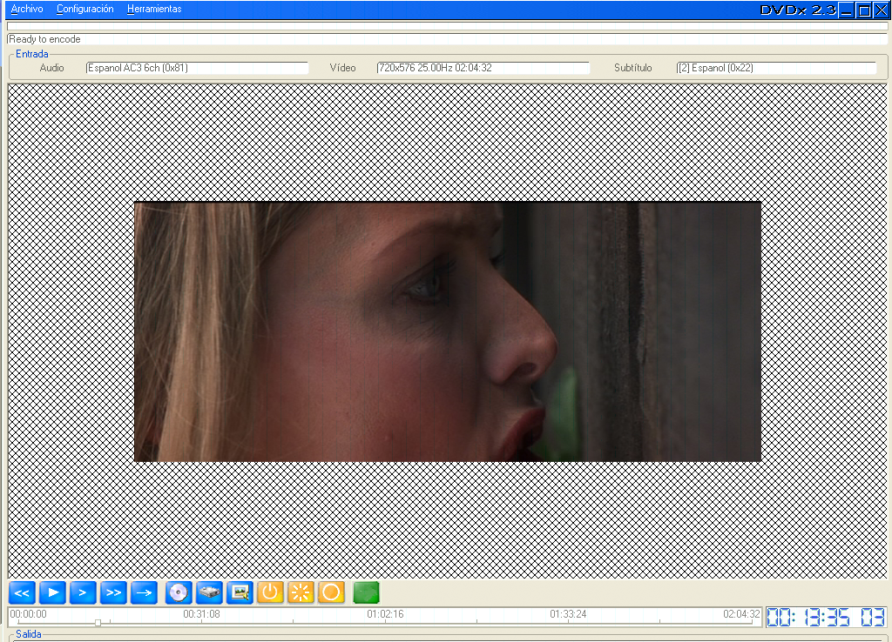

**Tiempo de codificación**  
Vuelve a abrir tu reproductor de dvd normalmente sin cerrar el DVDx y vigila el tiempo del vídeo. Para que la calidad final del vídeo sea mayor, puedes no codificar ciertas partes que no son “película” en si mismas. Por ejemplo los créditos del final y las cabeceras del inicio. Anota cuando acaban las cabeceras y cuando empiezan los créditos. Pasa ese tiempo segundos (las horas se multiplican por 3600 y los minutos por 60) y resta las cabeceras a los créditos. P.Ej:  
- Cabeceras: desde 00:00:00 hasta 00:00:20 
- Créditos: a partir de 01:30:00

Luego: créditos – cabeceras 5400 – 20 = 5380 segundos de video que nos interesa codificar.

Cierra el reproductor de dvd y vuelve a DVDx: Busca el botón “saltar” que está al lado de los controles de reproducción de la película. Se abre un cuadro en el que debes especificar un tiempo. Inserta el de las cabeceras (20 segundos) y haz clic en saltar. Irás al punto en el que comenzará la codificación del video. Ahora toma el tiempo que quieres codificar (5380 segundos) y multiplícalo por 25 (en nuestro caso queda 134500). Abre el menú configuración/Parámetros de salida y en la casilla “cuadros” inserta esa cifra. Ahora pincha sobre Pass 1 settings y configúrala como en las figuras 8 y 9. Para Pass 2 settings, figuras 10 y 11.

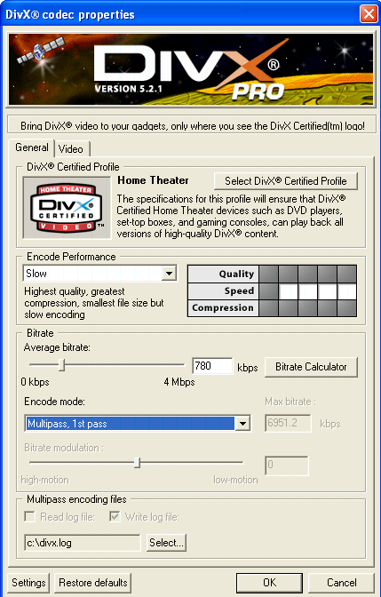

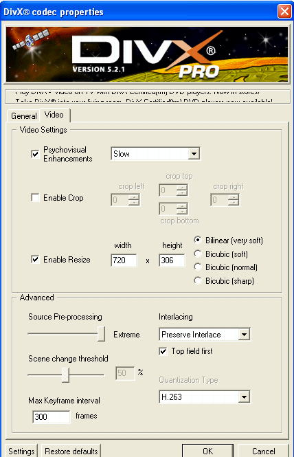

(Los valores de Enable Resize deben ser los mismos que la resolución de los parámetros de salida.)

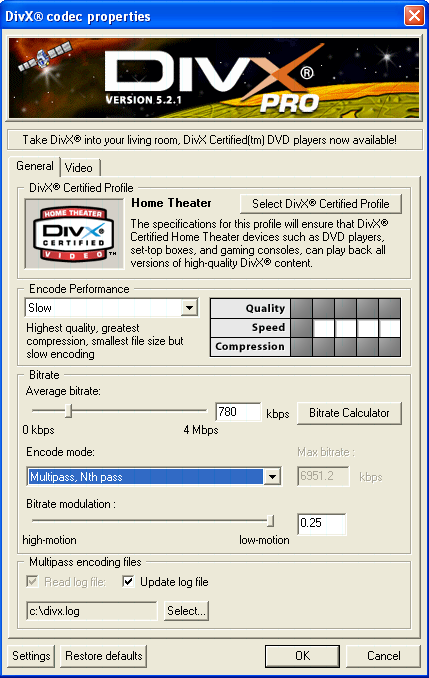

(Aunque parece igual que la figura 8 no lo es. Pon atención a los detalles.)

(Esta sí que es igual a la fig. 9. Recuerda que los valores de Enable Resize deben ser los mismos que la resolución de los parámetros de salida). Ya está todo listo. Solo nos falta una cosa.

**Calcular el bitrate y codificar la película**  
En las ventanas de las figuras 8 y 10, hay un botón llamado “bitrate calculator”. Dentro, especificamos la longitud de la película en cuadros (frames) y especificando 25 cuadros por segundo (fps). Al audio le ponemos un bitrate de 128 kbps y el tamaño del archivo 703 MB o si no escogemos la opción de ajustar al tamaño de los discos que especifiquemos (recomendable solo si la película sobrepasa las dos horas y media de duración. En ese caso lee el apartado “Cortar la película para varios discos”).

Abajo nos indica el bitrate adecuado. Hacemos clic en accept y comprobamos que el bitrate se ha ajustado (incluso con decimales. P.Ej. pasa de 790 a 789.235). Hay que especificar el bitrate en las ventanas 8 y 10 obligatoriamente. Hecho esto, aceptamos todas las ventanas hasta volver a la pantalla principal de DVDx. Hacemos clic en Archivo/Seleccionar salida y escribimos un nombre y escogemos donde se guardará el archivo final. Al acabar sólo queda hacer clic en el botón codificar (encima de la barra de tiempo). Empezará un largo proceso que durará varias horas. Procura dejarlo por ejemplo de noche y tendrás la película por la mañana (depende también de la velocidad del ordenador.) Cabe reseñar que en los parámetros de entrada puedes especificar que el ordenador se apague sólo cuando acabe. Al final podrás borrar sin problemas los archivos IFO y VOB que el DVD Decrypter extrajo a tu disco duro. Ahora solo trabajaremos con el archivo en DivX.

**Cortar la película para varios discos**  
Ahora que ya tienes un archivo \*.avi en tu disco duro, debes comprobar que su tamaño se ajusta a lo que querías, 703 MB o menos. Pero claro, si es una película muy larga, tal vez te interese archivarla en dos cds. Para ello, debes haber ripeado la película indicándole al códec DivX esto al calcular el bitrate. Ahora tendrás un archivo de unos 1400 MB (1.4 GB) que necesitarás cortar. Aquí es donde entra en escena el fantástico VirtualDub. Existe una versión en español de este programa (Spanishdub) que puedes encontrar en http://sourceforge.net/projects/spanishdub/ aunque normalmente suele ir un par de versiones “por detrás” del original ya que es el tiempo que tardan en traducirlo. Por eso usaremos la versión inglesa, que está más actualizada y suele ser más estable. En cualquier caso, el manejo es exactamente igual en los dos programas y bastará con una simple traducción mental para no perderte si usas la versión española. Cuando descargues el VirtualDub, tendrás un archivo comprimido en zip en tu disco duro. Descomprímelo en cualquier carpeta. Allí encontarás un archivo llamado VirtualDub.exe que es el programa en cuestión. La pantalla principal del programa (Figura 12) será nuestro lugar de trabajo aunque primero debemos ajustar dos parámetros.

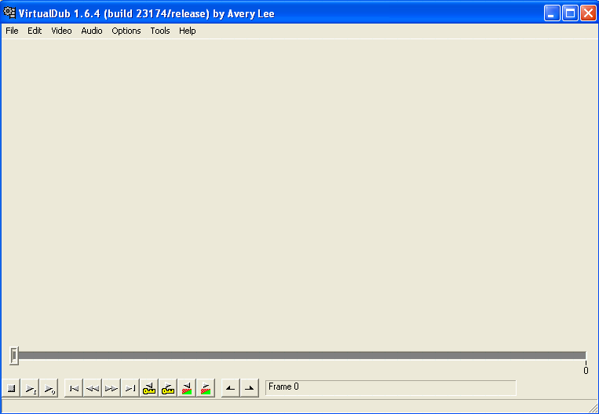

Lo primero será abrir el archivo de vídeo con el que vamos a trabajar. Haz clic en el menú “File” y en la opción “Open video file”; a continuación abre el archivo avi que creaste con el DVDx. Ahora, en el menú “Audio” y en el menú “Video” activa las opciones “Direct Stream Copy” y en la de audio marca también “Source Audio”. Es momento de seleccionar las partes en las que vas a dividir la película. Hay dos sistemas: - A ojo puedes buscar la parte que creas que es más o menos la mitad de la película. Con esto puedes ajustar que el corte no se produzca en medio de un diálogo o de una escena de acción, pero puedes equivocarte al seleccionar y que el tamaño para uno de los discos quede muy grande. - La segunda opción es cortar la película exactamente por la mitad, dividiendo el número de cuadros entre dos y situando ahí el corte. Te aseguras archivos del tamaño adecuado pero puedes interrumpir alguna escena de acción, un diálogo etc. Esto conlleva que tengas por ejemplo que cambiar el disco mientras unos personajes hablan. No pierdes tiempo de video pero resulta muy molesto. Vamos a describir los dos procesos.

**Cortar la película de forma manual**  
Justo después de abrir el archivo de vídeo, comprueba que estás situado en el frame 0 de la película (abajo a la derecha te lo indica el VirtualDub). Abre el menú “Edit” y clica en “Set selection start”. Después muévete al centro de la película, usando la barra de tiempo de la parte de debajo de la ventana, sobre los controles de reproducción, sitúate en el punto donde vayas a cortar y clica en “Set selection end”. Ahora verás que la barra de tiempo está en azul. Abre el menú “File” y haz clic en “Save as avi”. Dale un nombre (por ejemplo video1.avi), desactiva la casilla de la parte inferior si es necesario y guárdalo (quedaría más o menos como en la figura 13). Comenzará un proceso que suele durar un par de minutos. Cuando acabe, sin moverte, vuelve a hacer clic en “Edit/Set selection start” y muévete hasta el final para acabar haciendo clic en “Edit/Set selection end”. Como ves, ahora has seleccionado la segunda parte. Repite el proceso para guardarla con el nombre “video2.avi”. Comprueba que los tamaños de cada uno de estos dos nuevos archivos no supera los 703MB cada uno. Si superan este tamaño, repite la operación seleccionando otro punto de corte. Ya has acabado, así que ya puedes borrar el avi que ocupaba 1.4GB y grabar los otros dos en cd como un cd de datos con cualquier programa de grabación.

**Cortar la película de forma automática**  
Con el archivo avi abierto y las opciones audio y video configuradas como arriba indicamos, abre el menú “File” y selecciona “Save segmented avi”. Ponle un nombre a la primera parte (P.Ej.: “video1.avi”) y comprueba que las dos casillas que hay en la parte de debajo de la ventana están desactivadas. Solo queda indicar el tamaño máximo para cada archivo. En el último cuadro (el que está debajo de todo) introduce el tamaño deseado en MB (703 concretamente) y clica en guardar (quedaría más o menos como en la figura 14). Cuando el proceso acabe (unos 10 minutos o menos), comprueba que todos los archivos que el VirtualDub ha creado tienen un tamaño de 703 MB y si es así, borra ya el archivo de 1.4 GB. Ya has acabado, solo queda guardar esos dos archivos en cds con tu programa de grabación habitual como cd de datos.

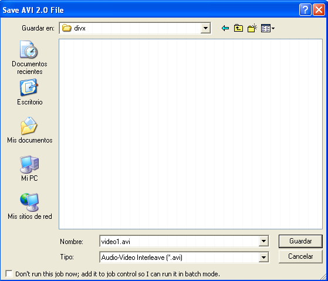
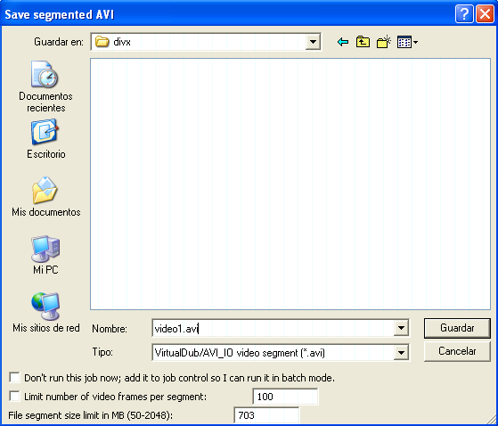