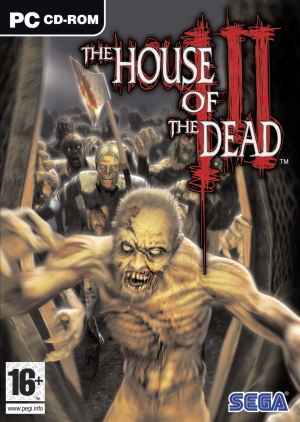
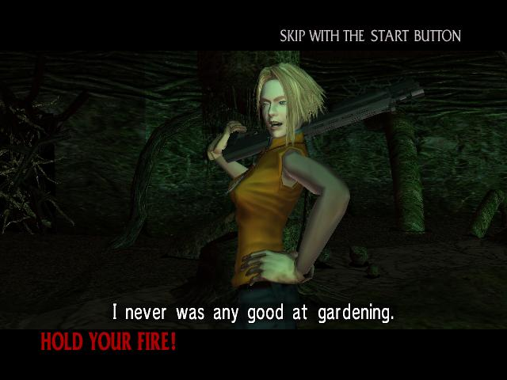
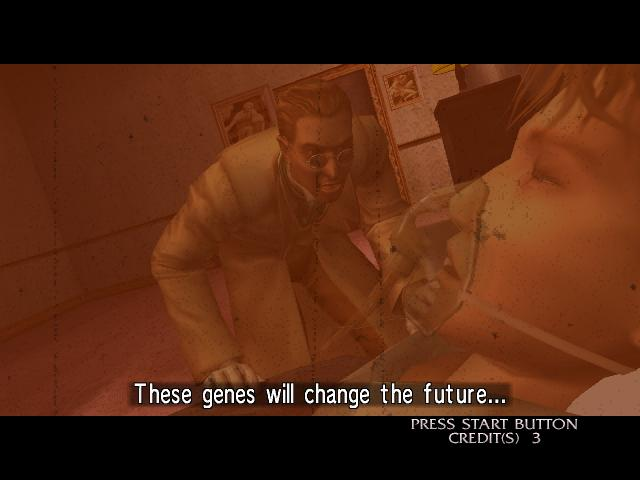
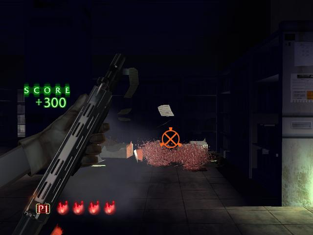
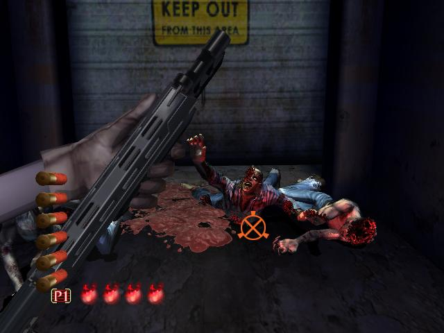
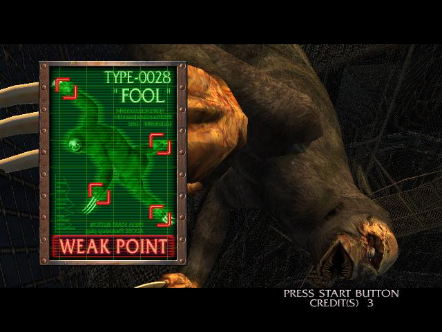
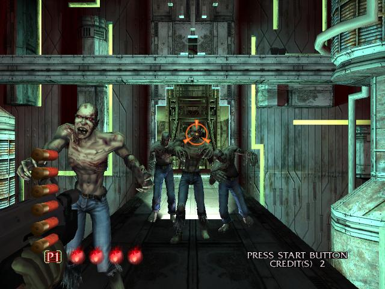
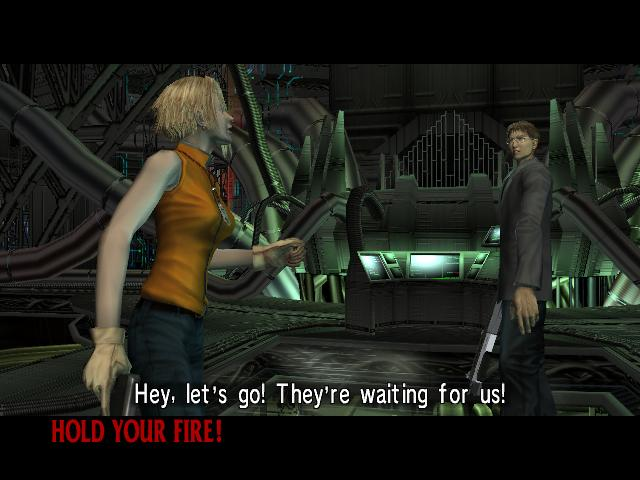

**Ficha Técnica:**  
Título: The House of the Dead 3  
Desarrollador: Sega  
Editor: Atari  
Pegi: +16  
Precio: 19.95 €  
Página web: http://www.es.atari.com/pc/house-of-the-dead-3-72.html

The House of the Dead es una saga histórica en recreativas y salones de juego, de eso que no te quepa la menor duda. Sus principios básicos son la acción directa y sin miramientos y los bichos de tamaño descomunal a exterminar, cada cual de una forma más enrevesada que el anterior. Y aunque sea con un poco de retraso, sus entregas suelen acabar convertidas en títulos de PC, pero eso es otra historia...

Veamos en detalle las virtudes y los defectos de esta tercera entrega. Dada su naturaleza, The House of the Dead necesita impresionar por armamento y por combatientes, y sin embargo ofrece una de cal y otra de arena. Más que nada porque el armamento es ridículo y solo puedes utilizar tu escopeta recortada (que funciona a la perfección, eso sí). La llevas desde el principio, no se atasca, no te quedas sin munición, recargas en menos de un abrir y cerrar de ojos... esto es un arcade, chico. Puedes olvidarte incluso de las habituales mejoras secundarias, porque no las hay y tampoco las vas a necesitar.

Superado este pequeño disgusto inicial, llegas al primer jefe de nivel, que es un bicho enorme e insistente hasta la saciedad en su afán de mandarte al camposanto. Pero ojito con él, en todo caso. Sigues aniquilando zombis, mutantes, bestias, murciélagos sospechosamente agresivos... El elenco de enemigos es amplio y no veas que satisfacción cargarse a varios de un solo escopetazo (nota: si tienes a dos muy cerca, dispara al medio), rematarlos cuando intentan levantarse o mandarlos de vuelta por donde vinieron cuando acosan a tu acompañante.

Entre esa variedad de enemigos encontramos a tres clásicos de ayer y de hoy, como son el incordiante lanzabarriles, el hábil motoserrínico y las parejas de hermanos marx-corta-rebanadores. Te sonarán de los dos anteriores episodios, pero lucen como nunca gracias a un nivel gráfico remozado, que sin ser [Crysis](../../../2007/12/crysis/) o Half-Life 2 te sumergirá en la acción mucho más de lo que imaginas, gozando de unos buenos (para lo que el juego es) efectos de humo o sombreados. A su favor cuenta con algo que los desarrolladores parecen haber olvidado en el baúl de los recuerdos: la posibilidad de ajustar opciones gráficas. Quieto, no eches cohetes por la ventana todavía: es una conversión y disponer de estos ajustes es una buena noticia, pero se limitan a la resolución, el filtrado antialiasing y la calidad de las texturas y color. Incluso un limitador de fps (frames per second, imágenes por segundo), que conviene dejar siempre en el valor más alto.

¿Quieres más? Pues tranquilo que hay más. Un acompañante al que salvar el pellejo repetidamente (acabas pensando que es un completo inútil) y una sobredosis de falsa solemnidad, diálogos absurdos a la americana y más enemigos en pantalla que en una peli de Peter Jackson, que por otra parte constituyen los momentos más entretenidos y de mayor frenesí destructivo.

Hablemos para terminar, de una duración penosa y las cualidades que se han perdido en esta conversión. Sí bien tenemos unas opciones gráficas en un título que nos llega de otra plataforma (por fin!!), la duración se vé muy pero que muy resentida, ya que lo que en la recreativa podía ser una tarde entera (con su correspondiente tasa de monedas) aquí se queda en menos de una hora de juego puro y duro. Cierto es que han añadido un modo de juego nuevo (al "Survival mode" tradicional se le une el "Time attack"), pero también han eliminado las opciones online de la segunda entrega, que tantas horas extra ofrecían al jugador. Otra cosa derivada de ser una conversión es la que reduce notablemente la puntuación de House of the Dead 3: el tamaño de la pantalla y el control. Si has jugado en la recreativa, sabrás que no puedes comparar un enorme pantallon de más de 30 pulgadas con los modestos monitores de los que uno puede disponer en casa, que como norma general no suelen superar las 20 pulgadas. Se pierde fuerza y grandiosidad, sobretodo en los final-bosses, pero también en la tónica general.

También es cierto que dispones de muchos caminos alternativos para paliar el mal de la duración, pero eso ya se tenía por descontado en este título, asi que no hay nada nuevo. Por otra parte, el control con ratón es plenamente satisfactorio, pero está claro que solo disfrutarán del juego al máximo aquellos que dispongan de una pistola IR, ya puestos a pedir que tenga también forma de escopeta. En definitiva, The House of the Dead 3 es mucho más de lo mismo, que se salva de caer en la repetición paradójicamente gracias a una duración mínima y a unas opciones de juego limitadísimas, pero da muchos minutos de festival adrenalínico, sobretodo si se juega en compañía.

**NOTA: 6.75**

**Lo mejor de The House of the Dead 3:**  
La acción rápida y directa  
Las mejoras técnicas respecto a las anteriores entregas  
Los enemigos finales

**Lo peor de The House of the Dead 3:**  
No explota el hardware. Sin opciones online  
Se disfrutaría mejor con una pistola de infrarrojos  
Solo un arma, sonido limitado y argumento patético  

**Requisitos mínimos:**  
Windows ME/2000/XP  
Pentium III 1 GHz  
128 MB RAM  
DirectX 9.0c   
700 MB Disco Duro  
Tarjeta compatible con Direct3D con 64 MB de vídeo

**Requisitos recomendados:**  
Windows ME/2000/XP  
Pentium IV 1.4 GHz  
256 MB RAM  
DirectX 9.0c  
700 MB Disco Duro  
Tarjeta compatible con Direct3D con 128 MB de vídeo