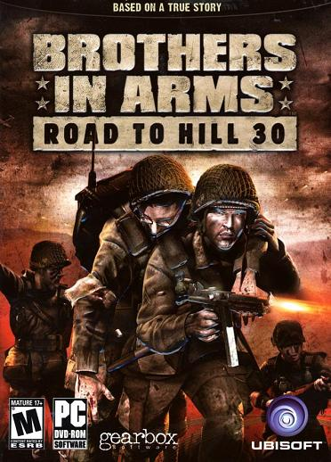
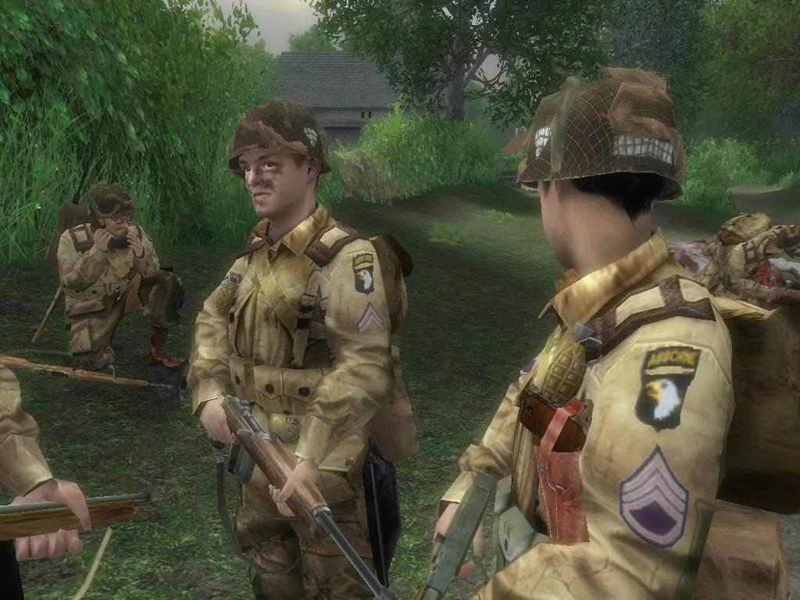
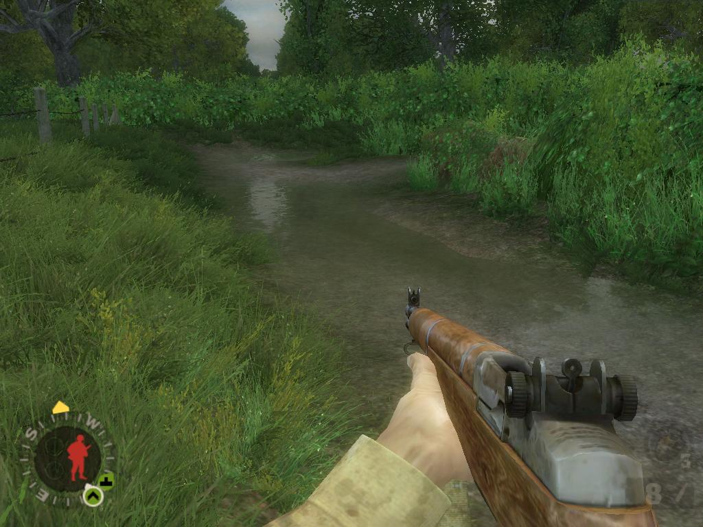
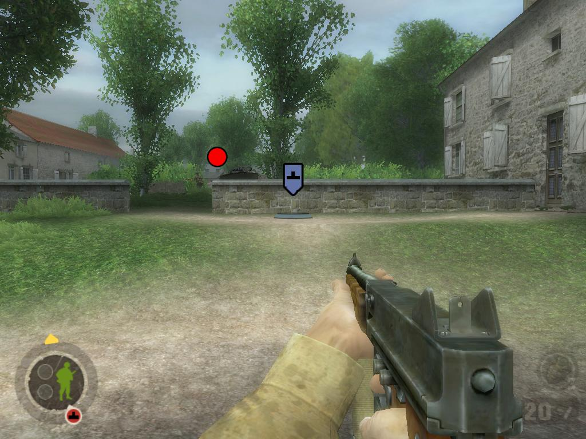
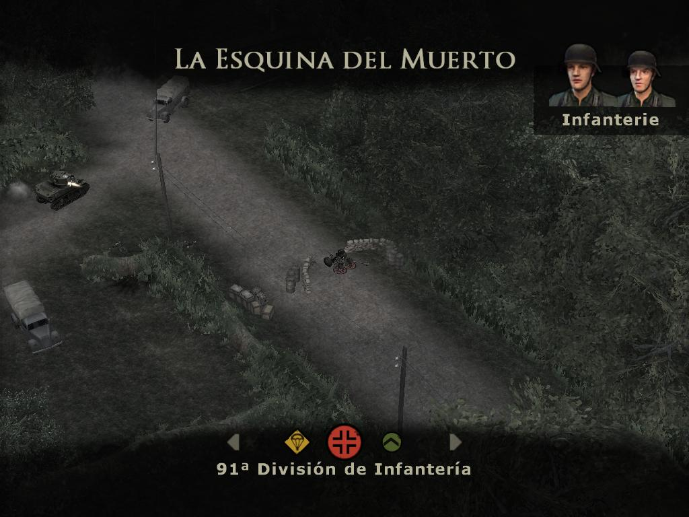
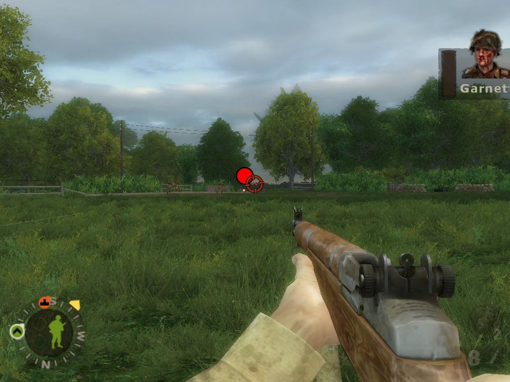
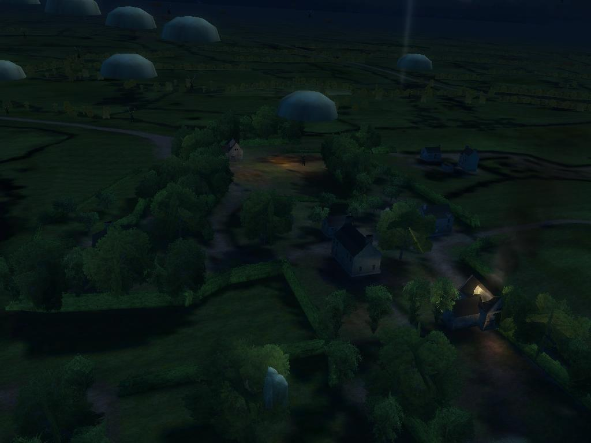

**Ficha técnica:**  
Título: Brothers in Arms  
Desarrollador: Gearbox Software  
Editor: Ubisoft  
Pegi: +16  
Precio: 44.95 €  
Página web: http://www.brothersinarmsgame.com

Brothers in Arms es un (otro) videojuego de acción basado en la Segunda Guerra Mundial. Eres el sargento Matt Baker, de la 101 División de Aeroparacaidistas, pero el Día-D las cosas no te salen como tenías pensado. Con el slogan "Basado en una historia real" en letras bien grandes, Gearbox nos propone patear culos alemanes una vez más. Esta compañía, que cuenta en su haber con otros títulos como la poco brillante conversión de Halo al PC, se las ha ingeniado para sacar adelante este proyecto con bastante acierto.

Primera bofetada al jugador: el control. No es malo, ni por asomo. De hecho resulta muy intuitivo, pero olvídate de Call of Duty. Lo primero que descubres es que el botón derecho de tu ratón no sirve exclusivamente para apuntar. Brothers in Arms pretende ir un paso más allá en la búsqueda de una simulación realista e inmersiva del gran conflicto del siglo XX, de modo que te ofrece la opción de ser el líder de tu escuadra y dar órdenes sencillas a tus compañeros. De libro: Hay que atacar por los flancos. En efecto, siguiendo la táctica invetada por Aníbal en las guerras contra los romanos (hace unos 2300 años), el juego pretende que busques atacar a tu enemigo envolvíendolo en un fuego cruzado del que no pueda escapar.

De modo que te ves obligado a propinar un contundente fuego de cobertura sobre el enemigo mientras indicas a tus soldados que se dirijan a esa posición ventajosa que les permitirá acabar con ellos sin correr demasiados riesgos. Veámoslo con un ejemplo: en cierta misión debes defenderte del acoso nazi mientras avanzas con tu tanque por un camino rodeado de frondosa vegetación. En la primera partida avanzas por el camino central, procurando acabar con los enemigos de un lado mientras el tanque te protege del fuego del otro. Craso error, porque enseguida aparece una MG que te da matarile antes de decir "mu". ¿Como salir airoso entonces de semejante situación? Usando la materia gris, amigo. Para ello, tienes a tu disposición una vista aérea que detiene el tiempo de juego y con la que puedes explorar el terreno para decidir tus movimientos sin exponerte a las balas. ¡Anda! ¡Pero si es nuestro amigo "árbol-parapeto-derribado"! Pues nada, tú te cubrirás tras él, disparando en diagonal hacia el otro extremo del camino. El tanque puede ocupar un puesto junto a tí, y abrir fuego sobre la MG, mientras tus soldados se mueven hacia el río que discurre por la derecha. Librados de la MG, tus soldados limpiarán el flanco en donde se encuentran mientras tú avanzas con el apoyo del tanque por la izquierda. Vía libre, camino despejado, misión completada.

Pero no todo son caminos de rosas con tropezones alemanes. Tomar una ciudad, por ejemplo, o despejar unos campos para que aterricen los aviones de suministros. Brothers in Arms ofrece una experiencia variada y la necesidad de estrujarte los sesos para no tener que visitar la pantalla de cargar partida supone, en conjunto, un cócktel atractivo. La herramienta a la que echarás más mano será la ya comentada vista aérea, pero incluso en el fragor de la batalla tendrás mucha información disponible y de una forma muy visual e intuitiva. El juego se rige por el uso de unos iconos, tales como enemigo, moverse a cierta posición o fuego sobre un objetivo. Este es un punto muy fuerte del juego porque a los dos minutos ya parece que conoces esos símbolos que aparecen en pantalla de toda la vida. Además se introduce una novedad bastante interesante como es el fuego de supresión. Tus enemigos llevan unos círculos de color rojo sobre sus cabezas. En el momento en que abres fuego sobre ellos se cubren y el círculo comienza a ponerse gris. El chaval en cuestión no puede moverse porque lo tienes acorralado con tus balas silbando sobre su cabeza, asi que ya puedes seguir avanzando mientras la pizza que tiene por aureola esté gris. Cuando vuelve a estar roja, el hombre volverá a disparar sin temor alguno. Esto introduce un ritmo más pausado en la partida. Primero fuego de supresión, avanzar, más fuego de supresión y liquidar finalmente al tipo.

Técnicamente, BiA alcanza una cota increíble en cuanto a la representación de soldados, con facciones definidas, expresividad y un modelado perfecto. Además usa unas texturas realmente buenas y el trabajo en los efectos de iluminación se nota. Tus compañeros gozan de un realismo sorprendente. Es más, incluso se ha trabajado para que tengan una personalidad propia y que de verdad creas que son unos hombres de carne y hueso, que pueden caer en cualquier momento porque ni tu ni ellos sois soldados invulnerables. Otro cantar son los escenarios. Están llenos de detalles y efectos, pero también resultan insulsos por lo poco interactivos que son. No puedes atravesar puertas de jardines o entrar en ninguna casa (salvo alguna contada excepción) lo que resta un poco de libertad al planteamiento del juego de ofrecer una variedad de caminos para llegar a los objetivos. Por su parte, la banda sonora se erige monumental y raya al nivel de una superproducción. Doblaje decente y la posibilidad de ajustar el rendimiento bastante fino.

Brothers in Arms es, en definitiva, un gran juego de acción. No hará historia, no será una compra obligada. Pero sus novedades ocultan sus pequeños defectos. Goza de un buen nivel técnico y su variedad e ideas acaban compensando.

**NOTA: 8**

**Lo mejor de Brothers in Arms:**   
Nivel técnico  
Intefaz por iconos y vista aérea  
El fuego de cobertura y el estilo pausado

**Lo peor de Brothers in Arms:**  
Lleno de tópicos y la absurda voz en off del protagonista  
Poca interactividad de los escenarios  
El control distinto a todo lo demás

**Requisitos mínimos:**  
Windows 2000/XP/Vista  
DirectX 9.0c  
Pentium III a 1 GHz o equivalente  
512 MB de RAM  
Tarjeta Gráfica de 32 MB compatible DirectX 9.0

**Requisitos recomendados:**  
Windows 2000/XP/Vista  
DirectX 9.0c  
Pentium IV 2.5 GHz o equivalente  
1 GB de RAM  
Tarjeta Gráfica de 64 MB compatible DirectX 9.0