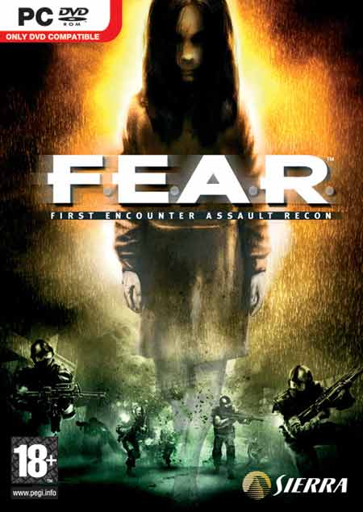
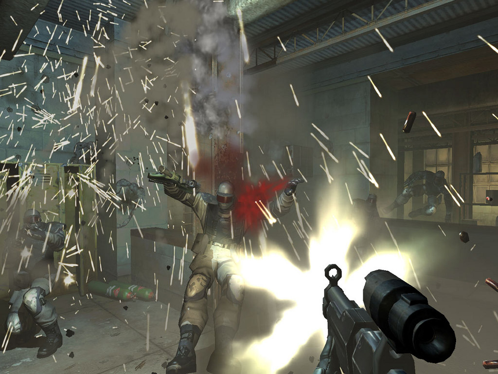
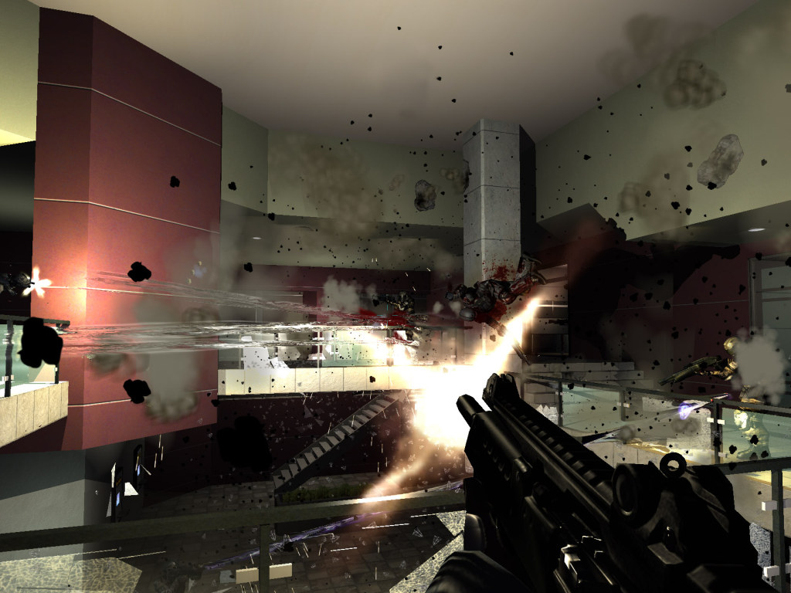
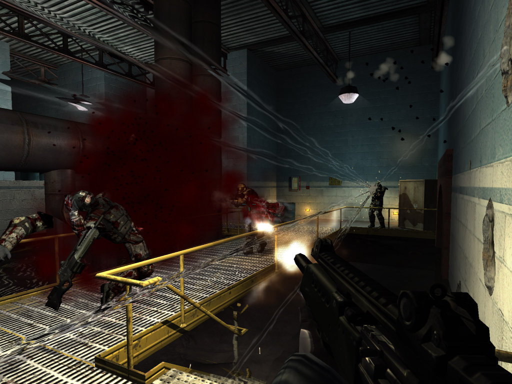
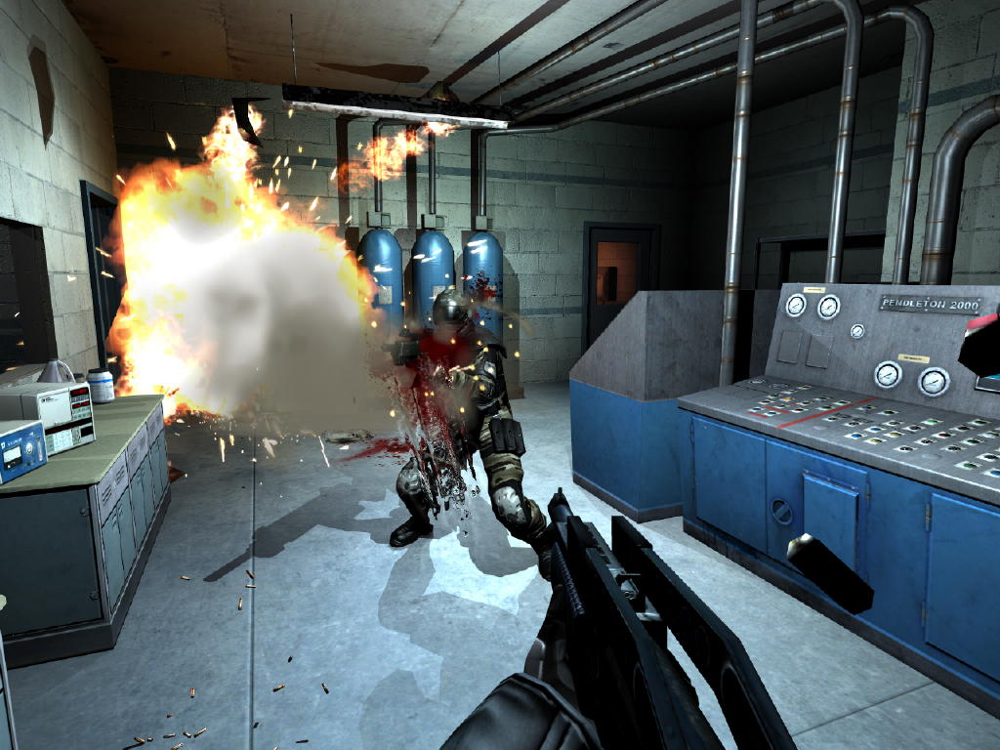
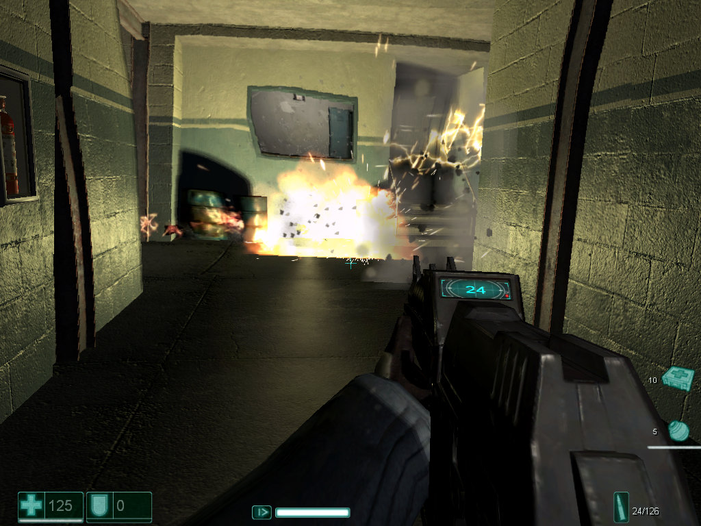
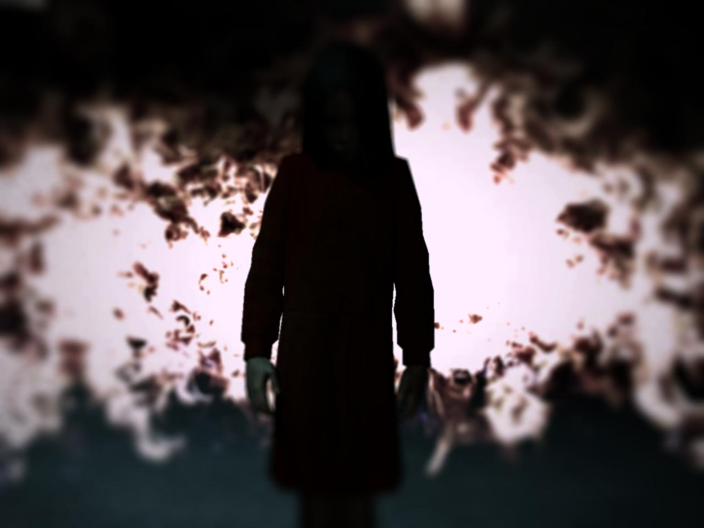
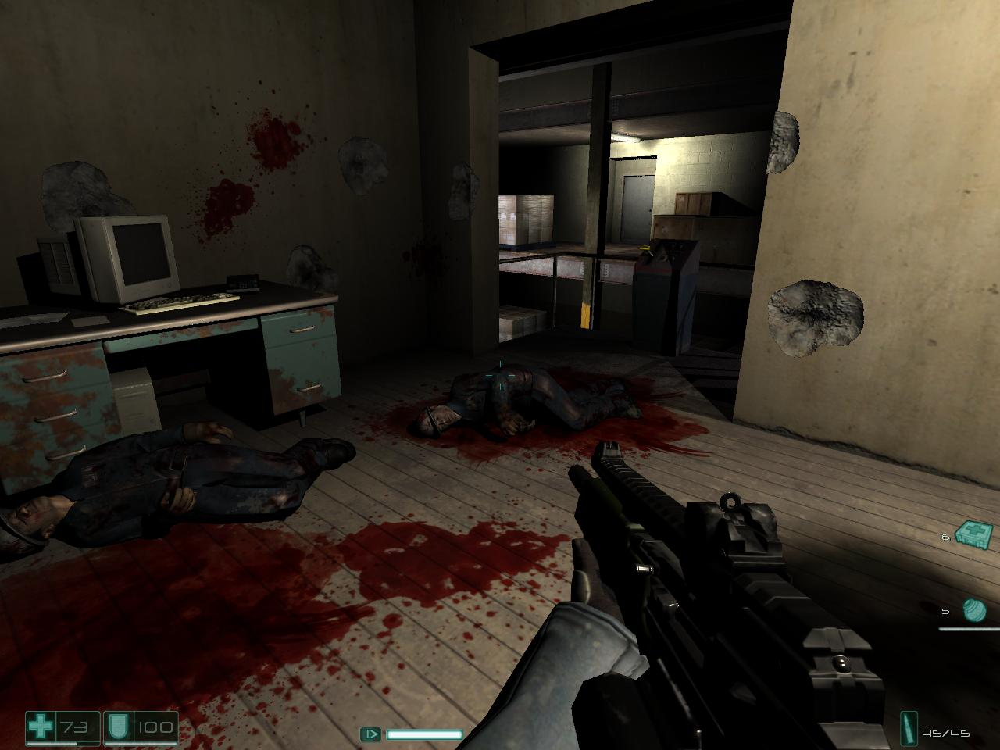

**Ficha Técnica:**  
Título: F.E.A.R.  
Desarrollador: Monolith Productions  
Editor: Vivendi Games  
Pegi: +18  
Precio: 49.95 €  
Página web: http://www.whatisfear.com/

Lo peor que le puede pasar a un videojuego es no tener personalidad. De hecho, nuestra memoria es selectiva, y de entre todos solo escoge a los videojuegos que de verdad se merecen un hueco entre los grandes. De F.E.A.R. se ha hablado hasta la saciedad antes y después de su estreno. Los desarrolladores de Monolith prometían un shooter como nunca antes habíamos visto: acción desmesurada, gráficos de infarto, guión cinematográfico y un terror al cuadrado. Sin embargo, F.E.A.R. se juega de una forma bastante convencional. De la acción, destaca por encima de todo su espectacularidad: cristaleras que se hacen añicos, cientos de pedazos de una silla volando por los aires, soldados que se retuercen de dolor y chispas saliendo de los cañones de los rifles. Todo ocurre al ritmo que marcas con tus cargadores y tus movimientos. Indispensable verlo, pues describirlo es bastante dificil. Toda esta espectacularidad viene aliñada con la que tal vez sea la innovación más jugona de la historia del videojuego desde la llegada de las 3D.

F.E.A.R. copia de [Max Payne](../../../2003/11/max-payne-2/) el famoso tiempo bala que tan buenos tiroteos ha dado. Y la verdad es que le ha salido redondo, por dos motivos: el primero ya está comentado, con el tiempo bala puedes apreciar el trabajo hecho en el motor gráfico y (si tienes una gráfica a la altura) deleitarte con los mejores juegos de luces y sombras disponibles por el momento. Pero el tiempo bala ofrece otra cosa: la posibilidad de sobrevivir. El juego es realmente difícil. La IA está tan bien programada que sufrirás lo insufrible para librar los combates. Tal vez en el modo fácil o normal puedas terminar la aventura sin pasar excesivos apuros, pero el modo dificil (o ese suicidio llamado modo experto) hará que desees no haber empezado el juego. En él se aprecia un salto cualitativo en cuanto a la inteligencia de tus enemigos, y es el que aporta algo realmente diferente. ¡Son más listos que el hambre!

Hablando de enemigos, uno de los peros de F.E.A.R. es que se repiten más que el ajo. Hay tres y solo tres tipos de enemigos en un juego larguísimo; y por muy clones que sean eso no es bueno. Tienes el marine normalito de toda la vida, con buena puntería y que ataca en grupo, cubriendose y arriesgando lo mínimo. En segundo lugar te encontrarás con unos soldados más delgaditos y con una tendencia cansina a saltar. Lo suyo es la velocidad y atacarte desde varios flancos para acabar contigo. El que es verdaderamente duro de pelar es el "tanque con patas". Viene cargado con un armamento demoledor, su armadura parece sacada del ropero de Terminator y necesitarás varias granadas para eliminarlo. Duro de roer como él solo. Sólo al final del guión encontrarás las variantes de este trio, que apenas son un robot y unos demonios que con un disparo vuelven por donde vinieron.

Lo mismo ocurre con los escenarios. Son los mismos una y otra vez, y cansan. Andas siempre por los mismos pasillos, entras en las mismas oficinas, visitas los mismos halls y te metes por las mismas trampillas de aire acondicionado. Aburren y desorientan, y parecen hechos con tan pocas ganas que incluso pasarás de explorar en busca de botiquines aunque solo sea por llegar a alguna sala que varíe un poco de los grises departamentos por los que te mueves. Desde otra perspectiva, tampoco son un milagro: aunque cuenten con unos gráficos fuera de serie o una física extraordinaria, no creo personalmente que hagan buena pareja con el guión del que tantas cosas nos habían prometido.

Eso del guión sí que ha sido un verdadero despropósito. Un asesino con un canibalismo a la altura de Hannibal Lecter anda suelto por la ciudad, un ejército de clones lo defiende y por si fuese poco, sucesos paranormales con una niña fantasma se meten por el medio. Para arreglar este desaguisado estás tú, que eres un experto combatiente entrenado para afrontar situaciones de este calibre y que cuentas con ventajas en cuanto a tus reflejos o recursos, así como licencia para matar. Paxton Fettel (ese gourmet tan desagradable) apenas tiene que ver con el planteamiento del que parte el juego. Digamos que está ahí para dar un poco de asco y para tener un pretexto con el que poder arrojar marines uno detrás de otro con la intención de estorbarte hasta llegar al meollo, que no es otro que la niña. Ella es la pieza distintiva del juego.

Hace ya unos años que el mundo del cine se está fijando en el terror japonés para hacernos saltar de la silla, y Monolith ha querido llevar esa sutil manera de asustar a tu monitor. El miedo psicológico es lo que F.E.A.R. pretende transmitir. Alma es la hija maldita de un científico que ha vuelto desde el más allá para vengarse de su padre y, ya de paso, de tí tambien. Ella es realmente espeluznante, y si te asusta en los primeros compases de tu recorrido, ni te imaginas lo que te espera. No voy a contartelo porque supone estropear el juego, pero los mejores momentos (o los peores, según lo mires) vienen de su mano; y su sola presencia es imponente. Como para quitarle los caramelos, vamos. En cualquier caso, el guión apenas tiene relevancia pues a F.E.A.R. le ocurre lo que a muchos juegos que pretenden dar el bombazo. Si tienes un guión, no puedes esperar que se cuente solo. Por muy bueno y bien integrado que esté, tienes que atraer al jugador hacia la historia, invitarle a ver las secuencias de video, a hablar con los personajes o a leer lo que encuentre. Pero aquí no ocurre eso: simplemente no se te cuenta, y si pretendes descubrirlo por tus propios medios perderás un montón de tiempo y no nos engañemos: la relación entre Fettel y Alma está cogida por los pelos. Los videos solo hacen preguntas y para hallar respuestas has de hilvanarlas tú entre todas las conversaciones telefónicas y notas que irás recogiendo.

Echemos un vistazo ahora a las armas, porque aun podemos salvar a F.E.A.R. de la quema. Solo puedes llevar tres encima al mismo tiempo (viva la originalidad) además de las prácticas granadas o los omnipresentes barriles explosivos que puedes usar a tu favor. Son bastante típicas: un par de rifles de asalto, el rifle de plasma y el rifle de estacazos, que es el más divertido de todos. Dispárale clavos a un soldado y déjalo hecho un cuadro: colgado en la pared más cercana :P Eso sí, apréndete bien las teclas de botiquines y granadas, porque al final las pulsarás más que unos novios el claxon de su coche. Como anécdotas, contar que si te quedas sin armas puedes recurrir a movimientos de combate (aunque si llegas a ese extremo... puedes volver a cargar la partida) o curiosidades como que ves tu cuerpo y tus propias sombras, o que la chica del videojuego es de las menos agraciadas...

Si además compras la versión "Director's Edition" disfrutarás de los documentales sobre como se hizo, un machinima (películas creadas a partir de imágenes del juego), la versión comentada segundo a segundo por el director del desarrollo y (lo más importante) la precuela rodada en exclusiva. Está interpretada por actores de carne y hueso y es bastante buena para ser un corto de unos minutos. Tambien es recomendable ver la sorpresa tras los créditos, porque hay una conversación realmente interesante 😉

Total, que cuando termines la aventura pensarás que no era para tanto. F.E.A.R. no es un mal título: divierte y puede incluso resultar jugoso para quien busque espectacularidad o una trama ligeramente más elaborada de lo habitual. Hasta es recomendable por el simple hecho de probar sus combates, pero no tiene nada que ver en absoluto con lo que nos prometieron. La acción sin miramientos la encontrarás en "Doom" o "[Serious Sam](../../../2005/11/serious-sam-2/)", el pánico en "System Shock 2" (que aunque no es lo mismo, sigue asustando como el primer dia), los gráficos en "[Far Cry](../../../2004/05/far-cry/)" o [Half-Life](../../../2006/06/half-life-2-episode-one/) y la trama y el tiempo bala en "Max Payne". No te confundas, F.E.A.R. es bueno, pero le falta personalidad y consistencia para llegar a ser lo que nos esperábamos cuando lo vimos nacer.

**NOTA: 7**  

**Lo mejor de F.E.A.R.:**  
Los combates  
Los gráficos  
La inteligencia de tus oponentes

**Lo peor de F.E.A.R.:**  
Escenarios y enemigos repetitivos  
Requiere un PC muy potente  
El guión apenas tiene importancia

**Requisitos mínimos:**  
Windows XP, x64 o 2000  
DirectX 9.0c  
Pentium 4 1.7 GHz o equivalente  
512 MB de RAM  
Tarjeta Gráfica 64 MB GeForce 4 Ti o Radeon 9000  
5.0 GB de espacio libre en disco  
4x CD-ROM drive  
Tarjeta de sonido 16-bit compatible con DirectX 9.0 con soporte EAX 2.0

**Requisitos recomendados:**  
Windows XP, x64 o 2000  
DirectX 9.0c  
Pentium 4 3.0 GHz o equivalente  
1 GB de RAM  
Tarjeta gráfica de 256 MB Radeon 9800 Pro or GeForce FX 5900 con DirectX 9, T&L y pixel shader 2.0  
5.0 GB de espacio libre en disco   
4x CD-ROM drive  
Tarjeta de sonido Sound Blaster X-Fi