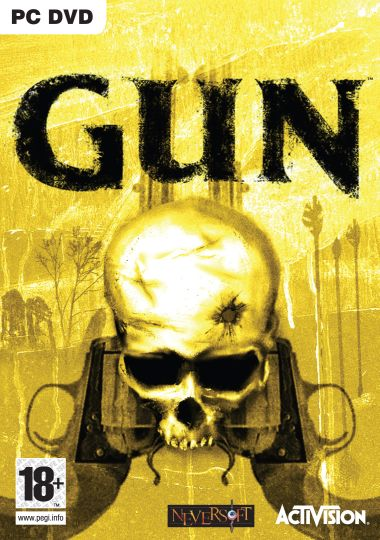
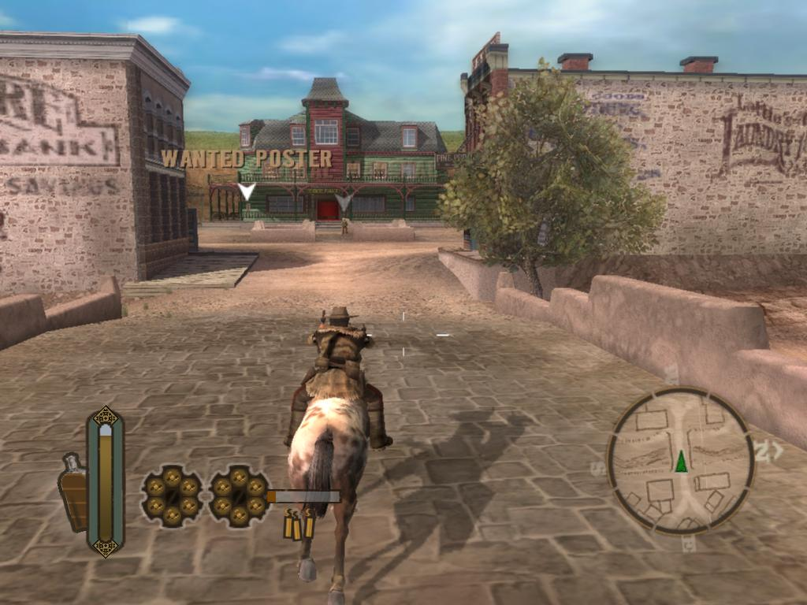

**Ficha Técnica:**  
Título: Gun  
Desarrollador: Neversoft Entertainment  
Editor: Activision  
Precio: 49,95 €  
Pegi: +18  
Web: http://www.gunthegame.com/

Bienvenido al lejano oeste, vaquero. Tu nombre es Colton White, cazador de profesión, y acabas de perder a tu padre en un tiroteo. ¿Vengarás su muerte?

Neversoft Entertainment es la compañía de títulos de conocida calidad como Tony Hawk's Pro Skater y juegos de similares caracteristicas, que con Gun pretende realizar su primera incursión en las aventuras de acción. En un subgénero tan explotado pero poco rentable como el de la simulación criminal (donde sólo GTA se impone frente a cualquier otro lanzamiento), Gun pretende hacerse un hueco utilizando para ello dos grandes bazas.

Gun es distinto a cualquier sucedáneo clon de la saga de Rockstar (léase 'Total Overdose' o 'Crime Life'). El juego te situa en la época de la colonización de América y (su gran secreto) en el Far West. Con un marco así, la acción se vuelve espectacular y cinematográfica, y la trama se desenvuelve en un mar de tópicos de películas como Blueberry. Aprovechando la publicidad gratuita de lo políticamente incorrecto y del boca a boca más morboso (¡Ah, pequeñines! ¿Cuándo aprenderéis?), Gun se centra en mostrar indios apaleados, cacerías masivas, prostitución, lenguaje malsonante, ... Pero tranquilo, al contrario de lo que sucedía en 'Postal', aquí la violencia no es gratuita (ojo, tampoco está justificada). La culpa de ello la tiene un magnífico guión y unos personajes tan bien trabajados que, aunque no ganarán un oscar de la academia, permanecerán mucho tiempo en tu memoria, más tiempo del habitual.

Siguiendo con las bondades del juego, tenemos que hablar del escenario. Es realmente grande y lo suficientemente interesante como para animarse a hacer misiones secundarias (cazarrecompensas, transportista, jugador de póquer, etc.) o simplemente pasear a lomos de tu caballo. Incluso al avanzar en el juego, el entorno va ganando un protagonismo realmente palpable. Pero la chicha del juego son los tiroteos y las misiones principales. Abundan las fases de acción a pie, con tu rifle cargado y esperando para tumbar a quien se ponga por delante. Por cierto que el juego incluye un tiempo bala que es una auténtica delicatessen. Gracias a esto, los enfrentamientos resultan extremadamente divertidos y dinámicos. También hay unas pocas fases de acción a caballo, resueltas correctamente, aunque más rápidas y un pelín más caóticas. Por su parte, las misiones principales son lo suficientemente variadas: cazar búfalos, carreras al galope, perseguir malhechores, defender puentes y casas, asaltar un refugio, ...

El punto negativo lo ponen los típicos defectos de un producto multiplataforma (gráficos que no aprovechan toda la potencia de un PC) aunque se nota que se ha hecho un buen trabajo en la optimización y en el sonido (a pesar de las voces en inglés, por lo menos subtituladas al castellano). Desgraciadamente, Gun te abandona enseguida, pues achaca una duración descaradamente escasa y alguna que otra solución argumental precipitada.

En definitiva, un título que te puede entretener todo un fin de semana, que no hará sombra a GTA pero con la suficiente personalidad para desmarcarse de él y alicientes de sobra para galopar en tu disco duro.

**NOTA: 7.25**

**Lo mejor de Gun:**  
La ambientación y el escenario  
El guión  
Los tiroteos

**Lo peor de Gun:**  
Voces en inglés  
Es corto  
Ligeramente fácil

**Requisitos mínimos:**  
Windows 98/ME/2000/XP  
Intel Pentium 4 1.8 GHz  
256 MB RAM  
Tarjeta gráfica de 32 MB compatible con DirectX  
Tarjeta de sonido compatible con DirectX  
DirectX 9.0c o superior

**Requisitos recomendados:**  
Windows 2000/XP  
Intel Pentium 4 2 GHz  
512 MB RAM  
Tarjeta gráfica de 64 MB compatible con DirectX 9  
Tarjeta de sonido compatible con DirectX  
DirectX 9.0c o superior