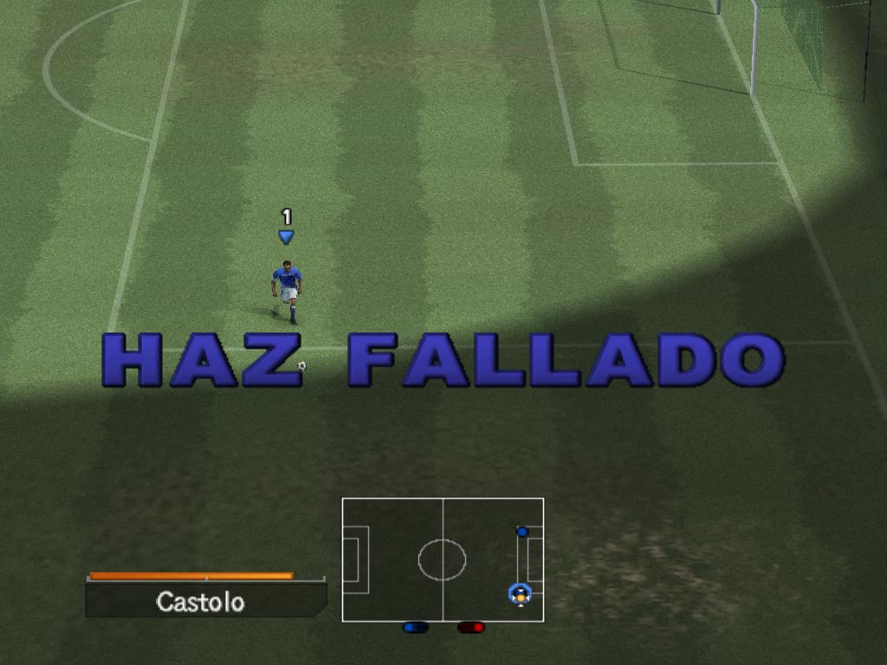

**Ficha Técnica:**  
Título: Pro Evolution Soccer 5  
Desarrollador: Konami  
Editor: Konami  
Precio: 45,95 €  
Pegi: +3  
Web: http://www.konami-pesclub.com/

Ssale la edición actualizada (con número 5) de un gran simulador del deporte rey. Pro Evolution Soccer es, junto a FIFA, el juego de simulación futbolística más fuerte del mercado. Si año tras año Konami y EA compiten por alzarse con el título a mejor juego de fútbol, sus criaturas tienen que presentar sólidos argumentos que atraigan a los jugadores y encandilen a la crítica. PES presenta sus mejores bazas en esta quinta edición, pero... ¿serán suficientes?

Cuando comienzas a jugar a Pro Evolution Soccer te llevas un chasco muy grande, más aun cuando vienes del FIFA de turno de toda la vida. En primer lugar, el aspecto del juego apenas difiere de la versión homonima de consolas, por lo que la interfaz te resultará algo pesada al principio, pero tranquilo, PES te atrapa en sus redes nada más cojer el pad. Sí, un pad como el de PS2, por supuesto. Sino, te perderás todos los regates, fintas, toques y disparos que el juego contempla (y créeme, no son muchos, son muchisimos). Donde PES aprueba es en la física y en la química. Como la vida real, el juego sigue unas leyes extremadamente realistas en cuanto al comportamiento de jugadores y balón. Olvídate de los botes imposibles y los rechaces incoherentes del FIFA. Para este juego parece que hayan contratado a Newton: corre hacia un adversario y verás como acabas en el suelo, salta a por el balon un poco antes y veras como no llegas, pásate con la fuerza del chut y... mándala a la grada. El juego no te defraudará en el aspecto de una simulación perfectamente pulida y más que nunca "simulada". Sobre todo, la inteligencia artificial es uno de los puntos fuertes, la notable química que estableces rápidamente con el equipo. En el juego de EA puedes recorrer todo el terreno de juego con un solo jugador en una marabunta de quiebros. Pero PES es asfixiante, la IA te obliga continuamente a pararte, bajar el ritmo, pasar a tus compañeros y esperar a encontrar el hueco. Tus rivales se las saben todas, y a la mínima sorpresa no dudarán en dejarte algún que otro regalito en tus piernas.

Así, encontrarás habitualmente momentos en los que no puedas entrar en su área y tengas que marear la perdiz, cambiar de banda, tocar atrás... pero hazlo correctamente. Pulsar un botón a destiempo o en la dirección equivocada provocará el contragolpe y tal vez no tengas tiempo de evitarlo. Por suerte, el modo Entrenamiento te enseñará de una forma muy práctica y eficaz todos los movimientos y toques realizables fuera de peligro, siendo este el primer lugar al que aconsejo que te dirijas si eres un novato en la saga Pro Evolution Soccer. El juego gira en torno a tres modos principales, uno para jugar una liga, otro para jugar un torneo y el modo Liga Máster en el que tienes que controlar otros aspectos del equipo como los entrenamientos o los fichajes, pero evidentemente sin llegar a la complejidad de un auténtico juego de mánager. Es el modo más largo de juego, pero tambien puedes jugar partidos rápidos o enfrentamientos on-line por si se te queda pequeño el juego en solitario. Sobra decir que según tus logros, irás obteniendo puntos PES, que sirven para desbloquear interesantes opciones y accesorios para alargar la vida de este título.

Pero claro, algo tiene que tener de malo. Y es que Pro Evolution Soccer sigue siendo una saga bastante consolera, y aunque el rendimiento es excelente en la mayoria de los PC's, quedan detalles que pulir. Para empezar se necesitaría una interfaz más agil y un sistema de menús más claro. La abrumadora cantidad de opciones y parametros puede despistar a cualquiera. El sonido ambiental es bastante digno, pero los comentarios, aunque correctos, no pueden competir en espectacularidad con los de FIFA, que gana por goleada con Paco Gonzalez y Manolo Lama. Aún asi, no es el peor aspecto de todos. Como casi todas las conversiones de Play Station, el juego peca de unos graficos un poquito pobres y, aunque son buenos, se nota que no ha evolucionado mucho respecto a la edición del año pasado. Y el punto negro culminante es el eterno debate sobre las licencias. Aunque en cada nueva temporada Konami intenta hacerse con el mayor número de ellas, seguirás encontrándote con equipos, estadios y jugadores ficticios; amén de la escasez de ligas y torneos. Con la paciencia suficiente podrás cambiar esto gracias al potente editor que incluye, en el que podrás cambiar hasta el largo de las patillas de los jugadores.

Por lo tanto, Pro Evolution Soccer se alza un año más con el título a mejor juego de futbol, pero arrastra graves errores como el tema de las licencias y los comentarios, siendo estos dos inconvenientes conocidos desde hace tiempo por sus desarrolladores. La jugabilidad es importante, sí, pero el ambiente tiene que contribuir a sumergirte en una experiencia a la altura.

**NOTA: 7**

**Lo mejor de Pro Evolution Soccer 5:**   
Realismo  
Animaciones  
Ritmo

**Lo peor de Pro Evolution Soccer 5:**  
Comentarios  
Interfaz poco ágil  
Licencias

**Requisitos mínimos:**  
Windows 98SE/ME/2000/XP  
Intel Pentium III 800MHz o equivalente (Athlon/Duron/Celeron)  
128 MB RAM  
4X DVD-ROM  
NVIDIA GeForce 3 o ATI Radeon 8500  
Tarjeta de sonido compatible con DirectX 8.1  
DirectX 8.1 o superior  
Red (para partidos on-line) (TCP/IP 128 kbps o más)  
800 MB de disco duro

**Requisitos recomendados:**  
Windows 2000/XP  
Intel Pentium IV 1.4GHz  
256 MB RAM  
8X DVD-ROM  
NVIDIA GeForce 4 Ti, ATI Radeon 9600, o superior  
Tarjeta de sonido compatible con DirectX 8.1  
DirectX 8.1 o superior  
Red (para partidos on-line) (TCP/IP 1.5Mbps o más)  
3 GB de disco duro