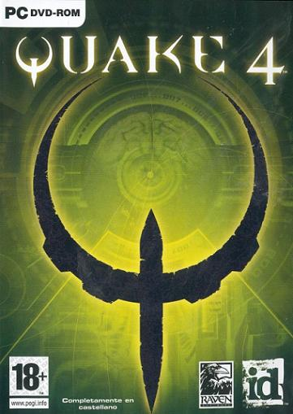
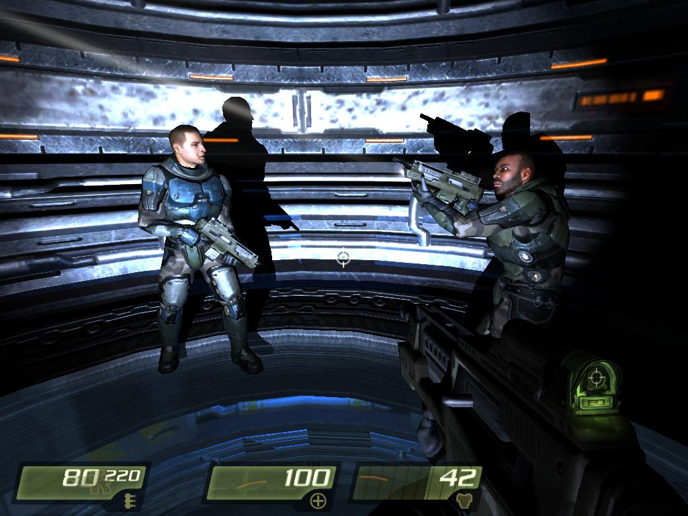
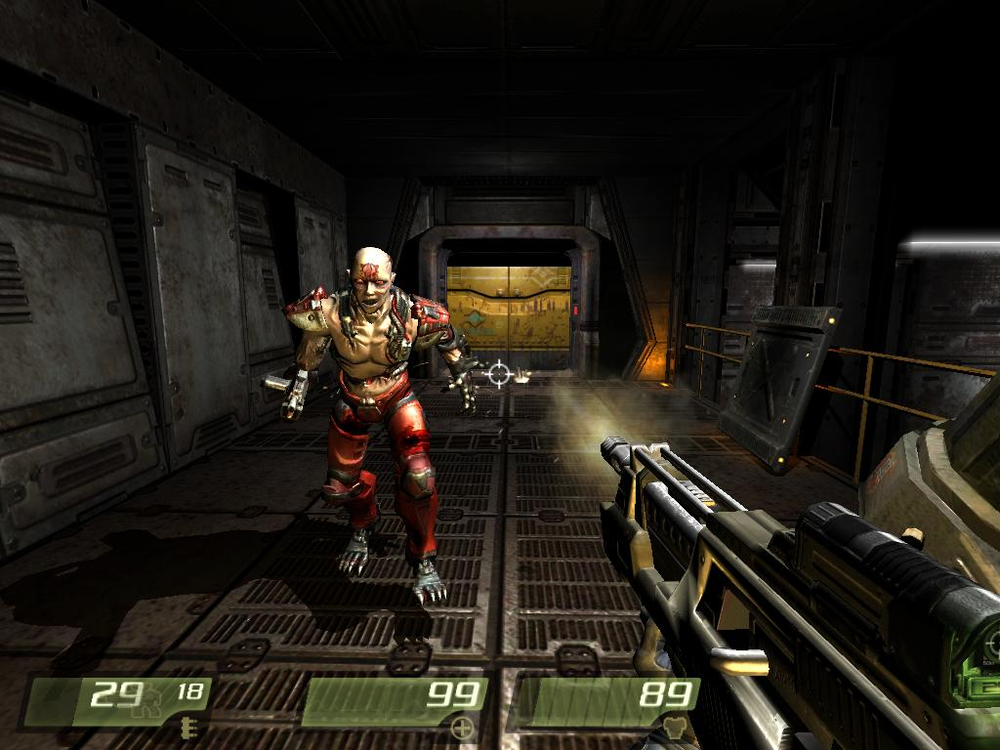
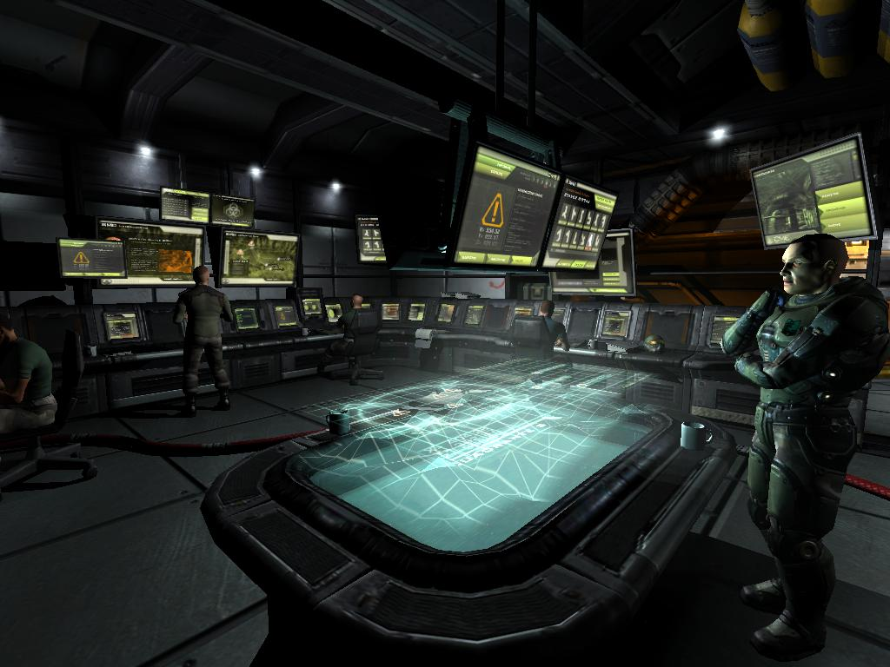
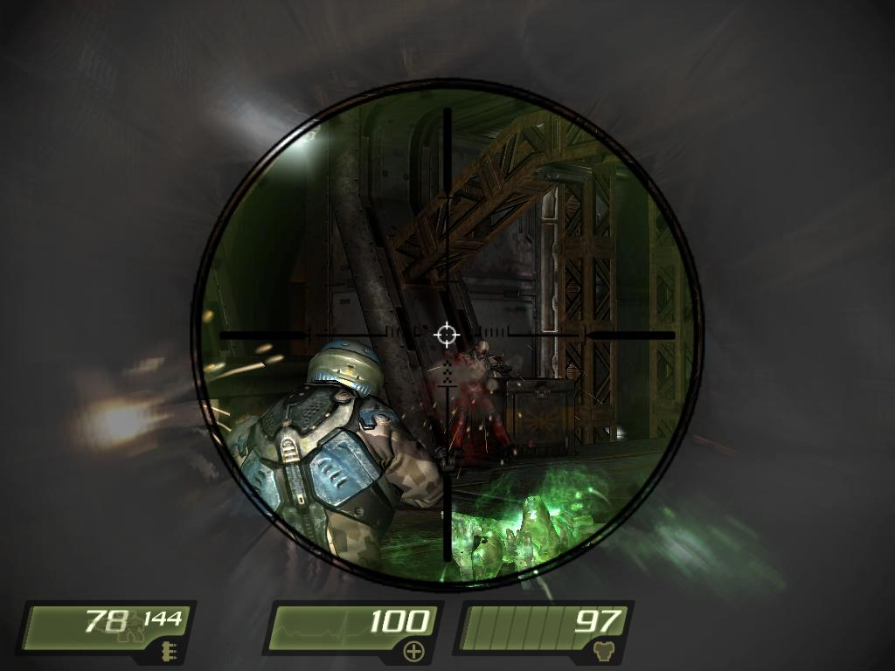
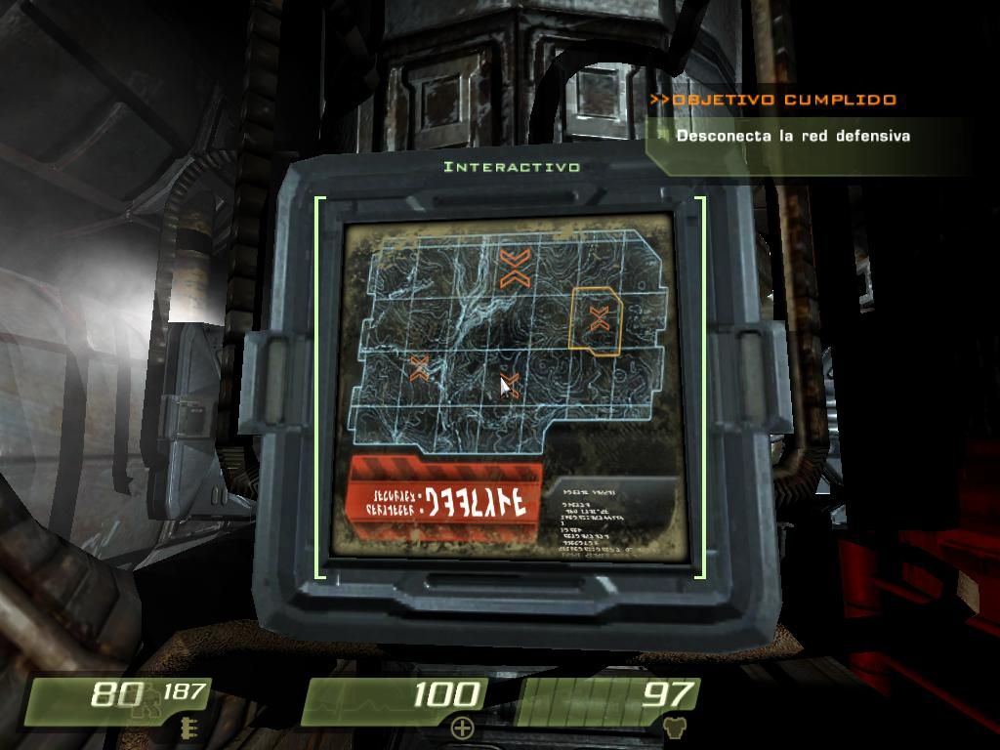

**Ficha Técnica:**  
Título: Quake 4  
Desarrollador: Raven Software  
Editor: Activision  
Pegi: +18  
Precio: 54.95 €  
Página web: http://www.quake4game.com/

Los orígenes de la saga Quake hay que buscarlos hace más de una década en los títulos de acción al estilo Doom cuando las primeras 3D (o pseudo-3D) hicieron su aparición. ID Software, padres de Doom, creaban un linaje paralelo al anterior cuyo mayor exponente fué Quake III Arena, a finales de los 90, porque inauguraba un territorio completamente virgen: el multijugador. Sin guión, sin buenos ni malos. Dejaba así en el aire la historia de su antecesor.

Pero tranquilos. Quake 2 nos mostraba la guerra entre los Strogg y la raza humana, casi por completo aniquilada, y cómo un soldado (nosotros) conseguía infiltrarse en el planeta enemigo para comenzar la reconquista, última oportunidad humana de sobrevivir. Y así como quien no quiere la cosa, ese marine fué capaz de llevar a cabo semejante tarea, por lo que Quake 4 retoma el argumento y nos pone en situación: ahora la Tierra quiere contraatacar, en un intento por salvarse, y a nosotros nos tocará destruir las defensas extraterrestres una vez más.

Uno de los mayores atractivos de este Quake (y de los otros) es su acción potente y madura. Tiene casi todos los refinamientos que se le pueden pedir a un título de semejante calibre después de tantos años de evolución. Encontrarás fases de sigilo (moderado sigilo), vehículos, escenarios laberínticos, puzzles no muy complicados, guión trabajado y ritmo. En Quake 4 siempre tienes algo que hacer y sueles saber el porqué. No abundan los vídeos, pero son tus propios compañeros (porque esta vez no estarás solo) los que te van poniendo al tanto de todo lo que ocurre. Es el mejor remedio a problemas como el de [F.E.A.R.](../../../2005/11/fear/). En el juego de Monolith, tenías que recorrer decenas de pasillos a oscuras, entrar en tropecientas oficinas vacías e ir leyendo o escuchando la historia. Tenías que buscarla. En Quake, la historia te busca a tí. Justo cuando crees que has cumplido tu misión... un nuevo objetivo te es asignado. Esto ayuda también a crear una pequeña sensación de caos a tu alrededor (bien calibrada, eso si) para sumergir al jugador en una guerra virtual.

Este sabroso cóctel viene aderezado por una factura técnica envidiable, con gráficos de aúpa, sonido envolvente, efectos por un tubo y la solvencia de un motor como el de Doom 3. Las sagas son hermanas y comparten su base; pero eso sí, en Quake no tendrás que pelear a oscuras en pasillos agobiantes y sufrir a cada paso que das. El uso de la tecnología pega un cambio radical y ahora podrás ver los exteriores de los que carecía Doom, o luchar con luz diúrna, e incluso pegar la linterna a tu arma. Cuánto hemos aprendido, ¿eh? La luminosidad del título se agradece.

Ahora bien, el juego también tiene sus defectos. Para empezar, las armas se antojan escasas a pesar de ser completamente útiles y variadas. Y no es que sea extremadamente corto, unas 10 horas de juego, pero un desarrollo tan ágil y una dificultad bastante asequible (habrá quien prefiera saltar directamente a los modos difíciles) hacen que la experiencia dure dos telediarios. Compensa: es intenso y agradable de jugar. Sin embargo a Quake le falla la inventiva. El desarrollo a cargo de Raven Software en lugar de ID (padres biológicos de la criatura) le ha sentado bien a Quake, con una historia que contar, objetivos variados y enemigos fluyendo hacia tí. Pero con todo, Quake 4 no deja de ser un producto inmovilista, sin detalles novedosos o momentos memorables, sin combates nunca vistos o escenarios extraordinarios. Le pesa demasiado el nombre. No pueden permitirse un riesgo comercial de semejante calibre, menos aún cuando ha sido programado por otros y con unos altísimos valores de producción. Hasta el multijugador resulta ser una copia exacta de Quake III, que no de por sí es malo, pero se habrían podido hacer muchas cosas más.

**NOTA: 7.5**

**Lo mejor de Quake 4:**  
Ritmo  
Nivel técnico  
Acción madura y variada

**Lo peor de Quake 4:**  
Multijugador insulso  
Corto y fugaz  
No aporta nada nuevo

**Requisitos mínimos:**  
Windows 98/ME/2000/XP  
DirectX 9.0  
Pentium 4 2 GHz o equivalente  
512 MB de RAM  
Tarjeta Gráfica 64 MB  
2.7 GB de espacio libre en disco  
Tarjeta de sonido 16-bit compatible con DirectX 9.0

**Requisitos recomendados:**  
Windows XP  
DirectX 9.0  
Pentium 4 3 GHz o equivalente  
1 GB de RAM  
Tarjeta gráfica de 128 MB compatible DirectX 9.0  
2.7 GB de espacio libre en disco  
Tarjeta de sonido 16-bit compatible con DirectX 9.0