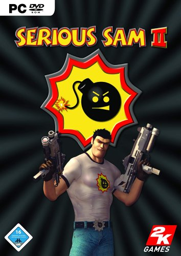
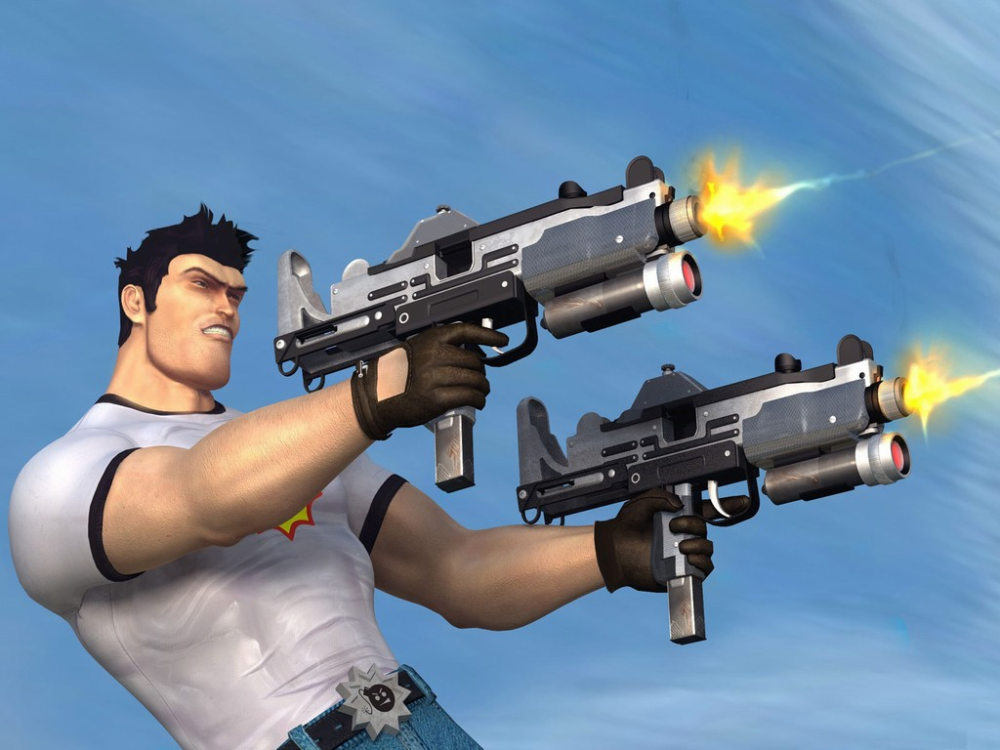
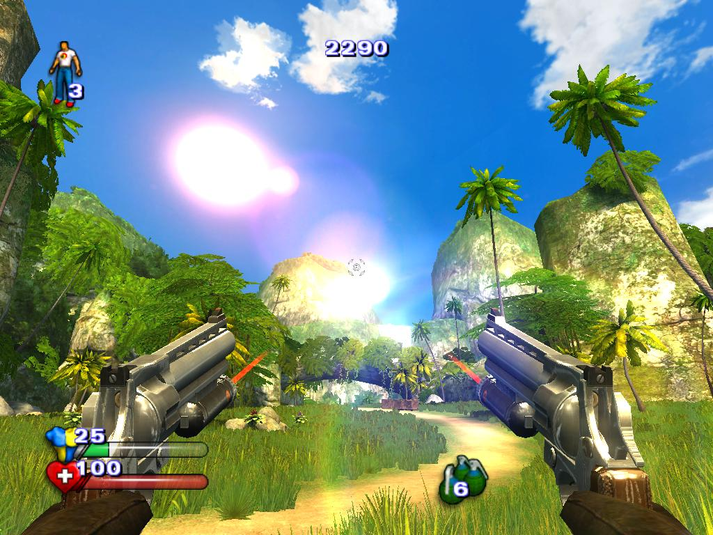
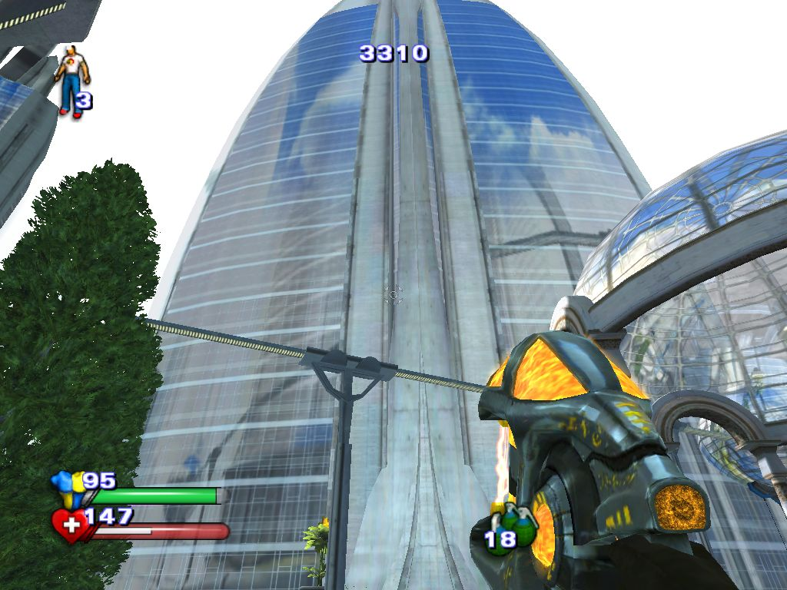
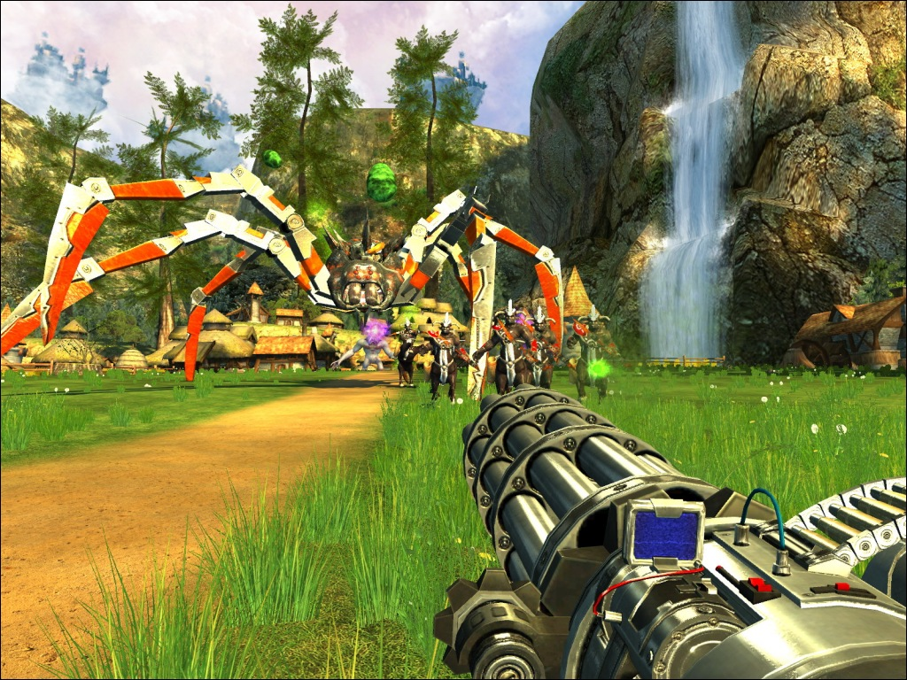
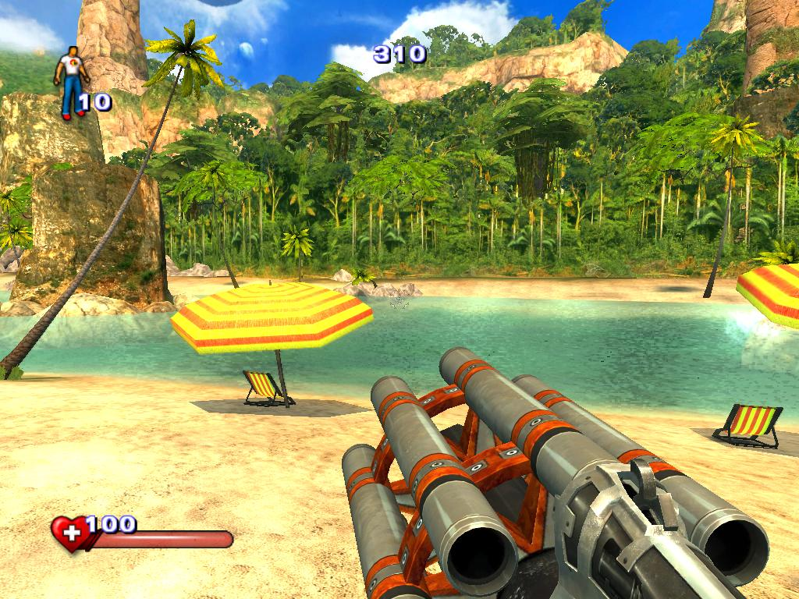

**Ficha Técnica:**  
Título: Serious Sam 2  
Desarrollador: Croteam  
Editor: Take Two  
Precio: 39,99 €  
Pegi: +12  
Web: http://www.serioussam2.com/

Serious Sam no es un título de acción al uso. Sí, tiene todo lo que un videojuego actual debe tener, pero su gran atractivo es reirse de sí mismo.

Al igual que en las dos entregas anteriores, Serious Sam II apuesta por un entorno atípico (junglas, ruinas, poblados...) embutido en una mecanica de más que probada solvencia. Nivel tras nivel, tu ratón aniquilará más enemigos que Chuck Norris en San Juan; pero vaya enemigos. La mayoría son grandes, el resto son descomunales, pero todos son desternillantes. Payasos, hombres-granada, trolls, naves y helicópteros... así hasta contar 45 tipos distintos que te atacan sin piedad en oleadas multitudinarias. El motor "Serious 2 engine" es capaz de mostrar tantos enemigos en pantalla que cuando acabes con ellos tendrás barba de varios dias.

Ojo a la inteligencia artificial. No es compleja, no es innovadora, ni mucho menos es inteligente, pero existe. Vale, no es algo necesario en un titulo de estas condiciones, pero se agradecen detalles como que los soldados no se queden atascados si no encuentran el camino hacia ti, uno de los problemas que achacan muchos juegos de acción descerebrada. Para cumplir tu misión tienes a tu disposición un arsenal digno de Rambo o del protagonista de Doom, en el que están, como no, la escopeta y el lanzamisiles, amén de las pistolas, el rifle de plasma, las granadas, etc. Todo ello diseminado a lo largo de cuarenta enormes niveles desarrollados en siete vastas y distintas localizaciones. Es decir, Serious Sam es largo para rato.

Otra de las novedades son los vehículos. Comienzas subido a un dinosaurio (ojo a como lo atrae Sam) para luego subir en una bola con pinchos, una nave aerodeslizadora, torretas defensivas... no te vas a aburrir. Por si fuera poco, la física acompaña a los gráficos y muestra un nivel excelente, así que tambien tendras que lidiar con un par de puzzles basados en la activación de mecanismos mediante la acumulación de cajas. En cuanto al sonido, las voces son excelentes aunque todo el juego está en inglés y no se han traducido ni siquiera los menus. Por supuesto olvidate de los subtítulos, porque ¿a quien le interesa realmente el argumento? Lo hay, pero es testimonial. Como en Serious Sam y en Serious Sam: The second encounter, solo tienes que apuntar bien. Y también es excelente la música, acompaña bien, es cañera y variada. Pero por desgracia Sam desafina en los efectos. Algunos detalles, como los toros mecanicos al galope ponen la piel de gallina, pero las arañas mecanicas son un desastre, imponen por tamaño, pero no por ruido.

En resumidas cuentas, el título resulta la mar de divertido y adictivo, conjuga muy buenas ideas y un apartado técnico de aupa (al minimo es toda una joya visual y al maximo es una tortura para tu PC). Mención aparte para el apartado multijugador cooperativo, que tiene muy buena pinta y parece que puede dar mucho de sí, aunque es una pena que no haya modos deathmatch o torneos. Así que esto es Serious Sam 2. Nada que no hayas visto, pero combinado con un gusto y un saber hacer excelentes. Altamente recomendable.

**NOTA: 8**

**Lo mejor de Serious Sam 2:**  
Los gráficos  
El humor  
Adrenalínico

**Lo peor de Serious Sam 2:**  
Algunos efectos  
Sin traducir  
Multijugador desaprovechado

**Requisitos mínimos:**  
Windows 98/ME/2000/XP  
Intel Pentium 4 1.3 GHz  
256 MB RAM  
Tarjeta gráfica de 32 MB compatible con DirectX  
Tarjeta de sonido compatible con DirectX  
DirectX 9.0c o superior  
2.5 GB de disco duro

**Requisitos recomendados:**  
Windows 2000/XP  
Intel Pentium 4 2.4 GHz  
512 MB RAM  
Tarjeta gráfica de 128 MB compatible con DirectX 9  
Tarjeta de sonido compatible con DirectX   
DirectX 9.0c o superior  
2.5 GB de disco duro