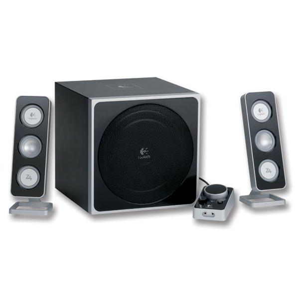
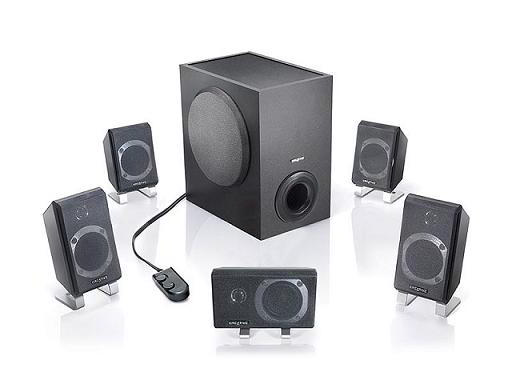
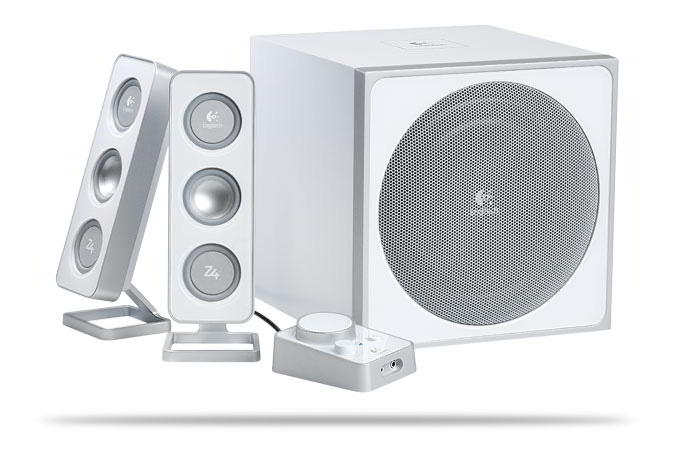

**Ficha técnica:**  
Nombre: Logitech Z-4e  
Fabricante: Logitech  
Precio: 99.90 €  
Página web: http://www.logitech.com/

Recientemente vendí mi conjunto 5.1 de la marca Creative, en concreto el modelo Inspire P5900 (actualmente descatalogado). Se trataba de un potente equipo de 74W RMS.Los Creative me habían dado un resultado excelente: potencia desmesurada para mi habitación (a partir de 60W cualquier cosa lo es) y sonido a todas luces espectacular en juegos y películas; siendo jugar la mayor prioridad. Pese a todo me gusta estar escuchando musica a todas horas y en este punto los Creative fallaban. Por eso me deshice de ellos y me lancé a la búsqueda de un conjunto de calidad, pero bajando desde el escalón del sonido envolvente propio de un home cinema a un conjunto estéreo más apropiado para música.

Los viejos creative:  

Comencé mi búsqueda en el mismo punto de siempre: las tiendas cercanas a mi casa. Podéis hacer el experimento: en la mayoría los conjuntos de altavoces son siempre de gama baja y (con suerte) te sonará de algo el fabricante. Así que me dirigí a un par de sitios online donde descubrí el nuevo modelo de Logitech, los Z-4.

La primera impresión que te llevas es, textualmente: DIOS! Casi 100€ por un conjunto 2.1 de 40W RMS de potencia y de una marca más o menos casera. Pero los Logitech Z-4 pintaban muy bien sobre el papel, con unas especificaciones más que decentes y unas críticas muy buenas: El equipo reparte la potencia en 2x8.5W RMS para los dos satélites y 23W RMS para el subwoofer. Además, los satélites cuentan con 2 transductores de presión y 1 activo (diseño de 3 vías, que aporta mejores agudos al tener varios altavoces para determinadas frecuencias; y es una mejora realmente audible, que no se queda en puro márketing). Junto a estos 3 conos por cada satélite (de 2 pulgadas cada cono), el subwoofer se vuelve el gran protagonista del sistema. Cuenta con 8 pulgadas y transductor activo, lo que supone una potencia mucho más que suficiente para cualquier usuario (habitualmente se montan subwoofers de no más de 5''1/4, es decir el mismo tamaño de un CD, como en el caso de los Creative). Destaca también que no tiene puerto Bass Reflex (la abertura circular que vemos habitualmente).

Exteriormente, los altavoces se pueden encontrar en dos versiones, una en negro y plata (denominada Z-4e) y otra en color blanco que recuerda a los iMac (denominada Z-4i) y cuya presencia es, a priori, mucho más estilizada y atractiva. Independientemente de cual sea nuestra elección, los altavoces cuentan con las mismas características y calidad de construcción, aunque parece que los Z-4i blancos están vendiendose mejor que sus homólogos. Personalmente me decanté por los Z-4e, que combinan muy bien con el resto de mi PC. Su acabado de espejo resulta atrayente.

La instalación es tan simple como la de cualquier conjunto estéreo o 2.1, con un cable de audio que va del PC al subwoofer (donde se encuentra el amplificador y la fuente de alimentación incluídas), un cable analógico parecido a los DSUB de los monitores para el mando a distancia y un cable de corriente (sin transformador, lo cual es de agradecer, al ir integrado en el cajón de bajos). Los altavoces se conectan mediante cables RCA rojo y amarillo (uno cada altavoz). En el control remoto encontramos un botón de encendido/apagado acompañado de un LED azul, una gran rueda con la que regular el volumen y otra más pequeña para ajustar la potencia de los graves reproducidos por el subwoofer, así como un conector de auriculares y otro para enchufar un cable minijack que lleve audio desde, por ejemplo, un reproductor MP3. Una forma buena de sacar provecho a estos altavoces es acompañarlos de una buena tarjeta de sonido (el sonido integrado de los PC's nunca ha sido satisfactorio) o conectarlos a un reproductor de salón o de cadena musical (en los cuales siempre se ofrece una calidad excelente).

Cuando comienzas a reproducir música te das cuenta de que estos altavoces valen lo que cuestan. El diseño cerrado del subwoofer hace que raramente los graves tapen los agudos (problema muy común en cualquier sistema de cine en casa), pero hace que gane en brusquedad. Para entendernos, con un subwoofer bass reflex escucharás tantos graves que parecerá que estás en el baño de una discoteca, con las voces de los cantantes perdidas en el fondo de un pozo y sonando sin consistencia. Sin embargo en un cajón sellado como este los bajos suenan como un bombo: cortos, bruscos, secos.

Los satélites ofrecen por su parte un nivel de potencia suficiente y una claridad muy considerable, con una tonalidad cálida y unos agudos bien definidos. No suena igual un platillo que un piano, y eso se nota. En este aspecto, muy buena nota. En conjunción con el subwoofer, la calidad general se puede calificar de excelente (siempre que no busquemos sonido profesional, donde tendremos que hacer desembolsos mucho mayores) y supera con creces a los mejores conjuntos de Creative (cuyos agudos son casi inexistentes y muy metálicos).

La nota negativa viene dada por un manual escueto (reprochable, pero no muy importante por la sencillez de instalación) y un precio que quizás haga que nos decantemos por otras opciones más económicas, aun a riesgo de sacrificar la calidad de sonido.

En definitiva, unas cajas con un sonido excelente en calidad y suficiente en cantidad como para llenar una habitación de tamaño medio. Si buscas sonido estéreo de calidad sin tener que gastar cientos de euros en ello, echale un ojo a estos Logitech.

**NOTA: 8.5**

**Lo mejor de Logitech Z-4e:**  
Calidad de sonido  
Subwoofer de 8'' sellado  
El aspecto y el transformador de corriente integrado

**Lo peor de Logitech Z-4e:**  
El precio  
Manual algo escueto  
Se echa de menos un mando a distancia inalámbrico