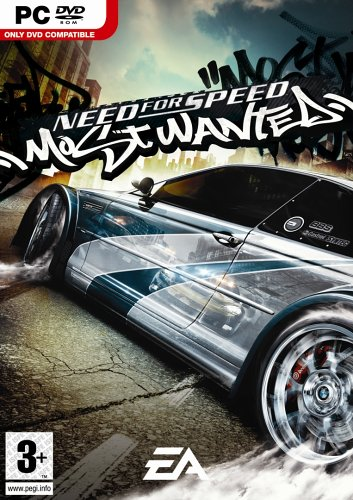
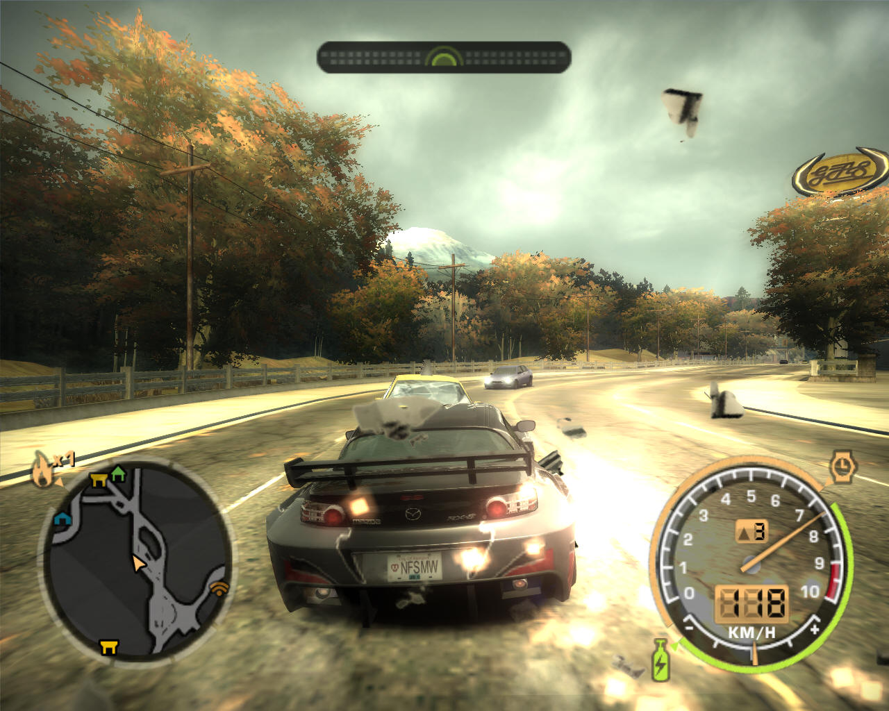
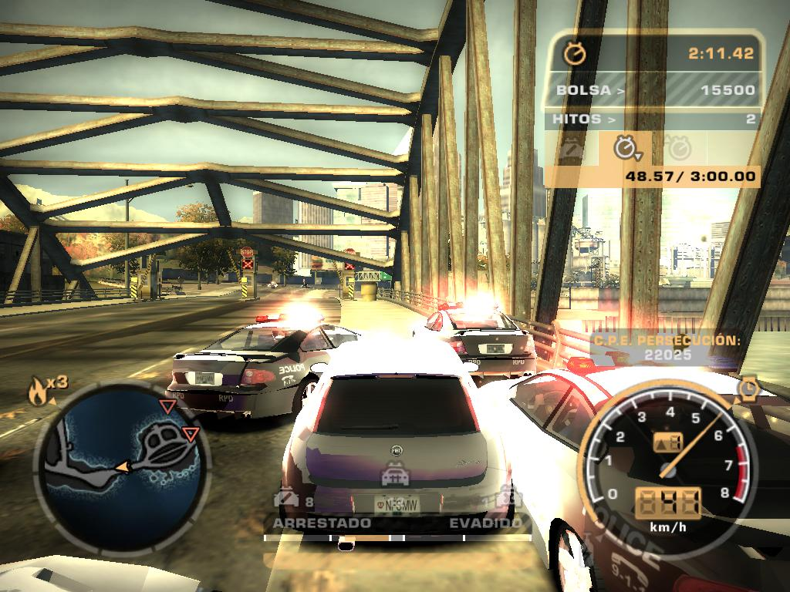
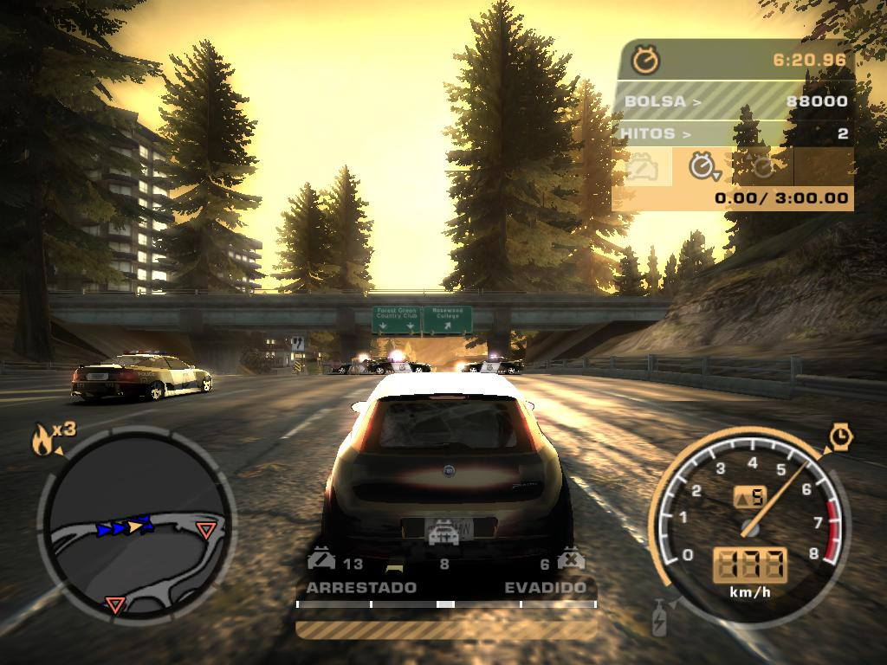
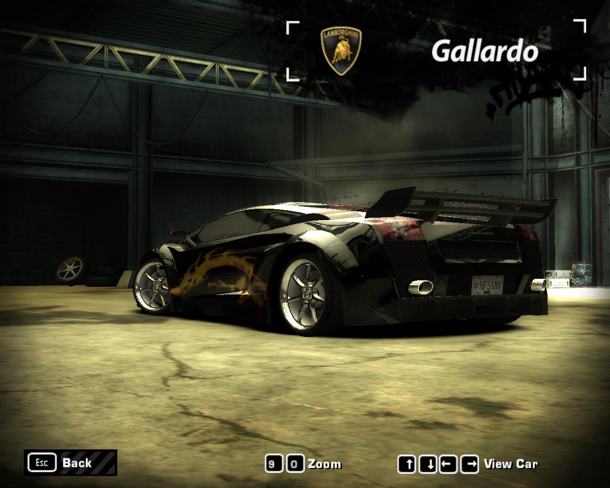

**Ficha Técnica:**  
Título: Need For Speed Most Wanted  
Desarrollador: EA Games  
Editor: Electronic Arts  
Precio: 49,95 €  
Pegi: +3  
Web: http://www.needforspeed.com/

La saga Need For Speed comenzó hace 12 años su andadura. El primer juego de esta serie se presentaba como un arcade realizado con un gusto y una factura técnica exquisitos. A finales del milenio presentaba un planteamiento basado en persecuciones policiales y hace pocos años inauguraba con un tremendo éxito la moda de los juegos de tuning. Por el medio, por supuesto, entregas con gráficos mejorados y más vehículos pilotables. Lejos de estancarse, los desarrolladores de EA han mezclado los diferentes ingredientes de todas las entregas de la serie y el resultado es un cóctel realmente apetitoso.

Most Wanted arranca con un planteamiento que no rompe moldes, pero bien conducido y que los buenos pilotos apreciarán. Mia Townsend (Josie Maran, modelo y actriz en la vida real) te da la oportunidad de volver al mundillo de las carreras urbanas tras un tiempo a la sombra. Tu misión consiste en labrarte una nueva reputación a base de ganar carreras, tunear tu buga y ¡oh, sorpresa! escapar de la pasma si te ve conducir más rápido que Alonso. Sin lugar a dudas esto es lo más divertido de todo lo que se puede hacer en el juego (que no es poco), pero ojo, como saques de quicio a las autoridades muy a menudo, irán a por tí: refuerzos, la secreta, maniobras arriesgadas y bloqueos. Para superarlos, nada mejor que el famoso nitro y la ralentización de tiempo ("Speed Breaker") que ralentiza la acción y te permite precisar e incluso corregir tus volantazos. Hasta puedes utilizar objetos del escenario o provocar colisiones para deshacerte de tus perseguidores.

Además, para progresar será necesario que mejores las prestaciones de tu coche o mismo comprar uno nuevo directamente si el que tienes se te queda corto. ¡Ah! y no descuides la estética: un montón de accesorios, desde llantas y vinilos hasta el óxido nitroso están a tu disposición para construirte tu propio sueño sobre cuatro ruedas. Por si fuese poco, debes ganar carreras contra los tipos de la Blacklist, tipos duros que no dudarán en apostar sus coches (a cada cual mejor) en una clasificación en la que tendrás que escalar posiciones para ser el más buscado (y por tanto, respetado entre tus rivales), y ya de paso vencer al tipejo que te envió al trullo.

Técnicamente, y como en casi todas las franquicias de EA, el título raya a un buen nivel. Llaman la atención el renderizado de los vídeos; son escenas reales mezcladas con imágenes generadas por ordenador a las que, después de ser montadas, se les ha aplicado filtros que le confieren un aspecto plástico para no notar la diferencia entre un tipo de imágenes y otras. Las texturas son bastante buenas, aun siendo este un lanzamiento multiplataforma; pero el rendimiento no es del todo bueno, sobretodo bajo configuraciones SLI donde el programa tiene serias dificultades y pide a gritos un parche para optimizar el funcionamiento. Los modelados, los escenarios y los efectos de iluminación son, eso si, excelentes. Por su parte, el sonido es aceptable, pero es una pena que solo llegue a ofrecer un insulso estéreo cuando un sistema multicanal nos podría haber puesto los vellos como escarpias.

A mayores: una historia bien presentada, una IA a la altura, apartado multijugador correcto y muchísimas opciones para personalizar los vehículos (tanto por dentro como por fuera). En definitiva, el arcade de conducción más completo y divertido del momento, genialmente realizado y que se merece tu atención, a la espera de la siguiente entrega de la serie.

**NOTA: 8**

**Lo mejor de Need for Speed Most Wanted:**  
Persecuciones  
Escenas de video  
El tuning

**Lo peor de Need for Speed Most Wanted:**  
Pequeñas caidas de rendimiento  
Sonido estéreo insulso  
Menos coches que en anteriores ediciones

**Requisitos mínimos:**  
Windows 98/ME/2000/XP  
Intel Pentium III 1 GHz  
256 MB RAM  
Tarjeta gráfica de 64 MB compatible con DirectX  
Tarjeta de sonido compatible con DirectX  
DirectX 9.0c o superior

**Requisitos recomendados:**  
Windows 2000/XP  
Intel Pentium 4 2.8 GHz  
512 MB RAM  
Tarjeta gráfica de 128 MB compatible con DirectX 9  
Tarjeta de sonido compatible con DirectX  
DirectX 9.0c o superior