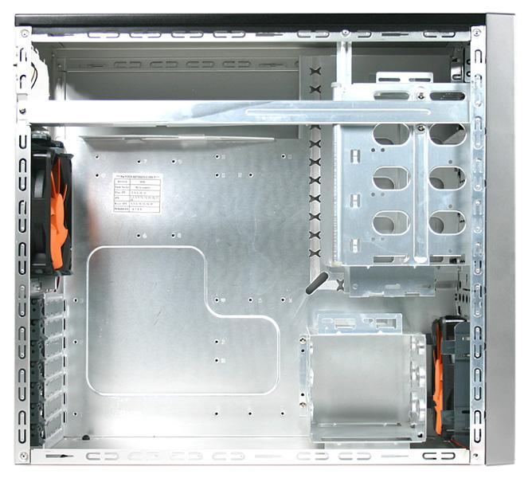

**Ficha técnica:**  
Nombre: Matrix Vx  
Fabricante: Thermaltake Technology Co.  
Precio: 79.00 €

Thermaltake es una veterana empresa que los aficcionados al hardware conocerán. En su trayectoria figuran varios productos de entre los más influyentes de todos los tiempos, como la caja Xaser (revolucionaria) o sus soluciones de refrigeración (BigWater o BigTyphoon, entre otros). La compañía es sobretodo conocida en el ámbito del modding o el overclocking y se está abriendo paso entre otro sector más complicado: los usuarios exigentes. Si bien hasta hace unos años la gente no se fijaba en el aspecto exterior de su PC, esta tendencia ha cambiado mucho en los últimos años, y es ya una auténtica necesidad para los fabricantes el ofrecer productos atractivos a la vista.

En este caso, Thermaltake ha dejado de lado las extravagancias y el impacto visual de la Xaser o las líneas redondeadas de la Swing para llegar a los usuarios exigentes con tres premisas bajo el brazo: Rendimiento, Refrigeración y Diseño. Los usuarios exigentes le piden a una caja una amplitud suficiente para instalar una generosa cantidad de dispositivos, un flujo de aire que ayude a la refrigeración de los componentes y un diseño atractivo a la vista. La caja Matrix Vx es tal vez el mejor intento de Thermaltake para lograr esto hasta la fecha. Está disponible en negro o en plateado y existe la opción de la ventana lateral (algo ya habitual en cajas de gama alta o media-alta). Su hermana menor, Matrix, no dispone de los dos ventiladores de 12cm incluidos con la Vx. Su tamaño es ATX aunque admite placas microATX.

Nada más sacarla de la caja te llamará la atención su ligereza. Thermaltake asegura que es una caja "ligera como una pluma y sólida como una roca". Esto es posible gracias al aluminio de 0.8mm en el que ha sido fabricada, aunque luego te das cuenta de que tal vez sea un poco enclenque. Montar un PC en su interior es un placer. Aunque no hay espacio suficiente para un sistema de refrigeración por agua, los componentes entran sin problemas. Quizá la placa base quede algo justita de espacio, pero nada grave, y el sistema de instalación sin herramientas ni tornillos luce como nunca antes habíamos visto. Solo las unidades de 3'1/2 externas (como disqueteras o Baybuses) necesitan ser atornilladas (pequeño tirón de orejas para Thermaltake). La caja cuenta con un par de huecos para esconder cableado. Por otra parte, la situación de los usb frontales quizá no sea la mejor pero es práctica al estar siempre a la vista y no depender de ninguna puertecilla. El caddy para discos duros se encuentra en perpendicular, por lo que la instalación resultará muy sencilla, y la forma de encajar las unidades ópticas funciona a la perfección, quedando correctamente alineadas y sin molestas rendijas que estropeen el acabado.

El chasis se encuentra perfectamente ventilado, empezando por la rejilla en la que se ha construido el frontal. El aire fresco entra directamente al interior, sin obstáculos en su camino y es empujado por un ventilador silencioso de 12cm de la propia marca (solo en la versión Vx, en la versión normal no se incluye) directo al caddy de discos duros. Tal vez la posición de éste entorpezca un poco el paso del aire, por lo que justo enfrente al disipador de la CPU hay una abertura para meter otro ventilador de 8cm en el lateral de la caja. Para sacarlo, nada mejor que otro ventilador igual al primero debajo de la fuente de alimentación (que si es buena también ayudará). Como véis, aun siendo simple y estar muy visto, este es el modelo a seguir en cuanto a refrigerar un PC. Thermaltake no se ha complicado y ha simplificado el tema del enfriamiento: no puedes obligar al aire frio a hacer giros de 180º como ocurre en cajas como la Gigabyte Aurora. Hay que decir que el ventilador frontal inlcuye un filtro de polvo lavable: bravo por la Matrix!

Sin duda, el diseño interior de la Matrix está muy bien pensado, sin querer tampoco ser nada revolucionario. Pero esta caja resuda elegancia por todo su frontal poroso. Influencia de Apple y los iMac, el frontal de rejilla, los botones metalizados, el minimalismo de la insignia Thermaltake (aunque no llegue al nivel de la compañía de la manzana)... sus líneas suaves y claras resultarán relajantes y no desentonarán en ningún lugar. El efecto sobrio y moderno del negro mate del aluminio tambien resulta muy atractivo, y los pequeños detalles plateados elevan el conjunto al nivel visual de una Stacker o una P180. Solo empaña la puntuación el hecho de que los laterales parecen un poco enclenques en comparación con una caja tradicional, pero en absoluto supone un problema para la salud de tu máquina.

Así pues tenemos ante nosotros a un firme candidato para llegar a ser el rey de las torres midi, que si soluciona sus pequeños defectos en la próxima versión sin variar un ápice el aspecto o el diseño interior, puede llegar a ser una caja histórica. Si hasta ahora creíamos que las Centurion 5 de Coolermaster eran las mejores midi... ya tenemos serias dudas.

**NOTA: 8.5**

**Lo mejor de Thermaltake Matrix Vx:**  
Aspecto externo elegante  
Montaje sin herramientas  
Ventiladores de 12cm incluídos

**Lo peor de Thermaltake Matrix Vx:**  
Laterales un poco enclenques  
Posición de los usb frontales  
Las unidades de 3'1/2 han de ser atornilladas