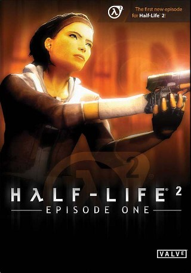
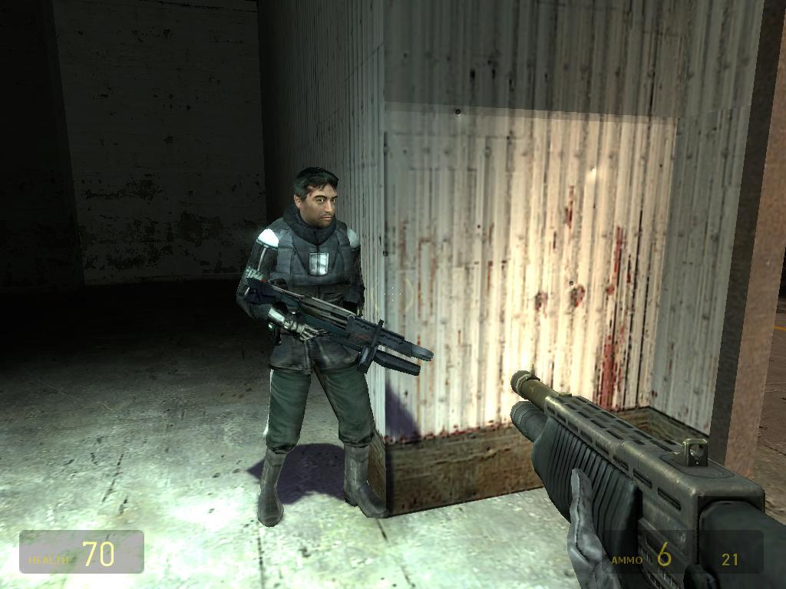
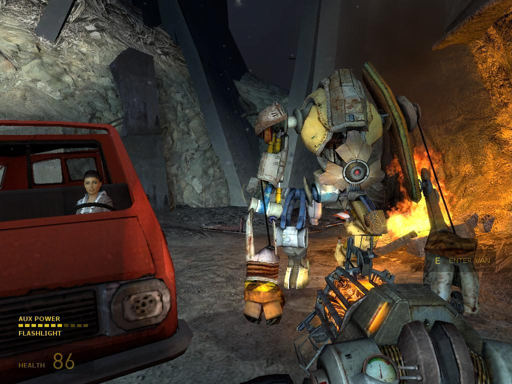
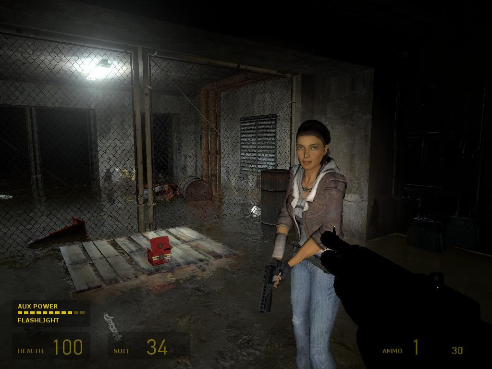
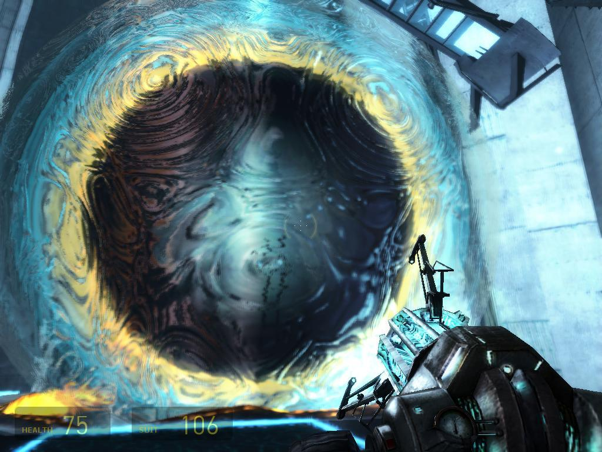
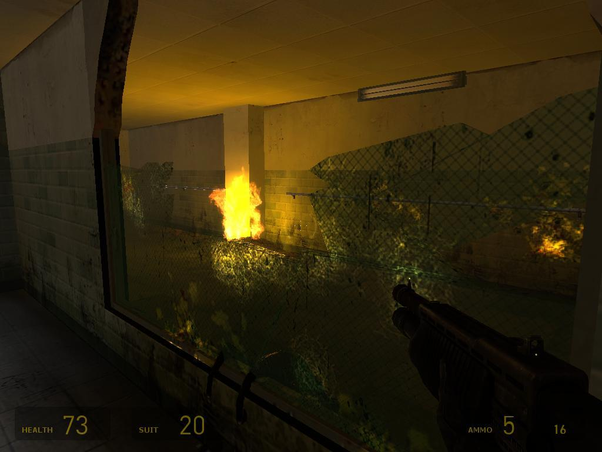
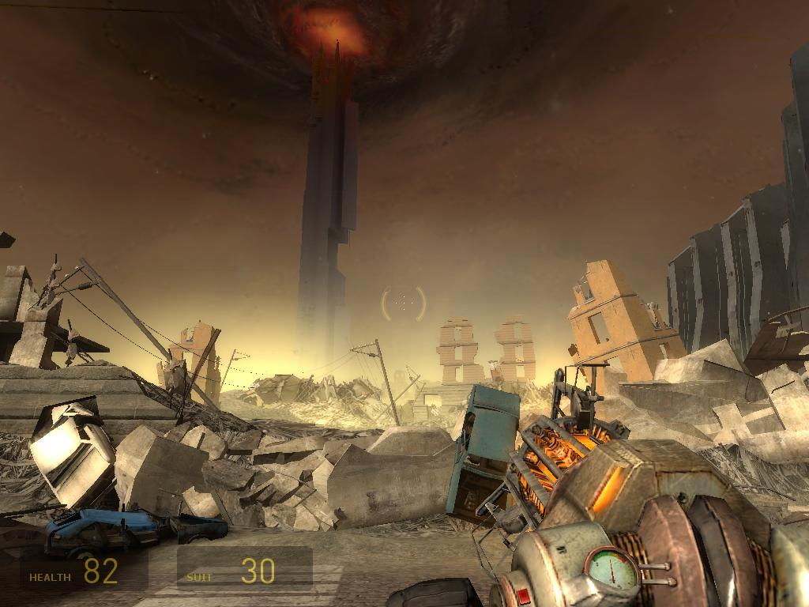
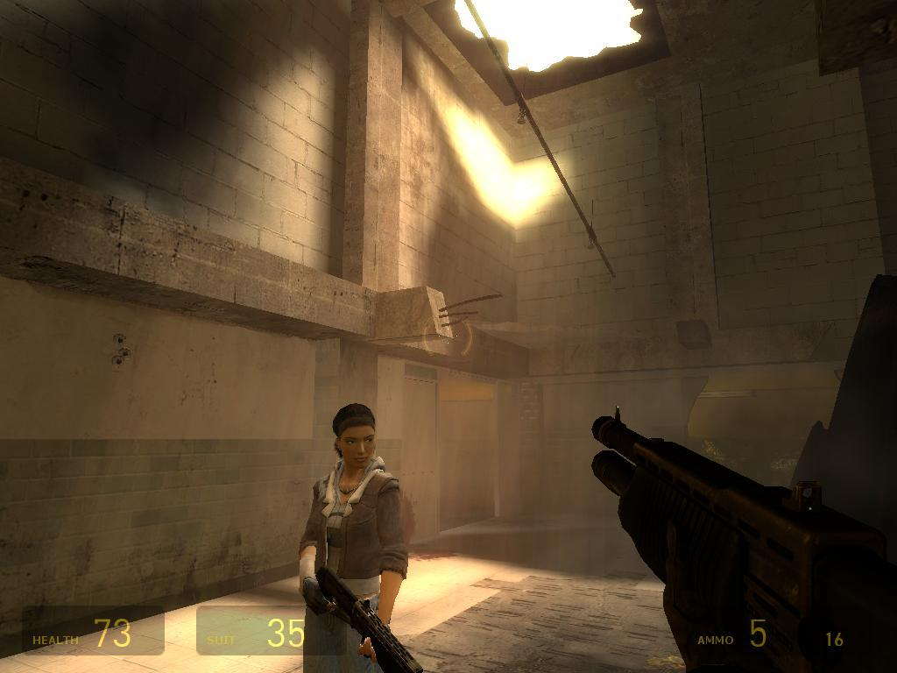
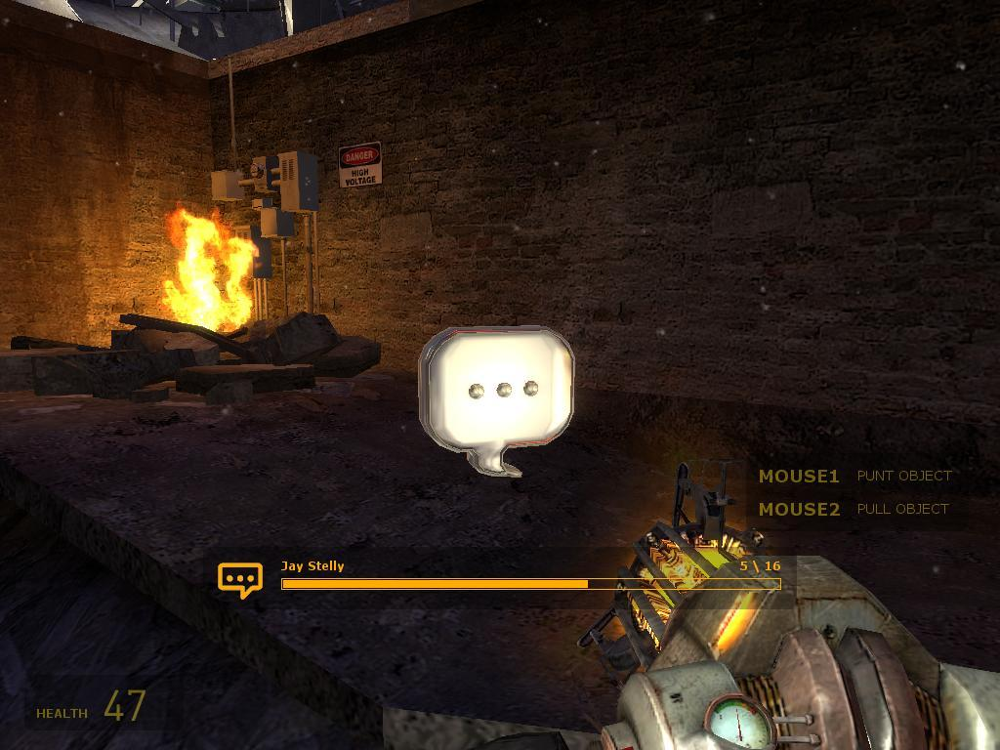
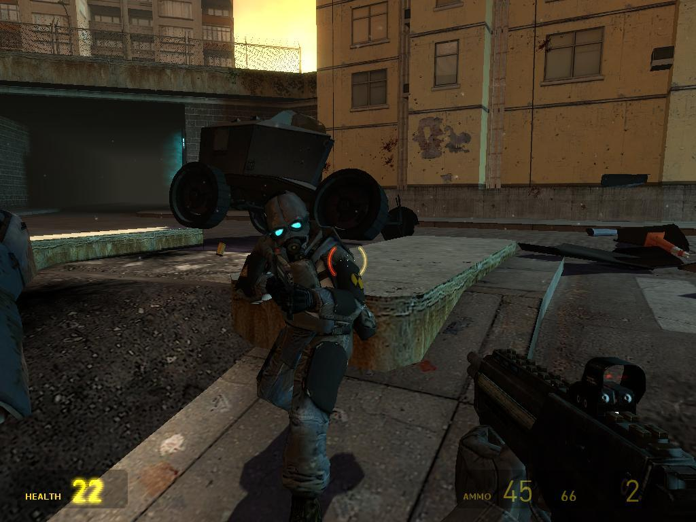

**Ficha Técnica:**  
Título: Half-Life 2 Episode One  
Desarrollador: Valve Software  
Editor: Electronic Arts  
Precio: 19,95 €  
Pegi: +16 Web: http://ep1.half-life2.com/

Retorne a windows y comencé a sentirme solo. Es la primera vez que me ocurre algo así, y lo más inquietante es que he estado solo todo el tiempo, pero solo lo he notado al pulsar en "Salir". Me recosté en mi sillón. Rápidamente eché una ojeada al correo y volví a cargar el juego. Half-Life 2 fué realmente increible, un juego que incluso antes de ver la luz ya se reconocía como un hito y que, en el momento de su publicación fue alabado hasta la saciedad (y aun así, toda alabanza era insuficiente) al mismo tiempo que era ya tildado de clásico instantáneo. Gordon nos presentaba un Mundo, con mayúsculas, no como esos "mundos" en los que Doom, [Quake](../../../2005/11/quake-4/) o [Far Cry](../../../2004/05/far-cry/) prometían sumergirnos. Mientras otros se esforzaban por reflejar la realidad, Half-Life la interpretaba, y partía de sus bases para darte un auténtico festin de buen software. Resudaba vida por todos sus poros. ¿Pero qué te vamos a contar que no sepas ya? Pues verás...

Cargué el juego de nuevo y la sensación de soledad se disipó por completo, realmente brillante. Episode One es el primero de una serie de expansiones para Half-Life que nos serán presentadas por capítulos y cuya segunda entrega está prevista para finales de 2006. Y a diferencia del original, en esta primera entrega no te encuentras solo. Si creias que tras acabar con Breen habías solucionado todo, te equivocabas. Escaparás de las manos de G-Man para, junto a Alyx, escapar de Ciudad 17 lo antes posible. No vamos a desvelarte el argumento, pero su resolución es realmente meritoria de un Oscar. En HL2, en especial durante la travesía costera, el ritmo narrativo se perdía un poco, pero en Episode One, siempre te es revelada nueva información... o no. Porque aunque algunas dudas se resuelven, las preguntas se amontonan y poco puedes intuir.

Genios del guión, en Valve Software saben que la mejor manera de vender una (presumiblemente) trilogía es contándolo todo hacia el final. Aún así, no te creas que en este episodio vas a aburrirte. Muchas, muchísimas fases de puzzles lógicos al más puro estilo de Freeman que tendrás que resolver con tus dos mejores aliadas: la pistola gravitatoria y la puntería de Alyx. De la primera poco podemos decirte que no sepas, pero en esta ocasión la potencia del arma será mayor para superar nuevos retos. Exclusivamente con ella recorrerás aproximadamente un tercio de la aventura, y luego compartirá protagonismo con todas las armas vistas anteriormente: la ballesta, el rifle de pulsos, la mágnum, la escopeta, el lanzacohetes... Curiosamente, solo verás la mitica palanca en el ultimo suspiro del juego, y la verdad, poco o nada la vas a utilizar. En este punto, tengo que añadir que deseo que los desarrolladores le den algo de protagonismo más adelante, pues supone todo un mito que de por sí evoca ya a toda una saga de videojuegos.

En cuanto a Alyx, las novedades son bastantes, aunque algunas tienen un caracter más bien técnico. El bellezón no se despegará de ti en ningún momento, estrenará nuevos movimientos de combate y, sobre todo, te cubrirá mientras resuelves puzles en medio de ataques enemigos. Supone toda una vuelta de tuerca al videojuego la forma en que Alyx te acompaña. Realmente te sentirás junto a otra persona. La señorita Vance posee una personalidad tan real, que la ficción de Episode One deja en bragas todo lo visto hasta la fecha. Sí, creo que fué en ese instante cuando me recosté en mi asiento. Valve ha creado al que, con toda seguridad, se convierta en el segundo personaje femenino más famoso y tangible del mundo de los videojuegos solo superada por la veterana Lara. Es una verdadera experiencia escuchar a Alyx bromear sobre los nuevos enemigos u oirla suspirar por su padre. Emociones que afloran y que se trasladan al jugador por completo.

Pero sigamos adelante. ¿Hemos dicho nuevos enemigos? Bueno, no es para tanto, en realidad, lo más novedoso es el alizombi, o "Zombine", chiste desternillante en boca de la coprotagonista sobretodo en la versión original del juego. Se trata de soldados combine que han sido atacados por los cangrejos y que ahora corren hacia ti a una velocidad endiablada y que no dudarán en activar una granada para cometer un ataque suicida haciéndola explotar en sus manos. Cuando veas que uno de estos emplea esta maniobra corre. Corre y no mires atrás, corre en la dirección que sea, pero aléjate de ellos. Existe otro tipo de enemigo: los Stalkers o acechadores. Estos cuerpos humanos han sido despellejados y ahora operan como si de robots orgánicos se tratase para los combine. No te enfrentarás a ellos, pero si que te pueden complicar algún que otro puzle en el principio de la aventura. El resto de adversarios ya los conocemos por el juego original.

Lo que también conocemos son los escenarios que, aunque con variaciones, suponen un compendio de las mejores localizaciones vistas en HL2. Son una auténtica pasada. Comienzas a los pies del rascacielos, pero la aventura te llevará por toda la cuidad, por el subterráneo, por alguna que otra vivienda, etc. Son los de siempre pero lucen como nunca, las nuevas texturas son excelentes y los avances en el motor gráfico evitan la (pequeña) sensación de cartón piedra de algunos momentos del original. Mención especial merece el aparcamiento y el subterraneo, donde una atmosfera opresiva y oscura te pondrá los pelos de punta, haciendose notar la influencia de Doom y, más sutilmente, [F.E.A.R.](../../../2005/11/fear/). ¿Que podemos esperar de los escenarios? Pues al principio una belleza plástica que bien podría pertenecer a cualquier película de ciencia-ficción, luego un aspecto agobiante y claustrofóbico excelentemente reproducido y, en el último tercio de juego, una sesión de combate urbano que vence y convence. Tal vez el combate te deje un sabor agridulce despues de probar la espectacularidad de F.E.A.R. o ver los fuegos de artificio de [Crysis](../../../2007/12/crysis/), pero aun así son exquisitos. Los soldados se cubren, arriesgan lo justo y procuran eliminarte desde la distancia. Recomendamos que pongas la dificultad en media o alta para que supongan un reto considerable (el nivel fácil se antoja muy sencillo) y porque además así percibirás más claramente los progresos que ha hecho Valve en cuanto a la IA.

Técnicamente, Episode One supone un paso no de gigante, pero si bastante grande, respecto a HL2. Si bien comparado con Lost Coast no muestra una evolución tan evidente, la inclusión de efectos como HDR (High Dinamic Range, una nueva forma de emplear la iluminación para ofrecer un nivel gráfico extremadamente realista) o el uso de texturas de alta resolución dotan al conjunto de un aspecto inmejorable. De hecho, muchas mejoras se han orientado hacia los personajes, por lo que Alyx tendrá una pinta que ya quisieran muchas heroinas para ellas...

Por otra parte, y aunque los requisitos siguen sin ser altos, Episode One exprimirá al máximo cualquier PC. Antialiasing, filtro anisotrópico, refracción del agua, corrección de color, sombras en tiempo real, luces dinámicas... Tienes efectos para aburrirte, pero podrás ajustarlos perfectamente a la potencia de tu ordenador. El sonido también está a la altura, con soporte nativo multicanal hasta 7.1 y una banda sonora de lujo, mejor implementada incluso que en la anterior entrega. Algo echamos en falta, y se trata de un mejor doblaje en la versión española que aunque cumple podría haberse resuelto mejor. En contra, Episode One cuenta con un número de horas irrisorio (entre cuatro y seis horas son necesarias para ventilarlo) y un precio que, siendo honestos, es una clavada porque a este seguirán otros dos episodios de igual duración y coste. También achaca la falta de novedades, pero el argumento maquilla un poco este punto negro y deja muy abierta la ambientación para la próxima entrega. Como anécdota, destacar que, como en Lost Coast, se ha incluido la pista de comentarios de los programadores, de gran interes para aquellos que quieran rejugar el título con una perspectiva diferente y que nos mostrará detalles que tal vez se nos hayan pasado.

En definitiva, una expansión mucho más que digna de una obra maestra, que en absoluto decepciona y te deja ganas de más. Lejos de suponer una revolución, es también mucho más que lo mismo de siempre.

**NOTA: 9**

**Lo mejor de Half-Life 2 Episode One:**  
Los gráficos  
La ambientación  
El desarrollo

**Lo peor de Half-Life 2 Episode One:**  
Pocas novedades  
La duración  
El precio junto a los próximos episodios

**Requisitos mínimos:**  
Windows 98/ME/2000/XP  
Intel Pentium III 1.2 GHz o equivalente (Athlon/Duron/Celeron)  
256 MB RAM  
Tarjeta gráfica de 64 MB compatible con DirectX 7  
Tarjeta de sonido compatible con DirectX  
DirectX 9.0c o superior  
2 GB de disco duro  
Conexión a internet

**Requisitos recomendados:**  
Windows 2000/XP  
Intel Pentium IV 2 GHz  
512 MB RAM  
Tarjeta gráfica de 128 MB compatible con DirectX 9  
Tarjeta de sonido compatible con DirectX  
DirectX 9.0c o superior  
2 GB de disco duro  
Conexión a internet