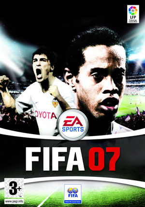
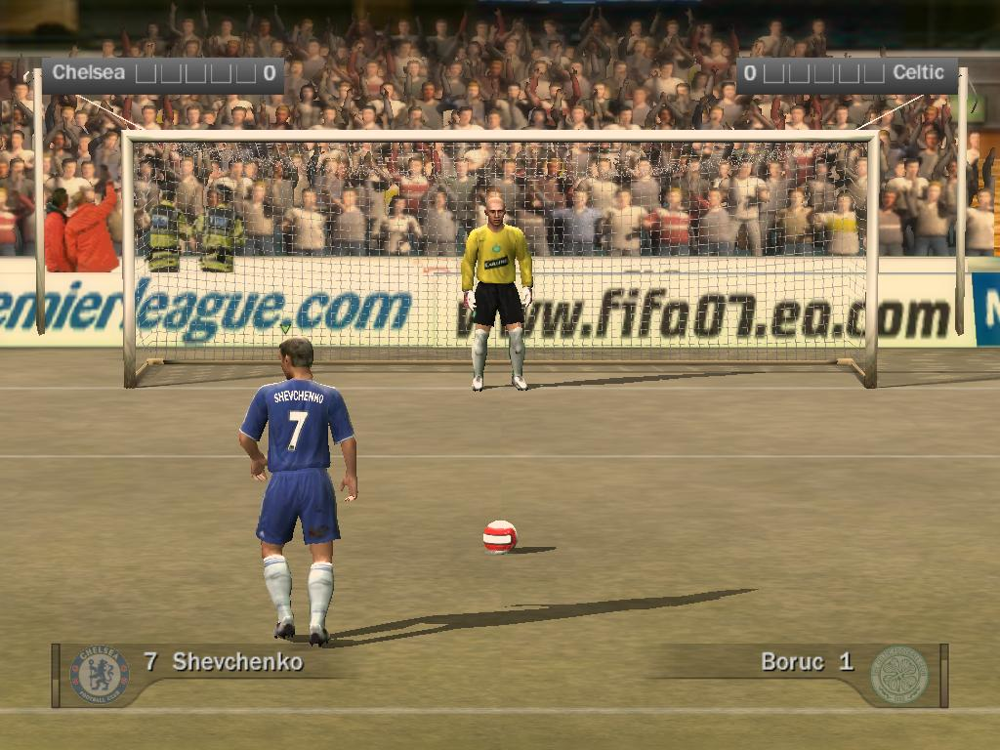
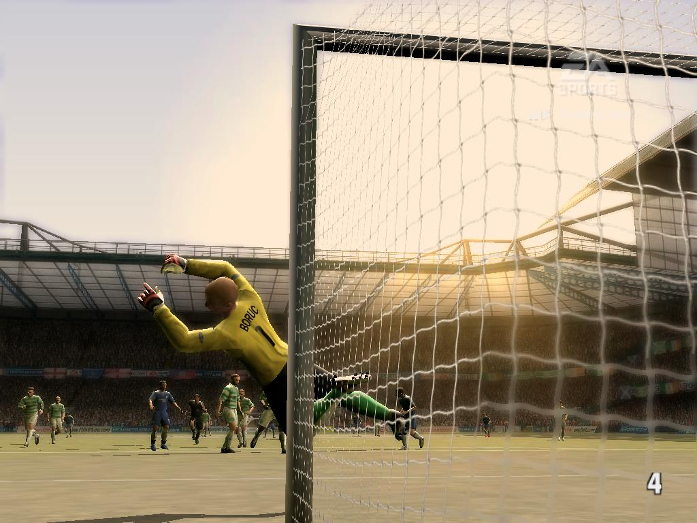
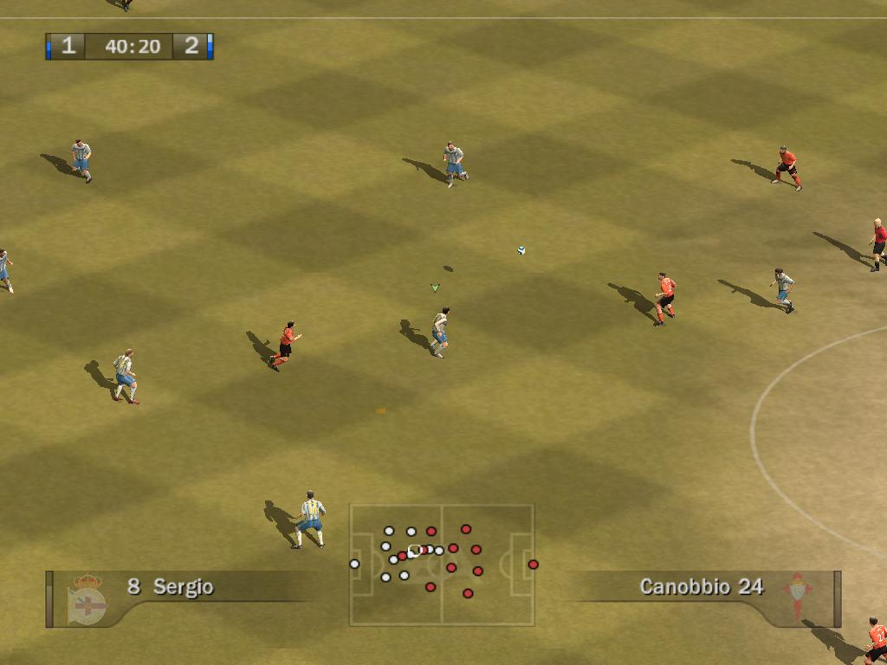
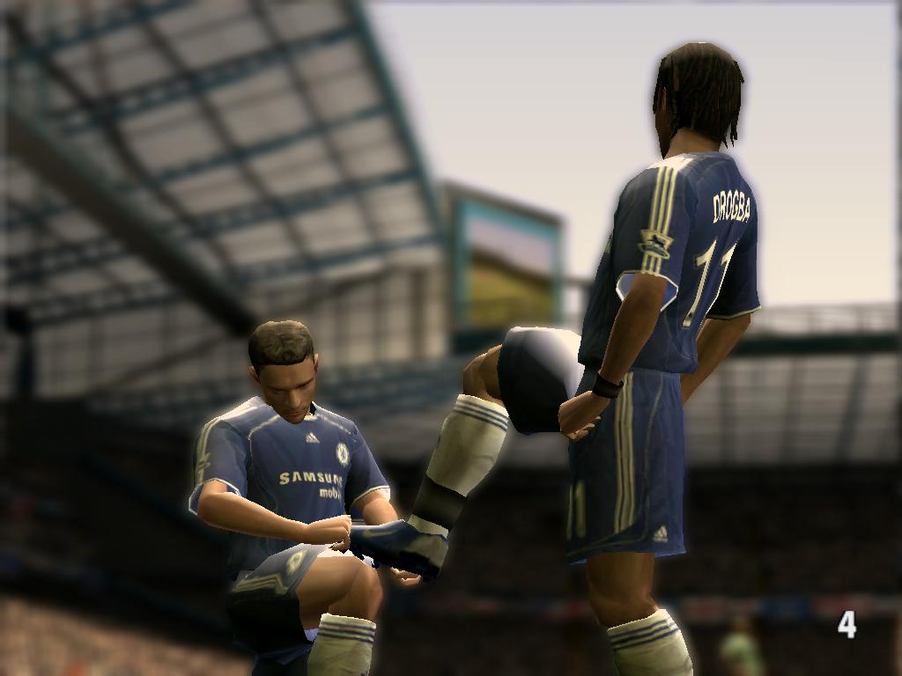

**Ficha Técnica:**  
Título: FIFA 2007  
Desarrollador: EA Sports  
Editor: Electronic Arts  
Precio: 39,95 €  
Pegi: +3  
Web: http://fifa07.ea.com/

EA vuelve a hacer rodar la pelota este año. Llega una nueva edición del juego deportivo más famoso de todos los tiempos, FIFA 2007. Anuncios, webs, rumores, escaparates,... hasta en la sopa!¿Te la vas a perder? No lo creo. El título regresa como cada año a nuestros discos duros para desatar un festival colorista que recrea el fútbol más cercano al espectáculo.

Lo primero que llama la atención es... nada. El juego, lejos de presentar innovaciones visuales o técnicas, sigue la linea continuista que tantas críticas le ha granjeado. No es que esto sea malo, en absoluto, pero se nota que apenas difiere de las ediciones de hace un par de años. Y si esto lo dice alguien que no ha seguido las dos últimas entregas... mal asunto. En Electronic Arts se disculpan diciendo que las novedades las tendremos que buscar cuando llegue la siguiente generación de consolas (no olvidemos que la práctica totalidad de títulos de esta compañía son productos multiplataforma).

Comencé mis primeros toques de balón en el partido rápido. Es una de las múltiples opciones que han puesto a tu disposición: torneos, ligas, modo manager, ligas interactivas, entrenamientos, carreras, desafíos... completar el juego te llevará mucho tiempo. Todas las posibilidades son viejas conocidas salvo las ligas interactivas, que permiten jugar la liga actual con tu equipo en modo multijugador contra los equipos de otros jugadores siguiendo el calendario oficial. Resulta al menos tentador probarlo y comprobar si se corresponde con la realidad de cada escuadra. Pero a FIFA le sobra saber que un buen juego tiene que desbordar al jugador en los primeros compases. Amén de las ya clásicas revisiones de la IA y de la física (aún así inconvincentes), se ha acelerado la velocidad de juego mediante una artimaña un poco "manazas": variar la configuración inicial del juego. Es decir, que si te diriges a la configuración del juego y la reduces te quedarás con el cansino ritmo de toda la vida. Para seguir abrumando al usuario, los efectos de sonido y los comentarios vuelven a sorprendernos (muy bien en este aspecto) y algunos detalles como el árbitro o los líneas suman bastantes puntos. Sin embargo, jugar acelerado provoca una mejor sensación de juego, pero en absoluto maquilla los desperfectos heredados de anteriores entregas.

Los jugadores (aunque con brazos y cuellos desproporcionados y unas minúsculas piernas) están correctamente representados, aunque siempre se cuela alguna pifia sonada, pero nada grave. Por supuesto, nombres y dorsales oficiales, montones de clubs y suficientes ligas como para entretener a Maldini un fin de semana enterito. Los gráficos son quizás la asignatura pendiente junto a la física y la IA. Visualmente se ha vuelto menos plástico que los anteriores, más organico, mejor representados inlcuso los efectos de iluminación. Las sombras en tiempo real son excelentes y la luz ambiental revisada le dotan de un aire más cálido. Atención tambien a un efecto foco que mejora infinitamente las animaciones (también de nueva factura y mucho mejor interpretadas) y sumerge al jugador en la acción de forma más convincente. Pero peca de producto multiplataforma, y la calidad de las texturas es realmente pobre por influencia de la PS2. El rendimiento, además, es bastante mejorable durante los videos.

En cuanto a la jugabilidad, sigue siendo FIFA para bien y para mal. Es instantáneo, se las sabe todas para hacerte pasar horas y horas frente al monitor, pero el control de los jugadores sigue siendo nefasto y la inteligencia (tanto de compañeros como rivales) es pésima. Por ejemplo, indicas a tu equipo que ataque usando las bandas pero nunca ves a tu lateral doblar a tu extremo para hacerle apoyo. Más de lo mismo si llegas a la línea de fondo. En un contraataque lo más probable es que llegues tú solo y un mísero defensa que poco o nada puede hacer para evitar un centro... que nadie llegará a rematar.

Así es este FIFA, más de lo mismo y, en mi modesta opinión, mediocre. Adolece de todos sus defectos y sus pequeñas novedades y aciertos no pueden evitar la sensación de juego preprogramado, sobre raíles, automatizado. Es un gusto verlo, jugarlo ya no tanto.

**NOTA: 6.5**

**Lo mejor de FIFA 2007:**  
La ambientación y el escenario  
Las licencias  
Los comentarios

**Lo peor de FIFA 2007:**  
Evolución nula  
Sensación de automatismo  
El control

**Requisitos mínimos:**  
Windows 98/ME/2000/XP  
Intel Pentium 4 1.8 GHz  
256 MB RAM  
Tarjeta gráfica de 32 MB compatible con DirectX  
Tarjeta de sonido compatible con DirectX  
DirectX 9.0c o superior

**Requisitos recomendados:**  
Windows 2000/XP  
Intel Pentium 4 2 GHz  
512 MB RAM  
Tarjeta gráfica de 128 MB compatible con DirectX 9  
Tarjeta de sonido compatible con DirectX  
DirectX 9.0c o superior