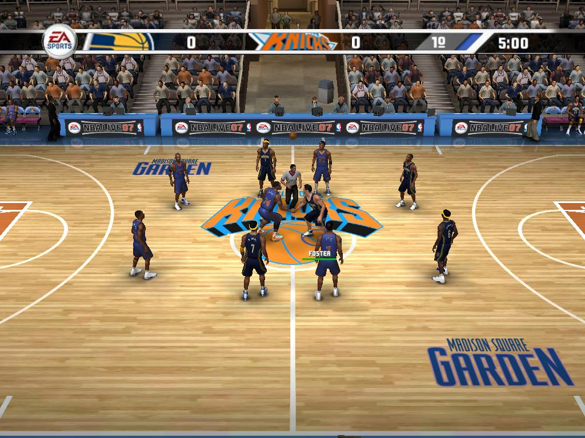

**Ficha Técnica:**  
Título: NBA Live 2007  
Desarrollador: EA Sports  
Editor: Electronic Arts  
Pegi: +3  
Precio: 39.95 €  
Página web: http://www.easports.com/nbalive07/

EA no falta a su cita con el basket. NBA Live 2007 es su último intento para hacerse con la corona de mejor simulador de baloncesto, y veremos si lo consigue. Como muchos de los juegos de esta compañía, por no decir la práctica totalidad de sus sagas deportivas, el juego parte de una base de contrastada rentabilidad: todas las licencias, jugadores, equipos, camisetas, canchas, marcas deportivas, sponsors... NBA pretende buscar el ambiente propio de la competición de carne y hueso para acercar el realismo y sumergir al jugador en un mar de datos y detalles. Esto no es noticia en los juegos de EA, como decíamos, aunque al mismo tiempo achaca varios defectos de sus sagas hermanas.

Pero vayamos por partes: nada más entrar en el juego tienes la posibilidad de jugar desafíos rápidos o entrar en modos más largos como el Dinastía, en el que tendrás que guiar a tu equipo hacia la victoria a lo largo de la temporada. Si lo prefieres puedes fardar de habilidades con los concursos de mates y triples (espectáculo puro) o "relajarte" en algún que otro 1 contra 1 en un pabellón que bien podría ser el de tu ciudad. La vida del juego es larga, siempre y cuando consigas conectar con él. Escogidos los equipos y la cancha, un partido cualquiera comienza con una pequeña escena cinemática que sirve de presentación para mostrar en pantalla las alineaciones iniciales y alguna que otra estadística anecdótica. Éste es uno de los puntos fuertes del juego: si fallas todos tus libres verás caer en picado tu estadística como lanzador, pero si machacas todos los aros o metes triples como churros tu nombre será un auténtico superventas. Aún hay más: según tu actuación el público puede responder de forma más o menos amistosa, aunque normalmente se limita a abuchear a los hombres del visitante.

El juego se desenvuelve de forma ágil y casi siempre te obliga a pensar nuevas tácticas, sobretodo con los niveles altos de dificultad, y resulta satisfactorio realizar de forma correcta un alley oop o llegar hasta la cocina del rival. De todas formas, dispones de una generosa cantidad de recursos a tu alcance. El control FreeStyle te deja mucho margen de maniobra, y siempre consigues moverte de la forma que quieras, lo cual suena muy bien, pero requiere un gamepad con 2 controles analógicos y unos diez o doce botones (similar al famoso mando de Play Station) para explotarlo al máximo. De la misma forma, el "Factor X" (nombre originalísimo donde los haya) es la cualidad de uno de tus jugadores, del hombre que puede decidir un partido en una acción, y que te garantiza un relativamente buen porcentaje de éxito en cualquier situación comprometida, como un triple desesperado en las últimas décimas del cuarto.

Sin embargo, NBA Live 2007 peca excesivamente de juego arcade, de no querer pofundizar y de conformarse con mucho menos de lo que podría dar de sí. Al igual que [FIFA](../../../2006/10/fifa-07/) (por poner el ejemplo más sangrante y conocido), la saga de baloncesto no se termina de decidir entre una simulación pura o la velocidad y diversión de los arcades inmediatos. Hijo de un a filosofía indecisa, este título falla en su objetivo: divierte, pero marea y se vuelve repetitivo al poco rato. Aunque disponga de modos de juego variados, a veces crees que cazar un rebote o meter un triple es simplemente cuestión de suerte; y esto es sin duda lo que te deja con esa sensación de juego confuso, de una decena de hombres que se pelean por un balón que parece tener vida propia. Técnicamente dá el pego, pero tampoco es un milagro de la programación. El control es su peor faceta, como dijimos, pero esta entrega de NBA Live achaca ya la edad de un motor gráfico que lleva varios años sin ser renovado, a la espera de la llegada de las consolas de nueva generación. Y es que son los problemas típicos de un producto multiplataforma: control inadecuado, gráficos que no aprovechan la potencia desmesurada de un PC en comparación con una Play, insulso sonido estéreo de calidad media y ligeros tirones si no se superan holgadamente los requisitos mínimos.

Si no fuese por un control pésimo, un apartado técnico vergonzoso y una sensación de caos reinante, NBA Live 2007 sería el mejor juego de baloncesto del mercado. Cuenta con buenos factores, como un desarrollo ágil, muchas licencias y una extensa base de datos; pero es el mejor simplemente porque es el único. Mientras nadie le plante cara y los errores no se subsanen, la saga NBA de EA será siempre un subproducto a la sombra de FIFA en el mercado europeo. Una lástima, a fin de cuentas.

**NOTA: 6.5**

**Lo mejor de NBA Live 2007:**  
Modos de juego  
Jugadores, estadios, camisetas...  
Las estadísticas y el multijugador

**Lo peor de NBA Live 2007:**  
Técnicamente pobre  
El control si no tienes gamepad  
Sensación de caos

**Requisitos mínimos:**  
Windows XP  
DirectX 9.0  
Pentium 4 1.3 GHz o equivalente  
256 MB de RAM  
Tarjeta Gráfica 64 MB  
3.7 GB de espacio libre en disco  
Tarjeta de sonido 16-bit compatible con DirectX 9.0

**Requisitos recomendados:**  
Windows XP  
DirectX 9.0  
Pentium 4 2.2 GHz o equivalente  
512 GB de RAM  
Tarjeta gráfica de 128 MB  
3.7 GB de espacio libre en disco  
Tarjeta de sonido 16-bit compatible con DirectX 9.0