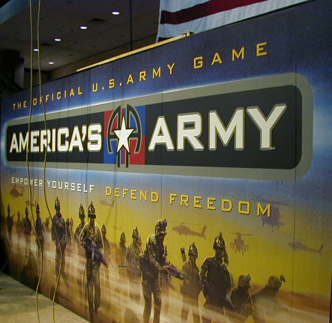
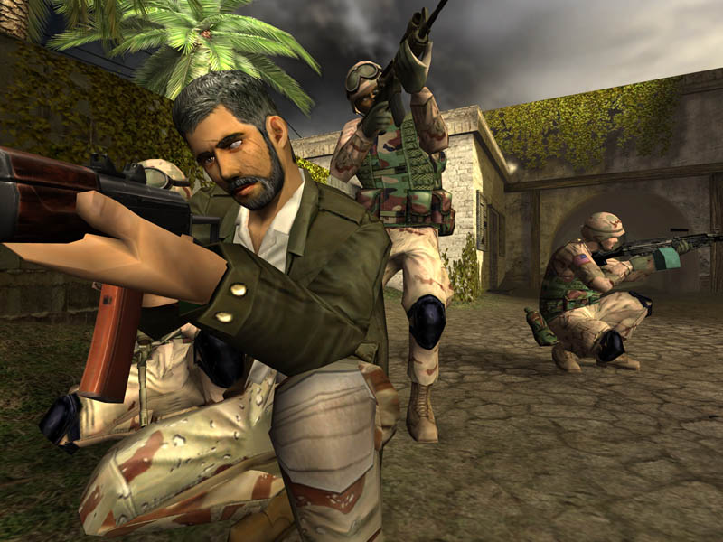
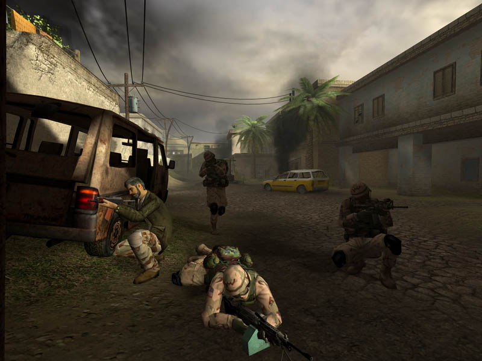
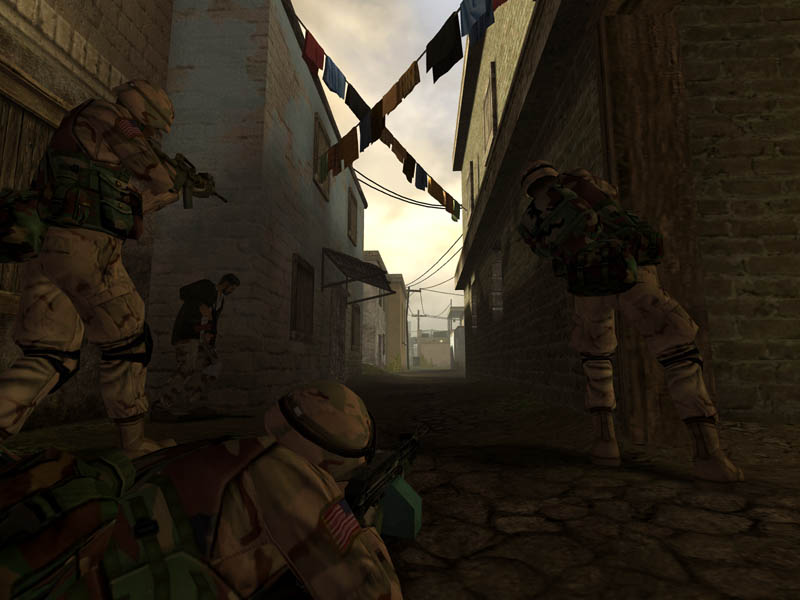
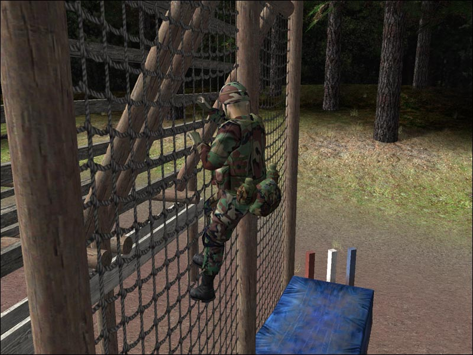
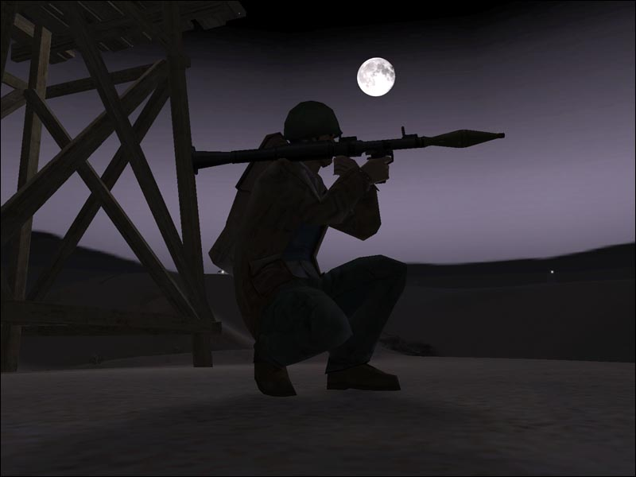

**Ficha Técnica:**  
Título: America's Army  
Precio: Gratuito  
Web: http://www.americasarmy.com/

Cuando comencé este análisis no tenía mucha fé puesta en la calidad de este juego. Gratuito, promocionado por el ejercito americano y, por encima de todo, con ya un respetable tiempo a sus espaldas. Pero que esto no te haga retroceder, soldado. El combate solo se libra de una forma. Los comienzos en el juego son tortuosos. Más de 800 Mb de descarga (y a una velocidad inexplicablemente baja) y una instalación de las más pesadas que se recuerdan. Nada de esto sería grave (de hecho es solo una cuestión de tiempo) si no fuese porque aun cuando se ejecuta la aplicación comienzas a sentirte como Tom Hanks en la película Náufrago.

Lo primero que llama la atención es que carece de traducción a otros idiomas. El ejercito norteamericano puede que solo reclute a estadounidenses, pero no pueden obviar a todos los ciudadanos del sur que dominan e incluso prefieren el español. Aún así, te agarras a la silla y (tras conseguir registrarte, para lo cual es necesario salir al navegador de windows) comienzas a buscar un punto de partida. Pero ¡oh! ¡sorpresa! No hay. En su lugar encuentras una serie de misiones de entrenamiento que has de completar obligatoriamente para poder salir al campo de batalla. Y no te esperes aquí el típico tutorial en el que disparas un par de veces, lanzas una granada y ya puedes hacer de rambo en la Segunda Guerra Mundial. Nada más alejado de la realidad. La primera fase del tutorial te enseña a posicionarte correctamente para disparar (cuerpo a tierra, agachado, de pie), la segunda se trata de superar un circuito de obstáculos utilizando el sprint, el cuerpo a tierra, subiendo, bajando, saltando, .... Y he aquí la primera gran baza del juego: sus entrenamientos recuerdan tan fuertemente a películas como "La chaqueta metálica", "Jarhead" o mismo "La delgada linea roja" que impactan. Escenas bien recreadas y en las que el sobresaliente sonido y las voces de tu superior te sumergen en una correctísima atmósfera militar. Claro, para algo tenían que valer los dólares que el pentágono se gasta en este producto.

En la tercera parada del entrenamiento básico recibes instruccion teorica y práctica sobre el uso y las características de las principales armas así como una práctica con granadas de humo y de fragmentación. Peaje discutible pero de nuevo obligatorio antes de terminar el entrenamiento básico. Porque el entrenamiento básico concluye con una soberbia cuarta fase, que por si misma hace meritoria la descarga, la instalación y el registro; y junto a la cual las demás se quedan en nada: la casa de tiro. Famosa escena de películas policíacas y de acción con SWATS de por medio. Pero en este caso la vives. Y de qué manera: La aparición de enemigos es hasta cierto punto aleatoria, por medio te puedes encontrar con rehenes, civiles, compañeros y policías, la munición escasea, hay que recargar el arma (que se puede atascar y deberás arreglar), y el tiempo y la precisión apremian. "¡UFF!" pensarás. Pues eso no es nada, chaval. A todo esto suma que se necesitan 10.000 puntos para aprobar, el fuego amigo cuesta 400 puntos por baja y cada habitación se debe limpiar en ¡6 segundos! ¡Increíble!, desde luego una fase para recordar porque no tiene desperdicio, hay tensión y superarla supone un reto tan bien calibrado que en si mismo podría constituir todo un videojuego.

Se desvanecen los fantasmas de ese comienzo tortuoso y desconcertante. ¿Y despues? Pues seguir con el entrenamiento o entrar en combate. Todos los entrenamientos son necesarios si no quieres que los otros te machaquen, e inluso algunos son geniales, como el entrenamiento de paracaídas o el de médico de campo. Se nota la influencia del ejercito real, palpable incluso en las reprimendas de tus superiores que seguramente escucharás a menudo; y si no prueba a darle al botón de saltar introducción 😉

Pero ¿y el combate? Núcleo de un videojuego de acción, en este la dificultad se antoja alta. Olvídate de Medal of Honor, [Call of Duty](../../../2008/12/call-duty-5-world-war/) o Counter Strike. En America's Army la mayoria de las veces una bala equivale a un muerto y un paso en falso también. Cuenta con buenos escenarios que no dejan lugar para abusos de los más veteranos ni para que los novatos sean un simple tiro al plato. La velocidad de la conexion es muy buena, cuenta con sistema anti-trampas Punk Buster (de más que probada calidad) y la comunidad es bastante activa y respetuosa (aunque siempre hay excepciones). En cuanto comiences a cogerle el truco, podrás completar los entrenamientos necesarios para ser instruido como soldado de las fuerzas especiales (lo que abre posibilidades tácticas en el juego bastante amplias), o especializarte en un rol en concreto (médico, rifle, francotirador, etc.) para beneficiar lo máximo posible a tu equipo. Los modos de juego sí que son ciertamente limitados. Un servidor puede centrarse en crear un torneo en el que se premie al mejor jugador o en recrear pequeñas escaramuzas para jugar ronda tras ronda.

Técnicamente dá el pego. Como dijimos antes, las voces propias de los oficiales están perfectamente interpretadas y se escuchan con la suficiente claridad como para comprender lo que te dicen, algo importante a falta de una traducción. Las armas se distinguen bien por su sonido, estruendoso y convincente. Tal vez les falte algo de fuerza a las granadas (tienen un sonido muy seco) pero siguen estando a un nivel aceptable. Con un equipo 5.1 disfrutarás aún más escuchandolo y el canal central te pondrá los pelos de punta cuando te disparen. Buena separación de canales, soporte para EAX y Dolby Surround. Los gráficos destacan por un buen modelado de las caras y un rendimiento bueno (incluso en configuraciones modestas) aunque filtros como el antialiasing tendrás que activarlos en windows porque no puedes hacerlo en el menú de opciones. Sin embargo, los efectos de partículas hacen ganar enteros al conjunto y la gama de colores es apropiada para cada situación. En un equipo potente, a alta resolución y con montones de filtros luce bastante bien; pero no nos engañemos: ni cuenta con la tecnología de "[F.E.A.R.](../../../2005/11/fear)" ni con la belleza plástica de "[Far Cry](../../../2004/05/far-cry/)".

**NOTA: 6.75**

**Lo mejor de America's Army:**  
Los entrenamientos  
Nivel técnico  
Es gratuito

**Lo peor de America's Army:**  
Desorganizado  
La instalación  
Elevada dificultad

**Requisitos mínimos:**  
Procesador a 1.5 GHz  
384 MB de RAM  
Tarjeta gráfica de 64 MB con el motor de trasformación e iluminación (GeForce 3 o Radeon 7500 en adelante)  
2 GB de espacio en disco duro  
Windows 2000/XP  
DirectX 9.0  
Tarjeta de sonido compatible  
Modem 56 Kbps

**Requisitos Recomendados:**  
Procesador a 2.4 GHz  
512 MB de RAM  
Tarjeta gráfica de 128 MB o 256 MB para alto detalle  
Conexión de banda ancha