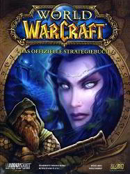
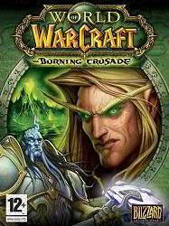
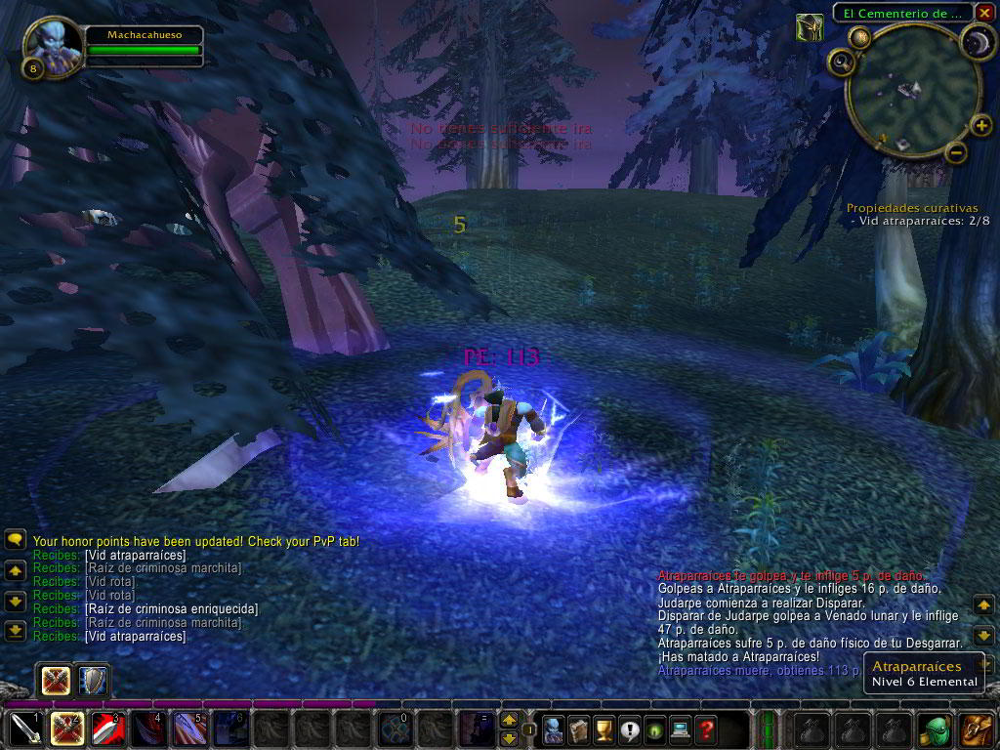
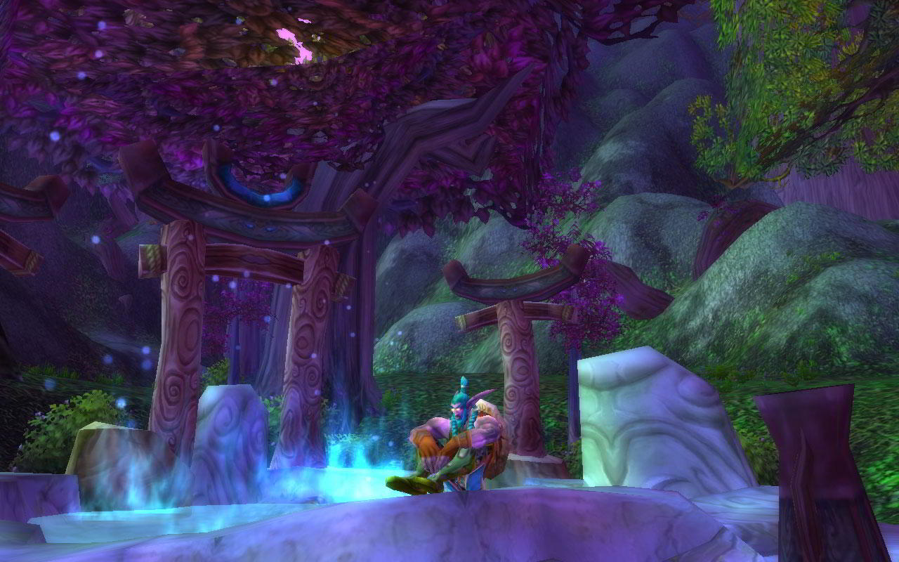
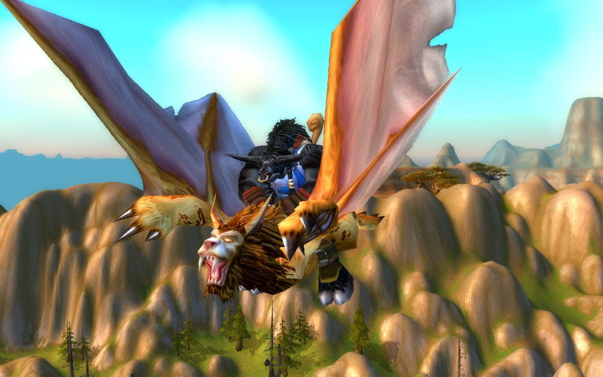
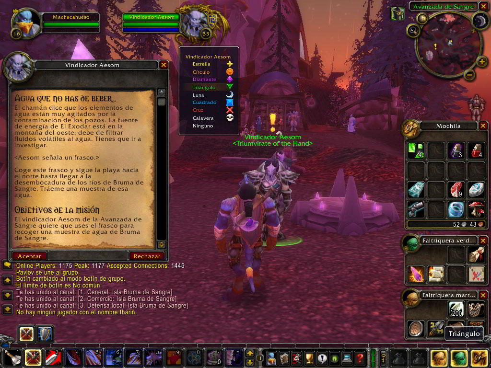

 

**Ficha técnica:**  
Título: World of Warcraft / World of Warcraft Burning Crusade  
Desarrollador: Blizzard Entertainment  
Editor: Vivendi Universal  
Pegi: +12  
Precio: 14.95 € + 34.95 € (juego y expansión por separado)  
Página web: http://www.wow-europe.com/es/

Existen en este mundo dos formas, dos vertientes, dos subgéneros si así lo prefieres en esto de crear juegos de rol para PC. Por un lado tenemos a Bioware, compañía con solera y currículum despampanantes, que es la creadora de aventuras épicas como la saga Baldur's Gate, los Icewind Dale o (sobretodo) Neverwinter Nights 1 y 2; cada uno de los títulos con sus respectivas expansiones y material adiccional. Frente a ellos, encontramos a Blizzard y su legión de imitadores granjeados gracias a un único título: Diablo. Blizzard mantenía (además de Diablo, Diablo 2 y la expansión de rigor) otra saga de juegos de estrategia con ambientación fantástica titulada Warcraft. Nada del otro mundo hasta que anunció que se traía entre manos un juego multijugador masivo.

Al igual que en la saga de estrategia, existen dos facciones enfrentadas (que no pueden comunicarse entre sí mediante el chat incorporado) que son la Alianza (el bien) y la Horda (adivina). Y existen también dos tipos de juego: el PvP (Player versus Player, o JcJ en la traducción) y el PvE (Player versus Environment, o JcE) según cual sea tu preferencia: el combate a saco o el combate y las misiones de los NPC. Yo me confieso un amante empedernido del gatillo fácil, más afin a Max Payne o Doom que a Age of Empires, por ejemplo. Aún así en cuanto a rol me gusta enormemente más el ritmo pausado y rico en matices de Baldur's Gate que del frenético mata-subenivel-mata de Diablo. Estas dos vertientes están claramente divididas: los juegos en los que subir nivel es consecuencia de tus acciones y los juegos en los que subir nivel es el objetivo de tus acciones. No obstante, WoW cuenta con interesantes puntos a su favor incluso para los menos atraídos por una operación de márketing antológica llevada a cabo durante los largos años de desarrollo: "El MMORPG definitivo!", rezaban.

Ocho son las razas disponibles en el juego, luego aumentadas en la expansión, para comenzar nuestro viaje. Y después de casi 60 horas de juego, creo que a mi héroe aun le queda mucho por descubrir, muchos territorios por conocer y muchos objetos que coleccionar. Primer paso en falso: la creación del personaje se resuelve con apenas siete variables (raza, profesión y unas pocas opciones de aspecto bastante precarias) por lo que vagas en un mundo donde siempre ves a los mismos personajes y a los mismos oponentes una y otra vez. Hay un montón de cosas distintas, pero la chicha de personalización es realmente escasa. Esto deja muy claro cual es la aspiración de WoW: la inmediatez y la accesibilidad. Puede marcar un antes y un después (si no lo ha hecho ya) en cuanto a juegos online y en cuanto a juegos de rol: no se tarda nada en empezar a jugar, y su facilidad y rapidez para iniciar al jugador en la aventura hacen que cualquiera pueda adentrarse en Azeroth antes de perder el énfasis que se apodera de tí nada más tocar la caja y los dvds.

Llegué al "Lugar del accidente" siendo un draeneir normal y corriente y me ví rodeado de vegetación, animales y unos cristales multicolor (como un viaje de LSD, vamos). Vagué por la isla Bruma Azur buscando plantas medicinales o curando a mis compañeros supervivientes y luego me dirigí al Exodar. Viajé en hipogrifo, atravesé portales para caminar en otros mundos, me enfrenté a orcos, osos, animales de todo tipo, espíritus de la sombra... y lo que me queda. La cantidad de cosas por hacer y sitios a los que ir es inagotable, y lo enorme del mapa es todavía un reto mayor. Esto permite también que, seas quien seas, la zona en la que apareces sea siempre un sitio más o menos seguro, con lo que a priori ningún nivel 50 o 60 podrá acosarte cuando aún no tienes ni un mísero cuchillo con el que hacerle frente. Afortunadamente para desplazarte de forma ágil por el mundo de Azeroth o por Terrallende puedes utilizar los hipogrifos, los portales, mascotas como "dientes de sable" o las piedras de hogar, que te devuelven a tu punto de partida o a otro que hayas designado como tal. El problema suele venir cuando mueres, porque suele ser lejos de donde revives y solo tienes dos opciones: ser reanimado al instante por tu ángel de turno (con una grave penalización en tus objetos equipados) o ir a buscar tu cadáver por lejos que esté y solo acarrear una penalización ligera. No obstante no pierdes objetos ni experiencia: solo tiempo y un poco de desesperación.

Las misiones son, en efecto, muy variadas y accesibles: desde encontrar plantas o curar animales hasta misiones de escolta por tenebrosos parajes o adentrarse en las cavernas de enemigos para darles matarile en compañía de tu grupo de amigos. En efecto, grupo de amigos: como es lógico, un mago no es precisamente el más indicado para enfrentarse cuerpo a cuerpo con una bestia, pero puede ser más util si tiene un guerrero que le de la cobertura y tiempo suficientes para invocar hechizos. De modo que se favorecen las alianzas de hasta 5 jugadores que se reparten el botín al cumplir su misión. De todas formas los grupos compuestos por roles más ofensivos (cazadores o guerreros) suelen resultar bastante universales a la hora de afrontar cualquier tarea. En ese botín (común o particular) Blizzard ha dado a su juego ese aura de gran obra basándose en la diseminación de miles y miles de objetos, de cientos de categorías distintas pero que escasean, de modo que el coleccionismo se apodera de tus actos y cualquier joya es susceptible de ser tu objeto más preciado... hasta encontrar uno mejor.

Tal vez al hablar del nivel técnico sigan las alabanzas: unos gráficos bastante inspirados (a pesar de su aspecto de dibujos animados) a los que te acostumbras bastante rápido, efectos especiales convincentes y sobretodo una banda sonora de gama alta, de esas que da gusto oír cuando te acercas al enclave de los orcos o mientras reposas en tu hogareña taberna. Y por cierto, si te desconectas o pasas un tiempo en una ciudad de tu raza, tu personaje estará más descansado y podrá obtener más experiencia durante un período de tiempo siguiente que si no se hubiese tomado un respiro. Esto anima a cargar el juego de nuevo o a simplemente pasear con tus congéneres facilitando la inmersión y aumentando la profundidad del mundo en el que vives. Brillante, aunque no original pues también la dura competencia (Guild Wars a la cabeza) ha seguido esta tendencia. Los servidores oficiales suelen soportar grandes cantidades de jugadores, pero aún así he podido comprobar en persona que apenas sufren ralentizaciones y mucho menos caídas o lags importantes. Y aún quedan pequeños bugs por resolver, pero los parches están llegando con buen ritmo y la activa comunidad (con el servicio técnico de Blizzard al frente) presta mucha ayuda. Incluso no leerás quejas en los chats oficiales porque, sencillamente, no las hay.

En definitiva, World of Warcraft (y sobretodo su expansión Burning Crusade) son dignos portadores de un nombre labrado en la estrategia y laureado por los expertos, pero incluso así resulta un juego tremendamente bueno. Todo lo que nos han venido vendiendo hasta su lanzamiento se ha materializado y constituye una experiencia que sin ser el no va más ni aportar novedades sustanciales a un género reciente sí que agrada y divierte. World of Warcraft es más que un juego de rol, más que un juego online. Su presencia traspasa géneros y su lanzamiento ha animado a muchos a aventurarse en la hazaña de jugar por internet con gente de carne y hueso, incluso en un país en el que el juego online no era precisamente una de nuestras mayores virtudes. No dejes que se te escape.

**NOTA: 8.5**

**Lo mejor de World of Warcraft y World of Warcraft Burning Crusade:**  
Cantidad de objetos, misiones, personajes, localizaciones y jugadores  
Esta traducido (traducción mediante parche oficial)  
Es accesible, inmediato y se desenvuelve de forma muy progresiva para el jugador

**Lo peor de World of Warcraft y World of Warcraft Burning Crusade:**  
La creación del personaje  
Instalación muuuuuy larga  
Aún quedan bugs y quests que no funcionan muy bien

**Requisitos mínimos:**  
Windows 2000/XP  
Pentium III 800 MHz  
512 MB RAM  
DirectX 9.0c  
10 GB Disco Duro  
Tarjeta compatible con Direct3D con 32 MB de vídeo

**Requisitos recomendados:**  
Windows 2000/XP  
Pentium IV 1.5 GHz  
1 GB RAM  
DirectX 9.0c  
10 GB Disco Duro  
Tarjeta compatible con Direct3D con 64 MB de vídeo

Disponible también una versión para MacOS.