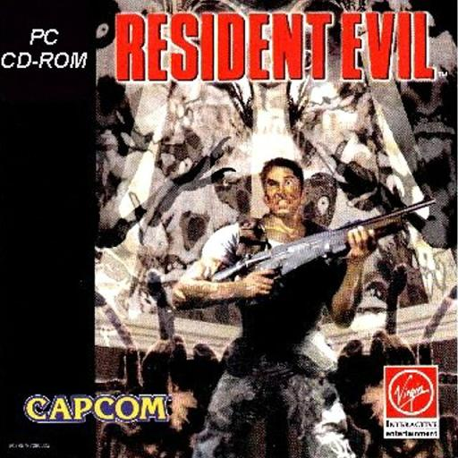
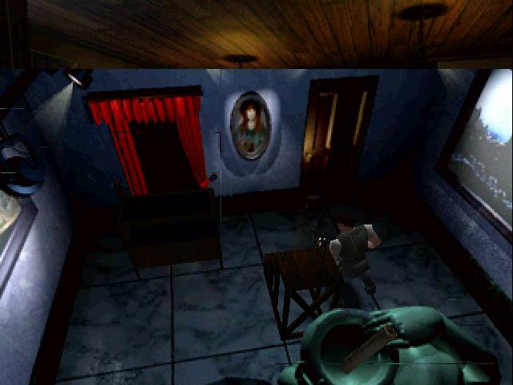
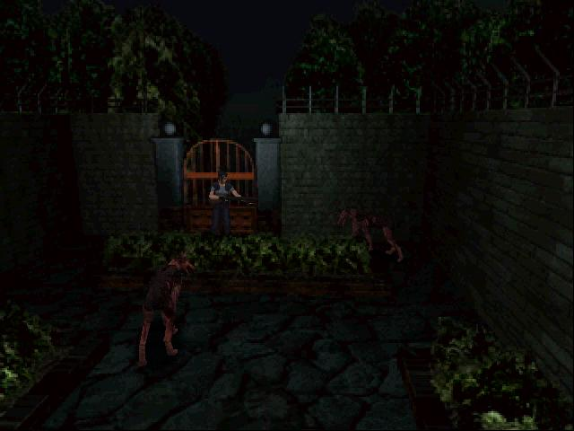
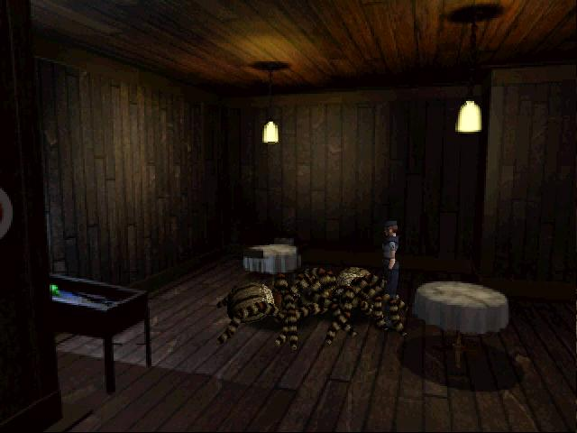
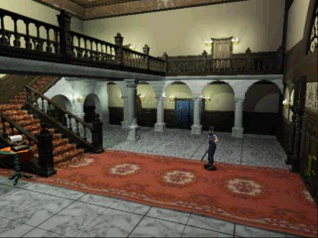
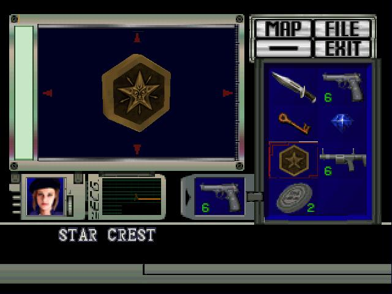
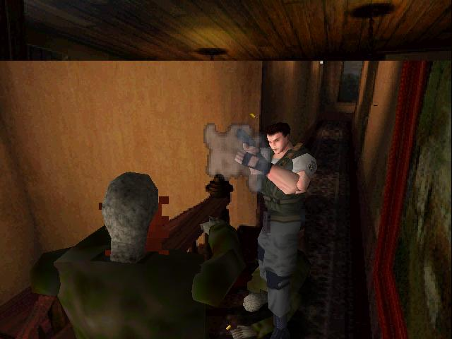
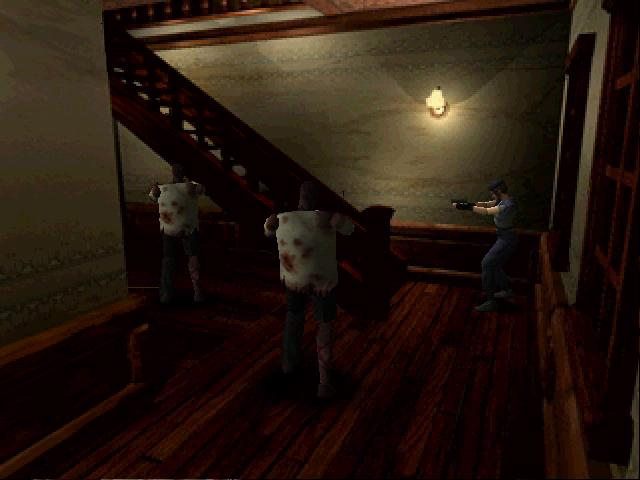

**Ficha técnica:**  
Título: Resident Evil  
Desarrollador: Capcom  
Editor: Virgin Play  
Pegi: N/D  
Precio: 48.01 €  
Página web: http://www.residentevil.com/

Jugar hoy en dia a Resident Evil no es sólo revisitar un clásico. Es apostar por un estilo de juego, por una filosofía de entretenimiento y por unas cualidades reconocidas y admiradas. Ahí es nada. Este juego de 1997 fué desarrollado por Capcom, compañía nipona que a raiz del presente título ha parido una saga fértil con vástagos que incluso traspasan las fronteras del género, como los spin-off de Resident Evil Outbreak. Libros, películas, revistas y todo tipo de material online, amén del merchandising habitual de figuritas, tazas, etc. Resident Evil es un título que trasciende.

Primera cualidad destacable: Resident Evil permite escojer con qué personaje jugar: Jill Valentine o Chris Redfield. No es algo nuevo, pero sí poco habitual. Eso sí, las diferencias entre jugar con uno o con otro son mínimas. Este detalle que podría parecer una chorrada o algo irrelevante es sin embargo un calculado factor de inmersión que ayuda a rodear al jugador de la atmósfera opresiva de la trama. Éste es el quid de la cuestión: la atmósfera. Resident Evil es un juego de Survival Horror (desafortunadamente traducido a Terror y Supervivencia), donde lo que cuenta es asustar al jugador a toda costa y hacerle saltar de la silla. Con este panorama, la calidad del juego se mide en pulsaciones por minuto y en el número de veces que encenderás la luz mientras juegas. La trama te suena con toda seguridad: unos cientificos a los que se les olvida que dejaron el caldo al fuego, un virus que pasaba por allí, varios tipos persiguiendo dinero y una mansión que en realidad es un laboratorio encubierto. Lo metemos todo junto, elevamos la temperatura y... _voilá!_ Ya tenemos problemón al canto para enviar a los héroes a hacer su trabajo!

Pero volvamos a lo importante: la ambientación. La atmósfera de la que hablo no es otra que una visión muy sombría de una historia de zombies y perros mutantes (entre otros seres de igual o peor mala familia) y de un miembro de los S.T.A.R.S. (tú) que debe salir con vida de semejante enjundia. Los S.T.A.R.S. vienen a ser los primos de los S.W.A.T. y se centran en investigación y trabajo de campo. Claro, de investigación irá entonces la cosa. Pues sí, amigo. Te tocará recorrer pasillos, habitaciones, pisos, halls, cobertizos, patios, jardines, sótanos, laboratorios... y más. La columna vertebral de Resident Evil es la exploración en busca de pistas y retazos de historia que encontrarás en pedazos de papel, libros o diarios de los científicos. Rellenando huecos y completando los espacios en blanco visualizarás un guión suficiente y que no se complica la vida. Porque ésta es otra de las señas de identidad del juego. No importa cuán absurdo pueda ser el guión, ya que el jugador no se va a entretener leyendo, sino disparando. Los zombies no mueren solos, de hecho no mueren porque ya están muertos, pero reventarles la cabeza de un balazo es la forma más rápida de evitar su acoso y de no convertirnos en bocata de Jill o sandwich de Chris. El combate es un pilar del juego, y se agradece porque en su competencia más directa (Silent Hill) se apuesta por un estilo pausado mucho más cercano a la aventura gráfica que puede no gustar o perder el ritmo fácilmente. En Racoon City es distinto porque tienes una pistola Beretta en lugar de un palo y porque se pretende que el jugador "corra" en lugar de que "camine". Es otra filosofía.

La exploración tira más por la senda de llave roja-puerta roja. Encontrar la llave de tal puerta, activar un mecanismo o llegar a tal habitación para recoger cierto objeto. Puede flaquear en ocasiones si no te enteras de mucho, pero el análisis de habitaciones y objetos es muy dinámico porque aquello con lo que puedes actuar se renderiza de forma distinta al resto del decorado. Fastidia que esté completamente en inglés.

Técnicamente tienes que olvidarte del año en que vives y trasladarte a 1997, donde te sorprenderías con unos juegos de luz y sombra bastante interesantes, unos escenarios ricos en matices y detalles, una música acorde con el lugar y el ritmo de la acción, unas voces suficientes (en la lengua de Shakespeare) y unos puzzles variados y bien resueltos. Ahora vuelve al presente. El juego tiene sus años: sus gráficos lo delatan, pero siguen siendo un alarde de buen gusto y de indiscutible identidad. La música: escueta pero tremenda. El control: mejorable pero sencillo. Los diálogos: lentos e insulsos. Resident Evil no es el juego definitivo de Survival Horror, pero qué gusto dá cargarse a un zombie cuando se acerca desde el fondo del pasillo...

**NOTA: 8.75**

**Lo mejor de Resident Evil:**  
La ambientación  
El combate  
Puzzles variados

**Lo peor de Resident Evil:**  
Absolutamente en inglés  
Control tirando a malo  
No es el juego de terror definitivo

**Requisitos mínimos:**  
Windows 95  
DirectX 3a  
Pentium 90  
16 MB de RAM  
Tarjeta Gráfica de 4 MB compatible DirectX  
5 MB de espacio libre en disco  
Tarjeta de sonido compatible con DirectX 3a

**Requisitos recomendados:**  
Windows 95  
DirectX 3a  
Pentium 133  
32 MB de RAM  
Tarjeta Gráfica de 4 MB compatible DirectX  
290 MB de espacio libre en disco  
Tarjeta de sonido compatible con DirectX 3a

**NOTA:** Activa la compatibilidad con Windows 95 para ejecutar el juego bajo Windows XP

