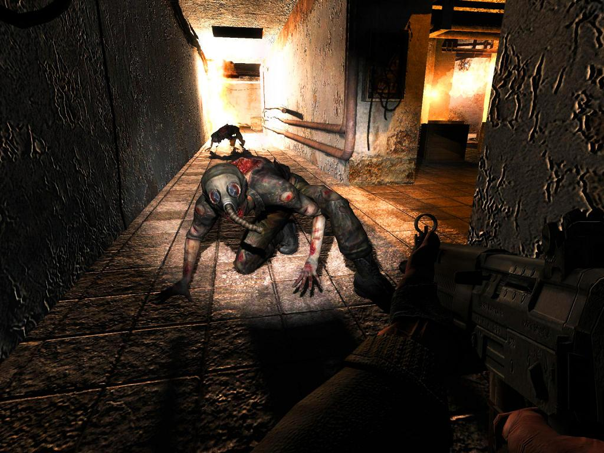

**Ficha Técnica:**  
Título: S.T.A.L.K.E.R. Shadow of Chernobyl  
Desarrollador: GSC Game World  
Editor: THQ  
Pegi: +16  
Precio: 49.95 €  
Página web: http://www.stalker-game.com

El cielo plomizo se extendía sobre mi cabeza y las nubes ocultaron los últimos rayos de sol. El peligroso día estaba dejando paso a la tenebrosa noche, pero en cualquier caso yo no podría quedarme allí por mucho tiempo. Recargué mi rifle, comprobé mis suministros médicos y comí un poco de carne antes de ponerme en marcha. El subterráneo me llevaría hasta mi siguiente objetivo, pero el camino no sería facil, pues en las sombras de aquellos túneles se escondían las peores pesadillas y acechaban los más increíbles sobresaltos. Conforme descendía por la escalerilla, el negro me envolvía. Extrañas formas danzaban a mi alrededor y halos de imaginarias criaturas me esperaban al final de los peldaños. Ahuyenté a todos ellos con la luz de mi linterna y tomé confianza activando la visión nocturna de mi traje protector. Al llegar abajo todo parecía tranquilo. Comprobé los niveles de radiación y eché un vistazo al mapa. Cuatro largos kilómetros me separaban de mi destino...

S.T.A.L.K.E.R. es un juego mayúsculo. No tanto por su nombre como por su capacidad para una y otra vez empujarte unos pasos más, y quizá su mayor virtud sea esa. Resulta totalmente atípico y tiene una personalidad tan fuerte que será sin duda inolvidable para todo aquel que lo pruebe. El juego está ambientado en las inmediaciones de la central nuclear más tristemente famosa del mundo, Chernobyl; y mezcla tintes de acción narrativa, aventura y rol. Veamos los primeros compases de lo que aspira a ser una obra maestra. Video introductorio: una camioneta cargada de cadáveres a toda velocidad por una carretera solitaria. La tormenta se endurece y el vehículo es alcanzado por un rayo. Explosión. Desvanecimiento... un hombre te recoje del suelo y te lleva a un lugar desconocido, te deja sobre una camilla... amnesia. Así comienzas, sin tener ni idea de quien eres. Todo el mundo te llama Marcado pero no sabes ni donde te encuentras. Todo lo que te queda de tu pasado es la última misión asignada en tu PDA: Matar a Strelok. Un comerciante te pone en rumbo con unas primeras misiones cerca de su cuchitril, pero poco a poco irás ganando confianza, y los sucesivos flashbacks te darán las pistas para recuperar tu identidad.

Lo primero que descubres en S.T.A.L.K.E.R. es su vertiente aventurera. Al más puro estilo del género que vio nacer a "Monkey Island", S.T.A.L.K.E.R. te permite hablar con cualquier personaje de tu entorno que esté vivo, naturalmente, seleccionando las frases que creas más convenientes en cada ocasión. Según tu elección, la conversación tomará unos u otros derroteros así como la actitud de ese personaje hacia tí. Es más: en una perfecta fusión con el rol, si colaboras activamente con un grupo de personajes, éstos te tratarán mejor e incluso puedes conseguir ascensos en tu afiliación, sobre todo si se trata de un grupo paramilitar. Esto también empeorará tu relación con el resto de facciones que pugnan por el control sobre La Zona. La Zona: ése es el verdadero quid de la cuestión.

La Zona es un perímetro surgido a raiz de los dos accidentes nucleares de Chernobyl (el segundo, un ficticio suceso de 2006) en donde la naturaleza se ha degradado y han aparecido horribles mutantes. Desde perros ciegos pero feroces hasta abominables bestias capaces de provocar pavor con solo intuir su presencia. S.T.A.L.K.E.R. da rienda suelta a la acción con un gran despliegue de efectos puestos ahí para hacer saltar al jugador de su asiento mientras lo acribillan a balazos unos mercenarios o mientras se lo meriendan estos mostruos. El control de La Zona significará algo distinto según en qué facción te enroles: para unos, el control para la protección; para otros, el control para el exterminio; para el resto: su propia avaricia. Y así, enfrentándote a bandidos, mercenarios, soldados del ejército o mutantes, avanzas en un mapa enorme e irrepetible. Un escenario de una belleza abrumadora y con el que podrás quedarte embelesado horas y horas. Pongo la ciudad de Prypiat por ejemplo, pero cualquier otra localización resulta interesante: Prypiat ha sido recreada con mimo y reconocerás en ella estructuras y lugares únicos, ahora deshabitados tanto en el mundo real como en el virtual. Esa ficción tan creíble, una ciudad fantasma en la que los columpios chirrían cuando los mece el viento y en donde casi cualquier rincón (incluyendo interiores de edificios) puede ser explorado, constituye de por si una experiencia sobrecogedora.

Pero no hemos venido aquí a hacer turismo, sino a "Matar a Strelok". Ojo porque según tus acciones el juego determinará uno de los 6 finales (5 malos, uno bueno pero escondido a más no poder) y aún así, La Zona aún podrá seguir siendo explorada. El propio juego genera una infinidad de misiones secundarias de forma dinámica y además siempre puedes resolverlas como mejor te plazca. Bebiendo de GTA, pero con la referencia siempre puesta en el mundo de rol, S.T.A.L.K.E.R. es siempre un juego condicionado por su escenario. El mapa dicta todo, y de él todo parte. No hay posibilidad de hacer el vago: incluso quedándote quieto y contemplando los perfectos ciclos de día y noche, eres susceptible de tener hambre, cansarte, cruzarte con algún compañero Stalker o ser presa de una criatura salvaje. Y vaya mundo el que tienes enfrente. Los gráficos hacen un uso realmente intensivo de los sombreados de DirectX 9.0c y así lo demuestran sus astronómicos requisitos. El sonido es simplemente perfecto, y la omisión casi total de banda sonora permite introducir más aún al jugador en el realismo extremo que destila el juego: graznidos de cuervos, el viento, hojas de árbol secas rozando el suelo en su suave vaivén... o tuberías que crujen, hornos en ebullición, material radiactivo, tu contador géiger alertándote, tu respiración entrecortada al esprintar...

En definitiva: S.T.A.L.K.E.R. Shadow of Chernobyl es un juego muy notable. Sobresaliente. Absolutamente por todo. Anda escaso de modos de juego, es quisquilloso con sus requisitos y a veces llegas a odiar tener que andar unas distancias tan largas. Pero la soberbia (mesiánica, perfecta, impresionante, original...) ambientación y su exquisito gusto y personalidad son mucho más que suficientes para que este humilde analista caiga rendido ante sus virtudes. Imprescindible.

**NOTA: 9**

**Lo mejor de S.T.A.L.K.E.R. Shadow of Chernobyl:**  
Su ambientación sublime  
Mezcla perfecta de acción, aventura y rol  
El carácter abierto de la campaña y la posibilidad de seguir jugando al terminar

**Lo peor de S.T.A.L.K.E.R. Shadow of Chernobyl:**  
Requisitos altos  
Largas caminatas y combates a veces difíciles en extremo  
El multijugador está limitado

**Requisitos mínimos:**  
Pentium 4 a 2 GHz  
512 MB de RAM  
Tarjeta de video 128 MB compatible con DirectX 8  
Windows 2000/XP/Vista  
10 GB de disco duro

**Requisitos recomendados:**  
Core 2 Duo E6400  
1.5 GB de RAM  
Tarjeta de video 256 MB compatible con DirectX 9.0c  
Windows 2000/XP/Vista  
10 GB de disco duro