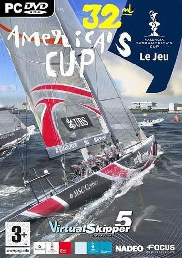
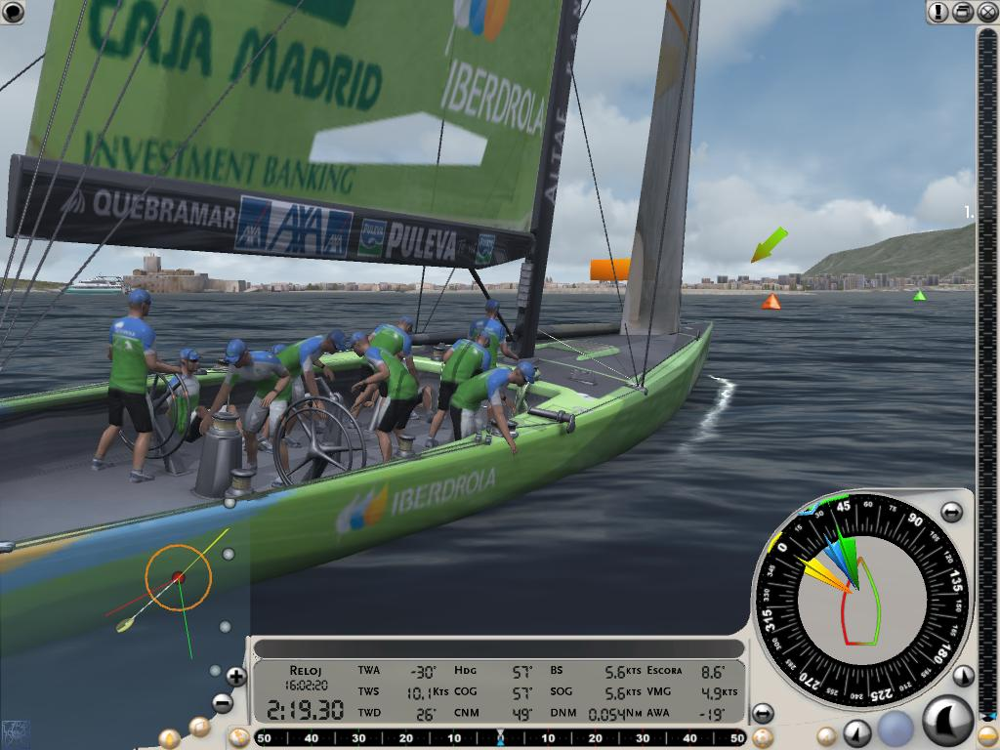
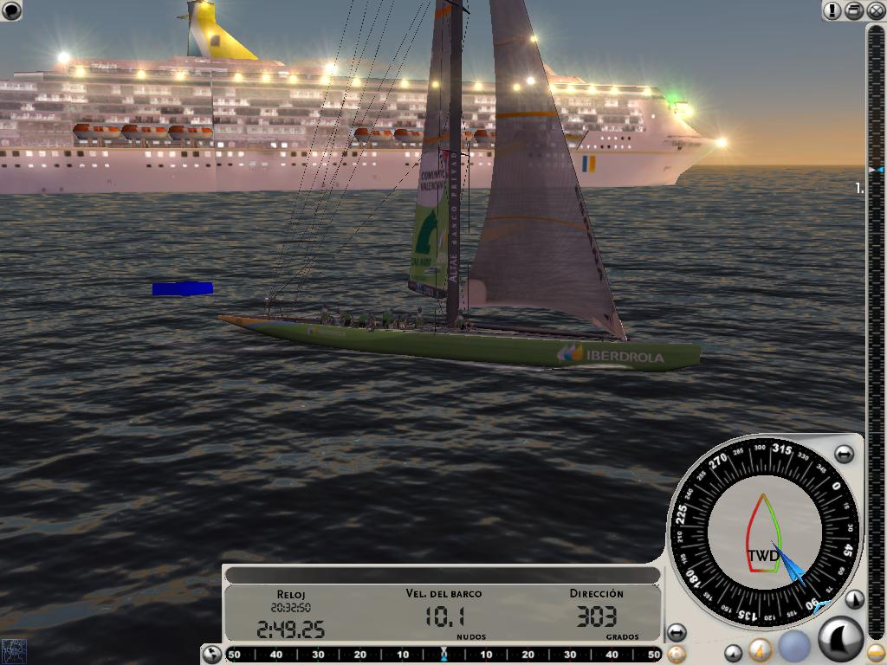
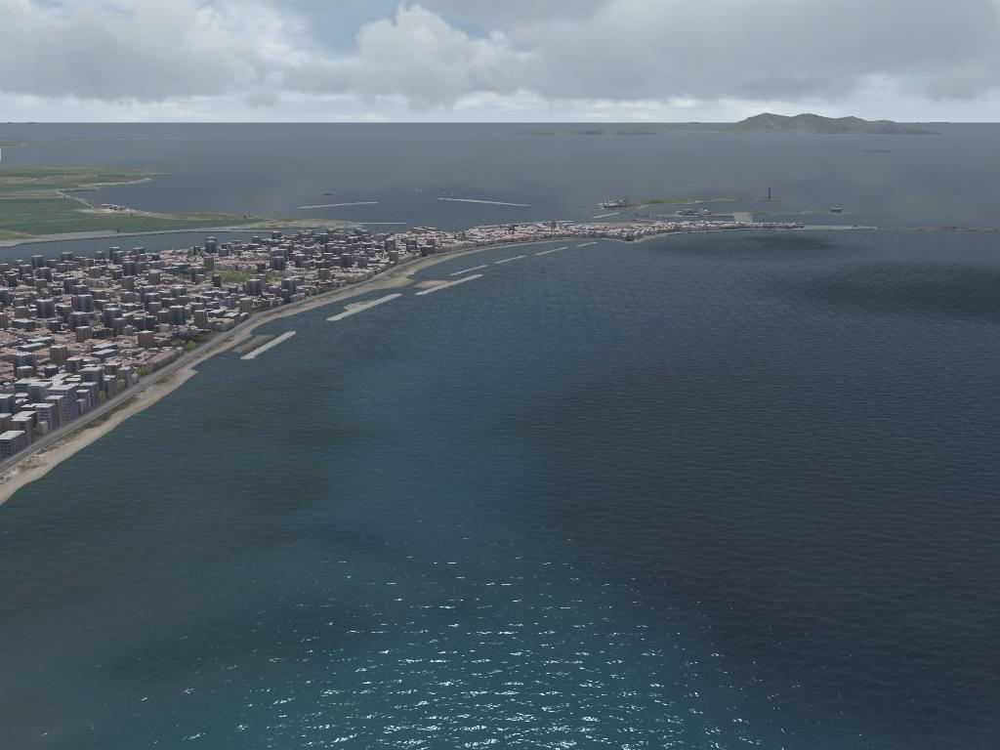
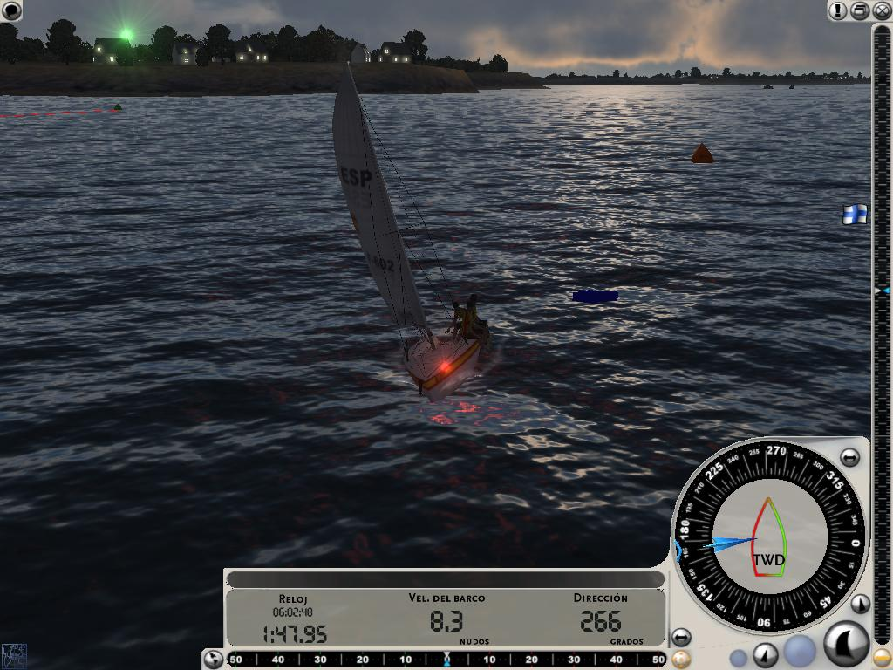
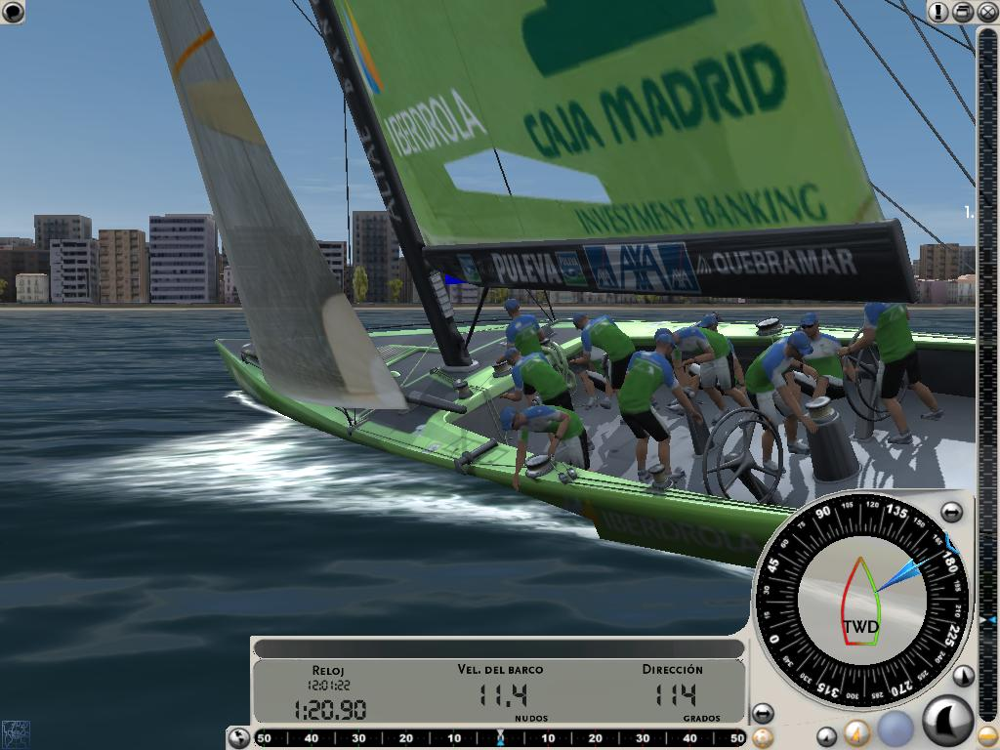
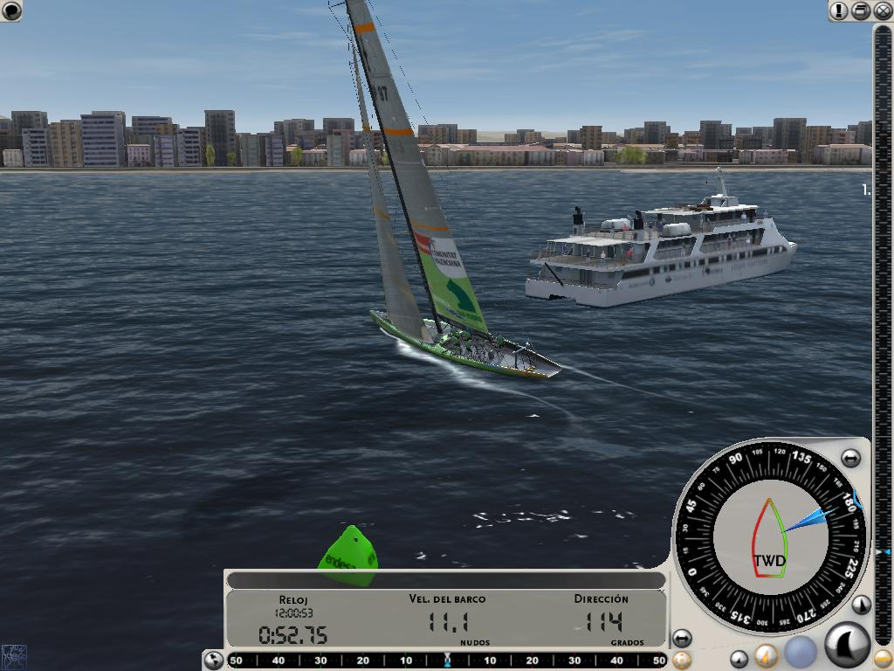
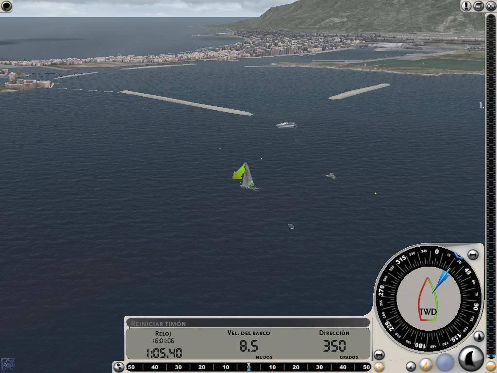
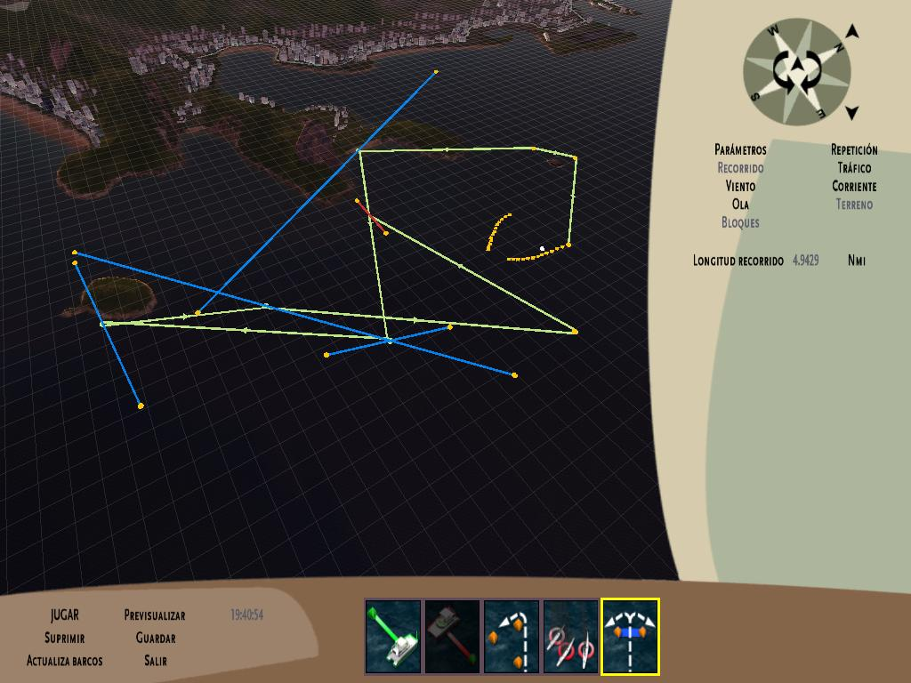
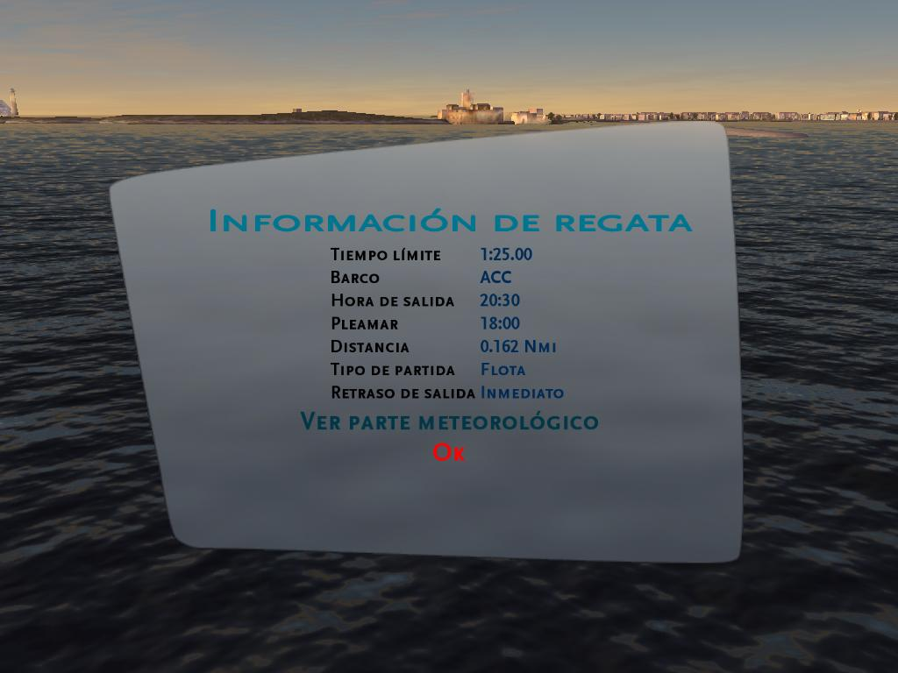

**Ficha Técnica:**  
Título: Virtual Skipper 5 32nd America's Cup  
Desarrollador: Nadeo  
Editor: Nobilis Ibérica  
Precio: 29.99 €  
Pegi: +3  
Página web: http://www.virtualskipper-game.com/

Virtual Skipper es una saga atípica, solo para paladares exóticos y sibaritas. De hecho, el juego es tan peculiar que se puede permitir algunos lujos, a saber: recrear un deporte al alcance de unos pocos privilegiados (que probablemente jamás hayan tocado un videojuego) y hacerlo con el concepto de simulación en mente (restando facilidades a cualquier jugador casual). Considero que para juzgar un videojuego hace falta saber de pé a pá todos los intríngulis de su género, sus pretensiones y haber jugado hasta la saciedad a cientos de cosas parecidas. Pero con Virtual Skipper tengo que romper esta norma, porque la vela es una disciplina ciertamente ajena a muchos de nosotros; así que este análisis es, en cierto modo, una visión crítica sobre el rumbo de las producciones de juegos.

El juego gira en torno a la Copa América (que ya lleva 32 ediciones a sus espaldas) que tan de moda parece estar en la actualidad. Es el título oficial del evento, lo que conlleva las licencias y la perfecta recreación de todo lo que envuelve a esta competición, desde la apariencia de los barcos, pasando por su diseño y características hasta el trazado de las regatas o la vestimenta de los participantes. La instalación requiere autentificación por internet, pero resulta la mar de sencillo y se ha integrado todo en la interfaz de juego, por lo que no tendrás problemas al respecto. Básicamente se compara tu rendimiento como capitán con el de otros jugadores y se actualizan datos acerca de la competición.

Comenzamos con un tutorial, trámite indispensable si no quieres quedarte parado en medio del océano. Repetimos, parado. Tu embarcación depende del viento, y aprender a posicionarte respecto a el es la primera lección. Luego llegan maniobras como virar en un punto concreto, navegar en zig-zag cuando tienes el viento en contra o enlazar varios giros. Con esto también empezarás a relacionarte con la interfaz en pantalla y los instrumentos de navegación. Tienes datos hasta la saciedad que están claramente representados y organizados, de forma que con un simple vistazo obtendrás casi toda la información que necesitas para mantener o corregir el rumbo. Solo tiene un pero, y es el excesivo tamaño que ocupa en pantalla (aunque algunos paneles se puedan ocultar). Si tu ordenador te lo permite, sube la resolución cuanto puedas para paliar este mal menor. Lo más importante será la brújula, la flecha con la dirección del viento y el radar en que irás viendo la posición de las diferentes balizas por las que tengas que pasar. Aunque presenta un parte meteorológico al iniciar el recorrido, su relevancia es nula. Está ahí, sin más, pero suponemos que en futuras ediciones cobrará importancia táctica.

La curva de aprendizaje es muy suave, sobretodo porque comienzas con un estilo arcade en el que apenas te tienes que preocupar de virar o ponerte con viento favorable. Poco a poco el juego te exigirá cada vez un poquito más... hasta llegar a una simulación en la que nada debe pasarse por alto. Esto lo entenderás en el momento en el que pienses "Nooo!!! Son 2 grados menos de viraje!!!" o tardes algún que otro segundo en recolocar el Spinakker. Has oído bien. En ese punto te darás cuenta de que serías capaz de salir a navegar en la vida real y no estar completamente "en blanco". Vas a aprender, y mucho.

En plena simulación tendrás bastantes preocupaciones, sobretodo en el modo de Competición. Participarás en la America's Cup como un marinero de agua dulce. La dificultad aumenta bastante en este modo de juego, pues es la espina dorsal de Virtual Skipper, pero tienes otras opciones como regatas únicas o volver al tutorial para perfeccionar tu técnica al timón. El modo multijugador permite medirse contra rivales de carne y hueso, bien sea por Internet o por LAN, y engancharse a una regata resulta muy fácil. Si no te llega con esto, aun te queda una vía de escape: un tremendo editor sencillo de utilizar y con el que diseñar tus propias regatas para poder exprimir un poco más los barcos. Es bastante facil de usar, aunque evidentemente tienes que olvidarte de los cientos de posibilidades que podría ofrecer un editor externo. De cualquier manera, te deja suficiente margen para proponer retos con un toque diferente.

Por cierto, que tienes tropecientas localizaciones para echarte al agua y un montón de barcos atendiendo a cuatro categorías básicas: los rapidísimos "ACC" (verdaderos Fórmula 1 del mar), los manejables "Off-Shore" (ideales para un paseo al atardecer), los versátiles "Melges" (manejables y fiables) o los inmensos trimaranes "Multi" (complicados hasta más no poder, pero autenticas bestias bajo las manos de un experto). Seguramente los conoces: el Areva Challenge, Victory, el Mascalzone Latino, el Oracle... y evidentemente entre ellos está el Desafío Español.

En cuanto al apartado técnico, Virtual Skipper 5 utiliza el motor gráfico de la anterior entrega de la serie (que ya era sobresaliente), con alguna que otra mejora palpable. Para empezar, tienes a tu disposición una enorme cantidad de parámetros que puedes modificar para ajustar el juego a la potencia de tu PC, pero si tu CPU te lo permite verás el agua más realista jamás llevada a un videojuego. En verdad que las capturas no hacen justicia al placer de ver pasar un trasatlántico a tu lado, o que el sol te ciegue durante la puesta. O de noche, con la ciudad iluminada. Los juegos de luces y sombras son tan complejos y permiten tantas virguerías que dá gusto jugar aunque solo sea por presumir de máquina. Luego además tienes las animaciones de tus hombres moviendose en la cubierta del barco (casi perfectas) o las olas rompiendo en tu casco. Shader Model, antialiasing, filtro anisotrópico, geometría, desenfoque de campo, colores dinámicos, ... Todos los efectos que puedas imaginar están ahí, y muchos de ellos se pueden activar sin perjudicar demasiado el rendimiento.

Por parte del sonido, otro tanto: multicanal, efecto doppler, EAX, HRTF (que simula sonido envolvente con altavoces estéreo y especialmente bien con auriculares)... El mar suena totalmente real y los gemidos de tus palos con los bandazos de tu embarcación ponen los pelos de punta. Es una pena, y solo desentona, que el multijugador achaque pequeños defectos como retrasos importantes, pero es de esperar que esta situación mejore paulatinamente: mejores servidores y los omnipresentes parches.

Para terminar, os dejo una reflexión. Y es que no entiendo como habiendo títulos tan divertidos (pese a sus pequeños errores) seguimos empeñados en jugar siempre a lo mismo, repetir las mismas fórmulas y patrones; y quejarnos cuando un juego intenta desmarcarse de esos esquemas. Muchos probablemente ya habréis jugado con otros simuladores, no solo de navegación; y estaréis de acuerdo conmigo en esto. Por eso animo a todos a que miréis más allá del Doom de turno, o de los interminables clones de Diablo. Si no lo hacemos, la industria terminará cerrando el grifo y nos perderemos títulos del mismo calibre que el que nos ocupa. En definitiva, Virtual Skipper 5 es un título que por su planteamiento atraerá solo a quienes sean fans de este tipo de simuladores, o a jugadores que estén dispuestos a darle una oportunidad y probar algo distinto. No es tu juego si estas deseando agarrar el pad y acelerar como un loco, pero sí que puede ser un soplo de aire fresco en el mascarón de proa de tu PC. Tómatelo como tal y te irá viento en popa. Quien sabe, tal vez algún dia tengas tu propia cáscara de nuez.

**NOTA: 8.5**

**Lo mejor de Virtual Skipper 5:**  
Los gráficos  
Simulación rigurosa pero asequible  
Es diferente, relajante y divertido desde el principio

**Lo peor de Virtual Skipper 5:**  
Ralentizaciones en multijugador  
Interfaz de juego  
Pese a las novedades, se parece mucho a Virtual Skipper 4

**Requisitos mínimos:**  
Windows XP/Vista  
Pentium 4 2.0 Ghz o AMD equivalente  
256 MB RAM  
1 GB de disco duro  
4x DVD-ROM  
Tarjeta gráfica 128 MB  
Microsoft DirectX 9.0

**Requisitos recomendados:**  
Windows XP/Vista  
Pentium 4 2.5 GHz o AMD equivalente  
512MB RAM  
1 GB de disco duro  
16x DVD-ROM  
Tarjeta gráfica 256 MB  
Microsoft DirectX 9.0