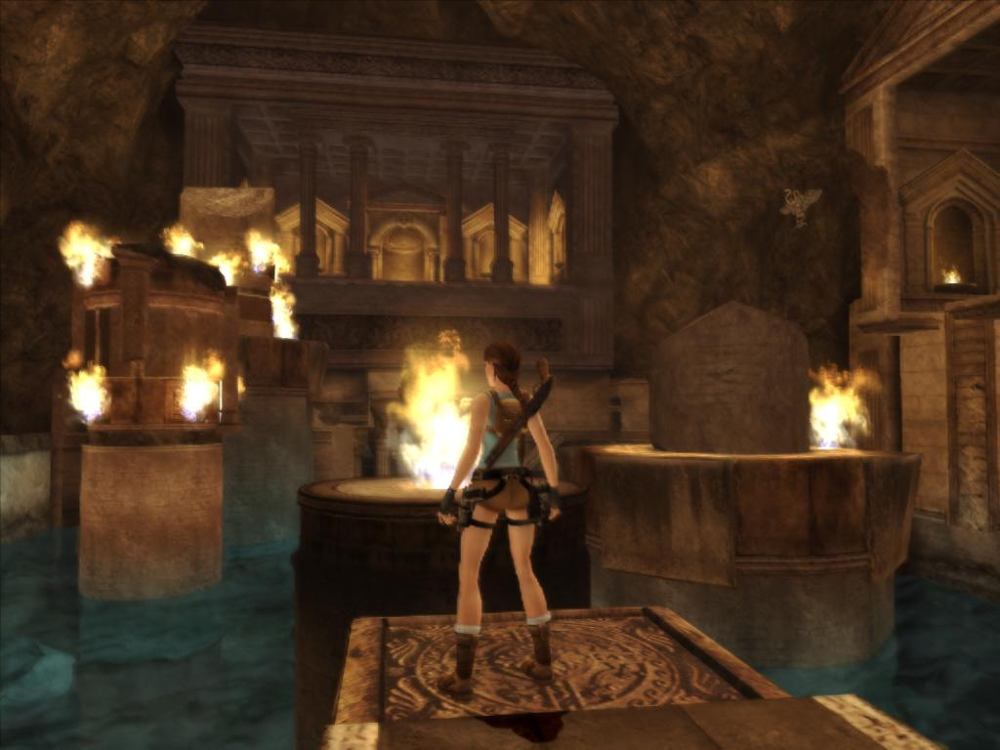

**Ficha técnica:**  
Título: Tomb Raider Anniversary  
Desarrollador: Crystal Dinamics  
Editor: Eidos Interactive  
Pegi: +16  
Precio: 44.95 €  
Página web: http://www.tombraider.com/

Han pasado once (casi doce) largos años. Once largos años que han dado para todo, incluyendo penas y glorias, éxitos y fracasos, escándalos, renacimientos, evoluciones y pasos en falso. Tomb Raider no es una saga: es La Saga por Excelencia del mundo de los videojuegos, y como tal debemos juzgar su última entrega, que viene a ser el cumpleaños feliz para una chica a la que le sobra todo. Lara Croft es indudablemente la heroína videojueguil más famosa de todos los tiempos y su figura ha traspasado fronteras hacia los cómics, el cine o el erotismo (¿conoces a alguien que no haya buscado "Lara Croft" en las imágenes de Google?), aunque de estas aventurillas poco podemos sacar en limpio porque los comics se han quedado en puras anécdotas y las películas... en fin, nada que ver con esta chica. Le sobra todo y por sobrar le sobra hasta el cine. A Lara le sobran curvas de escándalo que quitarían el hipo conforme ella se quitase ropa (en una versión de carne y hueso, obviamente), le sobra experiencia en eso de saltar de una pared a otra, le sobra la ducha porque por mucho que se revuelque en barro o se refrote contra una pared siempre está impoluta, le sobran ganas y motivos para dedicarse a ese viejo oficio de la exploración a la vieja usanza, le sobra munición para cargarse dinosaurios o dioses con su par de pistolas, y le sobra carisma y presuntuosidad como para burlarse de sus enemigos incluso cuando tiene un revólver en la sien.

El primer Tomb Raider fue un éxito total debido por completo al soplo de aire fresco que suponía respecto a los viejos y atascados plataformas tipo "Prince of Persia" (otro que tal baila... digo: salta), una protagonista a la que cogías cariño facilmente y que derrochaba sujetador, y en general por una tónica que te convertía en el Indiana Jones de turno de una forma muy pero que muy entretenida. De aquí surgieron "Unfinished bussines" (una expansión normalita), y una segunda entrega que reforzaba los puntos fuertes de la primera. Rondaba el año 1999 cuando el tercer título de la franquicia vio la luz, tocó techo y dejó paso a que "The Last Revelation" (la cuarta de la señorita Croft) y especialmente "Chronicles" llevasen al infierno las virtudes de sus antecesores. Para cuando todos creían que Tomb Raider sería pasto del recuerdo, "El ángel de la Oscuridad" reanimó la saga con un profundo bypass a corazón abierto, aunque lo cierto es que su éxito vino gracias al márketing y su renombre. Un juego con demasiado contraste entre luces y sombras que no gustó del todo y que fracasó ante las nuevas peripecias del príncipe o un solitario juego de "Indiana Jones y la tumba del emperador" que no recibió la continuidad apropiada; así que Lara no consiguió totalmente reinventarse. Habría que esperar al 2006. Core Desing (empresa que había desarrollado los primeros títulos) dejó en manos de Crystal Dinamics los Tomb Raider luego de publicar "El ángel de la Oscuridad", pero su creador Toby Gard regresó con fuerza para editar "[Tomb Raider Legend](../../../2011/06/tomb-raider-legend/)", título mayúsculo dentro del género de las aventuras y que sí recibió (esta vez crítica y público estaban de acuerdo) un justo veredicto que le beneficiaba. Y así, con una tecnología solvente ya pulida como base y recuperando su esencia, decidieron rendir homenaje a las peripecias de la trenza más larga que un pc jamás ha albergado. De modo que "Tomb Raider Anniversary" es un remake del juego original, único e irrepetible, una vuelta al punto de partida en forma de tarta de cumple que encubre el intento más acertado hasta la fecha para sacar adelante una marca que ha vendido hasta la saciedad sobretodo en forma de merchandising.

Comienzas enseguida, encaramándote a unos salientes en la roca para llegar a la puerta de tu primer nivel (es decir, pasando un tutorial fantasma que a decir verdad es de los más útiles que recuerdo) y en apenas una horita te ves exterminando lobos a diestro y siniestro mientras buscas un engranaje que resuelve el puzzle y abre la siguiente zona. Anniversary se juega así: llave-roja, puerta-roja; pero lo cierto es que la variedad de puzzles (no siempre limitados a saltar, pero siempre enfocados a explotar todas las posibilidades del escenario) es apabullante y acabas reconociendo que el trabajo en ese apartado ha sido brutal. Y si con cada entrega se iban siempre aumentando los movimientos disponibles, Anniversary ha sabido ofrecer toda esa libertad de una forma ágil. Veámoslo en acción: Te encuentras en una estancia totalmente vacía con una pequeña abertura en el techo. No puedes apilar cajas porque no hay cajas, ni subir por ninguna escalera, etc. Pero ¡oh, dios, al fin! divisas un pequeño reborde en una pared, tal vez una losa resquebrajada. Saltas al límite intentando agarrarte y de nuevo encuentras una argolla en la pared contigua, con otro salto desplegas tu cable y comienzas a caminar por la pared hasta que, en un salto final en el que te deshaces del cable, sujetas con una sola mano el borde del acceso en el techo. Tecla para agarrarse mejor, subir al saliente y listo. Y esto solo es una pequeña muestra. Para todo esto solo hubieses necesitado el clásico "WASD", la tecla del cable (Q por defecto), recuperar el equilibrio (E) y obviamente el salto aparcado como mandan los cánones en la barra espaciadora. Tan bien calibrado está el control que incluso cuando te equivocas puedes rectificar a tiempo de no morir en el precipicio si actúas tan rápido como la situación requiere. Cuando se empezaban a acumular las teclas con diferentes funciones (y mapeados imposibles) en "The Last Revelation" rogabas a Dios por un sistema de control como este. Como nota culminante hay que decir que a veces los problemas se resuelven con la socorrida física (¿qué sería de los videojuegos modernos sin ella?) y no solo disparando o saltando.

Y si el control, la variedad de movimientos y las animaciones son un auténtico lujo asiático; no quiero ni contarte cuando consigas adentrarte en St. Francis Folley y bajar a las entrañas de los templos griegos. El trabajo artístico es lo más sobresaliente del título junto con la calidad de los escenarios, y es dificil conseguir llegar a cotas tan altas de calidad, pero rebuscar en las tumbas de los dioses, o del rey Midas, o enfrentarse a una pareja de demonios griegos mientras esquivas rayos petrificadores y placajes brutales es una experiencia sublime. Tal vez la majestuosidad de los escenarios mesiánicos sólo sea comparable a su tamaño (son enormes!!) o a la cantidad de veces que cargarás partida. Porque Anniversary es un juego muy duro de roer (quizás solamente superado por [Blade: The Edge of Darkness](../../../2001/02/blade-the-edge-of-darkness/)) y en la mayor parte de los casos la solución no resulta obvia ni de lejos. Es tal lo intrincado de los puzzles y su compleja superación que el tiempo de juego se extiende más allá de las 15 horas en el modo fácil, y más de 20 si escojemos los más chungos. Entre unos y otros, se ha conservado una innovación de "Legend" (antes probablemente como experimento, ahora como elemento de nexo en la trama) como es los minijuegos entre cinemáticas. El jugador debe pulsar las teclas de dirección en un orden y momento adecuados para esquivar disparos o embestidas, y su dificultad supone un reto al principio y poco más que un trámite cuando les cojes el truco, pero por suerte no abundan y están bien dosificadas a lo largo de la trama, con lo que acabas agradeciendo su aparición para al menos aportar una visión distinta y ver las maneras en las que Lara puede ser historia si no te portas lo suficientemente bien. Hora de mirar a enemigos y armamento. Lobos, murciélagos, ratas, cocodrilos, dinosaurios, dioses, gorilas, panteras, momias... tus contrincantes son variados, están acorde con la ambientación de cada capítulo y lo que es más importante, se incluyen enemigos finales que den empaque a la consecución de objetivos como aliciente para el jugador. Para acabar con ellos lo habitual es el par de pistolas, un par de calibres .50mm y la recortada siempre fiel. Puede parecer escaso y de hecho lo es.

La factura técnica brilla con fuerza en "Anniversary", heredando el motor de "Legend" y añadiendo suculentas mejoras en cuanto a estabilidad. Lo más impresionante es la increíble iluminación y los efectos del entorno interaccionando con Lara como por ejemplo su ropa mojada (y más oscura) al salir del agua, el movimiento realista de su coleta al saltar y la sensación orgánica que trasmiten sus escenarios, llenos de elementos y texturas de alta resolución. Hasta se permite el lujo de ofrecer HDR y antialiasing. Pero atención, bombazo: el juego corre así de bien ¡¡incluso en pc's modestos!! Así que guardate tus euros y ahorra para comprar una gráfica cuando éstas puedan mover [Crysis](../../../2007/12/crysis/) en alta resolución porque TR:A es de lo más optimizado que he probado nunca, mucho más incluso que el motor Source de Half-Life 2 y [siguientes](../../../2006/06/half-life-2-episode-one/). Para que te hagas una idea, fliparás en colores al entrar en un oscuro pasillo después de pasar un ratito bajo un sol de castigo: tu visión se nubla ligeramente mientras las pupilas no se adaptan a la oscuridad. ¡Es el colmo del realismo técnico! "Profundidad y desenfoque de campo son virguerías realmente útiles", piensas. La luz filtrándose entre las columnas, el agua corriendo por las fuentes, la vegetación meciéndose con la brisa... Y qué decirte de las animaciones sin captura de movimiento, ahí es nada. Todo, absolutamente todo gesto o expresion de Lara Croft ha sido programado, desechando costosas técnicas como el citado "Motion capture" y la verdad es que se portan perfectamente porque guardas tus pistolas mientras te deslizas por el aire hacia esa pértiga en la que dar vueltas de campana y rematar la jugada con una caída en picado hacia la plataforma siguiente. La fluidez y plasticidad es pasmosa, impropias de un juego con semejante cantidad de movimientos y superficies diferentes. Tal vez la banda sonora sea un pelín más floja, pero los temas suelen acompañar a la acción bastante bien por lo que es un apartado discreto. No sobresale ni para bien ni para mal. En cambio, las cámaras no son totalmente satisfactorias cuando se trata de espacios cerrados o esquinas y no entiendo como en un motor tan avanzado, y siendo este un problema heredado, no se decantan por hacer trasparente al entorno o a la misma protagonista cuando la perspectiva libre lo requiera. Tampoco ayuda el sistema de guardado basado en puntos de control y que obliga en ocasiones a comenzar un nivel desde cero, cosa que estamos hartos de repetir pero que parece que no oyen ahí arriba: los checkpoints están muy bien... en consolas, máquinas que tal vez no puedan guardar partida con todo detalle como en un ordenador.

Tomb Raider Anniversary es, en definitiva, un remake sobresaliente y (paradójicamente) novedoso. Tiene todo lo que se le pide a un Tomb Raider (la exploración) y rechaza todo lo que no huela a marca Croft (el combate absurdo de "Chronicles", por ejemplo) y dada la falta de competencia (el príncipe de persia parece jubilado tras un aluvión de sus nuevas aventuras que terminó en empacho) el título se corona como mejor aventura de acción y plataformas producido. En consolas quizás sea donde lo pase peor, pero para PC no hay nada igual o superior. Así que Lara te veo bien una década más tarde. Conservas tus virtudes, aprovechas una tecnología excelente y además te permites lujos como aumentar tu repertorio u ofrecer al jugador lo mismo una vez más. Pero has encontrado la fórmula que funciona de nuevo, como ya hiciste once años antes con el Scion. Que dure.

**NOTA: 8.75**

**Lo mejor de Tomb Raider Anniversary:**  
El trabajo artístico y el diseño de niveles son Tomb Raider puro y duro  
La tecnología brillante y perfectamente optimizada se aprovecha al máximo  
Todos los movimientos se realizan con un control sencillo y las animaciones son excepcionales

**Lo peor de Tomb Raider Anniversary:**  
Las cámaras se ahogan en espacios muy cerrados  
Pocas armas y alguna cinemática no muy trabajada  
En ocasiones la dificultad se dispara, las soluciones no son obvias y el sistema de guardado complica las cosas

**Requisitos mínimos:**  
Windows 2000/XP/Vista  
Pentium III 1.4 GHz o Athlon XP 1500+  
256 MB RAM (2000/XP) ó 512 MB RAM (Vista)  
DirectX 9.0c  
4 GB Disco Duro  
Tarjeta gráfica compatible con DirectX 9.0c 64 MB con TnL (GeForce 3Ti / Radeon 9 series y superiores)

**Requisitos recomendados:**  
Windows 2000/XP/Vista  
Pentium IV 3 GHz o Athlon 64 3000+  
1 GB RAM  
DirectX 9.0c  
4 GB Disco Duro  
Tarjeta gráfica compatible con DirectX 9.0c 64 MB con Vertex Shader 2.0 y Pixel Shader 2.0 (GeForce 6000 series / Radeon X series y superiores)