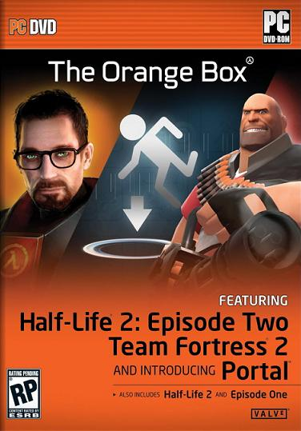
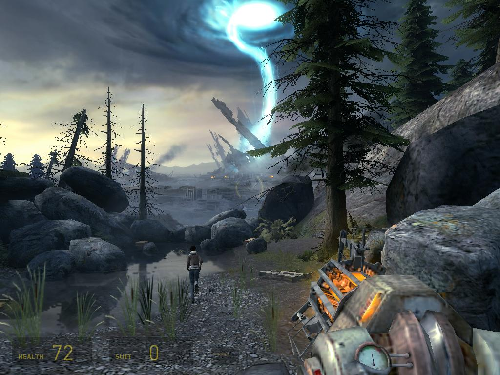
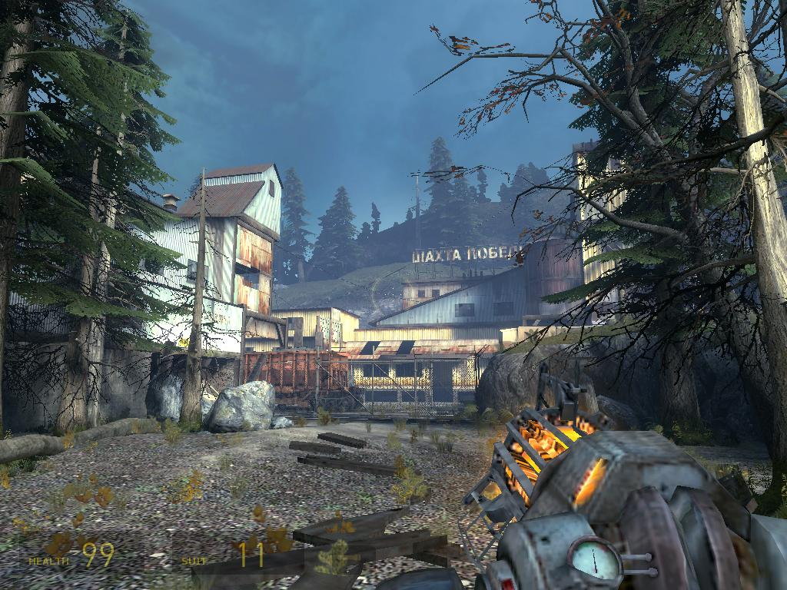
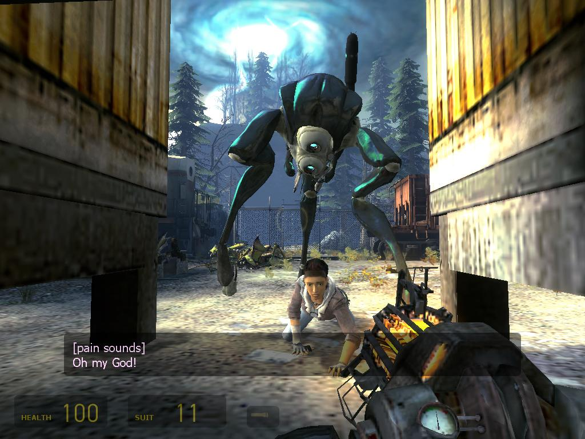
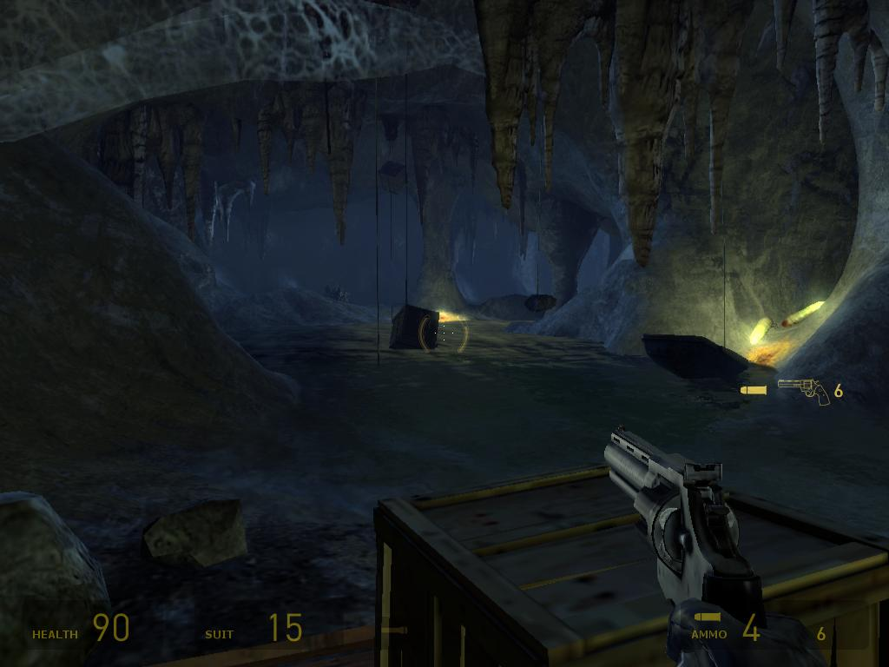
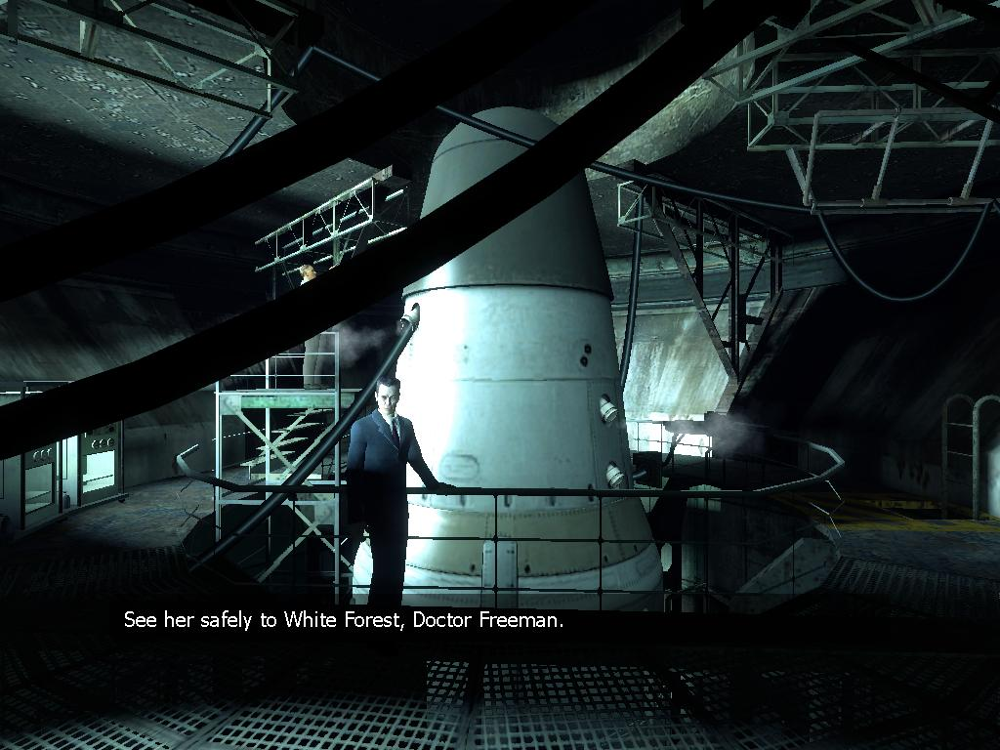
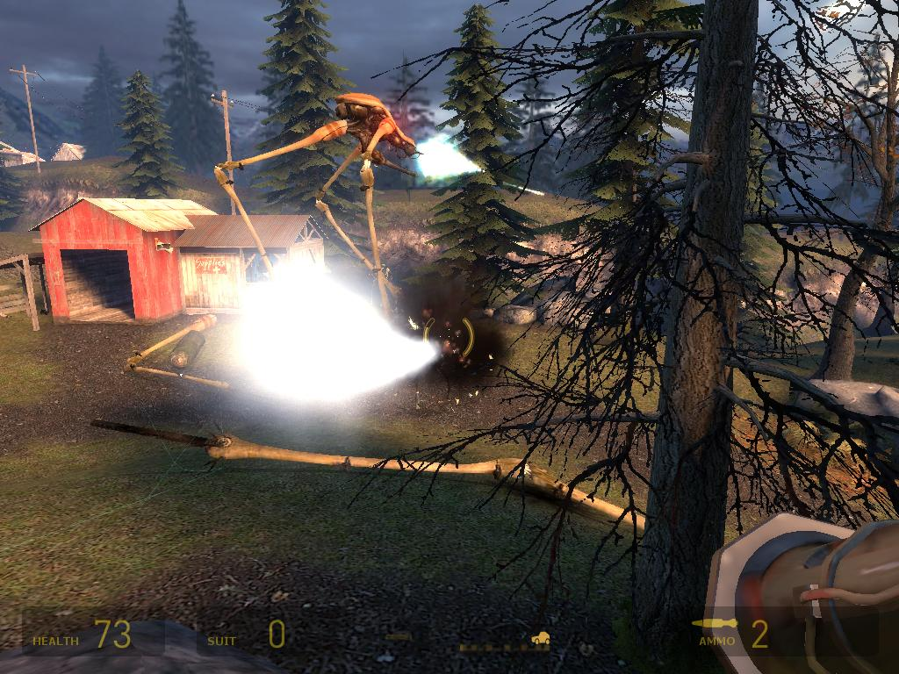
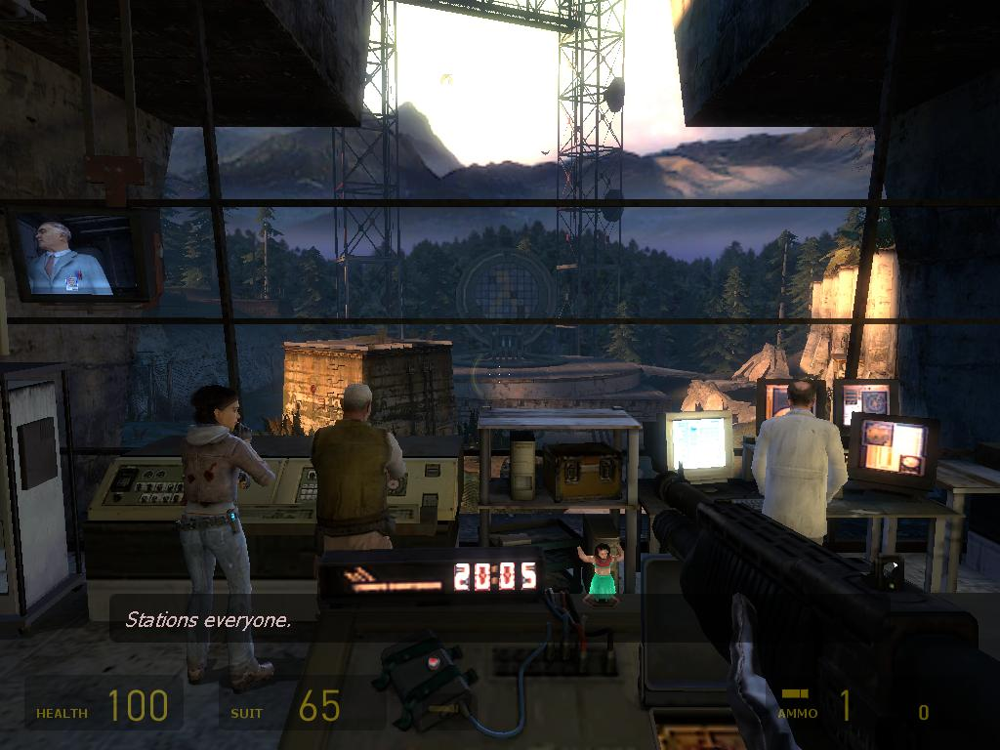
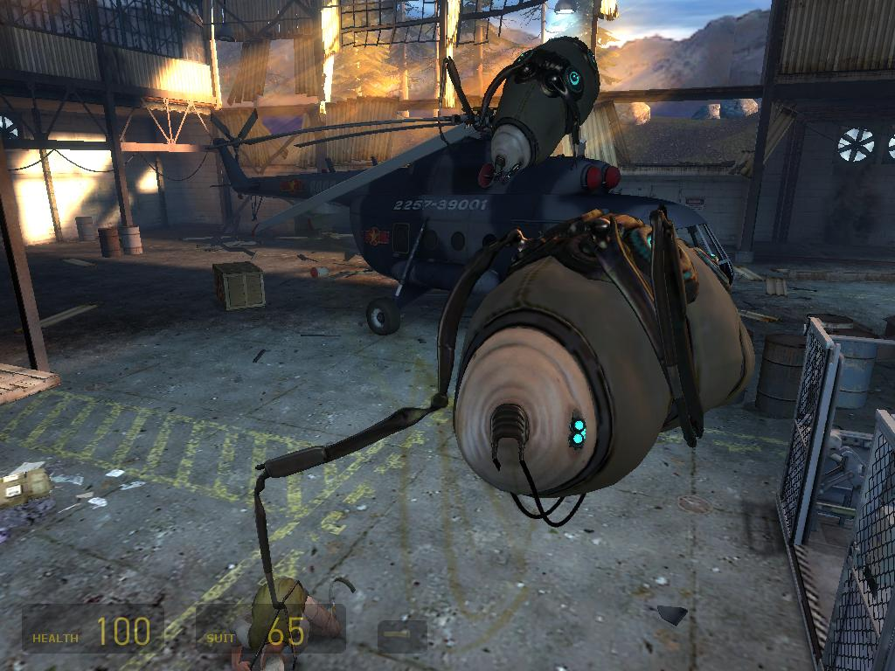

**Ficha técnica:**  
Título: Half-Life 2 Episode Two  
Desarrollador: Valve Software  
Editor: Electronic Arts  
Pegi: +18  
Precio: 49.95 €  
Página web: http://orange.half-life2.com/hl2ep2.html

Carta a los reyes magos. 18 de Octubre. Quiero un juego de acción en primera persona, con buenos gráficos, buen sonido, acción a raudales, fases de terror, exploración, puzzles y física realistas. Quiero que la historia sea buena y que funcione en mi ordenador sin tener que dejarme la paga en una grafica nueva. Un juego realista y no lineal en el que además haya vehículos y enemigos con una IA decente. Half-Life Episode Two es el mejor juego de acción que he jugado en mi vida. Así, directamente. Ni más ni menos, y eso que tiene sus defectillos. Ahora puedes bajar hasta el final para ver la nota o seguir leyendo y entender porqué EP2 me ha enganchado tanto.

Eres Gordon Freeman, obviamente, y eso de por si ya denota una forma de presentarte el videojuego. No hay videos y nunca sales de la perspectiva de nuestro científico favorito. Si te tienen que contar algo, viene algún personaje y te lo dice. Todo se desenvuelve de forma tan natural e intuitiva que la "linealidad" de otros juegos se convierte en el "instinto" que te guía a lo largo de tu aventura. Una ciudadela destruida de la que tienes que escapar y una chica a tu lado: Alyx Vance. Vuelve a leer el analisis de [Episode One](../../../2006/06/half-life-2-episode-one/) y ahora eleva al cuadrado todas las bondades que dije sobre ella. La morenita compañera de Gordon es tan real que sufres por ella. Primer puñetazo: a los pocos minutos es herida de gravedad y deberás correr para salvar su vida. Tranquilo, no te voy a estropear el que tal vez sea el argumento más complejo jamás ideado para una saga de videojuegos. Te (nos) han engañado durante los últimos 9 años. En apenas un par de horas, Episode Two pone el mundo al revés y te deja esa cara de tonto con la que te dejaba el primer Half-Life allá por el 98. El omnipresente G-Man, Eli Vance, el Dr. Kleiner... y tú. Consecuencias inesperadas. Guiño impagable a los veteranos de la saga. Durante todo el juego se deja entrever un homenaje, un toma y daca constante entre preguntas, respuestas y explicaciones a todo lo anterior. Un duro golpe en toda la cara al jugador.

A base de pistola gravitatoria escaparás a White Forest, pero por el camino lidiarás batallas épicas. El abismo de Helm en las películas de El señor de los anillos te parecerá un mero parchís, porque defenderte de decenas de hormigas león con la ayuda de los vortigaunts o derribar zancudos al tiempo que esquivas a los rapidísimos cazadores es una experiencia sublime. No tengo palabras para definirlo y las imagenes ni siquiera pueden ilustrarlo. Además Half-Life Episode Two aprovecha para introducir factores de terror totalmente novedosos e impactantes, hijos de una tecnología que se me antoja todopoderosa y que hará que te acuerdes de películas como The Ring o White Noise. Tensión.

Escapando hacia White Forest conocerás también unas postales increíbles: escenarios paradisíacos de montaña y naturaleza en los que investigar, explorar, experimentar o tal vez pasear. No creas que tampoco vas a tener muchos ratos libres. El ocio no existe en el mundo de Freeman y siempre tienes algo que hacer o alguien a quién disparar. Estos escenarios de los que te hablo son los más bellos gráficamente hablando que he visto en mi vida. Ni tan siquiera [Far Cry](../../../2004/05/far-cry/) con sus estupendas playas puede ponerse al nivel de los densos bosques, las altas montañas y la frondosa vegetación de EP2. Es así. No hay sensación de cartón piedra, o de camino marcado. Todo parece dispuesto de una forma tan natural y convincente que la sensación de realismo transmitida es brutal. Con HDR activado ya es demasiado. Todo ello aderezado por una física que era casi perfecta y que aún sigue mejorando a pasos de gigante. Física que es un elemento esencial y que cambia radicalmente la forma de jugar, porque siempre podrás convertir una mesa en una barricada o una botella de plástico en un mortífero misil directo a la cabeza de tus enemigos.

Hablando de enemigos. Hay tres enemigos nuevos y son durísimos de pelar. Obviamos al Guardian de las hormigas león porque tenía su minuto de gloria en el original, pero unas hormigas que te disparan ácido, los cazadores y los vigilantes son lo estremecedor del juego. Pon la dificultad en media y sabrás a qué me refiero, súbela al máximo y desearás no haber nacido. Contra las hormigas basta un poco de pericia, para los cazadores necesitarás munición a raudales y una velocidad punta altísima, pero para los vigilantes... reza. No puedes acabar con ellos. Así de sencillo. AH! También probarás un arma nueva: El dispositivo Magnusson. En realidad son unas bolas explosivas con las que cargarse a los zancudos, y exigen mucha puntería (primero tirarle la bola a la cabeza, luego disparar a la bola). Otra cosa en la que invertirás bastante tiempo será en la resolución de puzzles. Desde apilar cajas hasta jugar al perro y al gato con el Guardián o equilibrar un puente de hormigón semiderruido haciendo contrapeso con unos coches abandonados. Puede sonar raro pero lo harás. Es Half-Life al 100%.

Que Half-Life es un prodigio de la jugabilidad ya es bien sabido. Pero que todavía puedan explotar la técnica después de lo hecho con Episode One es todavía más increíble. Y no se resiente ni el rendimiento ni nada. Gráficamente es magistral, y las capturas no hacen justicia (recuerda que puedes verlas a tamaño completo haciendo clic sobre ellas). Hay cientos de cosas moviéndose en pantalla. Además tienes una IA complejísima con la que tus compañeros combaten, se cubren, recargan, te dan indicaciones y buscan sus propias formas de asestar el golpe definitivo contra sus adversarios. Por su parte el sonido sigue siendo altamente satisfactorio y la banda sonora acompaña a la perfección, más cañera que nunca.

Por cierto, si te compras la Orange Box disfrutarás de los juegos anteriores, pero tanto la Black como la Orange incluyen [Portal](../../../2007/10/portal-orange-box/) y Team Fortress 2. Un par de peros. Como en Episode One, la duración es extremadamente corta (unas 6 horas de juego más o menos) y escandalosamente no ha sido doblado al castellano (aunque ya tenemos noticias de que se terminará haciendo la localización). Eso es lo único que le puedes echar en cara al juego. Si desconfías de algo o te emperras en encontrar fallos tontos... tu falta de fé te será restregada. Tiene todo y aporta novedades rejuvenecedoras. No es definitivo, pero Half-Life 2 Episode Two ha estado a menos de un milímetro de conseguirlo.

**NOTA: 9.95**

**Lo mejor de Half-Life 2 Episode Two:**  
Acción indescriptible y novedades jugosas  
Guión, puzzles y desarrollo perfectos  
Tecnología de gala para una jugabilidad extrema

**Lo peor de Half-Life 2 Episode Two:**  
No está traducido!!!  
Es muy corto, igual que Episode One  
El precio si no te interesan el resto de contenidos de la Orange Box.

**Requisitos mínimos:**  
Windows 2000/XP/Vista  
DirectX 9.0c  
Pentium IV a 1.7GHz o equivalente  
512 MB de RAM  
Tarjeta Gráfica de 64 MB compatible DirectX 8

**Requisitos recomendados:**  
Windows 2000/XP/Vista  
DirectX 9.0c  
Pentium IV 3.0 GHz o equivalente  
1 GB de RAM  
Tarjeta Gráfica compatible DirectX 9.0