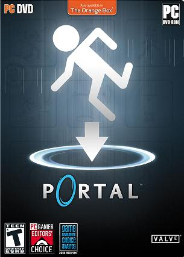
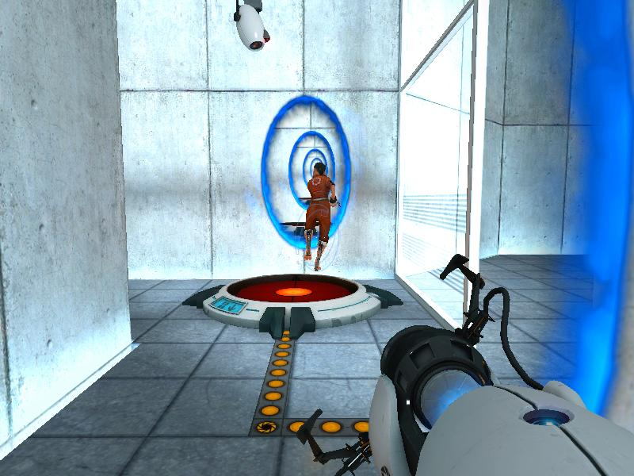
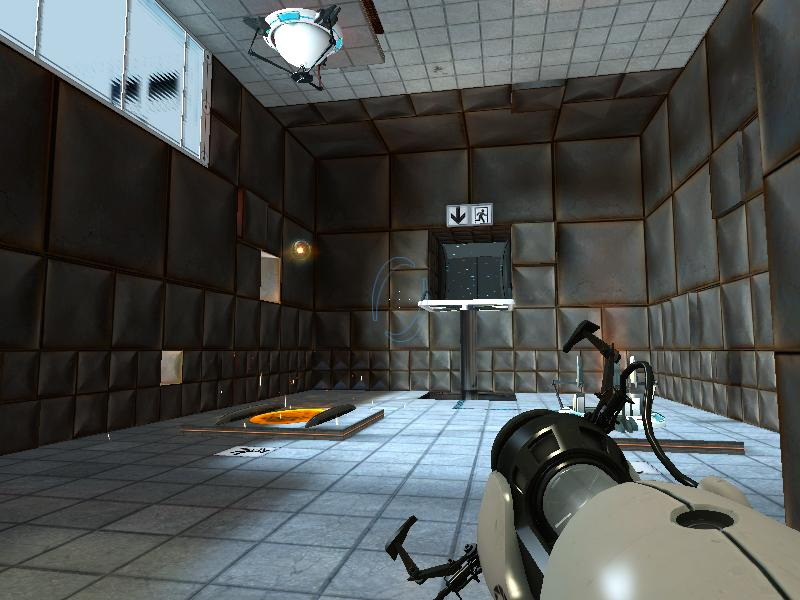
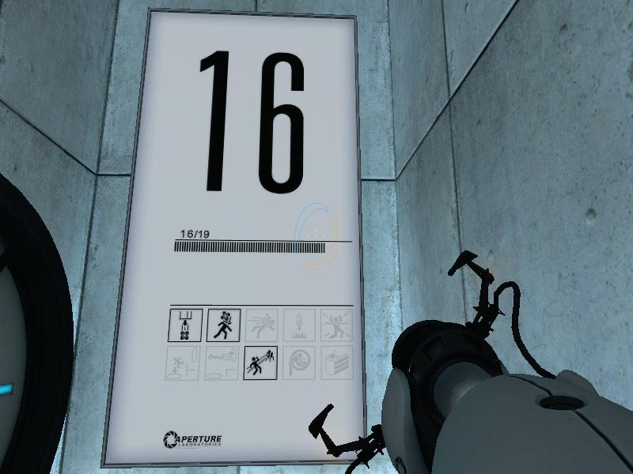
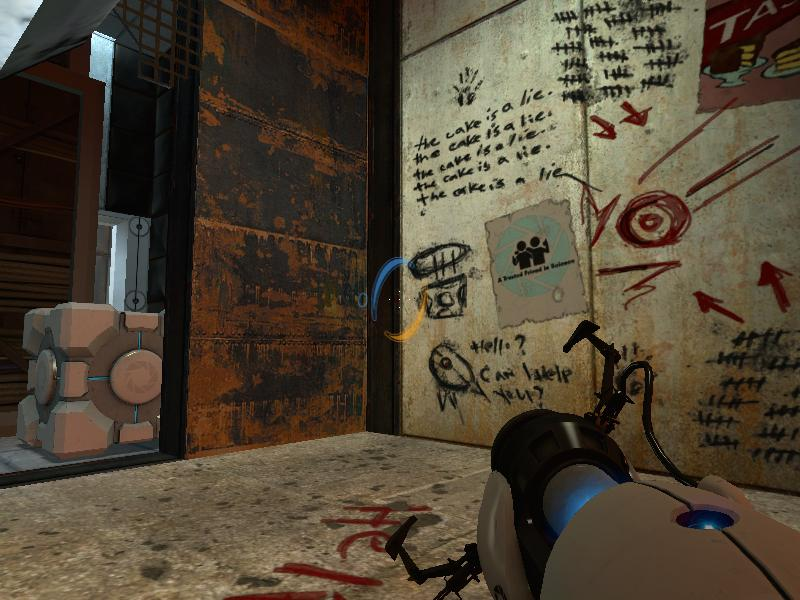
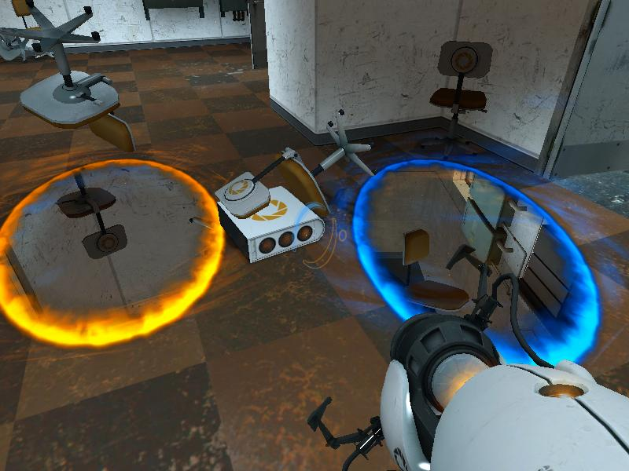

**Ficha Técnica:**  
Título: Portal  
Desarrollador: Valve Software  
Editor: Electronic Arts  
Pegi: +12  
Precio: 19.95 €  
Página web: http://orange.half-life2.com/portal.html

¿Como definir Portal? Es difícil. Quizá nos resulte más sencillo entendiendo que procede de [Half-Life 2](../../../2006/06/half-life-2-episode-one/). Valve Software ha utilizado el mismo motor Source que emplea con las aventuras de Gordon Freeman. Posiblemente, uno de los mayores logros que este motor haya conseguido ha sido la integración completa de la física en los videojuegos modernos. No quiero decir que antes no existiese, pero su introducción en Source ha sido definitiva en lo tocante a la jugabilidad. Pero si el arma gravitatoria era todo un lujo, puede que Portal sume algo mejor al ya de por sí sublime desarrollo de su software madre. Y lo hace. Portal debe su nombre y su existencia a los portales dimensionales que son la clave de la aventura.

Te despiertas en una sala de cristal, simplemente con un retrete y una cama futurista a tu alrededor. No sabes ni quien eres, ni que debes hacer. Lógicamente, no tienes ni una mísera palanca con la que defenderte, pero a los dos minutos de juego te olvidas por completo de la dichosa palanquita. No hace falta, porque rápidamente asumes que no eres más que una simple rata de laboratorio que ha de recorrer un intrincado laberinto. Portal es en parte eso: un exquisito laberinto. En cuanto recibes la pistola dimensional (la también llamada "batidora"), conoces el otro 50% del juego: los portales que te llevan de un extremo a otro del mapa con simplemente atravesarlos. De modo que fase tras fase simplemente te dedicas a combinar los novedosos portales y las vetustas cajas (Dios mío, ¿cuándo dejará de haber cajas en los videojuegos?) en busca de la manera de seguir avanzando por las estancias de Aperture Laboratories, que es tu prisión en el juego.

Llevado a la práctica es un juego divertidísimo, porque los portales resultan ser un elemento que abre grandes posibilidades de desarrollo no lineal. Por ejemplo, cuando no hay manera de llegar a una plataforma que se encuentra a demasiada altura como para saltar o apilar cajas. Bueno, no hay problema. Ponemos el primer portal en lo alto de una pared y el segundo portal justo debajo del primero, en el suelo. Si enlazamos varios saltos entrando y saliendo por los portales, nuestra energía cinética se irá multiplicando en cada ciclo, con lo que al final lo más probable es que podamos usarla para un gran salto final que nos lleve a esa plataforma lejana. Tampoco todo son saltos en Portal, pero darte más detalles sería estropearte esa gran experiencia que supone.

Este planteamiento basado en puzzles es tal y como aparenta: tan simple como el encefalograma de los concursantes de Gran Hermano. Aún con todo, compensa bastante el hecho de poder abrir portales y que la dificultad esté tan milimétricamente calibrada, pues siempre te sientes empujado hacia el siguiente nivel. Hablando de niveles, hay 19 cámaras made in Aperture para poner a prueba tus neuronas, pero hacia el último cuarto del desarrollo se produce un cambio de registro bellamente resuelto. A partir de ahí, cuando tú ya creías que se estaba acabando, Portal te sume en la miseria con unas intrincadas plataformas a través de las tripas de Aperture. Y sin contemplaciones, el juego te exprime todavía más, llevando la duración total de la experiencia a unas escasas pero justas 5 o 6 horas de entretenimiento. El hecho de que Portal sea tan fugaz acentúa aún más si cabe una sospecha que te persigue desde el comienzo. Portal es un experimento. Pues sí, oye. Lo de los portales se vé venir que puede ser el siguiente paso en la saga Half-Life, y la inclusión de Portal en la [Orange Box](../../../2007/10/half-life-2-episode-two-orange-box/) no parece más que destinada a tomar el pulso al mercado y a la crítica, para ver si la industria está preparada para una innovación de semejante calibre. Portal es un sabio pero entretenidísimo experimento comercial de Valve Software.

Traduciendo todo lo anterior: Portal es un gran juego. Las virtudes de un motor tanto gráfica como físicamente sorprendente se ven ampliadas muy mucho con la estupenda batidora y se favorece que poco a poco vayamos evolucionando el viejo sistema llave roja-puerta roja. Con todo, pesa el hecho de que sea un mero divertimento de un puñado de horas tan escandalósamente experimental. En un mundo perfecto, Portal sería un superventas alabado por todos, pero en la realidad se queda en una experiencia anecdótica más próxima a una tarde de cine que a un clímax videojueguil. Pruébalo, rejuvenécete de forma gratuita, pero sigue esperando Episode Three.

**NOTA: 8**

**Lo mejor de Portal:**  
- Puzzles tremendamente buenos y un soplo de aire fresco en el género
- El sistema de portales es muy innovador
- El cambio de estilo final y los detalles típicos de Valve

**Lo peor de Portal:**  
- No deja de ser "lo otro que venia con la Orange Box"
- Demasiado corto
- Apenas añade matices a la trama de Half-Life

**Requisitos mínimos:**  
- Procesador a 1.7 GHz
- 512 MB de RAM
- Tarjeta de video compatible con DirectX 8
- Windows 2000/XP/Vista
- Conexión a Internet

**Requisitos recomendados:**  
- Pentium 4 a 3.0 GHz
- 1 GB de RAM
- Tarjeta de video compatible con DirectX 9
- Windows 2000/XP/Vista
- Conexión a Internet

**NOTA:** Desde hace unos días, Portal se puede adquirir en Steam de forma individual, para aquellos que no estén interesados en la Orange Box completa o el resto de packs que incluyen este juego.