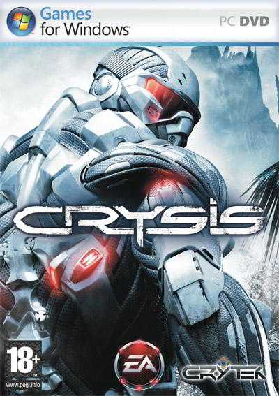
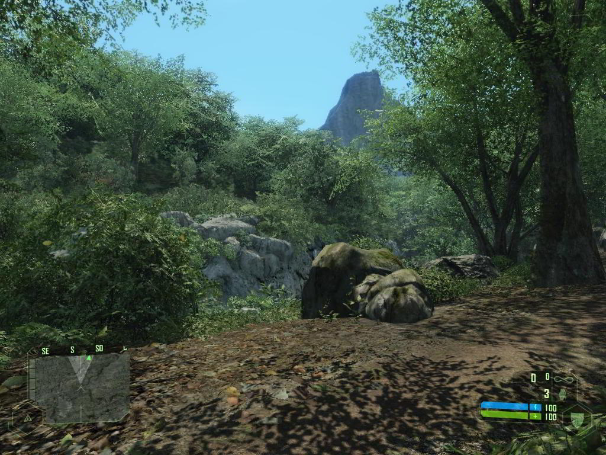
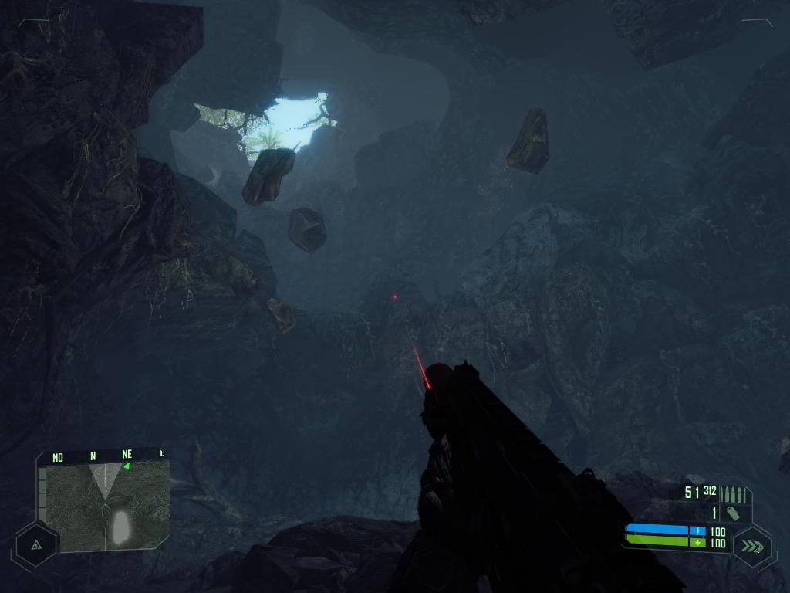
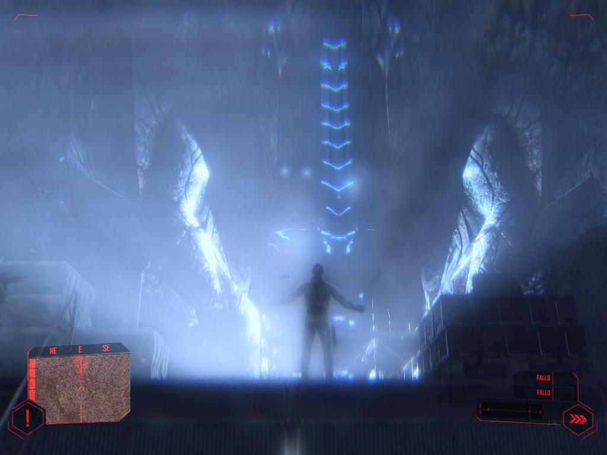
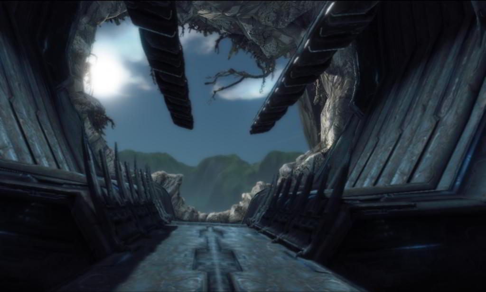
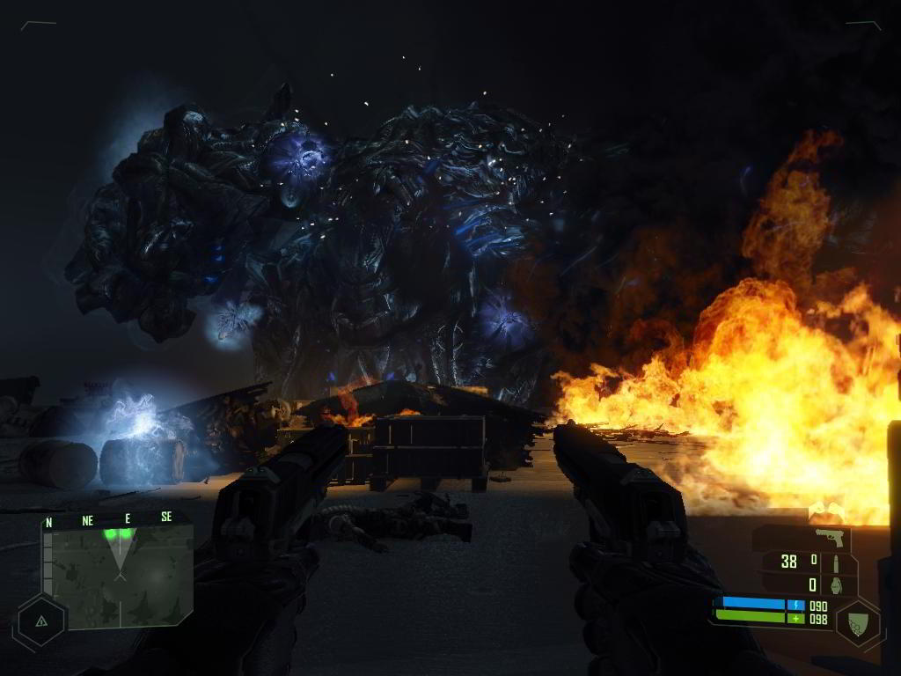
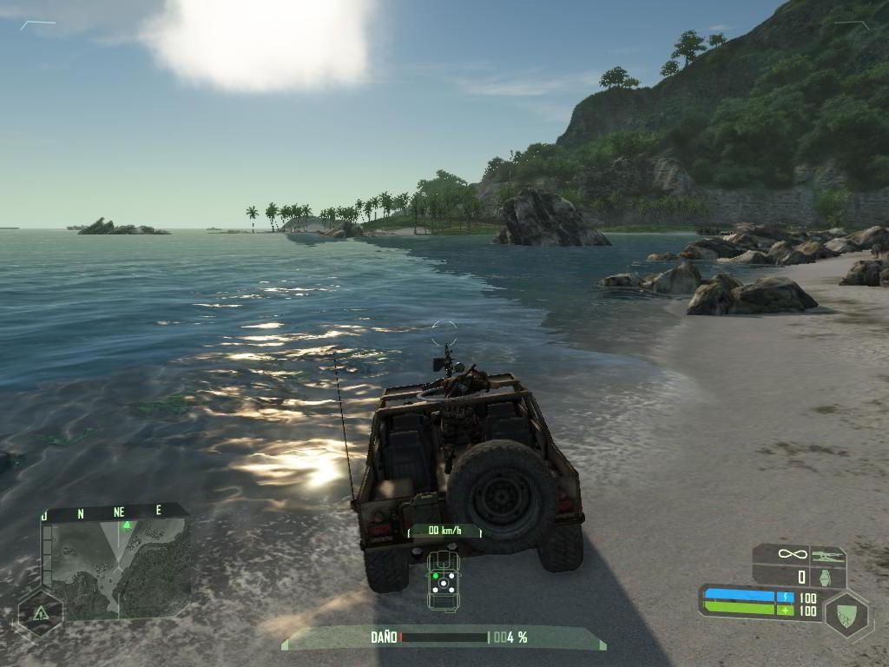
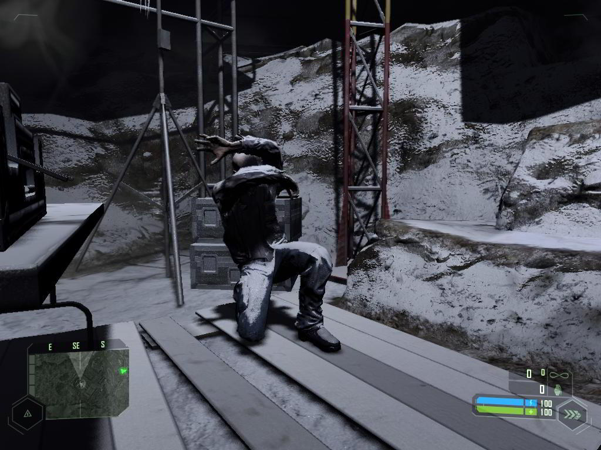

**Ficha técnica:**  
Título: Crysis  
Desarrollador: Crytek  
Editor: Electronic Arts  
PEGI: +18  
Precio: 49.95 €  
Página web: http://www.ea.com/crysis/

Hace unos meses que os contaba porqué [Half-Life 2 Episode Two](../../../2007/10/half-life-2-episode-two-orange-box/) era el mejor juego que jamás había probado. Bien. Hoy eso ha cambiado: tras una larga pero expectante espera, Crytek ha lanzado su segundo juego, titulado “Crysis” y llamado a ser el referente durante los próximos años. Tanto es así que tras su aparición estelar, el mercado de PC ha quedado un poco “huérfano” por falta de títulos de mayor calibre. Todo a su lado parece empequeñecer hasta tal punto que ni siquiera el multiplataforma y pulcro Assasin’s Creed le puede hacer sombra. Entendido este punto comenzaremos comentando el guión de esta obra maestra.

Nombre en clave: Nomad. 2019. Unos científicos han descubierto algo raro en unas excavaciones de una isla del mar de Filipinas, y el ejército norcoreano los ha tomado como rehenes, controlando la isla entera a las órdenes del general Kwong. Pero la isla guarda otro secreto aún mayor: un enclave alienígena latente en sus entrañas, y que por accidente es despertado, hará de la isla un auténtico infierno. Para poder mermar a las tropas humanas, cuentas con un nanotraje ultra-moderno que potencia varios atributos del personaje, según actives blindaje máximo, velocidad máxima, fuerza máxima o camuflaje óptico. Es, sin lugar a dudas un espectacular giro a todo lo visto hasta ahora, porque varías tu forma de jugar a una velocidad de espanto: ahora ataco aprovechando la velocidad, ahora me camuflo, agarro a mi enemigo y lo hago pedazos con mi fuerza, salto y evito que me atropellen... Tu nanotraje es tu vida, por eso no encontrarás botiquines; ya que tendrás que mantenerte a cubierto para que tu nanotraje recupere energía y te regenere.

Otra de las bazas de Crysis es el entorno en el que comienzas a jugar: una paradisíaca isla tropical, donde los rayos de sol se reflejan con precisión en el agua, donde la vegetación crece, los días dan paso a las noches y donde no todo ha de suceder a raiz de tus acciones. Ese entorno vivo es la mejora sustancial a todos los niveles de lo visto en [Far Cry](../../../2004/05/far-cry/), pero se transformará completamente cuando te introduzcas en la nave enemiga para combatir en gravedad cero, o para cuando trates de escapar de un paraje desolado por el frío y en el que te helarás si te quedas quieto. Y no te cuento nada de los gráficos porque las capturas ya hablan por si solas (guárdalas en tu PC para verlas a máxima resolución). Sin ellos, esta magneficiencia visual a nivel artístico no sería tan grande. El nivel exhibido en Crysis (y no solo en gráficos sino en sonido y banda sonora, o su cinematográfico guión a la americana) es sencillamente increíble. Cualquier adjetivo se queda corto cuando lo ves en movimiento. Todo esto viene sustentado por el motor CryEngine 2, evolución del visto en Far Cry y facilmente utilizable con el editor Sandbox incorporado en el juego. Seguir hablando de la belleza técnica o artística de Crysis es perder el tiempo. Es sublime, pero Crysis es mucho más que todo eso: es una experiencia muy física y directa, perfectamente dispuesta para que el jugador no se sienta como una rata en un laberinto. Hablo de la libertad a la hora de afrontar cualquier objetivo, o de poder ir a cualquier punto del mapa que se nos antoje, o del realismo transmitido cuando tu todoterreno mete sus ruedas en el agua. Ese poderío para “transmitir” es su mayor virtud por encima de cualquier otra.

No obstante echo cosas de menos que alejan a Crysis del temido 10. Por ejemplo, una campaña de 12 o 14 horas se me antoja un poco escasa teniendo en cuenta las posibilidades de los escenarios y del guión. Tampoco los vehículos gozan de tanto protagonismo como en Far Cry. Cierto que son juegos con enfoques bien distintos, pero se echa un poco de menos. El resto es impecable. Cuando dejas Crysis atrás (por suerte con un final muy abierto y que será continuado en Warhead) echas de menos esa abrumadora sensación inicial, las cinemáticas excelentemente interpretadas y jugar a ser el soldado definitivo con tu nanotraje. Magistral.

**NOTA: 9.95**

**Lo mejor de Crysis:**  
La tecnología es realmente apabullante  
La jugabilidad abierta y el uso del nanotraje  
Realismo transmitido y guión muy cinematográfico

**Lo peor de Crysis:**  
Requisitos muy altos para jugarlo a tope  
Los vehículos pierden protagonismo respecto a Far Cry  
La campaña pudo haber sido más larga

**Requisitos mínimos:**  
Windows XP/Vista  
DirectX 9.0c  
Procesador a 2,8 GHz o superior (3,2 GHz o superior para Vista)  
1 GB de RAM (1,5 GB para Vista)  
Tarjeta gráfica GeForce 6800 GT/Radeon 9800 Pro (Radeon X800 Pro para Vista) con 256 MB  
12 GB de espacio libre en disco duro  
Tarjeta de sonido compatible con DirectX 9.0

**Requisitos recomendados:**  
Windows Vista  
DirectX 10  
Procesador de doble núcleo (Athlon X2/Pentium D)  
1.5GB de RAM  
Tarjeta gráfica GeForce 7800GTX/ATI X1800XT (Shaders 3.0) o tarjeta compatible DirectX 10 equivalente  
12 GB de espacio libre en disco duro  
Tarjeta de sonido compatible con DirectX 9.0