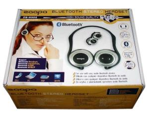
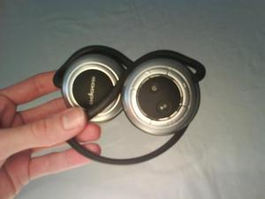
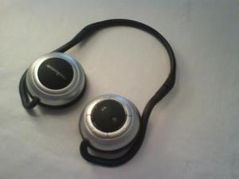
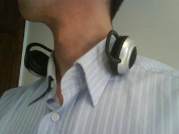

**Ficha Técnica:**  
Nombre: Zaapa ZB-H900  
Fabricante: Zaapa  
Precio: 32.00 €  
Página web: http://www.zaapa.co.uk/Public/ficha_producto.asp?CPRO=709

Viajemos a un futuro medianamente lejano, pongamos por ejemplo el siglo XXIII Los estudios que ahora tenemos sobre neurología habrán evolucionado lo suficiente como para que podamos manipular nuestro cerebro y adaptarlo a nuestras necesidades o gustos mediante inducción de campos magnéticos que modifiquen las estructuras que forman las neuronas dentro del cerebro. Cambiamos la máquina y cambiamos su función, y algo muy interesante sería que los seres humanos pudiesen utilizar contenidos multimedia allá donde fueren sin cables ni dispositivos adiccionales, vivir siempre permanentemente conectados a redes mucho más vastas y ricas que internet. Suena a ciencia ficción escalofriante, un mundo así, donde los cerebros pueden ser manipulados para bien o para mal, pondría fin a la existencia humana al menos tal y como hoy en dia la entendemos. Por ahora no tenemos que preocuparnos, pero ya podemos hacer uso de pequeños adelantos que nos enriquecerán la experiencia con medios de todo tipo en nuestra vida diaria. Zaapa, empresa tecnológica de mediano empaque, se preocupa porque podamos movernos en un entorno de forma libre, y presenta los auriculares ZB-H900 (en algunas ocasiones, ZA-H900) cuyo principal aliciente es la ausencia de cables.

Los Zaapa ZB-H900 soportan [A2DP](http://es.wikipedia.org/wiki/Perfil_Bluetooth#Advanced_Audio_Distribution_Profile_.28A2DP.29) (protocolo para transmisión de audio por Bluetooth), encriptación, emparejamiento y compatibilidad con las versiones 1.1 y 1.2 del estándar Bluetooth. Opera en el rango de frecuencias de 2.4GHz a 2.4835GHz en la banda ISM no-licencia, que significa que puedes usarlos sin tener que reservar a tu alrededor un espacio aéreo para trabajar con esas frecuencias de radio como ocurre con las transmisiones FM, por ejemplo. ¡Solo faltaría eso!. :D

Según los sacas de la caja te encuentras con los auriculares propiamente dichos y con un cargador que lo acompaña. Hasta aquí todo normal. Cuando cojes los cascos en tus manos la primera sensación es de ligereza, ya que su diadema está construida en una goma dura hueca, y la mayoría del peso se concentra en la corona de los auriculares. Tras cargarlos durante aproximadamente una hora y media (aunque la primera vez deberías dejarlos toda un poco más) te los colocas y comienzas a experimentar un poco con la calidad de sonido que pueden entregar.

En realidad, el sonido reproducido es el propio de unos imanes de 20mm y sus carencias son evidentes. La corona de los auriculares es amplia y dispone de un acolchado cómodo que cubre la mayor parte de tu oreja, pero aún así los pequeños altavoces situados en su interior carecen de precisión y contundencia. A los agudos les falta altura y definición, con unos platillos que nunca llegan a dar la sensación de sonido metálico alto y potente. Mejor se puede comportar con instrumentos como piano, donde las escalas de notas se escuchan con una tonalidad medianamente agradable y precisa, sin apenas pérdida en los sonidos más altos; pero detalles como triángulos o sutilezas de una guitarra española enmudecen bajo los sonidos medios. El rango medio es el que mejor pueden reproducir estos auriculares Zaapa, donde las voces suelen sonar claras sin más (aunque se puede llegar a notar cierta pérdida de definición en voces tenores con un oído un tanto entrenado), y la sintonía principal no tiene ruidos que la entorpezcan. Hasta consigue una profundidad bastante envidiable si los colocamos un poco desplazados hacia delante Sin embargo no podemos obviar que los graves suenan realmente mal dada la poca capacidad que los diminutos imanes tienen para mover el escaso volumen de aire en el interior de los conos. Esto, unido a la ausencia de los pequeños puertos Bass-Reflex que se vienen implementando en los auriculares de pelotilla desde hace un par de años, provoca que los bajos carezcan de presencia y profundidad como para resultar creíbles. Para empeorar las cosas, el primer par de auriculares que pude probar venía defectuoso y tuve que cambiarlo por unos nuevos (que eso sí, funcionan como Dios manda).

La botonera es plasticosa y no parece que vaya a aguantar mucho, pero en realidad es sólida y eficiente, un pequeño pitido a través del auricular te indica las pulsaciones y los botones cumplen las funciones básicas que se le pueden pedir: play, pausa, siguiente, anterior, stop y el control de volumen. Como este headset está pensado para ser también un funcional manos-libres telefónico, los botones se adecúan al uso con el móvil y la tecla de play pasa a ser la de rellamar, por ejemplo. El pequeño micrófono incorporado puede parecer insuficiente y se encuentra escondido en el auricular derecho. No es extensible pero está orientado hacia tu boca, por lo que proporcionará a tu interlocutor una transmisión clara y sin cortes de tu voz. Lo bueno es que, a diferencia de los manos libres de pinza que se cuelgan del reborde de la camisa, el micrófono siempre está apuntando a tu voz y no se te oirá como si estuviese hablando con alguien a quince metros de distancia. Quizás este es otro de los puntos fuertes del producto. Su batería de ion-Litio y polímeros proporciona unas 12 horas de reproducción y uso continuado, mientras que en stand-by puede llegar a las 200, más que suficiente; y el nivel de carga se indica mediante la aureola de leds del auricular derecho, que varía entre azul y rojo dependiendo de la carga de batería. Y si los estás utilizando y la pila se agota, una señal acústica evidente se encarga de avisarte. Una hora y media de carga es aproximadamente lo que tardarás en tenerlos otra vez con el cien por cien de autonomía. Además, mientras no los estés usando, los Zaapa pueden reposar cómodamente asidos a tu cuello.

En nuestras pruebas, los Zaapa ZB-H900 se comportaron bastante bien, no tuvieron problema alguno en emparejarse a distintos modelos de móviles (marcas Sony-Ericsson, Nokia y Motorola), a un PC con Bluetooth y a un netbook [Asus EeePC 901](../../../2008/10/asus-eee-pc-901/). Las transmisiones de datos no experimentaron cortes en ningún momento con uso normal, pero al llevar la cobertura a su límite (10 metros) y con paredes de por medio, se producían pequeños silencios aunque no se perdía el emparejamiento y la reproducción continuaba su curso. Tras varias horas con ellos puestos no apreciamos cansancio alguno o molestias gracias a su ligereza, pero sí es cierto que "machacan" los oídos si los llevas puestos a todas horas por culpa de su sonido deficiente. No obstante, el beneficio de no tener que depender de cables en enorme, y acabarás intentando que solo te llamen al movil cuando los tienes puestos para no tener que sujetar nada con tus manos y poder tenerlas completamente libres para seguir con lo que estabas; así que se vuelven unos inestimables aliados en el movimiento cotidiano por la ciudad. Eso sí, acostumbrate a que te miren un poco raro al principio por su apariencia poco convencional Si Zaapa consigue construir nuevas versiones con una mejor calidad de sonido sin variar un ápice el diseño externo ni perder duración de batería, tendremos unos serios aspirantes a headset definitivo. Pero los ZB-H900 se quedan, por ahora, en un buen intento con características muy interesantes como la conexión inalámbrica y su perfecto trabajo como manos libres de móvil.

**NOTA: 6.75**

**Lo mejor de Zaapa ZB-H900:**  
Conectividad Bluetooth y utilidad como manos libres  
Batería larga, auriculares ligeros, compatible con las principales marcas  
Microfono y calidad de las transmisiones

**Lo peor de Zaapa ZB-H900:**  
Calidad de sonido por debajo de lo aceptable y ausencia de bass-reflex  
Pequeña pérdida de señal en el límite de la cobertura  
Botonera de apariencia endeble