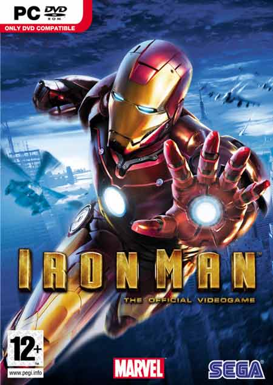
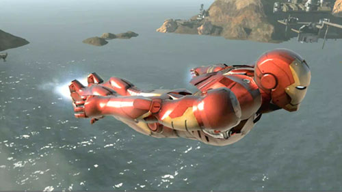
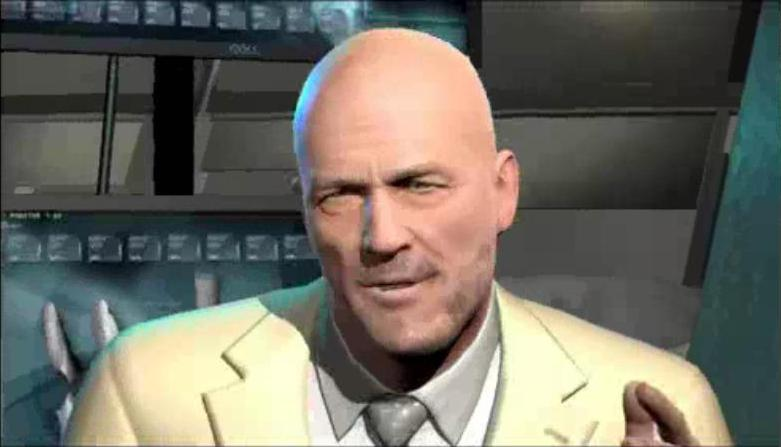
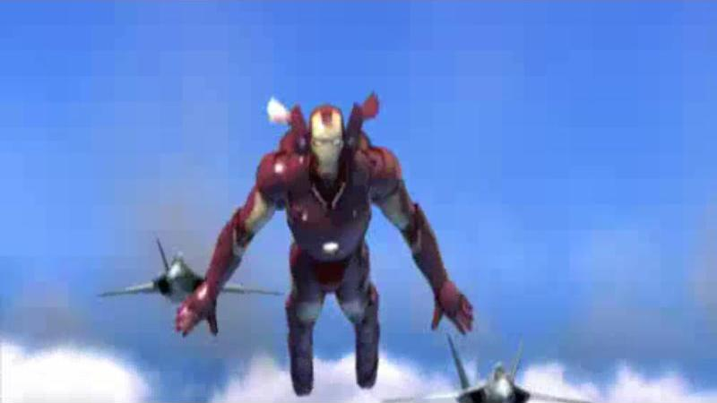
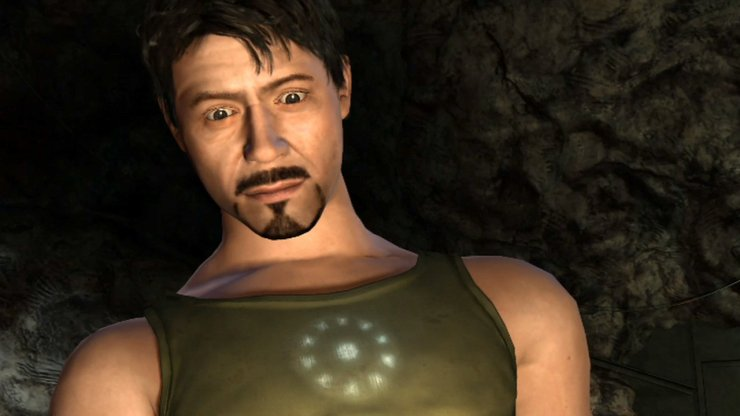
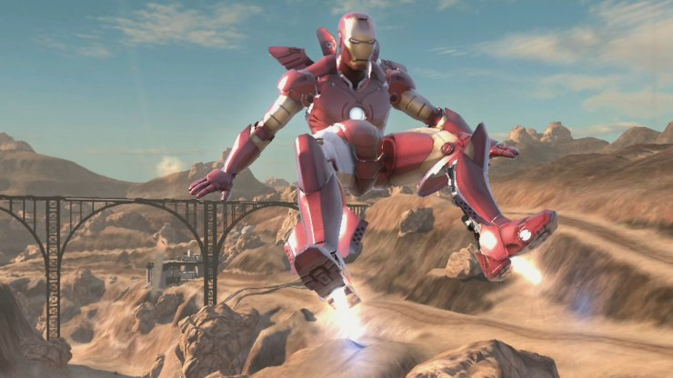

**Ficha Técnica:**  
Título: Iron Man  
Desarrollador: Secret Level  
Editor: SEGA  
Pegi: +12  
Precio: 26.95 €  
Página web: http://web.sega-europe.com/ironman/es

Iron Man es el juego de la película que acaba de llegar a los cines. Se publica simultáneamente para todas las plataformas del mercado y como es habitual, asesina una licencia que a priori podría dar bastante de sí. Es el ejemplo perfecto de una conversión mediocre.

Bueno, veamos: comienzas con un mini-tutorial en el que aprendes a moverte y utilizar tus armas y tu combate cuerpo a cuerpo mientras escapas de las cuevas en las que estás secuestrado. Viendo todo lo que has creado con tus armas, decides poner fin a la familia STARK de armamento, cargándote todo cuanto lleve tu logotipo haciendo uso de tu traje. Las principales escenas de la película están presentes en el videojuego, pero además se han incluído otras propias del cómic de Marvel y por ahora inéditas en el cine. Lo bueno de esto es que el juego dura un poco más que un telediario, porque es extremadamente sencillo y el contenido extra con respecto a la película palía un poco este mal. Lo que no está tan bien resuelto es el hilo conductor. El juego sufre innecesarios flashbacks y además está plagado de frases falsamente solemnes que no aportan nada, e incluso para alguien que no esté familiarizado con el mundo de Iron Man pueden resultar incoherentes algunas cosas (¿por qué estamos en una cueva?).

Entre otros defectos, el más gordo de Iron Man es la ausencia de sensaciones para el jugador. Resulta tan plano que simplemente vas superando misiones una tras otra sin demasiada esperanza de mejora. Lo único destacable pueden ser los primeros compases del vuelo, porque ahí sí que el hombre de acero muestra su potencial. El convincente movimiento en el aire goza además de una animación sorprendente y un efecto de velocidad bastante conseguido (además, los efectos bloom vuelven borrosa tu vista periférica y eso multiplica la inmersión).

Sin embargo, a Iron Man le pesa demasiado el hecho de estar desarrollado con poco presupuesto y ser claramente un producto de márketing sin ningún interés o aspiración en el mercado de videojuegos. Secret Level es una compañía a la que este tipo de desarrollos aún le vienen grandes y esa falta de consistencia es una lacra de la que tendrán que librarse si no quieren ir a pique en un futuro próximo. Última ráfaga de disparos antes de meter a Iron Man al hoyo: su nivel técnico es deplorable. Los gráficos pueden tener un aspecto más o menos normalito en un hardware solvente, pero no son para echar cohetes. Peor aún, en una máquina con un par de años la pinta del juego empobrece demasiado y no es nada configurable, así que tendrás que atender al criterio del programa para verlo según él crea mejor. El sistema de autodetección de hardware funciona bien, pero resta posibilidad de una mejora que el título pide a gritos. La música es realmente discreta y solo algunos efectos de sonido (como el del vuelo a alta velocidad) pueden resultar un poco interesantes sobre el resto del audio.

En definitiva, mal resultado que confirma nuestro temor a los títulos multiplataforma, las franquicias veraniegas y los juegos procedentes del dinero de las películas. Completamente irrecomendable.

**NOTA: 3**

**Lo mejor de Iron Man:**  
Algunas sensaciones  
Caracterización de personajes  
Más contenidos y armaduras que en la película

**Lo peor de Iron Man:**  
Insulso y plano  
Imposibilidad de configuración gráfica  
Simple y sin alicientes para continuar

**Requisitos mínimos:**  
Pentium 4 a 2.8 GHz  
1 GB de RAM  
Tarjeta de video 256 MB compatible con DirectX 9.0c  
Windows 2000/XP/Vista  
3 GB de disco duro

**Requisitos recomendados:**  
Procesador a 3.4 GHz  
1.5 GB de RAM  
Tarjeta de video Radeon X1800/GeForce 7800 GT  
Windows 2000/XP/Vista  
3 GB de disco duro