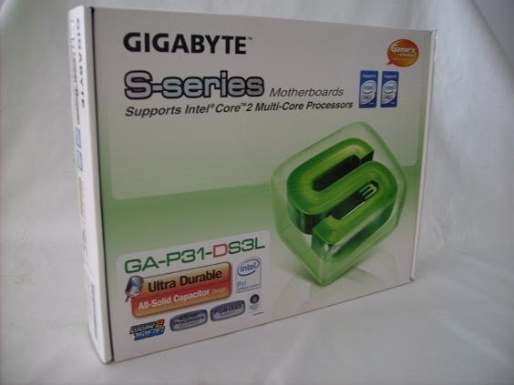
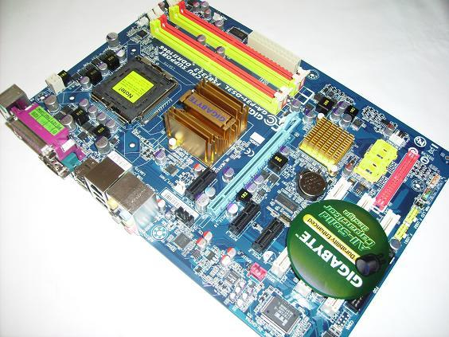
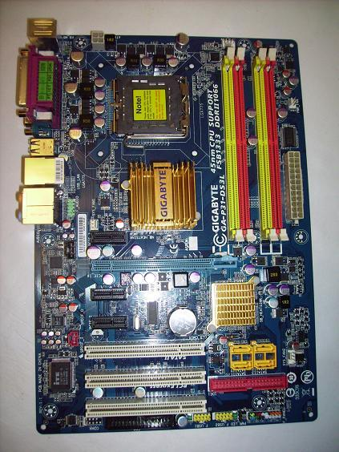

**Ficha Técnica:**  
Nombre: GA-P31-DS3L  
Fabricante: Gigabyte  
Precio: 62 €  
Página web: http://www.gigabyte.co.tw

No todas las placas base decentes han de costar un riñón. Esto, que puede parecer un grito popular, es sin embargo la filosofía de fabricación de la Gigabyte GA-P31-DS3L, así que esta es una de esas pocas ocasiones en las que fabricantes y usuarios parecen encontrar el punto medio de felicidad entre ambos. La placa está basada en el chipset P31 de Intel, así que admite casi cualquier procesador con encapsulado LGA 775, incluyendo los ultimísimos Quad-Core o las brutales versiones "Extreme". No obstante, Intel argumenta que el chipset P31 no puede gestionar FSBs superiores a 1066 MHz para potenciar las ventas del P35, X38, etc. Pero tranquilo, amigo mío, porque sabemos de buena tinta que el P31 puede superar la gloriosa barrera de los 1333 MHz sin demasiadas dificultades. Tampoco es que la ventaja sea abismal. Si estás lo suficientemente loco como para comprar un Core 2 Quad de varios cientos de euros y con un FSB a la velocidad de un fórmula 1, seguramente tengas la sensatez necesaria como para montarlo sobre una placa de gama alta con el último chipset fabricado por Intel.

Este northbridge da soporte de procesadores Intel incluyendo a los nuevos de 45nm, monta cuatro bancos DDR2 hasta 1066 MHz capaces de gestionar hasta 4 GB de memoria (y Dual-Channel de regalo). Solo incorpora un único puerto PCI-E de 16 railes versión 1.1, lo que podría limitar su expansión en un futuro hacia plataformas gráficas ávidas de ancho de banda, por no hablar de la imposibilidad de conectar dos tarjetas gráficas para trabajar en paralelo; pero se antoja más que suficiente por ahora y evidentemente, en este rango de precios una solución SLI o Crossfire no es factible. También hay 3 puertos PCI-E 1x y tres PCI. Si montas una gráfica que ocupe dos slots o que sea de grandes dimensiones, ten en cuenta que inhabilitarás uno de los PCI-E 1x (que tampoco es una tragedia) y que el extremo de la gráfica estará muy cerca del disipador del southbridge así que si no dispones de una refrigeración a la altura, puede darte algún quebradero de cabeza.

La Gigabyte GA-P31-DS3L viene perfectamente equipada para montar cualquier PC realmente completo. Un chip Realtek ALC888 típico proporciona audio de alta definición (el famoso Intel HD Audio) hasta 7.1 y con conexión SPDIF interna. Un puerto IDE de 80 contactos proporciona la conectividad con discos duros y unidades ópticas bajo esta interfaz, dispone de conexión de red Gigabit LAN, 8 puertos USB y 4 puertos SATA II, más que suficiente para ir tirando. Todo esto lo proporciona el Southbridge ICH7 de Intel, que aunque ya ha sido puesto al día en la version ICH9, sigue siendo muy válido a la hora de gestionar las entradas y salidas del ordenador. Además, un minúsculo chip iTE IT8718 permite enchufar una vetusta (pero eternamente cool y futurista) disquetera.

Ahondemos un poco más en los aciertos de esta placa. La BIOS Award proporciona una cantidad de controles asombrosa y todos resultan verdaderamente útiles. Aunque la mayoría son viejos conocidos, vale la pena visitar la sección "MB Intelligent Tweaker" que es el paraíso de cualquier overclocker. Puedes ajustar desde el multiplicador de la CPU a tu libre albedrío (si el micro está desbloqueado) o mover los valores del FSB desde 200 MHz hasta... ¡¡¡700!!! ¡¡¡DIOS, QUE LOCOS ESTÁN ESTOS DE GIGABYTE!!! Lo bueno de todo esto es que la placa llega estable hasta los muy respetables 375 MHz (y seguramente más si tocamos alguna configuración o ampliamos el sistema de refrigeración), con lo que puedes tener un micro supersónico con una RAM más rápida que su sombra. De nada valdría esto si no se pudiesen bloquear las frecuencias PCI, y por suerte la GA-P31-DS3L permite hacerlo. Hasta dispone de un modo dinámico de overclocking inteligente, que puede llevar la CPU un 20% más rápido sin tener que preocuparnos. Eso sí, la opción de marras (con el sugerente nombre de CIA2) no es recomendable si el overclock se hace de forma manual. La memoria también puede ser facilmente configurada, atendiendo a relación con el multiplicador, frecuencia, presets de latencias, voltajes, sobrevoltajes,... con los voltajes andaos con ojo porque permite variar los de la RAM, los bancos de memoria, la ranura PCI-E 16x, el FBS, Northbridge y el Vcore. Casi nada. Un punto negativo es que los reguladores de voltaje de la placa (los VRM) no disponen de ningún tipo de ventilación, y aunque la placa presuma de usar condensadores sólidos de alta durabilidad, lo cierto es que no es aconsejable hacer pasar un voltaje elevado durante largos períodos de tiempo. Si eres de los que deja el PC con overvolting encendido las 24h, plantéate refrigerar estos componentes o comprar una placa que incorpore algún tipo de disipación.

Para terminar, mencionar que a pesar de las limitaciones impuestas para la instalacion de subsistemas gráficos avanzados, o de la ausencia de conexión firewire; la placa incluye cables IDE y un cable SATA, así como el reglamentario CD y un completo manual (en inglés). Su gran rendimiento y un potencial excelente para overclocking la hacen muy atractiva siempre y cuando puedas prescindir de virguerías como SLI/Crossfire o no tengas un Quad-Core pidiendo a gritos datos para ser procesados. Cabe mencionar que las hermanas mayores de este mismo modelo (sin la L al final del nombre, la versión Platinum y otras como la que incluye gráficos integrados) son exactamente iguales pero con pequeñas variaciones en cuanto a conexiones (algunas incluyen firewire) o tipos de memoria soportados (hasta DDR2-1066 según Intel, más según Gigabyte). Por menos de 100 €, la Gigabyte GA-P31-DS3L es una de las mejores placas del momento.

**NOTA: 8**

**Lo mejor de Gigabyte GA-P31-DS3L:**  
Gran potencial para overclocking  
Precio ajustado  
Rendimiento excelente, gran cantidad de conexiones.

**Lo peor de Gigabyte GA-P31-DS3L:**  
Intel no garantiza que el P31 pueda con los venideros FSBs  
Solo una ranura PCI-E 16x 1.1 y VRMs sin disipación de calor  
Manual en inglés