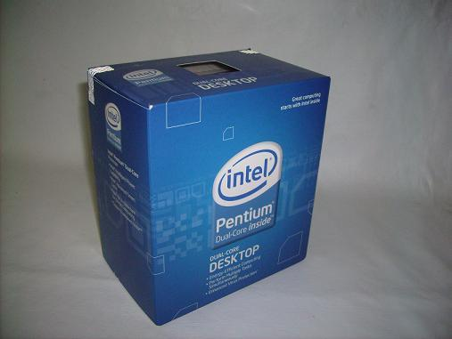
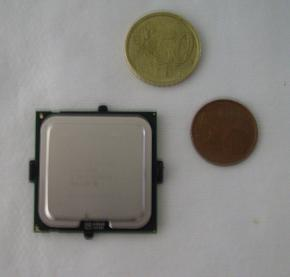
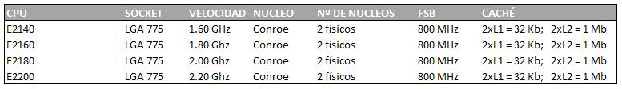
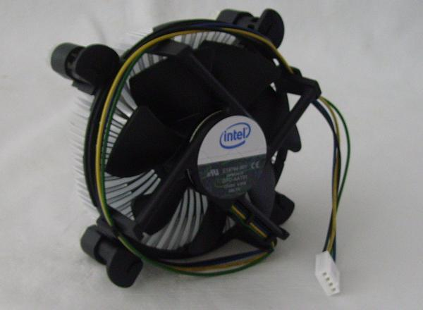

**Ficha Técnica:**  
Nombre: Intel Pentium Dual-Core  
Fabricante: Intel  
Precio: A partir de 50 €  
Página web: http://www.intel.es

Hace ya mucho tiempo que Intel lanzara los primeros Pentium, allá por la época del 486 y otros procesadores similares. Con ellos se pretendía empezar una nueva etapa en la era informática y en parte así fue, porque con ellos arrancó la dura guerra de los Megahertzios con AMD en el papel de principal contrincante. Intel basaba su negocio en una impecable imagen de marca y unos rendimientos que crecían a pasos agigantados con cada nueva generación Pentium, hasta que hace apenas 2 años dijo basta. Dos veces batida por su rival (la primera con el K6 y la segunda con los K7 y K8), Intel decidió poner fin a un nombre más famoso incluso que ellos. Además, mientras los Athlon 64 copaban el mercado, Intel se tomó su tiempo (no sin pérdidas económicas y de posición dominante en casi todos los sectores) para desarrollar la plataforma Core y, pocos meses despues, la Core 2.

Cuando hubo conseguido sus objetivos, el reto de volver a crear una marca tan mítica como Pentium era una ardua tarea, pero el rendimiento puso a los Core 2 en donde se merecían: lo más alto; y a su vez concluían la guerra de Megahertzios para comenzar la guerra de los núcleos. Con AMD perdiendo terreno escandalosamente, Intel decidió que no iba a tirar por la borda la familia Pentium (entonces muerta) y llamó así a sus procesadores de gama baja (resucitando su buque insignia de los 90). ¿Que hay entonces en los nuevos Pentium? ¿Podemos fiarnos de ellos?

Básicamente, Intel ha reconvertido los Core 2 Duo (Core 2 con doble núcleo) que no daban la talla tras el proceso de fabricación, y en lugar de tirarlos a la basura les recorta el precio y las prestaciones y los pone en la calle. De modo que las diferencias entre la arquitectura de un Pentium Dual-Core y un Core 2 Duo son nulas. ¡Ojo! No confundir estos Pentium Dual-Core (basados en Core 2) con los vetustos Pentium D (de la arquitectura NetBurst de los Pentium 4 y tambien duales, pero muchísimo menos eficientes a cualquier nivel). Estos nuevos Pentium se basan en núcleos Conroe (como la mayoría de la serie Core 2 Duo o los inferiores Celeron 4x0), de modo que necesitarás una placa con Socket 775, que aunque es un tipo de zócalo muy viejo, tiene aún un largo recorrido por delante si los planes de Intel no se tuercen. De este modo casi cualquier placa Intel con tres años o menos (especialmente las lanzadas tras Core 2) será compatible, o como mucho requerirá una simple puesta al día de la BIOS.

La diferencia con sus hermanas mayores estriba en que la serie Pentium Dual Core solo goza de 1 MB de memoria caché L2 a diferencia de los 2 o 4 MB que se pueden ver en los Core 2 Duo o de los 6 que se pueden ver ya en los procesadores más recientes. Esto puede desalentarnos un poco a la hora de comprar un Pentium Dual Core, porque por ejemplo en un juego puede llegar a resentirse el rendimiento hasta un 25% aproximadamente, pero se compensa con creces cuando comprobamos que el resto de aplicaciones de escritorio funcionan igual de rápido. Teniendo en cuenta que el precio de estos Pentium es aproximadamente un tercio del de aquellos, se erigen como una opción muy respetable si vamos a destinarlos a máquinas sin muchas pretensiones o a equipos que no se vayan a dedicar a tareas realmente pesadas. Otro dato a tener en cuenta es que los núcleos Core 2 son mucho más eficientes energéticamente, lo que quiere decir que necesitan menos potencia para funcionar y que también generan menos calor. Todo por gentileza de los procesos de fabricación de 65nm propios de los Conroe. Además, todos los Pentium Dual Core de la serie E2x00 disponen de un FSB de 800 MHz ideal para funcionar con memorias DDR2-800 en modo síncrono. Están empezando a verse procesadores con FBS's el doble de rápidos, pero su astronómico precio (por no hablar del precio de una memoria tan rápida) deja a estos Pentium en una posición relativamente cómoda en cuanto a rendimiento si los comparamos con la competencia cercana. La familia de estos nuevos Pentium cuenta por ahora con cuatro integrantes (a la espera de que sean ampliados) cuyos datos puedes ver en la siguiente tabla:

Lo cierto es que tras estas modestas cifras, el Pentium todavía se reserva un as en la manga. Tal y como sale de la fábrica, el Pentium rinde bastante bien: Windows Vista se mueve con soltura y si acaso solo echaremos en falta más potencia cuando tengamos varias aplicaciones simultáneamente realizando algunas tareas costosas. No está mal para el precio que ha costado, pero sin duda que este PC puede con algo más. Pudimos llevar el E2140 de forma estable hasta los 3 GHz simplemente subiendo el FSB a unos felices 375 MHz (1,5 GHz efectivos). Eso sí, el HSF proporcionado por Intel giraba a toda pastilla haciendo un ruido infernal propio de un Boeing a punto de despegar, así que sería recomendable meter una refrigeración más eficiente o, si pensáis hacer un overclocking agresivo, llevar a la práctica la instalación de refrigeración líquida. Por último, cabe destacar que hay dos versiones de stepping de los E2x00. Por una parte tenemos la L2 y por otra la M0. Basicamente la M0 tiene una mayor tolerancia térmica, lo que significa que tal vez se puedan arañar todavía más megahertzios sin que el procesador tenga que disipar tanta energía térmica; así que posiblemente los más potenciables sean los E2200 con este stepping.

Para terminar, quise echar un vistazo a la competencia del Pentium Dual Core tanto dentro como fuera de la propia Intel. Sus hermanos mayores, Core 2 Duo o Core 2 Quad, son bestias imparables en comparación con estos modestos procesadores, por lo que la elección sería un procesador más caro si buscamos rendimiento. Pero en la faceta económica, los alrededor de 30 € de un Celeron 4x0 no merecen en absoluto la pena, pues son mononúcleo e incorporan la mitad de caché L2, que como vimos afecta muy negativamente al rendimiento del ordenador en general. Como opción por menos de 100 €, los Pentium Dual Core son muy serios aspirantes al trono. AMD sigue por ahora centrada en recuperar terreno perdido en estos dos últimos años, así que está prestando toda su atención a los nuevos procesadores Phenom con cuatro núcleos e inmensas cachés L2, pero sigue manteniendo a los ya mayorcitos Athlon 64 y Athlon 64 X2 (doble núcleo) en el rango de precios más bajo. Sin embargo, los AMD generan una cantidad considerable de calor, y son procesadores mucho más ávidos de energía que los basados en Core 2. Quizás el Athlon 64 X2 5000+ Black Edition sea el mejor representante de esta familia, pues por apenas 100 € ofrece un rendimiento en juegos ligeramente superior al de los Pentium, pero ni de lejos resulta una diferencia abrumadora.

En conclusión, Pentium resurge de sus cenizas, pero maltrecho por su pérdida de orgullo deberá ganarse al sector económico pues es el único en el que el gigante Intel todavía no dominaba con claridad. Si estás pensando en montar un PC, no te importa hacer overclocking y puedes acompañarlo de un hardware solvente, su rendimiento será mucho más de lo que imaginas por un precio realmente asequible. Favorito: el E2200.

**NOTA: 6.75**

**Lo mejor de Intel Pentium E2x00 Dual Core:**  
Gran potencial para overclocking  
Precio ajustado  
Rendimiento satisfactorio y eficiencia energética

**Lo peor de Intel Pentium E2x00 Dual Core:**  
El FSB va camino de quedarse corto a medio plazo  
Multitarea y juego limitados por escasa L2  
Frecuencias de serie muy bajas y pocos modelos disponibles