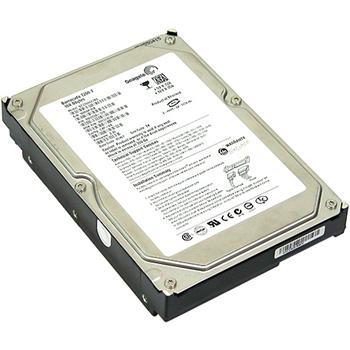
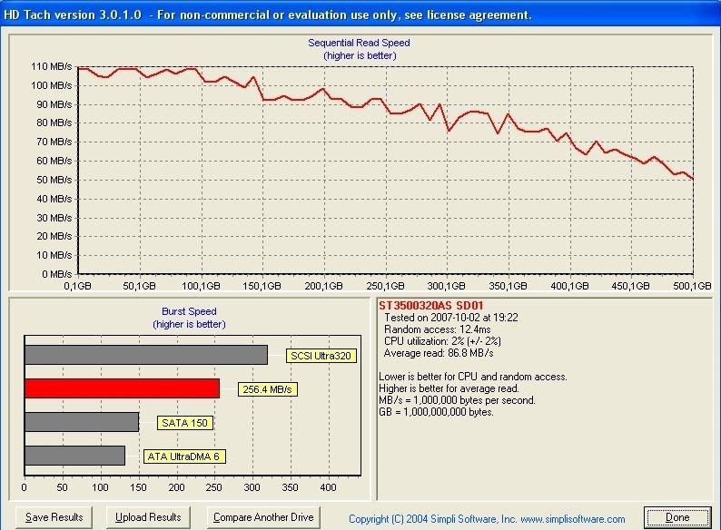
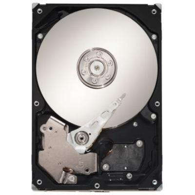

**Ficha Técnica:**  
Nombre: Barracuda 7200.11  
Fabricante: Seagate  
Precio: 62 €  
Página web: http://www.seagate.com/www/es-es/products/desktops/barracuda_hard_drives/barracuda_7200.11/

La decimoprimera generación de Barracuda se presentó hace apenas unas semanas y lo cierto es que había generado una moderada expectación. Existen varias versiones de este disco duro, atendiendo a su capacidad, pero basicamente todas cumplen unas especificaciones similares. Esta gama abarca desde los cómodos 320 GB o los holgados 500 GB del modelo que analizamos hasta los cada vez más habituales modelos con 1 TB (1024 GB), relegando a la generación 7200.10 a los discos de menor tamaño. Lo importante en un disco duro, además de su capacidad, es que sea lo más rápido posible leyendo y escribiendo datos. Una memoria RAM podrá funcionar a cientos de Megahertzios, pero los discos duros se toman su tiempo. Los factores más influyentes en unas buenas velocidades se pueden resumir en prácticamente tres: la densidad de los platos, su velocidad de rotación y el tamaño de la memoria caché. Bajo una interfaz S-ATA II, el Barracuda alberga dos platos de 250 GB cada uno, lo que es casi la densidad de datos más alta que podemos encontrar hoy en día, que giran a las habituales 7200 rpm. Cuenta con 4 cabezales de lectura (uno por cara) y 32 MB de memoria caché. En teoría cuenta con madera de ganador para ser uno de los discos más rápidos disponibles actualmente para un ordenador casero; prueba de ello son los 87,1 MB/s en lectura y 78 MB/s en escritura que puede manejar y su excelente tiempo de acceso a datos de 12,5 milisegundos, según el programa HD Tach. Inexplicablemente pese a estas excelentes especificaciones, el rendimiento no resulta tan sobresaliente. Las prestaciones del disco se quedan en la parte del ránking conocida como "Bueno pero normalito", ya que discos con densidades menores pueden arrojar resultados similares o hasta mejores, sobretodo en aplicaciones que requieren un buen acceso aleatorio a datos, como puede ser la edición de muchas imágenes de forma simultánea o la carga de un nivel en un juego. Además el disco se deja oir: solo es un siseo, pero si odias el ruido deberías dirigir tu mirada hacia discos más silenciosos como los Samsung Spinpoint.

Por ejemplo, el Raptor X es sensiblemente más eficiente en el tiempo de acceso medio. No es que sea un rival muy honrado para el Barracuda porque sus platos giran a unas endemoniadas 10.000 rpm (de hecho es el único disco que lo hace), pero tampoco goza de la densidad por plato del Seagate. La diferencia es de 8,2 frente a 12,5 ms. El tiempo promedio de búsqueda también es espeluznante: 4,03 frente a 8,3 ms y el tiempo de carga de un nivel en Crysis también fué 2 segundos menor en el Raptor X. No obstante, si tenemos en cuenta que el Raptor X de Western Digital solamente almacena 150 GB y que el resto de discos del mercado ofrecen prácticamente el mismo rendimiento que el Seagate Barracuda, las cosas cambian. La época del Raptor ha pasado, y si buscas un disco rápido en el que también almacenar tus colecciones de música, fotos y vídeo, los 500 GB de la serie 7200.11 te resultarán más agradables. Frente al resto de la competencia, es un buen disco, pero tampoco el mejor.

**NOTA: 8**

**Lo mejor de Seagate Barracuda 7200.11 500 GB:**  
Densidad por plato muy alta  
Lectura y escritura rápidas  
Interfaz S-ATA II

**Lo peor de Seagate Barracuda 7200.11 500 GB:**  
Tiempo de acceso medio  
Promedio de búsqueda  
Emite pequeños ruidos, como las anteriores versiones

**NOTA IMPORTANTE:** Dado que los modelos ST3500320AS entre otros están sufriendo "muertes súbitas", se recomienda actualizar los firmwares. Comprueba tu modelo concreto y tu revisión con la herramienta [DriveDetect](http://support.seagate.com/kbimg/utils/drivedetect.exe). Si la revision es la SD15, actualiza tu firmware a la SD1A con [esta herramienta](http://www.seagate.com/staticfiles/support/downloads/firmware/ms-sd1a.exe). Tienes mucha mas informacion en las siguientes URLs:  
- http://www.msfn.org/board/index.php?showtopic=128906  
- http://foro.noticias3d.com/vbulletin/showthread.php?t=274425