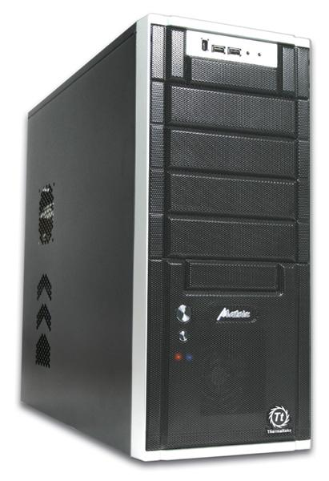
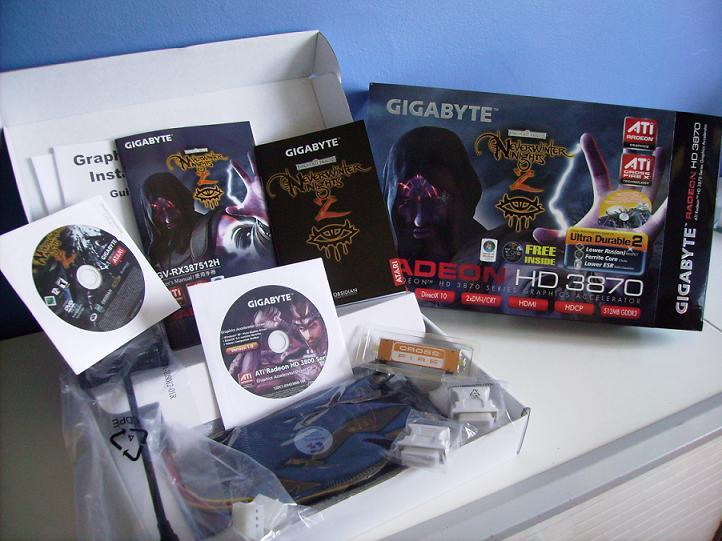
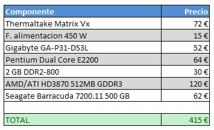
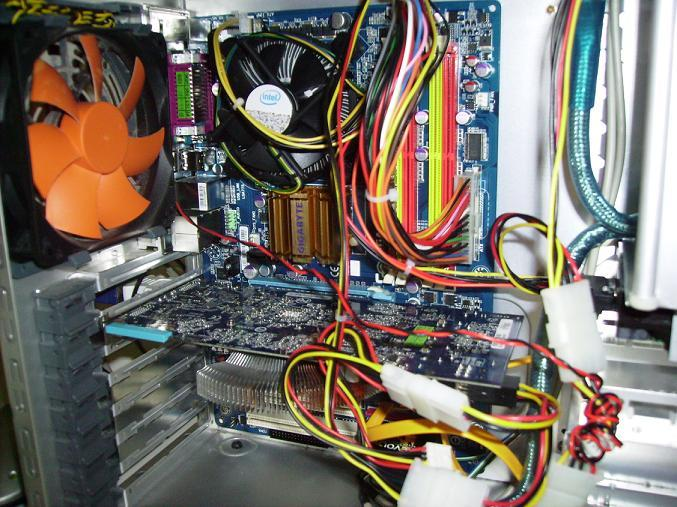
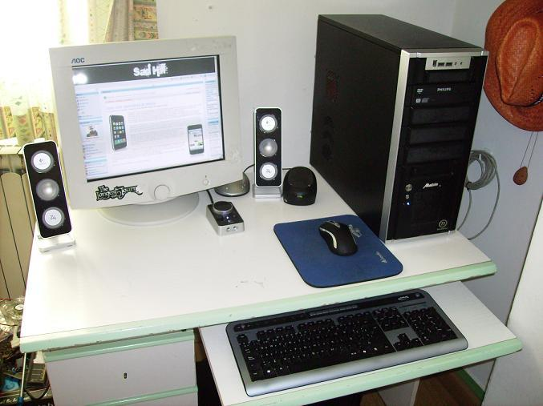

Plan renove: llega Crysis y no podemos dejarlo escapar. Hay que jugarlo y además hay que hacerlo bien, pequeño Mike. Te enseñamos como jugar más pagando menos.

Empecemos por pensar en la caja que albergue nuestro flamante PC durante los próximos años. En cualquier tienda de informática te pueden vender cajas que incluso traen una fuente de alimentacion, ambas de dudosa calidad y procedencia. Pero a nosotros nos interesa más que el ahorro incondicional, el ahorro inteligente. La [Matrix Vx](../../../2006/03/thermaltake-matrix-vx) sigue tragándose a toda la competencia a través de su frontal poroso que refrigera cualquier PC de una excelente manera. Desde 72 euros la encontraremos nueva en tiendas. Entre otras ventajas además de la refrigeración tiene un par de puertos USB y uno firewire en el exterior, así como suficiente espacio para albergar varias unidades de 5¼ y 3½. Añadiremos una fuente genérica que nos proporcione unos buenos 450 W que también se pueden conseguir muy fácilmente por 15€ más.

Hoy por hoy, lo más sensato sería comprar un procesador de 4 núcleos fabricado por Intel y una placa solvente. No obstante, la mayoría del software corre ligero con la mitad de núcleos y por ahí podemos atacar. Decidido que será Intel, miraremos una placa capaz. La [GA-P31-DS3L de Gigabyte](../../../2008/06/gigabyte-ga-p31-ds3l) sigue imbatible en su estatus de mejor placa por menos de 80 euros y desde luego no le falta de nada. Es cierto que no podremos instalar un sistema SLI, pero ¿quien pensaba hacerlo en un equipo económico?. Entre otras lindezas nos brinda un potencial para overclocking que quita el hipo, y aunque no es recomendable forzarla ni cambiarle los voltajes (los VRM no tienen ningún tipo de refrigeración) puede empujarnos en nuestras pruebas de velocidad. Por 52 euros es nuestra. El micro puede resultar todavía más barato. Cierto es que el Pentium Dual-Core que Intel fabrica ahora para la gama baja es un 25 % más lento que un Core2Duo equivalente pues solo tiene 1 MB de caché L2, pero su precio es también un tercio del otro. El [E2200 a 2,0 Ghz](../../../2008/06/intel-pentium-e2x00-dual-core/) tiene una pinta estupenda por tan solo 64 de nuestros euros. ¡Alto! Estando en un buen momento para comprar RAM podemos echar mano de varios gigas, pero tan solo necesitamos 2 GB DDR2 a 800 MHz de Trascend por 30 €. Sus latencias no son nada del otro mundo (5-5-5-18) pero al menos soportan funcionar con más voltaje de lo habitual en DDR2, lo que nos dará un pequeño margen de overclocking.

Mover Crysis en calidad Muy Alta y renderizado DirectX10 es casi imposible en nuestro presupuesto, pero no renunciamos a jugarlo en calidad Alta bajo DirectX 9. Y ahora que ha salido la serie HD4xxx de AMD/ATI, la generación anterior está muy bien de precio. Una HD3870 de 512 MB GDDR3 para puerto PCI-E puede salirnos por tan solo 120 €, y además es Gigabyte por lo tanto los condensadores sólidos incorporados nos beneficiarán si queremos subirla un poco por encima de sus posibilidades.

Es necesario comentar que la 3870 se puede encontrar tambien con GDDR4 pero el beneficio no es tan grande como para desechar el modelo de GDDR3, y la diferencia solo se hace notar un poco en los test sintéticos. Para jugar parece más sensato seguir apostando por la versión con GDDR3 que ahora está bastante barata. Efectivamente, compañero, un buen disco duro es necesario para guardar todos nuestros datos e instalar Crysis sin que la información salga despedida de los platos por falta de espacio en disco. Por 60 € conseguimos un [Seagate Barracuda 7200.11 de 500 GB](../../../2008/06/seagate-barracuda-720011) que incorpora unas buenas tasas de lectura/escritura y 32 MB de caché. No es el más rápido ni el más económico, pero es de los últimos que pudimos encontrar sin estar sujeto al nuevo canon digital. Ya tenemos todos los componentes esenciales para nuestro nuevo PC. Podemos ahora añadir al carrito una unidad óptica como por ejemplo una regrabadora de DVD que ronde los 30 €.

Todavía podríamos hacernos con un buen conjunto de altavoces que mejore nuestra experiencia, o una TFT de generosas dimensiones. Sin embargo, todos estos accesorios no afectarán al rendimiento así que los dejaremos a un lado para que cada uno escoja los que crea más adecuados o para que aproveche los que tenga, lo mismo que el sistema operativo.

Montamos el PC e instalamos una copia de Windows XP SP3 con los driver del CD que venia con la placa base. Para la tarjeta gráfica utilizamos los Catalyst 8.6 del 18 de Junio de 2008. Lo primero es lo primero, así que ejecutamos el 3D-Mark 06 con el hotfix de Febrero de 2008 que incluye pruebas de carga para la gráfica y el procesador. Arrojó unos saludables pero no fascinantes 8893 puntos. No contentos con ello, utilizamos los driver de la tarjeta gráfica para subir las frecuencias de esta. El núcleo lo subimos de 825 Mhz a 900 Mhz y la memoria pudimos impulsarla desde los 900 Mhz hasta los 1125, lo que no está nada mal. 3D-Mark devolvió unos mucho más interesantes 9069 puntos. La mejora es marginal, pero dio pié a pensar en llegar a la barrera de los 10.000 impulsando la CPU. Aquí vino lo mejor de todo. El Pentium E2200 llegó a funcionar a 3,30 GHz simplemente impulsando el FSB hasta los 300 Mhz, pero no parecía estable del todo en las pruebas, así que bajamos el multiplicador de 11x a 10x, con lo que acabó corriendo a 3,00 GHz aplicando un voltaje de 1,5 al Vcore en lugar de los 1,325 V de fábrica. La memoria RAM aguantó el tipo con 900 MHz (100 más de lo especificado) con tan solo 0.1 V más.

Conseguimos que funcionase estable a esa velocidad, y la prueba de 3D-Mark se disparó hasta 10556 puntos con la gráfica en sus velocidades de reloj de fábrica, que se convertirían en unos espectaculares 11156 puntos al volver a hacer overclocking de la gráfica. Esto situa a nuestro PC a medio camino entre el rendimiento de un Quad Core Extreme QX6850 con una 9600 GT y un brutal QX9450 con una 8800 GT. Sin duda todo un éxito pocas veces visto, pues nuestro PC es significativamente más barato que cualquiera de esas máquinas. A estas velocidades Crysis es jugable a 1024x768 2xAA y todos los ajustes en Alto, y a 1280x1024 píxeles con todo en Alto, pero sin filtrado. Obviamente es más de lo que pedíamos para un PC que cuesta menos que una 9800 GTX.

¿Y si nuestro presupuesto no fuese tan ajustado? Bueno, básicamente parece que es el procesador el que más afectó al rendimiento, de modo que sería muy sensato hacerse con uno que tuviese más caché L2 y funcionase a más MHz, como por ejemplo un Quad Core o un Core 2 Duo de gama alta. No obstante son bastante caros en comparación con la ganancia de rendimiento, a no ser que te asuste el overclocking de tu PC. También podríamos aprovechar el excelente momento de la RAM para conseguir 4 GB en lugar de 2, lo que solo costaría 30 euros más y sin embargo aligeraría mucho más el rendimiento en un sistema operativo ávido de memoria como Windows Vista. O en vez de adquirir una HD 3870 podríamos echar un ojo a la nueva generación de AMD/ATI (la 4xxx) que parece que está dando muy buenos resultados en sus primeros días, o a una 9600 GT si preferimos Nvidia. Y si no, pues no pasa nada. En cualquier caso, nuestro bolsillo y nuestro ocio nos agradecerán haber probado a montar un PC por nosotros mismos con unos componentes bien escogidos.

