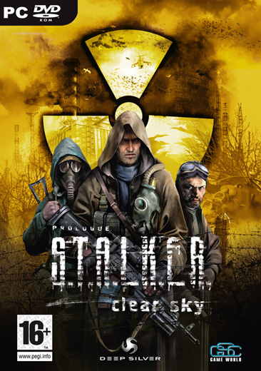

**Ficha Técnica:**  
Título: S.T.A.L.K.E.R. Clear Sky  
Desarrollador: Deep Silver  
Editor: GSC Game World  
Pegi: +16  
Precio: 36.95 €  
Página web: http://cs.stalker-game.com

El otoño permanente mecía la hojarasca y la arrastraba infinita e invariablemente por el suelo. El profundo vaivén solo se veía alterado por la presencia de las anomalías, que enmarañaban aquella masa vegetal heterogénea en un todo que giraba vertiginosamente; para acabar volviendo al suelo y continuar su viaje por las tierras de La Zona. Te acompañaban sin que lo quisieseis ni tú ni ellas, pero las hojas eran compañeras en el largo camino que habías de recorrer. Y caminata tras caminata, sucediese lo que sucediese entre medias, esta extraña pareja se reunía silenciosa. No importaban los disparos, la sangre derramada, la misión y los enemigos; arrastrándose lastimosamente por el piso seguiría siempre junto a tí.

Clear Sky es el prólogo a posteriori de uno de los mejores juegos de los últimos años. Más allá de su tecnología soberbia (quizás modesta competencia para [Crysis](../../../2007/12/crysis/)), su estilo de juego, conservado aquí tal cual, es el mejor exponente de su gran calidad. Conozcamos un poco de qué va. Para los que ya jugaron el original, Clear Sky es poco más que una expansión con alguna mejora, pues es exactamente lo mismo que [Shadow of Chernobyl](../../../2007/04/stalker-shadow-of-chernobyl/) en todas sus facetas. El calco es tal, que ni siquiera mirarás el mapeado de los controles ni necesitarás saber porqué tienes tornillos. El juego pone frente a tí una recreación virtual de los aledaños de la vieja central nuclear, y añade un ficticio segundo accidente para conferir a la historia un marco que permita incluir mutantes, bichos y mercenarios según mandan los cánones. En este segundo accidente se ha creado "La Zona", un perímetro que cerca al difunto reactor y en el cual tienen lugar sucesos paranormales, donde la vegetación y la fauna han sido alteradas por la radiación y donde los Stalkers se buscan la vida. Además, facciones que luchan por el control del territorio, bandidos y comerciantes.

La mecánica es la siguiente: Se te asigna una misión. Recorres kilómetros y kilómetros de vastos parajes de frondosos bosques hasta llegar a tu objetivo. Guardas la partida. Ahora entras en un bucle en el cual intentarás acabar con tus enemigos hasta que lo consigas, momento en el cual se te asignará un nuevo paseo y volverás al segundo paso de esta dinámica. Objetivo por objetivo patearás un mapa inmenso (inmensísimo) sin ayuda de vehículos ("d'ho!") y te relacionarás con las distintas guerrillas. El hilo conductor te ayudará a comprender porqué tú, mercenario, sobrevives a las emisiones de radiación de la zona que se cargan a todo lo que tenga dos o cuatro patas. También te sonarán nombres y localizaciones del original. Se ha tratado de dar una profundidad tal al universo de S.T.A.L.K.E.R. que esta repetición era obligatoria, pero en absoluto creas que es como en la anterior entrega. Las diferencias (sobretodo en lo relativo a los edificios que aún están en pié) son evidentes, y además todo parece gozar de un mejor y más trabajado aspecto.

Algo que me ha gustado mucho ha sido la recreación de la hierba y el entorno en general. Por fín, el White Forest de [Half-Life 2 Episode Two](../../../2007/10/half-life-2-episode-two-orange-box/) tiene rival en cuanto a belleza y naturalidad. Ahí está la hierba alta y baja, las hojas arrancadas, los árboles irregulares y diferentes entre sí... Parece que se acerca el fin de los juegos en los que el bosque era simplemente un pequeño cliché de texturas dispuestas para encerrar al jugador en el "camino a seguir". Obviamente este camino no existe en S.T.A.L.K.E.R.. Clear Sky hereda de Shadow of Chernobyl las flechas que te indican tus objetivos en el minimapa, pero cómo llegar o cómo acercarse a un punto determinado no está determinado con antelación: existe una ruta óptima y evidente, como es de esperar; pero el entorno abierto te permite tambien trazar recorridos más complejos, e incluso abordar misiones principales y secundarias de la forma que prefieras y alternando entre ambos tipos.

La vertiente acción está clara como el agua pero S.T.A.L.K.E.R. Clear Sky también ofrece grandes dosis de rol parlante y aventura en condiciones. Tendrás que entablar conversación con un montón de personajes, comerciar con unos cuantos y sobretodo gestionar tu inventario con detenimiento y precisión. Hablar con cualquier hombre con el que te encuentres también estará a tu alcance, siempre que él no dispare primero.

En el apartado técnico se ha notado una gran optimización (muy necesaria en [Shadow of Chernobyl](../../../2007/04/stalker-shadow-of-chernobyl)) y además se han añadido nuevas capacidades y efectos. El entorno se muestra mucho más vivo, el tratamiento de la luz se ha mejorado estratosféricamente y además las texturas lucen ahora muchísimo más detalladas. Quizás sea el sombreado el primer efecto más notable, pero en realidad casi cualquier variable relacionada con los gráficos ha recibido alguna puesta a punto. El menú para configurar todas estas opciones también nos permitirá ajustarlas para correr el juego en equipos menos potentes. Sonido y control también han recibido puntuales revisiones, pero se mantienen prácticamente en el mismo nivel. Destaca, eso sí, la calidad del doblaje al español; y eso es algo que no se ve todos los días. En definitiva, motivos mucho más que satisfactorios para volver a Chernobyl a pasear gustosamente. Imprescindible para los que jugasen al anterior, obligatorio para los que no; y poder jugarlo de forma independiente de aquel no es más que otro aliciente para los más vagos.

**NOTA: 8.5**

**Lo mejor de S.T.A.L.K.E.R. Clear Sky:**  
Una ambientación inimitable y enormemente inmersiva, con unos mapas increíblemente grandes  
La mezcla única y exquisita de acción, rol y aventura  
De nuevo, una tecnología potente

**Lo peor de S.T.A.L.K.E.R. Clear Sky:**  
Novedades discretas, dificultad moderada y las conocidas largas caminatas  
Sigue siendo exigente en cuanto al hardware  
Algún bug (parches disponibles) y pequeños detalles del control

**Requisitos mínimos:**  
Intel Pentium 4 2.0 Ghz / AMD XP 2200+  
512 MB RAM  
10 GB espacio libre en disco duro  
Tarjeta gráfica 128 MB DirectX 8.0 compatible (P. Ej. nVIDIA GeForce 5700 / ATI Radeon 9600)

**Requisitos recomendados:**  
Intel Core 2 Duo E6400 / AMD 64 X2 4200+  
1.5 GB RAM  
10 GB espacio libre en disco duro  
Tarjeta gráfica 256 MB DirectX 9.0c compatible (P. Ej. nVIDIA GeForce 8800 GT / ATI Radeon HD 2900 XT)