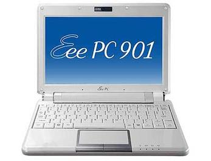
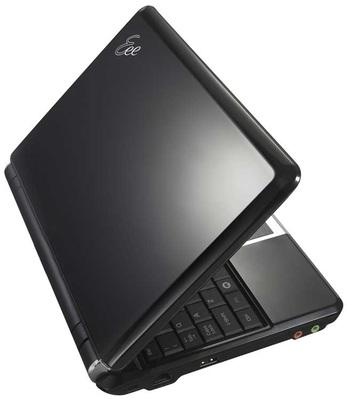

**Ficha Técnica:**  
Nombre: Eee PC 901  
Fabricante: Asus  
Precio: 380 €  
Página web: http://eeepc.asus.com/

Hace cosa de un año y poco Asus sacaba al mercado el Eee PC, un portatil ultraligero de apenas 7 pulgadas y bajo coste. El invento venía con un sistema operativo propio basado en Linux, concretamente en una distribución Debian, con una interfaz propia pero toda la versatilidad de una distro típica. Con la llegada de nuevos Eee PC, nos referiremos al primero con el número 701. Ahora salen al mercado los nuevos Eee PC. Las novedades son: - Nuevo procesador Intel Atom 1,6 Ghz (45nm, 512 Kb L2) - Mayor memoria DDR-2, aumentada a 1GB - Nueva pantalla de 8 pulgadas - Almacenamiento de 12 gigabytes (Windows) o 20 gigabytes (Linux) frente a los 4 GB del Eee PC original - Wi-fi con el nuevo protocolo 802.11n

Estas son las especificaciones básicas de un Eee PC 901, como el que probamos a continuación, y son muy similares a los nuevos Eee PC 900 y 1000. En la caja encontraremos además un pequeño set de accesorios realmente imprescindibles y muy socorridos: una funda de transporte, una gamuza para limpiar la pantalla y la carcasa, los discos de recuperación, unos estupendos manuales y, como es lógico, el cargador para la batería.

Con estas especificaciones, el Eee PC tal vez no valga para jugar a [Crysis](../../../2007/12/crysis/), pero en cambio mueve con soltura el sistema operativo Xandros (su propio SO de fábrica). Este entorno propio de los Eee PC se basa en pestañas (Internet, Oficina, Jugar, etc.) que abren las ventanas de los programas; por lo que hasta cierto punto recuerda al manejo de una PDA o un smartphone. Está basado en Debian y el sistema gráfico lo sustentan las librerías KDE. No obstante, la potencia de este gestor de ventanas está completamente desaparecida, y hacer algo tan sencillo como abrir un terminal o un editor de texto plano (como por ejemplo Kate) es una tarea casi imposible. Te ves obligado una y otra vez a abrir el pesado OpenOffice aunque solo vayas a leer dos lineas. Por suerte, Xandros lo hace todo muy rápido, desde el arranque del sistema hasta cargar programas bastante gruesos como el ya mencionado OpenOffice o Gimp.

El manejo con teclado y touchpad es aceptable, aunque su tamaño hace que sea incómodo trabajar mucho rato o navegar por grandes áreas como imágenes o textos muy largos. Pese a todo, tienen una respuesta bastante sensible y natural y las teclas de función son muy útiles (una de ellas, por ejemplo, abre el monitor del sistema). Cuando las utilicemos para cambiar el brillo de la pantalla, la conectividad inalámbrica o el volumen del audio, un menú OSD nos facilitará ajustar estos parámetros con bastante precisión y claridad.

Xandros viene con muchas aplicaciones interesantes sobretodo para disfrutar de internet. Firefox a la cabeza, dispone tambien de cliente de correo, mensajería, VoIP con Skype, ... pero sin embargo queríamos probar el Asus Eee PC con algo más realista. De modo que armados de paciencia, preparamos un pendrive USB 2.0 de 1 GB para instalar Windows XP y una distribución Linux. Antes de valorar el Eee PC corriendo estos sistemas, deberíamos aclarar algunos puntos sobre el disco duro del Asus. Los discos SSD que incorpora disponen de 4 GB de memoria flash (de ahí discos de estado sólido) complementados con 8 o 16 GB (dependiendo de si incorpora Windows o Linux) en un SSD secundario ligeramente más lento. Por eso, el sistema de particiones verá dos discos en uno, siendo el primero los 4 GB flash y el segundo, el espacio restante que haya en nuestro equipo.

**Eee PC con Windows XP**  
El Asus no tuvo ningún problema para arrancar la instalación de XP desde un pendrive. Bastó con indicárselo en la BIOS al comienzo. Durante el proceso pudimos escoger cómo emplear el disco duro para albergar el SO, así que destinamos los 4 GB flash a la instalación de XP. Esto nos beneficiará muchísimo pues Windows requiere hacer muchas más lecturas de disco que, por ejemplo, Ubuntu, por lo que nos beneficiaremos de las mejores tasas de lectura/escritura. Además, hicimos un hueco de otros 5 GB en los platos del disco para albergar nuestros datos, pues 4 GB se antojaban escasos en cuanto instalásemos un par de aplicaciones. A continuación instalamos los drivers de los dispositivos (suministrados por Asus en un DVD con el equipo) y una pequeña selección de aplicaciones básicas en un equipo portátil, incluyendo procesador de textos, navegador, cliente de correo y mensajería instantánea.

En realidad, Windows se mueve bastante bien en el Eee PC, pero los drivers de Asus instalan demasiados procesos en memoria que conviene matar/desactivar para que no nos dejen si memoria disponible. Tras pasar una hora desactivando servicios y características innecesarias, obtuvimos un sistema fiable que arranca en unos pocos segundos gracias al disco SSD. Por la contra, algunas aplicaciones como Firefox demuestran que la escasa y lenta RAM hará necesaria una ampliación en un futuro a unos más sólidos 2 GB que nos den la cobertura necesaria para desenvolver sin problemas el trabajo con varias aplicaciones abiertas simultáneamente. Como era de esperar, todas las características del Eee PC funcionan adecuadamente incluyendo los botones de acceso rápido, las teclas de función y los menús OSD.

**Eee PC con Linux**  
Hoy por hoy puede que la distribución Linux más extendida sea Ubuntu o alguna de sus derivaciones (Kubuntu/Xubuntu/Edubuntu...). Por comodidad, decidimos instalar [Linux Mint](http://www.linuxmint.com/), una distribución basada en Ubuntu que incorpora por defecto muchos paquetes de software que no vienen en la instalación típica de ésta, como por ejemplo códecs propietarios o algunas utilidades comunes (ndiswrapper, envyNG, etc.). Linux Mint utiliza Gnome como gestor de ventanas. Para llevar a cabo la instalacion recurrimos de nuevo al pendrive USB 2.0 de 1 GB y al arranque por USB que proporciona la BIOS. Para instalar Mint hicimos una particion SWAP (intercambio) de 1 GB a continuación de los 5 GB de datos para Windows y dejamos los 10 GB finales para el directorio raiz. El Eee PC tardó un poco más en instalar Linux, pues el disco secundario tiene unas tasas de lectura/escritura considerablemente menores que en los sectores flash del primario; pero esto no es sino una comparación injusta, pues al terminar, Mint ya tenía todo el software utilizado habitualmente y además el proceso se realiza mediante Live, lo que implica que puedes utilizar el Eee PC mientras se instala el sistema (cosa de la que carece XP).

Por desgracia, la compatibilidad de los sistemas basados en Ubuntu con el Eee PC no es tan satisfactoria, pero buceando un poco en la red conseguimos hacer funcionar todo de nuevo simplemente tocando algunas configuraciones e instalando unos pequeños paquetes. Linux Mint se mueve mucho más ágilmente que Windows en multitarea, sobretodo tras una ligera puesta a punto deshabilitando servicios y optimizando algunos procesos. Al final obtienes un sistema robusto y cómodo de utilizar.

Conclusión: el Eee PC es el compañero perfecto para aquellos que necesitan un acceso a internet en cualquier parte, o una alta movilidad en su día a día. Incluso para ir a clase y no tener que cargar con portátiles de 15 o 17 pulgadas y más de 3,5 KG de peso. La comodidad y libertad que presta puede marcar el futuro próximo del mercado y los fabricantes parece que se están dando cuenta, por lo que la competencia puede beneficiarnos todavía más. Veremos lo que sucede.

**NOTA: 9.5**

**Lo mejor de Asus Eee PC 901:**  
Su tamaño y peso, que no están reñidos con una buena potencia  
Su batería y la calidad de la pantalla  
Interesante hardware y buenas posibilidades de actualización

**Lo peor de Asus Eee PC 901:**  
Xandros no da la talla y con Windows XP solo tiene 12 GB  
El touchpad es (por la fuerza) pequeño e impreciso  
La compatibilidad con Linux no es muy buena, aunque tiene solución