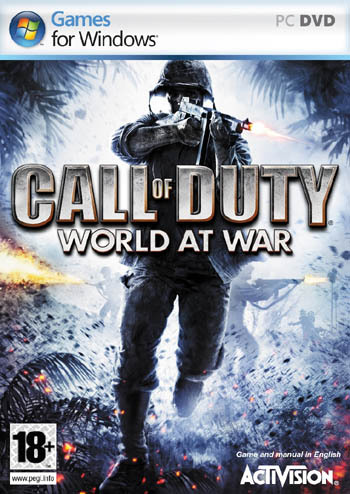
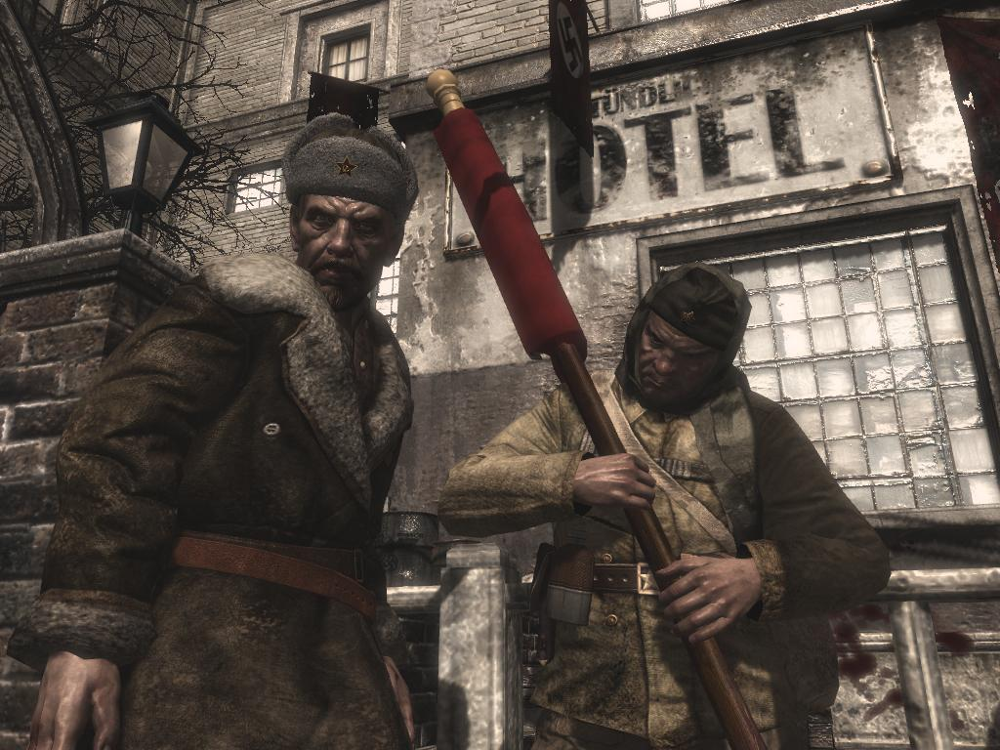
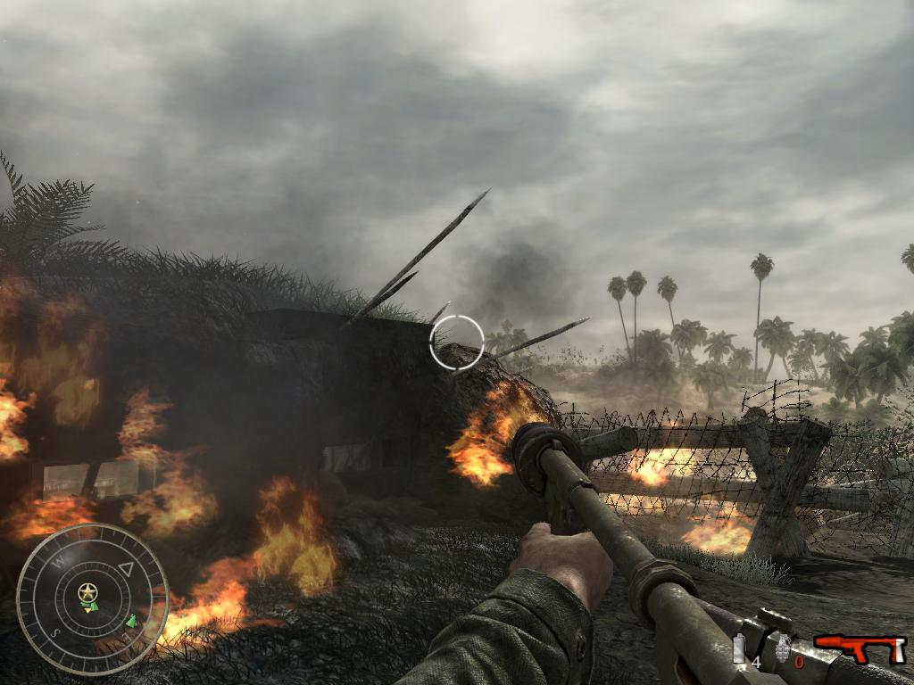
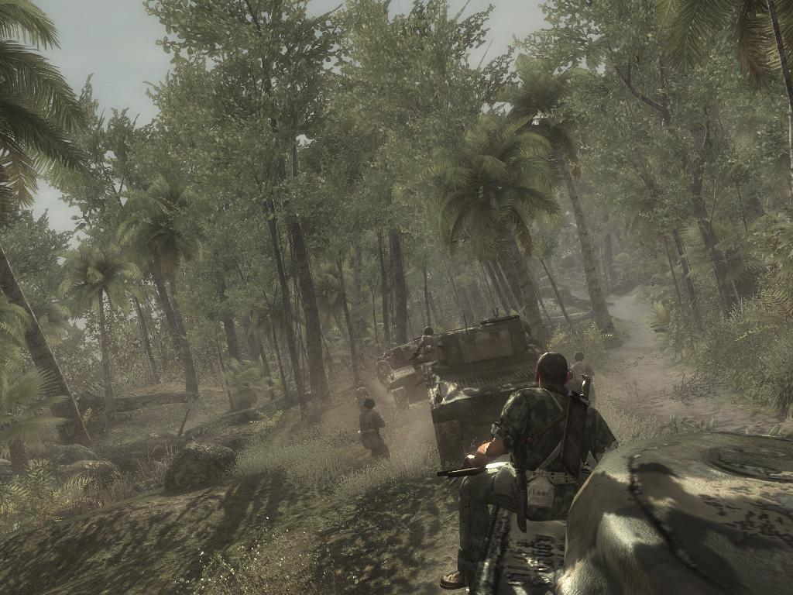
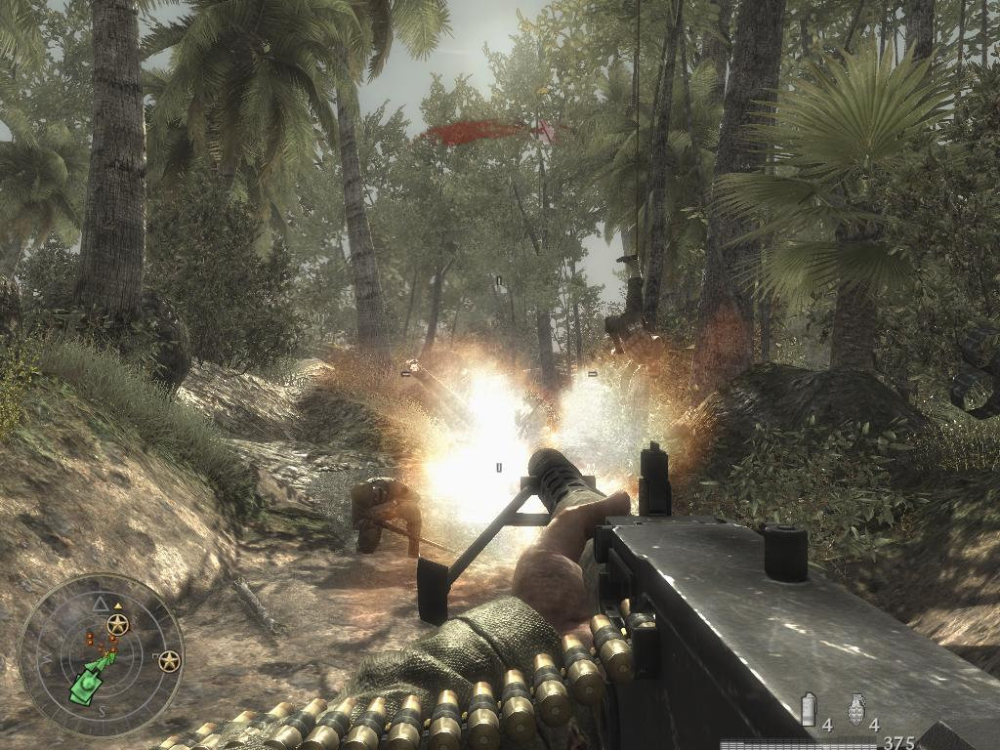
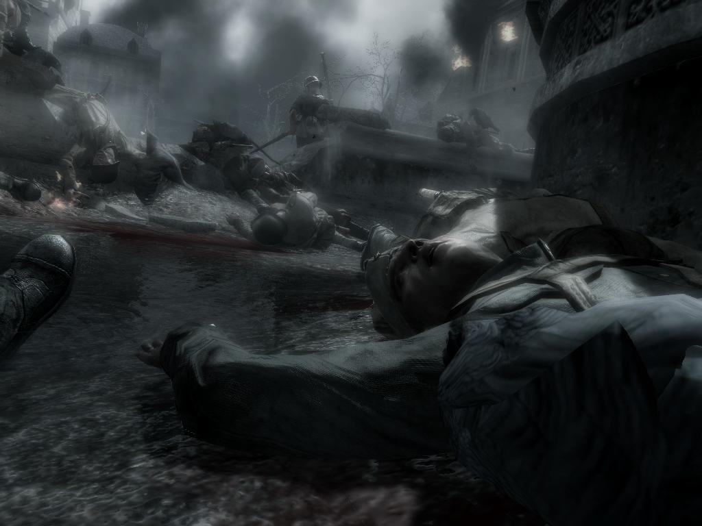
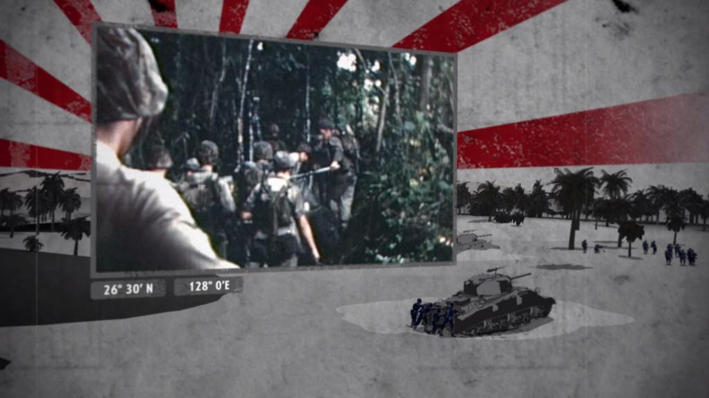
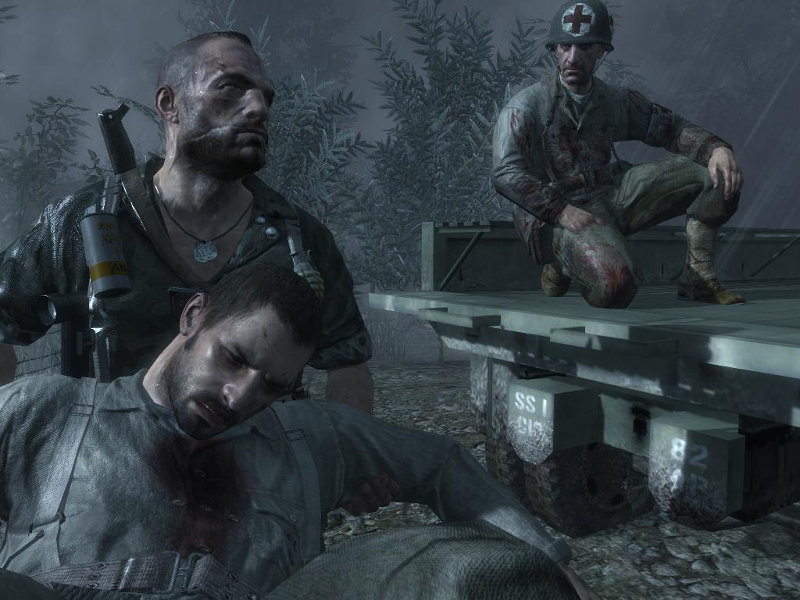

  
**Ficha técnica:**  
Título: Call of Duty 5: World at War  
Desarrollador: Treyarch  
Editor: Activision  
Pegi: +18  
Precio: 56.90 €  
Página web: http://www.callofduty.com/

Y ya van cinco. Call of Duty se renueva una vez más, esta vez bajo el subtítulo World at War. ¿Da la talla? Treyarch ya había desarrollado tambien la tercera entrega, no muy exitosa y con el gran lastre de no haber sido editada para PC. Presentada poco después de la segunda, no aportaba grandes novedades y en realidad tuvo que venir el cuarto Call of Duty para retomar el trono del segundo. Modern Warfare, amado y denostado a partes iguales, trasladaba la acción de la segunda guerra mundial al presente; pero World at War nos devolverá al gran conflicto del Siglo XX.

La acción transcurre en el pacífico, donde los estadounidenses luchan contra los japoneses; y en europa, donde los rusos reconquistarán todo el terreno perdido a manos de los alemanes. Lo primero que más llama la atención es el gran trabajo artístico llevado a cabo entre las misiones, con unas secuencias que entremezclan imágenes de videos documentales con gráficos generados por ordenador y un elenco de recursos visuales que te transportan por la historia del juego y de la guerra. Estas escenas han sido realizadas con buen gusto y resultan la mar de entretenidas, además de amenizar la espera entre carga y carga de nivel. La campaña americana está ambientada dentro de unas espesas selvas tropicales y en bosques, playas y zonas más o menos desérticas; de colorido y vivacidad que evocan a algún escenario similar de precursores como Medal of Honor: Pacific Assault. En ellos, los enemigos buscan todas las formas posibles de atacarte: desde lo alto de una palmera, escondidos entre la alta hierba, haciendo agujeros en el suelo... no faltan tampoco los búnkers y las trincheras, o alguna que otra torre de vigilancia. Llama la atención el comportamiento realista del ejército nipón y su lección magistral de estrategia. ¿Crees que has tomado el valle? Pues no te relajes porque ahora viene una verdadera oleada de hombrecillos armados corriendo hacia ti para cogerte desprevenido y dispuestos a contraatacar con toda su furia. La IA también resulta muy combativa, cubriéndose, devolviéndote las granadas, buscando tus flancos y aprovechando el entorno. Arriesga lo justo, como debe hacer; y esto es mucho más notable en los niveles de dificultad más avanzados.

Es bastante espectacular la forma en que un enemigo puede abordarte cuerpo a cuerpo por sorpresa para apuñalarte sin miramientos, y cómo puedes maniobrar con unos reflejos propios de un felino para sacártelo de encima y hacer que sea él quien muerda el polvo. En esta campaña tambien se recuperan las misiones de tanques (casi tradicionales en la saga), ahora simplificadas para ofrecer un control más básico, convirtiéndolas en una experiencia más dinámica y edificante en comparación con, por ejemplo, las de Call of Duty 2. Entran en juego tambien las misiones como artillero de aviones de guerra, en las que se manejan ametralladoras de una forma que quizás peca de demasiado simple o arcade, pero parecen ser solo una prueba o un experimento y quizás en futuras entregas (empezando por la sexta, que ya está en producción) estas fases en el cielo cobren más protagonismo. Pero la campaña que verdaderamente te enamorará es la de los rusos. ¡¡Oh, si!! O mejor dicho: ¡¡Oh, Da!! Una auténtica resurrección vivida en directo junto a tu veterano compañero de armas: un francotirador que engañará a la muerte tantas veces como tú para acompañarte hasta Berlín. Desde hacerse el muerto y guiarte para evitar que te maten nada más empezar, hasta disparar a oficiales, trucos de un perro viejo capaz de saltar a traves de una ventana para salvar el pellejo o quemarse sus propias manos para sacarte de una habitación en llamas. El colorido se desvanece para sumergirte en la mejor campaña rusa que se recuerda, con una dosis extraordinaria de épica que traspasa el monitor y te recompensa cada clic y cada tecla pulsada.

Gráficamente, el juego bebe directamente del motor de Modern Warfare; lo que desvela la clara estrategia de los productores, dejando el avance tecnológico para las entregas desarrolladas por Infinity Ward (estudio brillante en esta tarea) y cubriendo los lapsos entre motor y motor con secuelas realmente más orientadas al contenido; que son las que Treyarch parece que aspira a hacer. Pese a todo, sí que se nota alguna que otra mejora en la optimización y la estabilidad del juego, y detalles menores a favor de lo visual; tal y como era de esperar. En conjunto, todos los efectos suman, sacando un buen partido de los equipos más potentes y haciéndolo tambien asequible para máquinas modestas si los desactivamos. El control es inmejorable, así como el sonido, seña de identidad de toda la saga: estruendoso, realista y sobrecogedor. Las grandas te harán saltar de la silla, pero los bombardeos son de una magnitud tal que parece que estén derrumbando tu casa. Goza de un doblaje increíble para todas las facciones y durante las escenas narrativas se cuenta de una forma clara, concisa y en primera persona todos los hechos relevantes en el guión. En la jugabilidad, Call of Duty 5: World at War puede llegar a pecar ligeramente de repetitivo, si bien ambas campañas se desmarcan muchísimo y se intercalan para disimular que la mayor parte del tiempo solo estás corriendo hasta tu siguiente objetivo, disparando a diestro y siniestro y esquivando granadazos. Las misiones en carros de combate o en aviones son solo guindas de un pastel ya conocido, aunque no por ello menos sabroso. Lo interesante es precisamente cómo las misiones de unos y otros se entrelazan para cambiar la dinámica del juego: del puro asalto y el churrasco del lanzallamas en la selva, al gato y el ratón de los francotiradores apostados en las ventanas de la ciudad.

Un achaque tambien conocido y realmente incordiante es la duración del modo para una sola persona: corto es decir poco, porque apenas en cuatro horas ya estábamos rozando las ultimas misiones americanas y mucho nos tememos que la duración total no sobrepase las 6 o 7 con un poco de suerte. Esta hábil combinación de rusos y americanos intercalados no revoluciona, pero evoluciona respecto a Modern Warfare hacia un estilo donde la munición se superpone sobre los gadgets (algo que es tambien de agradecer en un shooter puro y duro, sobretodo en el multijugador). Y es ahí, en el juego para varios donde "CoD5: WaW" despliega un potencial enorme más próximo a las interminables batallas del "CoD2" que a las complejas escaramuzas de "CoD4: MW". Es su triunfo y posiblemente el ámbito en el que, como el otro, todavía se mantenga en activo pasados nada menos que cuatro años. Y que siga.

**NOTA: 8.75**

**Lo mejor de Call of Duty 5: World at War:**  
Estupendo nivel visual y sonoro  
Las trepidantes campañas, especialmente la rusa  
Un multijugador adictivo y mejorado

**Lo peor de Call of Duty 5: World at War:**  
No lo parece, pero su mecánica es repetitiva  
Se echan de menos más horas para el modo en solitario: ¡es muy corto!  
Las misiones de aviones y el sistema de perfiles online no terminan de cuajar

**Requisitos mínimos:**  
Windows XP/Vista  
AMD 64 3200+ o Pentium 4 3.0 GHz  
512 MB de memoria RAM en Windows XP o 1 GB en Vista  
8 GB libres de disco duro  
Tarjeta gráfica de 256 MB nVidia GeForce 6600 GT o ATI Radeon 1600 XT

**Requisitos recomendados:**  
Windows Vista  
Intel Core 2 Duo  
2 GB de memoria RAM en Windows XP o 4 GB en Vista  
8 GB libres de disco duro  
Tarjeta gráfica de 512 MB nVidia GeForce 7900 GT o ATI Radeon 2400

**NOTA:** Por desgracia no se han hecho públicos unos requisitos recomendados oficiales, los que reflejamos aquí son una estimación aproximada.