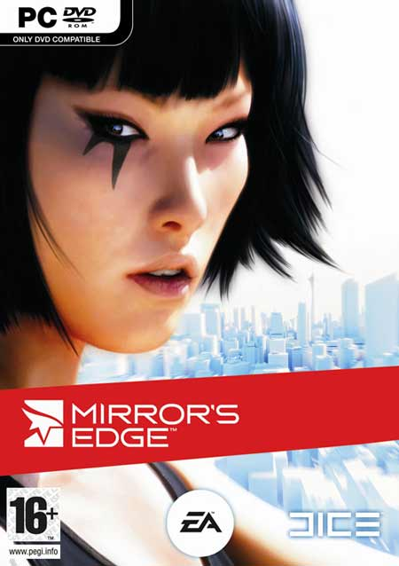
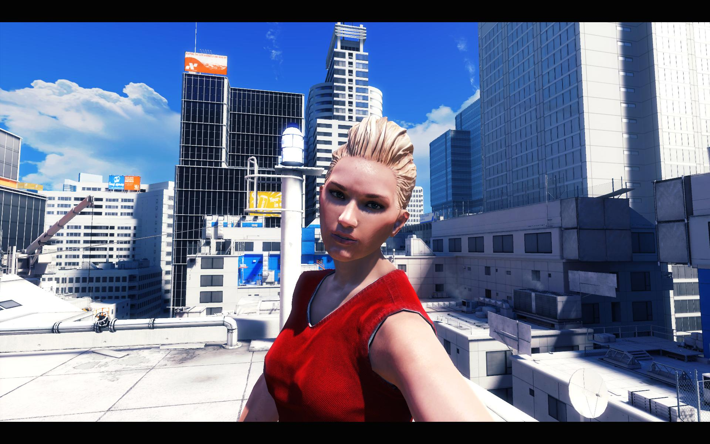
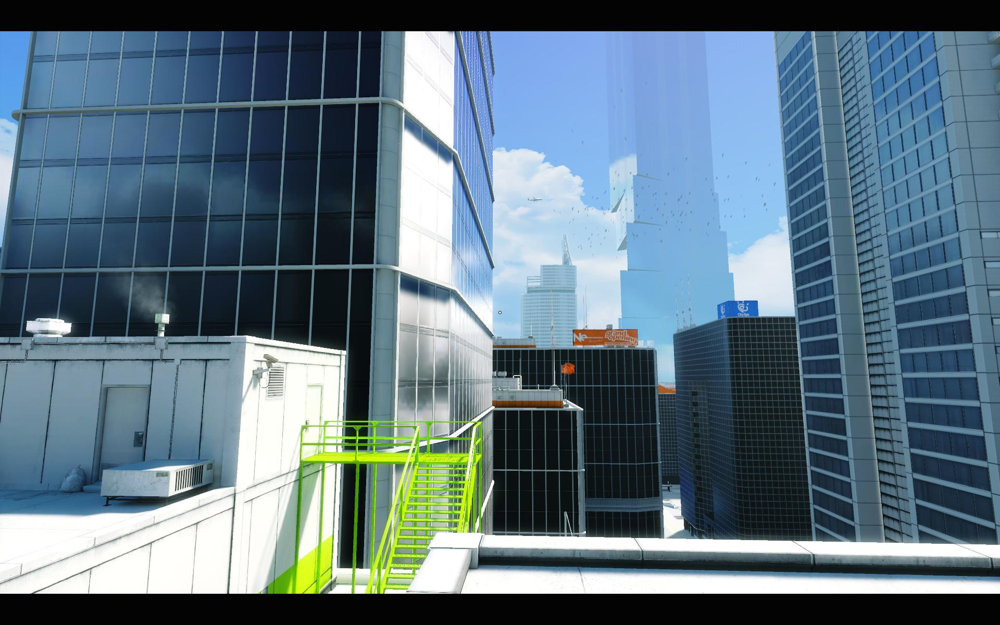
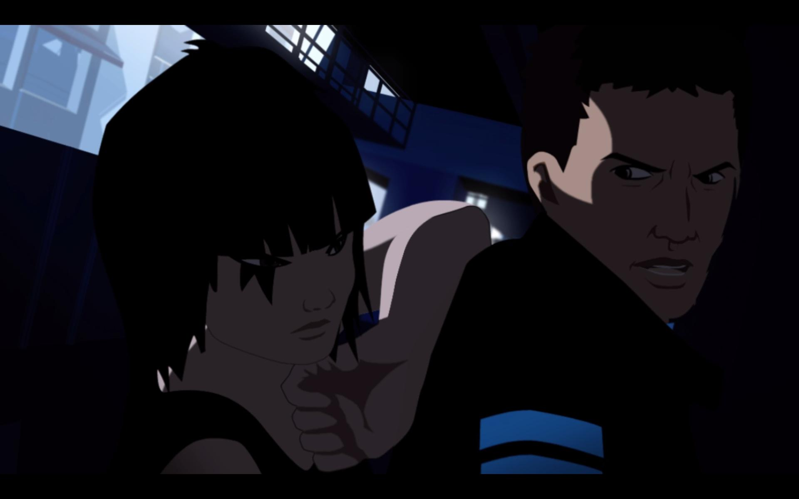
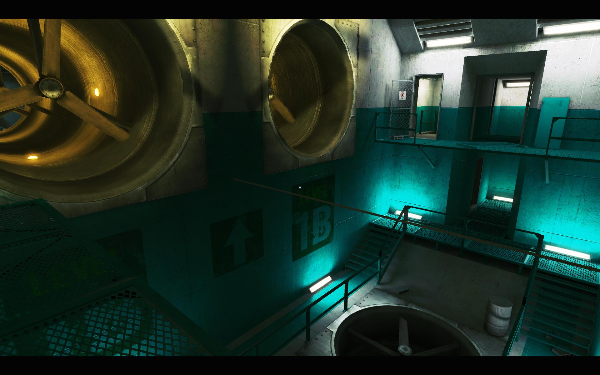
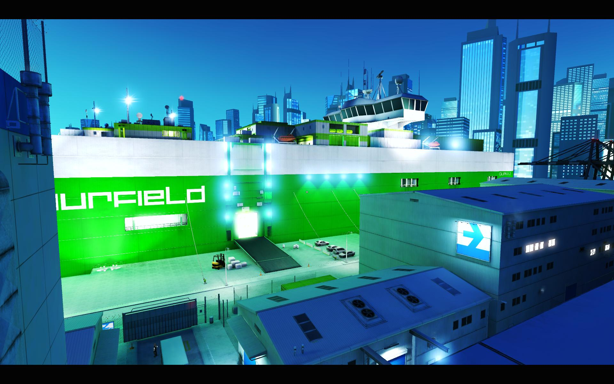
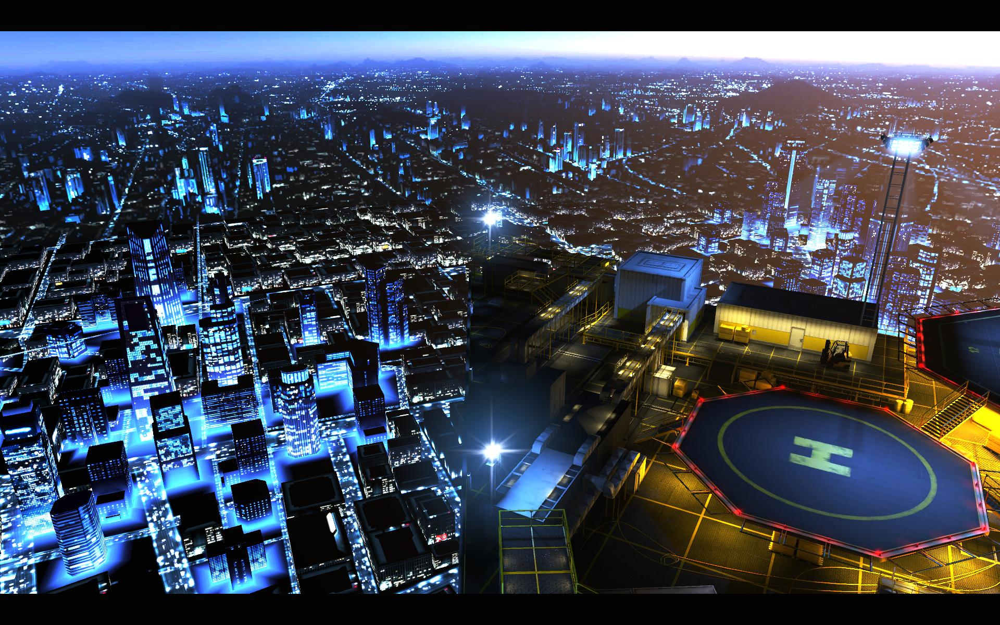
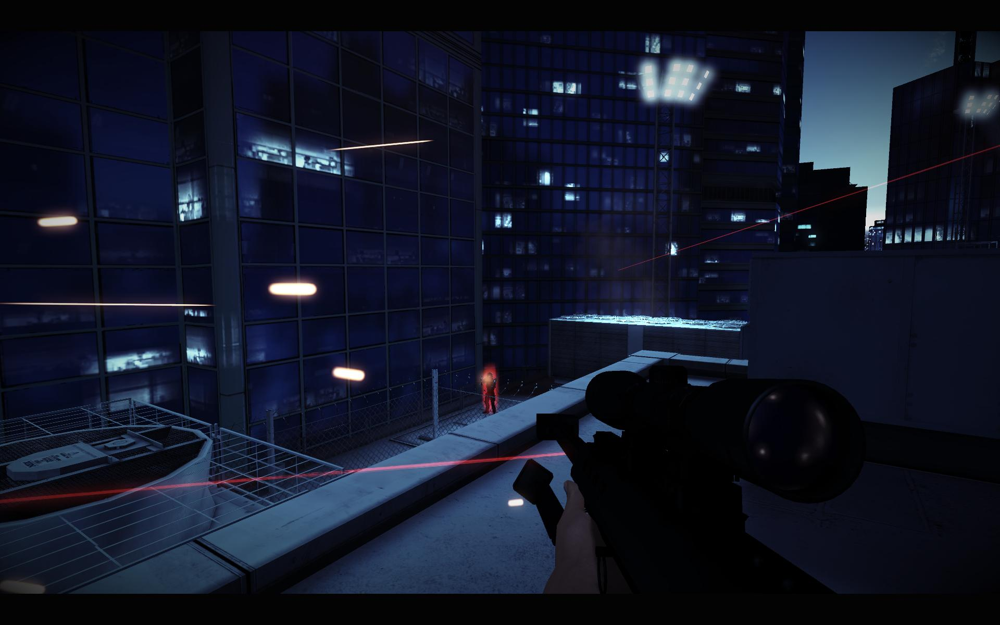
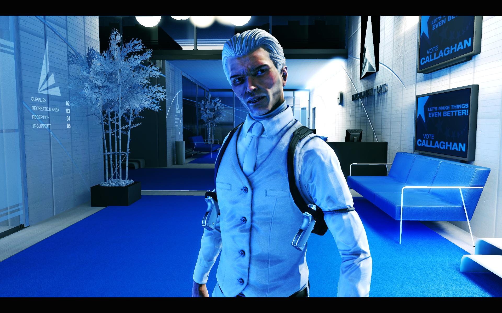

**Ficha Técnica:**  
Título: Mirror's Edge  
Desarrollador: Dice  
Editor: Electronic Arts  
Pegi: +16  
Precio: 39.95 €  
Página web: http://www.mirrorsedge.com/

Cuatro y media de la madrugada, últimos compases de la canción final de Mirror’s Edge. Los créditos amenazan con llegar a su fin y todavía no tengo muy claro si me ha gustado o no. ¿Habrá merecido la pena estar despierto hasta tan tarde? Desengranando su mecánica y recapacitando sobre sus virtudes y sus errores, me quedo poco a poco dormido en un profundo sueño... Mirror’s Edge ha sido desarrollado por Electronic Arts con el objetivo de poner al alcance de todos ese nuevo deporte urbano conocido como “Free Running” o “Parkour”. Se trata de correr sin parar por la ciudad esquivando obstáculos o superándolos mediante complicados movimientos: correr por la pared, encadenar saltos, saltos de “chimenea”, colgarse de un saliente... Con tal pretexto, podría parecer la situación propicia para ofrecernos un “Tony Hawk’s Pro Skater” sin monopatín, pero algo más podemos rascar. En EA se dieron cuenta de que podrían explotar este mecanismo introduciendo enemigos y movimientos parecidos a un arte marcial. Añádase hilo narrativo genérico y cocínese para varias plataformas. Sírvase con una generosa campaña de publicidad en los medios televisivos.

Eres Faith, una runner con una hermana llamada Kate. Mientras ella patrulla la ciudad, tú cometes trapicheos de todo tipo con información que un estado totalitarista no puede permitir que circule. Es la ciudad de la novela “1984” de George Orwell pero con otro nombre. Este superestado tiene incluso un plan perfectamente orquestado para acabar con los runners. Un asesinato, la persona acertada en el sitio equivocado, una traición y tu hermana en medio de todo el meollo (¡Hermanas! ¿Cuándo aprenderán?). La historia te conduce por los tejados de los edificios y los conductos de ventilación para que descubras qué oscuros intereses manejan los hilos de la urbe. Este hilo argumental fluye a lo largo de diez capítulos, de los cuales el primero se descuenta porque es el típico tutorial embutido en el punto de partida, y que es bastante útil, porque aunque el juego se las apaña con 10 simples teclas la variedad de movimientos es relativamente amplia. Los capítulos quedan interconectados mediante secuencias de video de tipo "anime", aunque bastante flojas en actuación y posibilidades de sorprender al respetable. Ni tan siquiera son originales, pero son una excusa para que prestes algo de atención al sencillo guión. En las cinemáticas sin embargo, la cosa cambia. Los personajes gozan de un nivel de detalle considerable y su aspecto es notoriamente superior a la media.

Mirror’s Edge sigue un desarrollo estrictamente lineal basado en checkpoints imposible de eludir. O haces algo bien o te quedas atascado y no puedes guardar la partida en un punto determinado, aunque por suerte los puntos de guardado están bastante bien situados. En cierto modo se parece a [Tomb Raider](../../../2007/06/tomb-raider-anniversary/), pues basa su mecánica en sortear obstáculos, saltar largas distancias, aferrarse a salientes... Podríamos decir que incluso tiene bastantes elementos de "[Portal](../../../2007/10/portal-orange-box/)", sobretodo en interiores, donde aprovechar las físicas (soporte para tecnología PhysX incluído) puede resultar crucial. Eso sí, no verás rastro alguno de un puzle. Como mucho, te limitarás a utilizar ascensores y pulsar botones en momentos puntuales. No hay chicha bastante para maquillar que en realidad siempre estarás corriendo como alma que lleva el diablo, dinámica tan solo perturbada por las emboscadas policiales. Es una pena, porque el combate no da la talla: la inteligencia artificial parece sacada de un juego de hace 10 años. En una de las últimas fases nos enfrentamos a un desconocido enemigo que se oculta bajo una máscara. En cuanto mueres un par de veces en el cuerpo a cuerpo reconoces claramente cuándo soltará una patada y ves venir todos los puñetazos. Como además dispones de movimientos de desarme, varios tipos de patadas y la posibilidad de ralentizar el tiempo; toda la adrenalina se disipa en un suspiro: “A ver si se da muerto de una vez”. Solo hacia el final, cuando hay varios enemigos acosándote con serias armas de fuego y tus objetivos se complican es cuando el combate supone el reto que debería haber sido durante toda la aventura. En estas circunstancias ya hemos renunciado a recomendar Mirror’s Edge incondicionalmente y a otorgarle una buena nota.

El envoltorio técnico sí que destaca. Mirror’s Edge es un abanderado de la PlayStation 3 y la Xbox 360 además de los compatibles. Con mucho televisor de alta definición todavía por vender, el juego toma la idea de los aclamados 1080 píxeles de las televisiones Full-HD para ofrecer mayores atractivos. Por eso fuerza una imagen panorámica. Jugado a 1024x768 píxeles de resolución (un monitor de 15 o 17 pulgadas) Faith es poco más que una hormiga con tenis rojos. Malditas bandas negras. Visto a 1920x1080 (resolución para Full-HD), la cosa cambia. Haz clic en las imágenes para poder verlas en alta calidad. La ciudad ahora sí parece inmensa y los saltos son mucho más impactantes. Es una pena que las texturas no estén a la altura del resto de gráficos, porque no son la maravilla de la definición. Baldosas bastante planas y carentes de vida alguna (sin manchas, sin imperfecciones), todas cortadas por el mismo patrón. Ni el más mínimo óxido en las entrañas metálicas de los edificios. Lo poco orgánico del aspecto queda deslumbrado por lo vívido de los exteriores. La sensación producida por una vista del horizonte de la ciudad, plagado de rascacielos y altas torres, está a caballo entre maravillar e intimidar al jugador. Realmente se consigue esa sensación de entorno opresivo. Con tanta línea recta, el antialiasing de tu tarjeta gráfica será un gran amigo, puliendo los bordes y dejándolos perfectamente definidos. Llama la atención el trabajo artístico llevado a cabo, que dota a cada misión de una personalidad distinta. La por lo general gris gama tonal recibirá una inyección de un color vivo diferente para cada fase, marcando algunas por su entorno anaranjado, verdoso, azulado… Estas fosforescencias dan un porte más que interesante al aspecto visual del juego en general.

En la espiral de carreras, saltos y movimientos varios de Mirror’s Edge, el ritmo de juego se vuelve vertiginoso. Además puede que si algún amigo se compra el juego disfrutéis aún más con el modo de carreras multijugador contrarreloj, un alivio porque el juego se hace corto, sobretodo si no te atascas en ninguna situación (que puede ocurrir). Su novedoso punto de partida deja huella, aún más cuando no hay competencia en cuanto a juegos de “Free Running” respecta. Merece la pena por ello, pero deberás aceptar sus errores y carencias.

**NOTA: 6.75**

**Lo mejor de Mirror’s Edge:**  
Jugabilidad original más allá de un juego deportivo  
El buen gusto en el estilo visual y el trabajo artístico  
Ritmo vertiginoso y dinámico

**Lo peor de Mirror’s Edge:**  
Detalles técnicos como las texturas que no están a la altura del resto del juego  
Combate no competitivo e inteligencia artificial muy pobre  
Guión predecible y misiones muy repetitivas

**Requisitos mínimos:**  
Windows XP SP2/Vista  
Intel Pentium 4 3.0 GHz o equivalente  
1 GB RAM  
Tarjeta gráfica con 256 MB y con Shader Model 3.0  
8 GB de espacio libre en disco duro

**Requisitos recomendados:**  
Windows Vista  
Procesador de doble núcleo de 2.4 GHZ o superior  
1 GB de memoria RAM  
Tarjeta gráfica NVIDIA 7800GTX+ o ATI x1300+  
8 GB de espacio libre en disco duro

**NOTA:** Estos requisitos recomendados no son oficiales ya que no se han publicado unos, sino que son una estimación. Para jugar bajo DirectX 10 será necesaria una tarjeta gráfica compatible con DirectX 10.