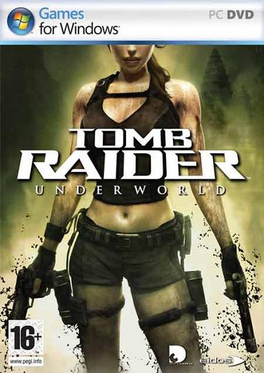
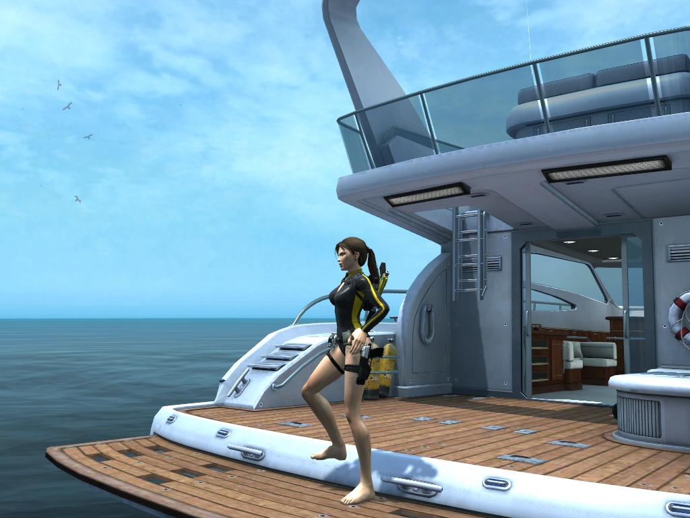
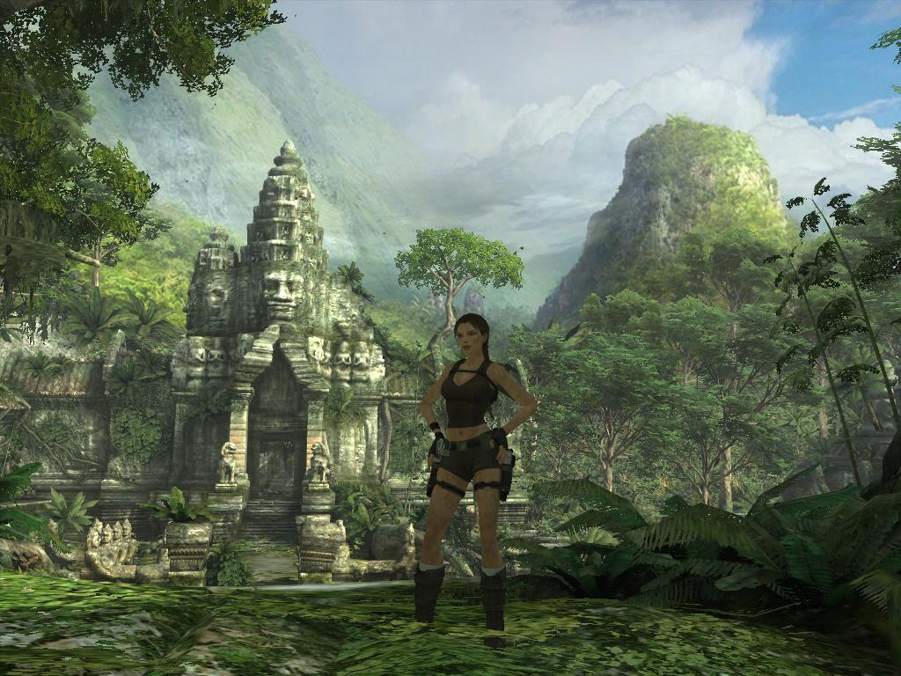
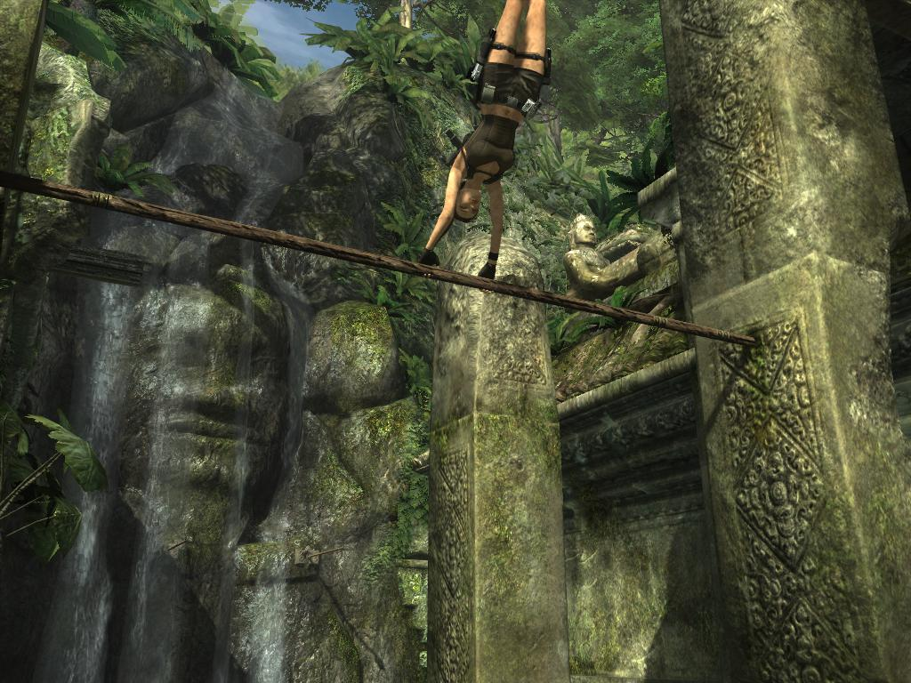
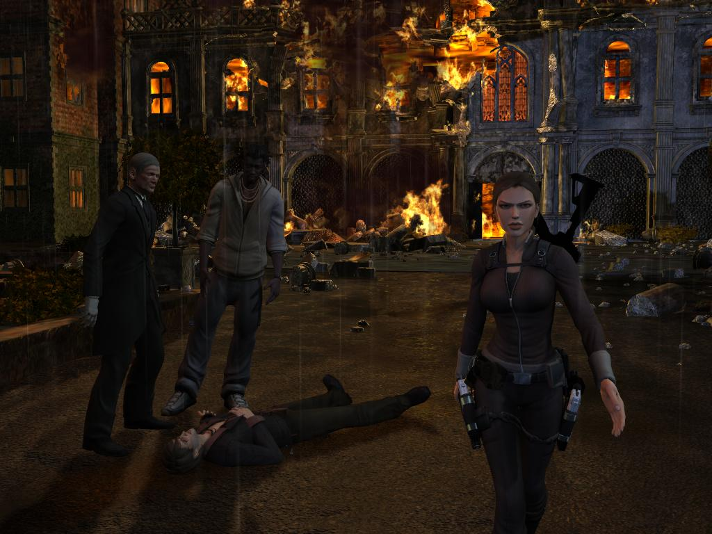
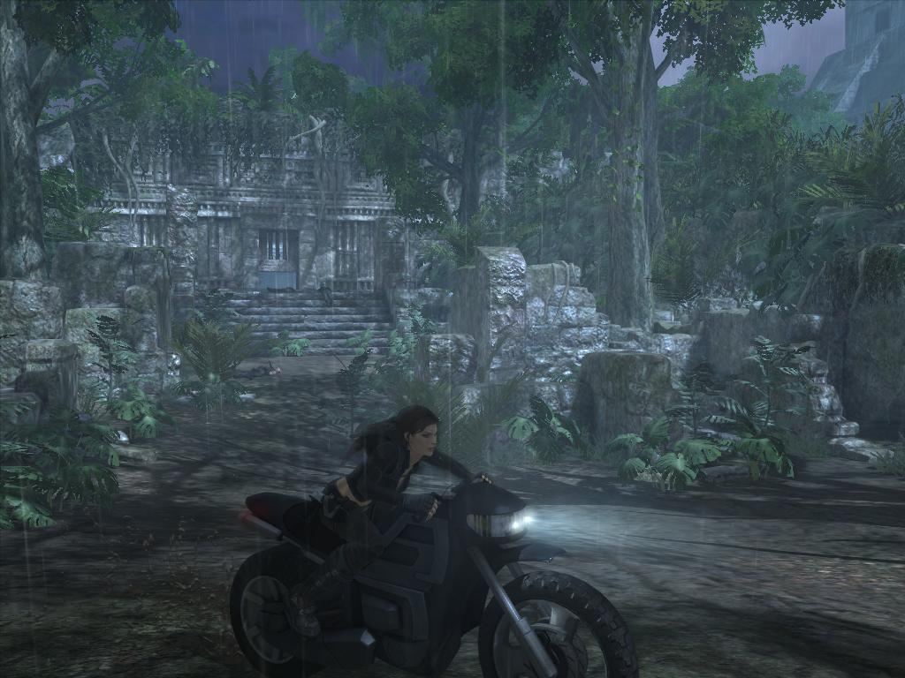
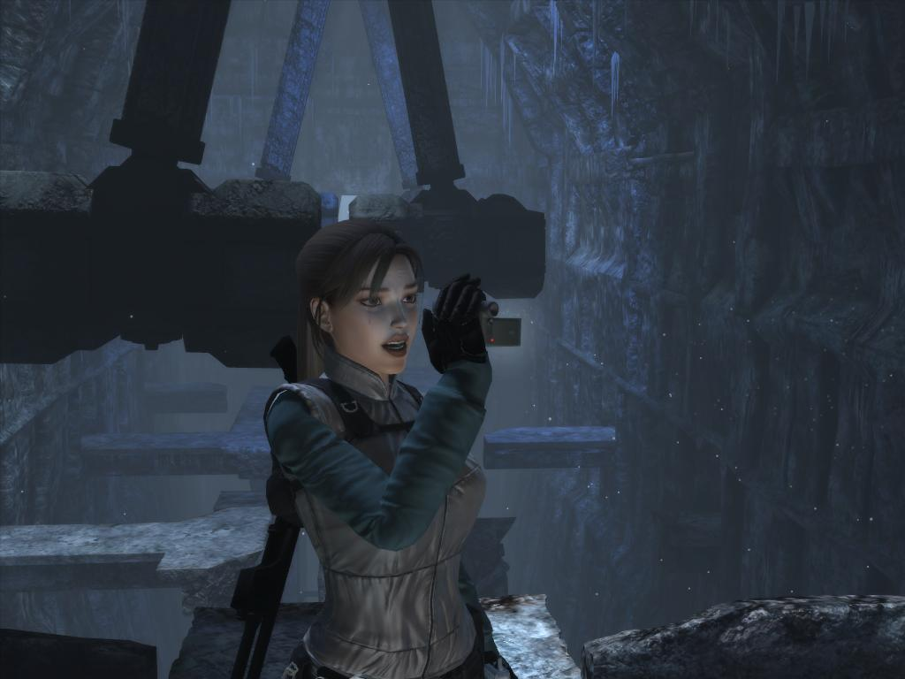
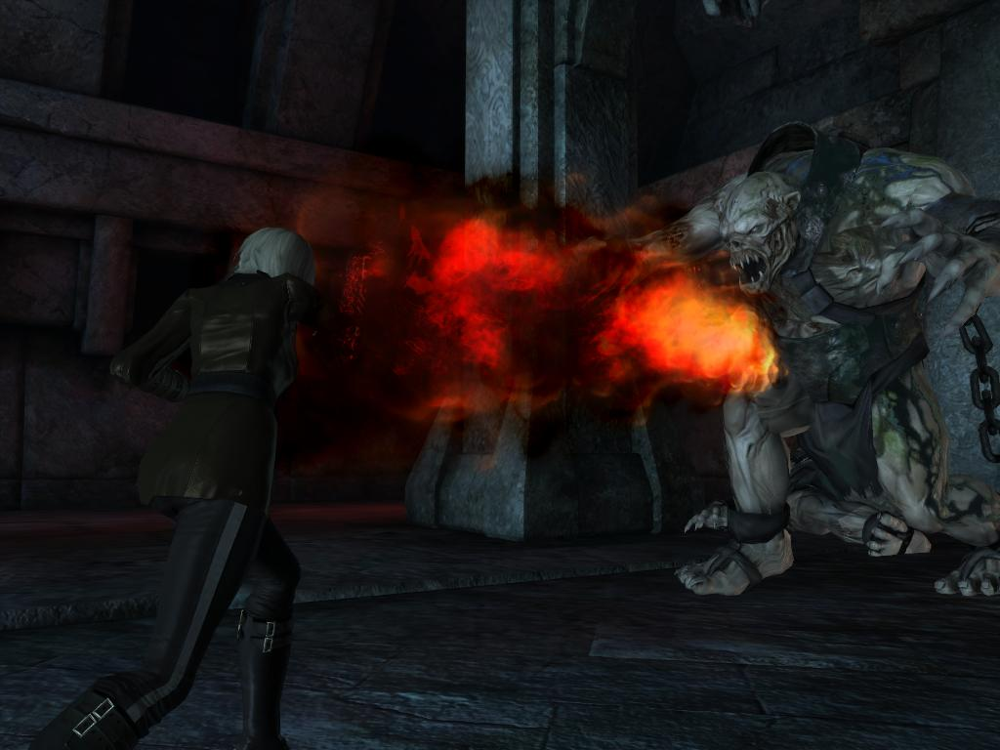
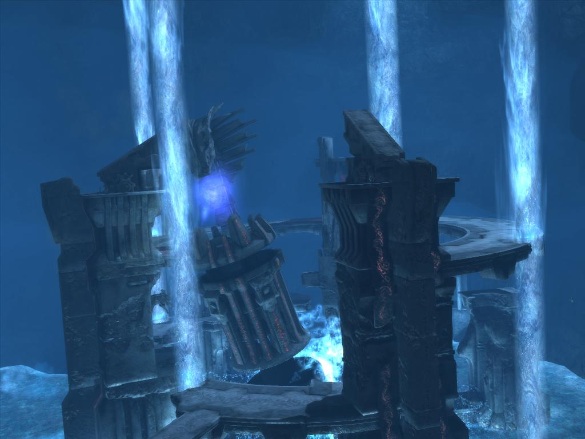

**Ficha técnica:**  
Título: Tomb Raider Underworld  
Desarrollador: Crystal Dynamics  
Editor: Eidos  
Pegi: +16  
Precio: 19.95 €  
Página web: http://www.tombraider.com/

Hay vida tras "[Tomb Raider Anniversary](../../../2007/06/tomb-raider-anniversary/)". Esa es la reflexión a la que conduce, sin duda, el nuevo "Tomb Raider Underworld". En esta nueva entrega la saga se reafirma en su segunda juventud y desde luego que convence con argumentos. El punto de partida ya lo conoces: eres Lara Croft y tu misión es superar niveles y obstáculos mediante la mecánica de saltos, acción, más saltos, puzzle y de nuevo saltos. ¿Que novedades podemos esperar entonces? Para empezar, encontramos un trabajo artístico de órdago. Lo que ya vimos en el trailer es tan solo el aperitivo, porque los escenarios, los enemigos y la historia forman un conjunto con una puesta en escena increíble. Prueba de esto son los dos primeros niveles del juego. Comienzas en unas ruinas submarinas del mediterráneo, y cuando ni tan siquiera te has habituado a ellas, te ves rodeado de una espesa jungla tailandesa en la que a cada paso bien podrías cruzarte con Indiana Jones o con algún personaje perdido de "[Crysis](../../../2007/12/crysis/)".

No exagero, los gráficos son tan buenos que la jungla agobia y la humedad te hace sudar frío mientras te preguntas si conseguirás mantenerte agarrado al saliente de la pared. No solo eso: el nuevo motor (que continúa la esencia del que dio vida a "[Tomb Raider Legend](../../../2011/06/tomb-raider-legend/)" y "Tomb Raider Anniversary") ofrece un nivel de detalle pasmoso con un rendimiento bueno y lo que es aún mejor: un ejército de efectos de iluminación (sobretodo bajo DirectX 10) que quita el hipo. La parte técnica es el carrete en donde se recogen unas impresionantes postales que nuestra retina difícilmente olvidará. Por su parte, el sonido encaja en su papel, la banda sonora cumple y las voces (dobladas a un perfecto castellano) son realmente buenas. No adolece de un doblaje de segunda, todo lo contrario: la interpretación da la talla e incluso realza el dramatismo de las cinemáticas. Con este aspecto tan chulo y unas bondades paisajísticas evidentes, solo queda saber porqué Lara volverá a cojer sus pistolas. La respuesta es su madre, a quien Lara creía muerta pero que en realidad puede que tan solo esté atrapada en Avalon, el lugar donde iban a parar los muertos del antiguo mundo. Así que nuestra protagonista se ve obligada a remover en el Mediterráneo, en Tailandia, en México, en el Ártico... Los niveles son larguísimos y muy dispares, lo que condiciona en parte la naturaleza de los puzzles, pero por desgracia no afecta demasiado a la forma en que Lara se desenvuelve en ellos. Si acaso, el uso de la moto (mejor integrada que en otras entregas) y las misiones donde tienes que bucear son el mayor cambio de aires a la tónica general del juego. Hace aparición el nivel de rigor en el interior de la Mansión Croft, desde sus profundidades hasta sus dependencias y el hall principal; donde la faceta narrativa encuentra su punto de inflexión.

Como siempre, buscarás salientes en las paredes, encadenarás saltos, te balancearás a cientos de metros de altura, escalarás, rapelarás, harás de funambulista y dispararás a las fieras que te ataquen. Eso es Tomb Raider Underworld: un salto tras otro, es lo mismo que otros Tomb Raider. De modo que las novedades son escasas (quizás la más relevante sea el nuevo motor gráfico y la posibilidad de disparar mientras cuelgas de algo), ya que las misiones de agua se resuelven de una forma mucho más simple de lo que podíamos predecir. Es más, el nuevo "mapa sonar" te permite ver una malla tridimensional con la que explorar los recovecos de tu entorno, pero en realidad es prácticamente prescindible. De hecho, terminamos la aventura habiéndolo utilizado una única vez. Poca nueva chicha para una coleta famosa. ¿Malo? No, amigo, no es malo. Continuismo significa una apuesta segura aunque muchas veces, es cierto, es sinónimo también de una mala jugada en cuanto a crítica (léanse FIFA y derivados). Pero Tomb Raider corresponde siempre con dosis industriales de mitología y con una historia contada de una forma muy cinematográfica, con escenas bien recreadas, diálogos mucho menos estúpidos de lo que te esperas y unos personajes (buenos y malos) que sí son creíbles. Ayudan tambien, por ejemplo, ideas como la del video explicativo que nos pone en antecedentes de todo lo que sucede, la posibilidad de poner en pausa una cinemática o la PDA donde podremos consultar toda la información que vayamos conociendo. Es de agradecer, sobretodo para los no iniciados en las mitologías nórdica y maya; aunque más por conocer que por jugar.

Puedes haber llegado al final de este atípico análisis y preguntarte porqué "Tomb Raider Underworld" merece entonces su nota cuando llevamos dos párrafos diciéndote que es lo mismo que los anteriores. Pues sí, precisamente por eso; porque los anteriores funcionaban a la perfección y "Underworld" tambien. Y porque además debemos juzgarlo como lo que es: una aventura con unos escenarios que te enamoran desde el primer segundo, unos personajes y una historia mejores de lo habitual, un trabajo artístico inconmensurable y, sobretodo, porque apetece cargarlo para intentar una vez más ese dificil salto. Ese reto constante lo convierte en una experiencia a la que dificilmente podemos decir que no.

**NOTA: 8.75**

**Lo mejor de Tomb Raider Underworld:**  
El trabajo artístico, los personajes y la interpretación.  
Los saltos, los puzzles... ¡Es Tomb Raider!  
Es inteligente y su nivel técnico es una gozada.

**Lo peor de Tomb Raider Underworld:**  
Puede que sea algo más corto de lo normal  
En efecto, la mecánica se repite. ¡Es Tomb Raider!  
El "mapa sonar" y otros gadgets son fundamentalmente precindibles.

**Requisitos mínimos:**  
Windows XP/Vista  
Pentium 4 3.0 GHz o AMD Athlon 2,5 GHz  
1 GB de memoria RAM en Windows XP o 2 GB en Vista  
8 GB libres de disco duro  
Tarjeta gráfica nVidia GeForce 6800 GT o ATI Radeon 1800 XT

**Requisitos recomendados:**  
Windows Vista  
Intel Core 2 Duo 2,2 GHz o Athlon 64 X2 4400+  
2 GB de memoria RAM  
8 GB libres de disco duro  
Tarjeta gráfica nVidia GeForce 9800 GTX o ATI Radeon 4800