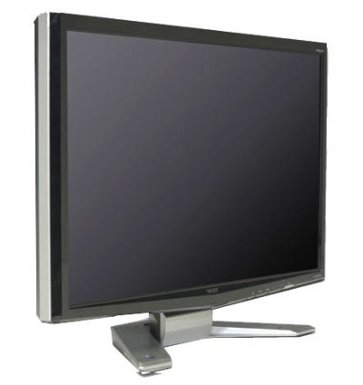

**Ficha técnica:**  
Nombre: Acer P241W  
Fabricante: Acer  
Precio: 274.00 €

Hacía tiempo que tenía que cambiar de monitor. De las insufribles 14 pulgadas de un viejo CRT de principios de los noventa (800x600 a 60 Hz) más propio de Windows 3.1 o Windows 95, había pasado a un AOC que todavía se puede ver en [algún post](../../../2008/06/tu-pc-para-juegos-por-menos-de-450-euros/) del blog. La mejora era sustancial: 17 pulgadas, una tasa de refresco de 80 Hz y una resolución 1280x1024. Sin embargo me estaba costando las retinas el trabajar bombardeado por rayos catódicos; así que llegó el momento de hacerme con un buen TFT.

La industria llevaba tiempo empujando los formatos panorámicos y poco a poco se estaban imponiendo los 16:9, en buena medida por la llegada de la alta definición Full-HD (1920x1080) en Blu-rays y consolas de nueva generación (PS3 y XBox 360). Sin embargo, su altura me parecía insuficiente para poder trabajar con texto la mayor parte del tiempo. Cuando estas programando, odias tener que andar subiendo y bajando continuamente para ver otros pedazos de tu código.

Así que me centré en buscar algo en 16:10 que me permitiese ver peliculas Full-HD al mismo tiempo. La resolución clave era 1920x1200. Ese extra de altura se notaba una barbaridad por lo poquito que había podido probar en alguna tienda. Pese a todo, los precios eran muchísimo más altos, lo que estuvo a punto de hacerme cambiar de opinión... No obstante encontré este Acer P241W en El Corte Inglés de mi ciudad por poco más de 270 €. Sus características principales son:
- Resolucion 1920x1200
- 24 pulgadas de superficie visible
- Tiempo de respuesta de 5ms
- Formato: 16:10
- Conexiones VGA y DVI. Admite HDCP, y existe una versión con HDMI algo más cara.

Me atrajo mucho también su bajo tiempo de respuesta, necesario para que en los juegos de acción o secuencias de imágenes en movimiento a gran velocidad no se apreciase el efecto fantasma de las pantallas más lentas. Por supuesto, cuenta con dos años de garantía. La primera sensación cuando por fin lo ves en tu escritorio es... ¡¡Madre del amor hermoso!! ¡¡Es enooooorrmeeee!! :D

Lo más satisfactorio a partir de ese momento es el trabajo ofimático. Como puedes ver en la foto, caben perfectamente dos folios tamaño DIN A4 a tamaño real y aún queda espacio para las barras de herramientas. En una hoja de cálculo, la cantidad de datos a la vista es abrumadora, abrir documentos en paralelo es una experiencia completamente diferente y ya ni te digo trabajar con varias ventanas o vistas en el explorador de archivos.

La pantalla no obstante adolece de una configuración de color de fábrica que los desvirtúa un poco, quedando "aguados", aunque jugueteando un poco con los controles y el OSD se puede paliar en buena medida. Otra cosa que querrás ajustar será la cantidad de brillo que emite la pantalla. En una habitación a oscuras, hay tanta luz saliendo de la pantalla que puede llegar a resultar molesta.

No hubo ningún problema al reproducir contenido en alta definición, siempre y cuando la máquina sea capaz de mover el video. El trailer de "300" a 1080p es alucinante y la cantidad de detalles es pasmosa. Cargar un DVD a continuación es sencillamente lo más decepcionante que verás en mucho tiempo. La diferencia de resolución es un escollo difícil de salvar y el ganador está claro. Con juegos como [Crysis](../../../2007/12/crysis/) o [Tomb Raider Underworld](../../../2009/02/tomb-raider-underworld/), que gozan de un movimiento rápido y repleto de gráficos de última generación no aprecié ningún efecto molesto, así que el tiempo de 5ms de respuesta dió la talla en este aspecto. Los monitores TFT suelen adolecer de un contraste bastante limitado en comparación con los CRT y las escenas demasiado oscuras no suelen salir tan bien paradas. Desde unos ángulos razonables de visionado, sin embargo, la pantalla sale del apuro sin muchos problemas.

Es una lástima que no incluya HDMI y que no se pueda rotar para emplearla en vertical (lo que sería ya la repanocha para el trabajo con texto). Cada vez es más dificil encontrar pantallas que puedan rotar, pero hay alguna de la marca Dell por un precio similar a la que, sin embargo, no pude echar el guante. La lástima es aún mayor porque la peana es muy sólida pero enorme y solo permite ajustar el ángulo de inclinación del panel ☹️ Por supuesto, las pantallas táctiles se quedan fuera de este juego porque aún está por ver cómo Windows 7 las aprovecha y si realmente se asentarán en el escritorio para ir poco a poco diciendo adiós al teclado y al ratón.

Pronto llegarán las pantallas con tecnología LED, que consumirán mucha menos energía y serán aún más delgadas, pero por ahora parece sensato acogerse a esta Acer si necesitas una superficie de trabajo como esta...

**NOTA: 7.5**

**Lo mejor de Acer P241W:**  
Formato 16:10 y resolución 1920x1200  
Muy brillante y con buen tiempo de respuesta  
Peana consistente, buen menú OSD

**Lo peor de Acer P241W:**  
No dispone de entrada HDMI  
La calibración de color de fábrica no es muy exacta  
No se puede rotar y la peana es algo grande