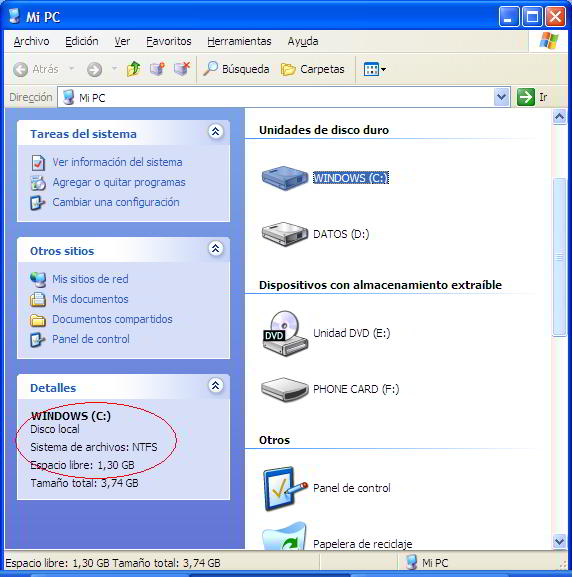
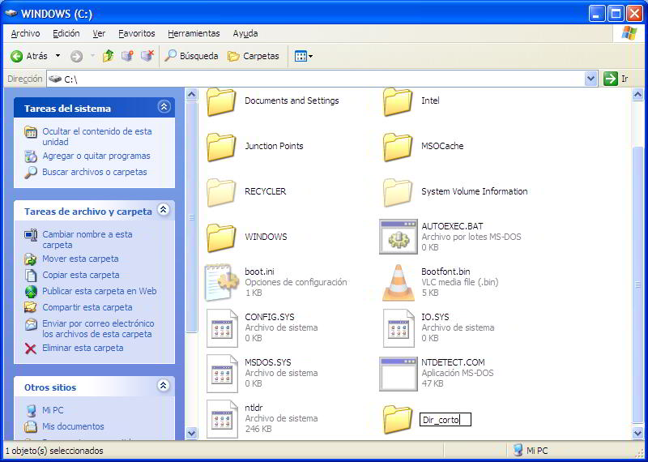
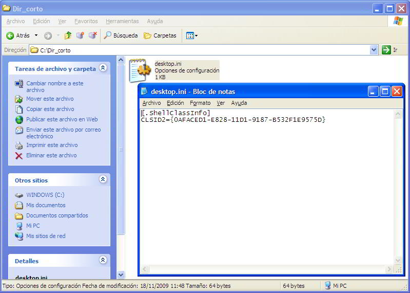
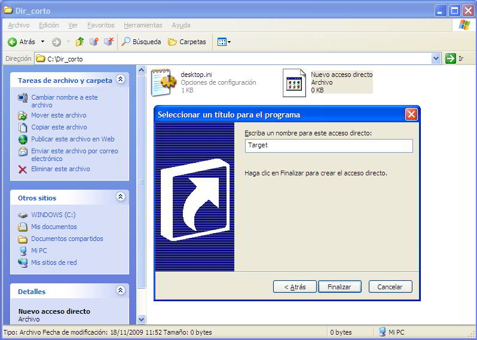
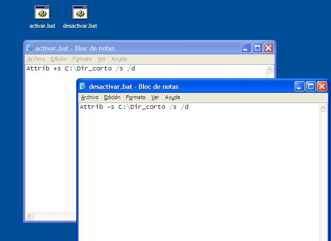

A veces puede ocurrir que, bien por motivos de espacio, bien por motivos de organización, necesitemos crear un "Junction Point", o punto de unión en castellano. ¿Qué es un "Junction Point"? Bueno, básicamente es un nombre que damos a un directorio que en lugar de almacenar unos archivos, muestra el contenido de otro directorio. Es similar al concepto de acceso directo, pero en lugar de tratarse de un archivo que te lleva a otra ubicacion, sencillamente muestra el contenido de otra carpeta como si estuviese dentro de ella. Quizás el artículo al respecto de la wikipedia sea algo más clarificador: https://en.wikipedia.org/wiki/NTFS_links. 

A mi me resultó particularmente útil cuando tenia instalado WinXP en mi EeePC 901, que viene con dos discos SSD, uno de 4GB (donde tenía el sistema) y uno de 16GB (donde tenia los datos y otra partición con una instalación de Ubuntu). Como en el primero no me quedaba mucho espacio, moví muchos directorios a la particion de datos, donde si disponia de suficiente para, por ejemplo, las cachés de Office, las caches de _C:\\Windows\\Installer_ y otras carpetas de tamaños mostruosos y dudosa utilidad. Básicamente un Junction Point es una carpeta en el disco duro (Por ejemplo _C:\\Mi\_carpeta\_corta_) que realmente está almacenada en otra carpeta del mismo disco duro o de uno secundario (Por ejemplo _D:\\PROGRAMAS\\CACHÉ\\Mi\_capeta\_de\_nombre\_largo_).  
Es como crear un acceso directo, pero de forma que los programas lo vean como un directorio normal y corriente, asi que... 

**Qué necesito?**  
En principio basta con tener instalado Windows XP y que el disco duro esté en formato NTFS, que es lo habitual hoy en día, pero si quieres comprobarlo abre Mi PC 

 


**Como hacerlo?**  
Existen varias utilidades (por ejemplo el sencillo _LinkD_ descargable desde la pagina de Microsoft) pero vamos a hacerlo a mano.  
Comencemos por crear el directorio por el que queremos acceder. Por ejemplo, abrimos Mi PC, C: y creamos ahí la carpeta _Dir\_corto_ 

 

Ahora abrimos el bloc de notas y dentro copiamos estas dos líneas:  
```
[.ShellClassInfo]  
CLSID2={0AFACED1-E828-11D1-9187-B532F1E9575D}
``` 

Pinchamos en Archivo/Guardar como y de nombre ponemos (incluyendo las comillas) `"C:\Dir_corto\desktop.ini"`  
Esto guardará el archivo dentro de _Dir\_corto_ con la extensión .ini (si quieres comprobarlo, verás que su icono no es como el de un archivo de texto normal).

 

¿Que hace esto? Le dice al sistema que busque el acceso directo llamado _Target_ que lo llevará al directorio al que queremos enlazar. Asi que dentro de directorio corto hacemos ahora un acceso directo a la carpeta larga. Pinchamos con el boton derecho, Nuevo/Acceso directo. Buscamos la carpeta, por ejemplo _D:\\PROGRAMAS\\Mi\_carpeta\_larguisima_, pinchamos en siguiente y de nombre le ponemos _Target_. Aceptamos.  

 

Ahora abrimos de nuevo el bloc de notas. Vamos a crear dos archivos que activen y desactiven el punto de unión. Para el primero escribimos:  
```
Attrib +s C:\Dir_corto /s /d
```

Y lo guardamos en el escritorio (o cualquier otro lugar salvo _Dir\_corto_) con el nombre `"activar_union.bat"` (pon las comillas para que lo guarde con la extensión .bat).  
Para el segundo archivo escribiremos lo mismo pero cambiando el signo + por -:  
```
Attrib -s C:\Dir_corto /s /d
```

Y hacemos lo mismo para guardarlo como `"desactivar_union.bat"` 

 

Ahora hacemos doble clic sobre activar/desactivar para hacer efectiva la unión o terminarla. Incluso si reiniciamos se conservarán los cambios, algo muy práctico para determinadas situaciones. 

**Modificar el directorio de destino:**  
Debemos desactivar la unión, borrar el acceso directo _Target_ de dentro del directorio corto, hacerlo de nuevo para el nuevo destino (siempre con el nombre _Target_) y volver a activar la unión. 

**Tips utiles:**  
Si tienes varios directorios "junction", haz dos carpetas dentro de _Mis documentos_, por ejemplo, una con los archivos que activan las uniones y otra con los que las desactivan. Así puedes darle nombres más explicativos a estos activadores: _MSOCache.bat_ activa o desactiva el junction del directorio llamado MSOCache, por ejemplo _Installer.bat_ hace lo propio con el directorio Installer, etc.