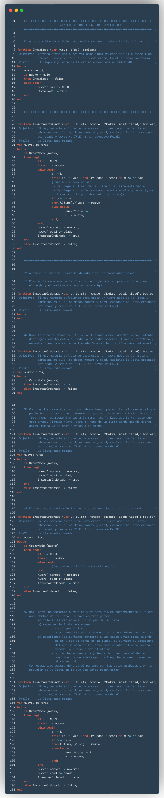
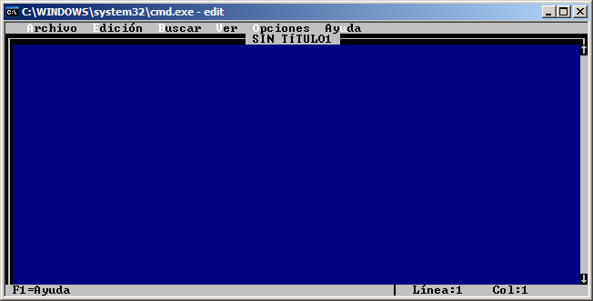
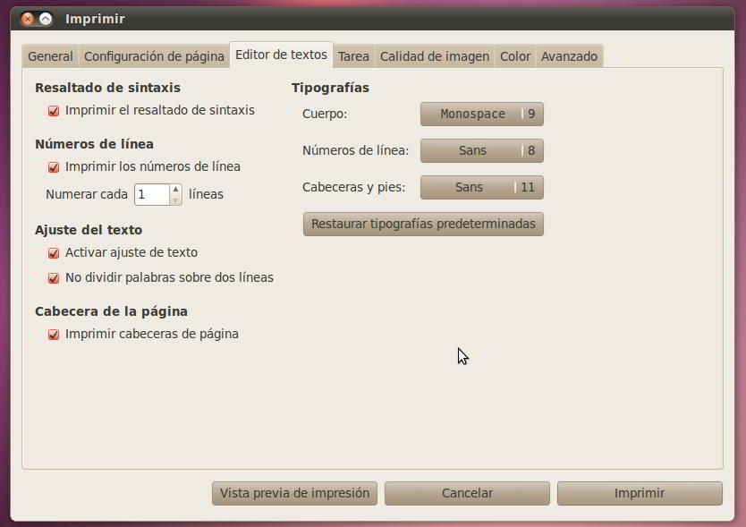

Uno debe adquirir buenas costumbres a la hora de programar. Son muchas y algunas se refieren a como distribuir el código, otras a como documentarlo, otras a qué orden seguir al escribirlo, otras a cómo indentarlo y dividirlo en partes más simples, etc. De las conclusiones sacadas, aquí están unas pocas sugerencias y un ejemplo práctico. Me centraré en Pascal por ser este uno de los primeros lenguajes de nuestra carrera y el que mucha gente aprende por su cuenta para iniciarse en la programación estructurada, pero en general todo consejo puede ser bueno independientemente de qué lenguaje estemos utilizando.

También voy a comentar justo lo contrario, los errores más graves que creo que se pueden cometer a la hora de abordar un desarrollo.

**Distribuir el código**  
Hoy en día la gran mayoría de lenguajes de programación existentes, y por supuesto los más conocidos, aceptan la distribución del código fuente de un programa en bloques que se conectan al programa principal o que se encuentran interconectados entre sí. Ya se llamen módulos, librerías, _units_, bibliotecas... al final todos estos nombres se refieren a un fichero que proporciona una determinada utilidad. En nuestra carrera, el ejemplo más evidente son las units de Pascal (concretamente de la implementación [FreePascal](http://www.freepascal.org/)) donde todas las funciones y procedimientos de uno de estos módulos se crean para proporcionar a un programa la habilidad de crear, modificar y consultar listas, colas, pilas, etc. Es importante por eso darle también un nombre apropiado a estas librerías: "_lista.pas_" o "_juego.pas_", por ejemplo. En otras ocasiones, un programa puede necesitar de forma recurrente operaciones mucho más simples y que no están relacionadas entre sí. Pongo por ejemplo la función que convierta una letra mayúscula en minúscula, que enlace ficheros, o el procedimiento que centre un texto en pantalla, o tal vez el algoritmo que nos devuelva un número generado aleatoriamente. Estas operaciones no tienen nada que ver entre sí y no nos proporcionarán un nuevo tipo de dato abstracto, pero son necesarias y se utilizan de forma común. Más evidente aún es la necesidad de importar en todos los módulos de un programa los tipos de datos que se emplean. En lugar de definir los tipos en cada fichero, podemos escribirlos una vez en un módulo separado y exportarlo. En este caso, a mi me gusta emplear una denominación tomada de la denominación de paquetes de software en sistemas Debian. Igual que a una unit que proporciona una lista podríamos llamarla "_lista.pas_", podríamos hablar de "_general.pas_" o, mi preferido, "_base.pas_" pues sí que contiene información y operaciones básicas comunes al resto del programa y que, por su naturaleza, no están directamente relacionadas entre sí.

**Documentar el código**  
Es muy importante aprender cuando y como escribir comentarios en medio del código fuente de cualquier programa. Por ejemplo, en la siguiente sentencia no hay nada que comentar:
```
x := 1;
```
Sería inútil comentar esta instrucción pues cuando un programador abre un programa de pascal (y suponemos por tanto, que entiende fundamentalmente el lenguaje) sabrá que se trata de una asignación y que se graba el número 1 en la variable x. Los comentarios han de escribirse para otro programador, no para cualquier persona, a no ser que esa sea explícitamente nuestra intención. ¿Cuantas líneas de sintaxis igualmente sencilla hay en cualquier código fuente? Exacto, muchas. Llenar de comentarios redundantes o que explican algo tremendamente obvio solo incomodará a quien quiera leerlo y entenderlo. No obstante, sí que resulta útil comentar fragmentos mayores, como una función, indicando sus entradas, salidas, precondiciones y poscondiciones, objetivo y quizás, alguna aclaración sobre su funcionamiento.

```
function esListaVacia (L: tLista): boolean;
{Objetivo: Devuelve TRUE si la lista L es una lista vacia, o FALSE en caso contrario
PreCD: La lista esta inicializada}
```

Tampoco estaría de más comentar las condiciones que se dan para detener un bucle cuya lógica sea un poco enrevesada o no demasiado auto-explicativa. Un ejemplo de esto puede ser:

```
while not (p = nil) and not (p^.num = n) do p := p^.sig;
{Este bucle se detiene si:
  - Se llega al final de la lista
  - Si el dato num de la posicion p es igual a n
}
```

Otra posibilidad que nos brindan los comentarios es hacer de delimitadores. No hay problema en dejar tres lineas en blanco de separación entre unas funciones con una ligera relación y otras de carácter distinto, como tampoco importará incluir un comentario como el siguiente:
```
{ ############################## }
```
Esta linea sin importancia resulta una gran ayuda visual para organizar de forma eficiente el código, algo de lo que también hablaré más adelante. No puedo terminar el apartado dedicado a la documentación sin hablar de la función principal de los comentarios. Es precisamente comentar una determinada instrucción o una porción de nuestro trabajo y a eso mismo ha de ceñirse, y no se han de utilizar para escribir grandes explicaciones o hablar de aspectos que no son los propios de ese código. Para eso podría recurrirse a la documentación externa, un archivo independiente donde comentar más profundamente aspectos teóricos, decisiones tomadas o desarrollar razonamientos que ayuden a entender el planteamiento general (y más abstraído del código) del programa.

**Seguir un orden al escribir código**  
En casi cualquier lenguaje de programación existen sentencias o palabras de la sintaxis del lenguaje que requieren una apertura y un cierre, o el uso de más de una palabra. Por ejemplo, las palabras _BEGIN_ y _END_ de Pascal. Por cada _BEGIN_ que escribamos, deberá haber otro _END_, así que no es descabellada la idea de que nada más escribir el primero, colocar ya el segundo y luego escribir el código en medio de ambos. Esto ayudará a no olvidarnos de ningún cierre. Lo mismo se aplica a las aperturas y cierres de paréntesis, llaves, corchetes, etc. Incluso sentencias selectoras como _IF_ requieren otras palabras: _THEN_ y _ELSE_, por lo que nada más escribir uno, estaría bien escribir los otros dos. Lo mismo para _CASE, WHILE, FOR,_ etc.

**Cómo indentar (tabular) el código**  
Para que cualquier fragmento resulte más legible se puede decir que es necesario tabular las sentencias según su jerarquía en el algoritmo, y emplear también de forma inteligente los saltos de línea. Un ejemplo de lo que NO hay que hacer:

```
write ('escribe n: ');  
readln (n);  
if n=1  
then begin  
write ('hola');
writeln ('aqui n es 1');  
end  
else writeln ('hola, aqui n es otra cosa')
end; 
write ('escribe i: ');  
readln (i);
```

Es mucho más claro:

```
write ('escribe n: ');
readln (n);

if n = 1  
then begin  
	write ('hola');  
	writeln ('aqui n es 1');  
end  
else writeln ('hola, aqui n es otra cosa');  
  
write ('escribe i: ');  
readln (i);  
```

La ventaja de tener un código escrito de forma bien clara es que su lectura es mucho más sencilla y parece más fácil de depurar o mejorar. Seguramente por eso tampoco te habrás dado cuenta de que en el primer caso sobra el "_end;_" que hay al principio de la tercera línea 😉

**Dividir el código en partes más simples**  
Nuestro profesor de programación repite año tras año la siguiente máxima:

> Si ocupa más de lo que un editor de texto puede mostrar en una sola pantalla, es demasiado largo

Razón no le falta en absoluto. Quiere decir que no hay que hacer larguísimos procedimientos de 100 líneas. Ni tan siquiera de 80, 70, 60 o 50. Utilizar unidades tan largas de código es una de las mejores maneras de cometer muchos errores: usar identificadores que ya se han usado, no cerrar parejas tipo _begin-end_, escribir condiciones con una lógica enrevesada... Vale la pena hacer trozos de 20 o 30 lineas y saber que ese trozo está bien que no tener que andar mirando y remirando el código fuente por n-ésima vez para que al final el error sea un punto y coma no puesto, un paréntesis no cerrado, un nombre reutilizado para algo con lo que no se puede reutilizar, etc. Además, hacer algoritmos más pequeños facilita la corrección de los mismos.

A conitnuación adjunto un pequeño código fuente escrito en Pascal. Es una función que inserta un dato de forma ordenada en una lista dinámica. En la parte superior del fichero se encuentra la función (y la función auxiliar "CrearNodo") ya terminada. Luego, tras una linea de comentarios a modo de separador se encuentra la función hecha paso a paso hasta llegar al resultado final, para así apreciar cómo yo escribo mi código de forma ordenada.



Aprovecharé ahora para referirme a algunas convenciones respecto a nombres identificadores de variables, constantes, etc. y a los editores con los que trabajar. De nuevo emplearé el lenguaje Pascal como ejemplo, pero estas directrices se pueden seguir prácticamente en cualquier lenguaje.

**Convenciones**  
Por enumerarlas de una forma rápida:
- Los nombres (identificadores) que designemos deben ser precisamente eso: identificadores. Debemos dar un nombre significativo a cada cosa, incluso nombres compuestos. Por ejemplo, a una variable que almacene la edad de una persona, no bastaría con llamarle "_e_", sino que sería más útil emplear la palabra completa "_edad_". Por esta misma razón, a un procedimiento que dibujase un cuadrado no le llamaría "_Cuadrado_" (que puede confundirse con calcular el cuadrado de un numero) sino "_DibujarCuadrado_", porque eso es lo que hace y el identificador ya no deja lugar a dudas de a qué nos estamos refiriendo.

```
...
procedure DibujarCuadrado (lado: integer);
...
```

- Las variables deberían comenzar por letra minúscula. Esto es una convención que nos ayudará a distinguirlas de constantes y tipos. Por ejemplo

```
...
var
	n_entero: integer;
	letra: char;
...
```

- Las constantes, por contraposición a las anteriores, deberían estar escritas totalmente en mayúsculas. Por ejemplo:

```
...
const
	NULO = nil;
	MAX = 100;
...
```

- Los tipos de dato que nosotros definamos deberían empezar por la letra "t" seguidos del nombre de lo que ese tipo representa. Por ejemplo, el tipo "_lord_" no resulta muy explicativo, resulta más efectivo denominarlo:

```
...
type
	tListaOrdenada = array [1..MAX] of integer;
...
```

Así vemos claramente que se trata de una lista ordenada. 

- Las funciones y procedimientos deberían comenzar por mayúscula. El nombre de las funciones tiene que representar lo que se calcula o evalúa y el de los procedimientos debe ser un verbo que indique lo que realmente hace. Por ejemplo:

```
...
function RaizCuadrada (numero: integer): real;
...
procedure MostrarTextoCentrado (texto: string);
...
```

- Utilizar nombres cortos es algo que deberíamos hacer siempre en la medida de lo posible. Por ejemplo, la función:

```
...
function RaizCuadrada (numero: integer): real;
...
```

Es evidente que calcula una raíz cuadrada del entero recibido en la variable "_numero_". Sería inútil nombrarla de la siguiente forma:

```
...
function RaizCuadradaDeUnNumero (numero: integer): real;
...
```

Este nombre tan largo solo nos causaría incomodidades escribiendo el código fuente y provocará que las líneas del mismo se vuelvan demasiado largas, algo de lo que hablaré más adelante.

**Editores**  
Que yo sepa, todo código fuente debe ser guardado como texto plano sin ningún tipo de formato. Esto ya descarta como posibles editores a muchos procesadores de texto (Microsoft Word, OpenOffice.org Writer, Abiword, etc.). Son excelentes herramientas y por supuesto que pueden trabajar con texto plano, pero lo hacen de una forma muy engorrosa y son aplicaciones muy pesadas y que por lo general no facilitan mucho la tarea al programador, porque no han sido creadas para programar. Un editor de texto plano puede ser desde el viejo editor de MS-DOS (que se puede lanzar en la consola con el comando "_edit_") o los más básicos presentes en sistemas GNU/Linux (pico, nano, emacs, vi, etc.).




Desgraciadamente, no pueden competir con las nuevas generaciones, que han evolucionado claramente hacia no solo la creación de pequeños documentos sino la creación de código fuente en muchos lenguajes. Habitualmente yo utilizo **gEdit**, presente como editor de texto por defecto en Ubuntu y que cumple mis necesidades sin problemas. Las características que más demando en un editor son:  
- Un resaltado de sintaxis eficaz, adaptado al lenguaje en el que trabaje y que además no utilice colores molestos o chillones. A fin de cuentas se trata de facilitar la lectura del código. En este aspecto importa que se resalte la línea en la que nos encontramos y los cierres de paréntesis, corchetes, etc. para evitar que nos olvidemos de alguno. 
- Que haga sangría del código automática e inteligente, para ayudarnos a centrarnos más en el contenido y menos en la forma. 
- La posibilidad de ajustar un limite a las lineas de texto, habitualmente de 80 caracteres, que es el limite que se suele poner porque es lo que cabía en una vieja ventana de terminal (aunque hoy en día este límite sea inexistente). Esto está estrechamente relacionado con lo que contaba en el apartado anterior acerca de no utilizar nombres o instrucciones muy largas en nuestros programas. Estaría bien no rebasar este límite nunca o casi nunca. Esto permite leer el código de un plumazo sin tener que mover el documento hacia los lados y tener oculta una parte del mismo. 
- Que la tipografía del texto tenga un tamaño agradable que no nos fuerce la vista o que haga que quepan pocos caracteres en pantalla. Debe tener el tamaño cómodo para trabajar sin dañar nuestras retinas y al mismo tiempo ver porciones del código lo suficientemente amplias como para que quepan nuestras funciones o procedimientos enteros o prácticamente enteros en la misma pantalla. 
- Que permita deshacer/rehacer las ultimas modificaciones (un numero suficiente de ellas) para cuando necesitemos volver sobre nuestros pasos tras cambiar alguna porción de código. Muchos editores también pueden guardar automáticamente el documento cada poco tiempo para evitar pérdidas mayores. 
- Que esté presente la herramienta "Buscar" y "Buscar y reemplazar", que ahorran mucho tiempo a la hora de corregir errores que cometimos al teclear o un nombre que sabemos que hemos escrito varias veces de forma incorrecta. 
- Que pueda abrir varios documentos al mismo tiempo mediante un sistema de pestañas y que también los botones, menús, ... sean útiles, no estorben o desconcentren y estén bien organizados. En definitiva, que el editor tenga una interfaz bien organizada, simple y que resulte de ayuda. 
- Que se puedan editar archivos remotos, porque todos los que tenemos archivos en un servidor web necesitamos, antes o después, acceder a ellos. Bien sea por encima de un protocolo FTP, SSH o similar, nuestro editor debería estar capacitado para esto. Esto quiere decir que tiene que existir una buena integración con otras tecnologías de las que dependamos: CVS, SVN, etc. 
- Poder imprimir los números de línea, el resaltado de sintaxis, etc. y también imprimir a un archivo en formato PDF o PostScript.




**Los errores**

**Errores en el análisis del problema**  
- No ceñirse las especificaciones del problema: Es increíble la cantidad de veces que la gente empieza a programar algo a lo loco sin fijarse primero en que entienden a la perfección lo que le piden. Saber qué hay que hacer es lo más importante antes de teclear un solo "begin". Si se trata de un ejercicio o práctica para el instituto/universidad, lo mejor es leer el enunciado atentamente y en profundidad e ir anotando todos los casos especiales, no definidos o vagamente mencionados en él. Luego habrá que recabar más información y preguntar al profesor. Una vez que entendemos y tenemos bien definidas las especificaciones, es importante ceñirse a ellas, no irse por los cerros de Úbeda. No se ha de añadir, cambiar o quitar funcionalidades, ni programar con vistas a algo que no haya sido pedido.

**Errores en el diseño de la solución** 
- No definir objetivos y/o etapas del desarrollo y limites de tiempo: Es importante el concepto de objetivo, etapa y límite para organizarse. Una vez que hemos comprendido el problema en toda su magnitud, hay que hacer una especie de "roadmap" en el que a cada objetivo se le asigne una fecha límite. Estos objetivos tienen que estar organizados por etapas, es decir, relacionados entre sí. Por ejemplo, la primera etapa de todas sería conseguir el diseño del programa: decidir cómo se va a hacer. Poner una fecha límite para las decisiones que tomemos a nivel abstracto, a partir de la cual no sean alterables (o al menos no en la [metodología en cascada](https://es.wikipedia.org/wiki/Desarrollo_en_cascada) clásica) puede beneficiarnos porque a partir de ese momento se acata el diseño y simplemente resta traducirlo a código (en el lenguaje que sea).

- Hacer muchos cambios que desvirtúen la funcionalidad principal del programa: Quizás esto sucede más cuando uno trabaja por su cuenta, para un cliente, o siguiendo otras metodologías. A veces mientras se diseña una solución se llega a algún tipo de encrucijada, y un camino fácil puede ser alterar alguna característica del programa para que nos salve nuestro escollo. Como daño colateral, estaríamos desvirtuando el problema y esto a gran escala puede tener unas implicaciones demasiado graves.

**Errores durante la programación**  
- No dividir el problema en partes más simples que podamos abordar por separado: Esto es fundamental. Siempre que programemos tenemos que pensar en hacer algoritmos. Y los algoritmos, por definición, son los pasos con los que se consigue un objetivo. Esos pasos han de estar a su vez subdivididos en algoritmos más pequeños. Por ejemplo:  
```
Algoritmo para hacer cafe:
	1. Preparar la cafetera
	2. Poner al fuego
	3. Servir cuando este listo
```
A su vez podemos hacer descomposiciones de estos: 
```
1. Preparar la cafetera: 
	1.1 Abrir cafetera 
	1.2 Abrir paquete de cafe
	1.3 Poner X gramos de café en el compartimento de cafe de la cafetera
```
Llegará un momento en que nuestro algoritmo contenga muchos pasos, pero todos serán operaciones "atómicas" o suficientemente sencillas como para programarlas sin dificultad.

- No hacer sucesivos refinamientos del código: Una vez que tenemos un código que funciona y cumple perfectamente la especificación, debemos preocuparnos también de optimizarlo. Que funcione no quiere decir que funcione bien. Hay que optimizar su velocidad y tener previsto cualquier error que pueda surgir. El control de errores marca la diferencia entre algo programado con un nivel aceptable y algo exhaustivamente programado, así que una vez que tengas tu prototipo, búscale las cosquillas.

- No comentar o comentar en exceso el código fuente: Se supone que el código fuente está escrito por programadores y para programadores, así que las operaciones sencillas no necesitan ser explicadas: tanto si lo leemos nosotros como otra persona, serán operaciones que se dan por entendidas de antemano. Los fragmentos más grandes de código, sin embargo, sí que pueden necesitar ciertas aclaraciones. Por ejemplo, antes de escribir una función, podemos aclarar su objetivo, qué condiciones espera que se cumplan antes de ejecutarse y qué asegura que se cumple cuando termina. Tampoco está de más el introducir líneas de comentarios sin texto, pero que sirvan para delimitar partes de un fichero, por ejemplo, una líńea como: `// -------------------` Puede ayudar a separar unas funciones que están muy directamente relacionadas entre sí, de otras que no lo están tanto.

- No distribuir el código: Es prácticamente obligatorio el saber trabajar con código muy cohesionado y poco acoplado. Así que es conveniente saber crear módulos/units/clases. En el caso de la programación orientada a objetos, esto es casi obligatorio y también mucho más intuitivo.

- No tabular el código correctamente: Sangrar el texto ayuda a visualizar fácilmente qué instrucciones se encuentran dentro de una sentencia mayor. Por ejemplo, las sentencias dentro de un "if" o de un bucle. De nuevo, el motivo principal es facilitar la lectura del código. Aunque por lo general no sea necesario hacerlo, existen lenguajes que también utilizan el sangrado como forma sintáctica (por ejemplo, Python).

- No escribir los símbolos o identificadores de aperturas y cierres a la vez: Si no te acostumbras a escribir la llave de cierre "\}" despues de cada llave que abras "\{", entonces estás en serios apuros. Lo mismo para las parejas de "begin" y "end" o similares. A pesar de que los editores de código modernos se encargan de hacerlo por tí, necesitas acostumbrarte a hacerlo. También debes recordar que si estás trabajando en un lenguaje donde las sentencias terminan en punto y coma, has de acostumbrarte a escribirlo. La mayoría de veces que corriges errores en tiempo de compilación, son cagadas de este tipo.

- No respetar las convenciones de uso de Mayúsuclas, minúsculas, etc.: Por los mismos motivos que en casos anteriores: tu código debe ser legible y existen ciertas costumbres comunes a todo programador que ayudan a trabajar con código ajeno más ágilmente.

- No usar nombres de variables relevantes: Este error es muy común pero a la vez muy grave. Será muy complicado que alguien sepa a que te refieres cuando tus variables se llaman "a", "n", "i". Está mucho mejor darles identificadores que se asemejen a como nos referiríamos a ellas en lenguaje natural: "articulo", "cliente", etc.

- Borrar en lugar de comentar: A veces uno quiere hacer una sustitución de un pequeño pedazo de código, para ver si los cambios introducidos surten efecto, probar una nueva variante, comparar rendimiento de una alternativa... Nunca borres el código que sabes que funciona bien. Enciérralo en comentarios para hacer tus pruebas; así será fácil volver a un punto seguro si de repente todo falla.

**Errores en la depuración**  
- No diseñar y pasar pruebas: Además de las pruebas simples que uno hace para verificar el funcionamiento de un código, hay que diseñar pruebas complejas que lleven a nuestro programa a su límite. Tan importante es esto que hay una [metodología de desarrollo guiada por tests](http://es.wikipedia.org/wiki/Desarrollo_guiado_por_pruebas) que el programa debe ir cumpliendo para verificar su validez.

- No habituarse a utilizar los depuradores: Un buen programador sabrá utilizar el debugger para encontrar ese esquivo error que aparece en tiempo de ejecución. No son las herramientas más atractivas, pero son fundamentales.

**Otros errores**  
- No utilizar las herramientas adecuadas: Me refiero a no estar utilizando un buen editor, o incluso un entorno integrado (IDE) si es posible. Es cierto que al principio no necesitaremos nada más que un editor de texto plano (gEdit, notepad, emacs, vi, pico, nano, y un larguísimo etcétera) pero cuando queramos afrontar programas de cierta complejidad tendremos que utilizar las herramientas que nos faciliten el trabajo lo máximo posible. En Java, por ejemplo, están NetBeans y Eclipse, que son los dos entornos más comunes para trabajar. Se encargan de resaltar el código, completarlo, ofrecer documentación, detectar errores, compilar, ejecutar, ... Trabajar con ellos es una ventaja frente a los editores clásicos, así que no está de más intentar acostumbrarse.  
También será positivo conocer algún sistema de control de versiones (por ejemplo, Subversion o git).  
Lo mismo podríamos decir acerca del hardware del equipo: necesitas un teclado en el que puedas escribir rápido, donde las combinaciones de teclas sean de tu agrado y que no te provoque dolor tras largas sesiones de escritura, así como disponer de un tamaño y resolución de pantalla cómodos, etc. ... busca siempre tu productividad, no pierdas el tiempo en cosas que no deberías. En definitiva: compórtate como un verdadero profesional.

- No hacer ejercicios simples que aportan soltura a la hora de escribir buen código: Tal vez hoy no tengas que programar nada. Pero eso no quiere decir que no debas. Estar siempre en activo te ayudará a mejorar continuamente, sobretodo si haces tareas especificas como practicar sintaxis, conocer una librería, etc.

- No almacenar los "snippets" de código que sean útiles, reutilizables y correctos: Si tienes algo que funciona bien y en lo que has invertido el tiempo suficiente como para obtener un resultado que merezca la pena, entonces guárdalo a buen recaudo. Existen programas que te permiten guardar fragmentos de código, categorizarlos y etiquetarlos para encontrarlos rápidamente y poder recurrir a ellos de forma inmediata siempre que los necesites. Los mejores hasta incluyen ya una pequeña biblioteca con contenidos genéricos muy útiles.

- Permitir que alguien altere nuestro código y luego no revisar, estudiar y comprender los cambios/mejoras introducidos, y cómo afectan al funcionamiento interno de la aplicación: Es evidente porqué esto es un error: no nos ayudará en absoluto a aprender a programar e incluso nos puede conducir a algún aprieto si en algún momento tenemos que defender un código que no hemos escrito, no comprendemos/recordamos su funcionamiento o que no está escrito como debiera. ¡Y eso ya es dando por supuesto que funciona bien!

En definitiva, programar bien es una tarea que requiere mucha práctica pero que, como he descrito en algunos de los ejemplos anteriores, puede ser más sencilla si contamos con herramientas apropiadas y adoptamos algunas "buenas prácticas". Según tu experiencia encontrarás más útiles unos u otros consejos. Por ejemplo en el caso de un estudiante de primero de carrera, quizás los más interesantes sean los consejos de programación "pura y dura" mientras que uno de segundo quizás ya pueda preocuparse del análisis y el diseño.