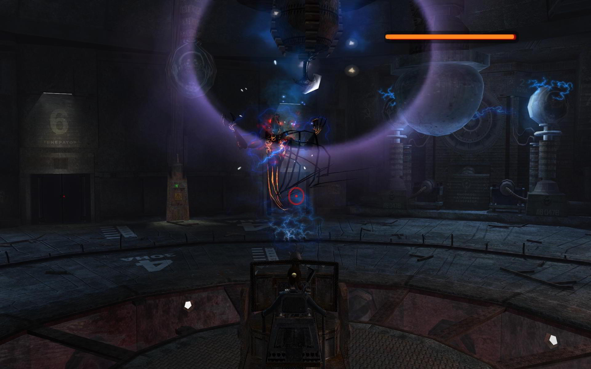

**Ficha técnica:**  
Título: Tomb Raider Legend  
Desarrollador: Crystal Dinamics  
Editor: Proein  
Pegi: +12  
Precio: 44.95 €  
Página web: http://www.tombraider.com/

Por suerte, he tenido la ocasión de catar (al fin!) la aventura Tomb Raider Legend. Tras el fiasco de "El Ángel de la Muerte", el videojuego de Lara Croft vuelve para renovarse y no morir.

El cambio de estudio desarrollador le viene de perlas a este nueva entrega. Tras la escalada de violencia de las últimas ocasiones, Crystal Dinamics se hace cargo y Legend vuelve a traer un juego más aventurero, dejando el combate en un segundo plano aunque sin olvidarse de que también debe estar ahí.

La trama arranca con la investigación de Lara acerca de la muerte de su madre y de su compañera exploradora Amanda. El hilo conductor es, como siempre, lo que determina las localizaciones del juego, que van desde un tropical Perú hasta un frío Nepal, atravesando una sequísima Bolivia y una fértil Ghana, entre otros lugares. Mención especial para Japón, porque en este punto te das cuenta de que nunca has visto una Lara como esta...

Ni tampoco como esta:

El trabajo en los gráficos es de órdago y funcionan muy fluidos, aún a pesar de que los escenarios sean enormes. Lara tiene tantas animaciones y se mueve de forma tan natural que de verdad transmite una sensación física creíble. Y el escenario tampoco se queda atrás, con unos exteriores cuidados y una interactividad envidiable. El trabajo de iluminación es excelente y ayuda también a que todo el conjunto suba enteros. Me viene a la mente ejemplos como el nivel en Inglaterra y la tumba del Rey Arturo. En este único nivel se ve un Tomb Raider plenamente moderno y también el más clásico: la ambientación del museo abandonado es sencillamente puro David Lynch (muy próxima a uno de los niveles de [Max Payne 2](../../../2003/11/max-payne-2/)) y el descenso por los túneles conduce a un Tomb Raider lleno de viejos mitos esculpidos en roca.

Y es que, conforme avanza la aventura, los escenarios (verdaderos protagonistas) intercalan luz y sombra de forma brillante. Cierto es que en el caso de Bolivia o Kazajstan se tira del tópico para resolver la ambientación, pero en este Tomb Raider más cinematográfico es necesario. El uso de pequeños cliches potencia la inmersión y la sensación que proporciona es verdaderamente tangible. Estás ahí, con Lara.

Precisamente en Bolivia, el juego muestra fugazmente sus otras dos aspiraciones: el uso de la moto y el combate en las pequeñas emboscadas que tienden a la señorita Croft. El combate se resuelve con facilidad y espectacularidad porque puedes hacer movimientos muy vistosos sin demasiadas complicaciones. Eso sí, el sistema de apuntado automático es un poco caótico y a veces no convence. Lo de las persecuciones en moto ha mejorado bastante y ahora sí que es algo integrado, menos "artificial". De nuevo, se busca un juego cinematográfico y con la moto lo han conseguido. Repetiremos también más adelante en una memorable escena con trenes... Lo mejor es que suponen un contrapunto muy interesante y consiguen un efecto de velocidad respetablemente bueno para no ser un juego de carreras.

Pero la verdadera esencia del juego es esa vuelta a los puzzles, a misiones de auténtica exploración, de devanarse los sesos intentado dilucidar cómo aferrarnos a un saliente, o cómo alcanzar tal objeto. Las puertas cerradas que tendremos que abrir serán, por fin, la tónica general del juego tras varias entregas que dejaron bastante que desear (Chronicles, El Ángel de la Muerte, etc.). La gran mayoría se resuelven de forma lineal aunque no siempre evidente y algunos de ellos se basan en la activación de palancas, el encadenamiento de saltos o el uso de algún elemento del entorno, principalmente cajas (¡que noticia!)...

La física por su parte es una de las novedades más llamativas. Está muy bien implementada y es otra pieza fundamental de las pruebas. No sólo habrá que mover esas cajas, sino que también habrá que aprender a aprovechar balanceos, improvisar catapultas, jugar con los pesos, etc. A todo ello contribuye un control simplificado y la posibilidad de usar nuestro garfio magnético, con el que atraer objetos, descolgarnos por paredes verticales, etc.

También hay algunas pequeñas secuencias cinemáticas interactivas, donde tendremos que pulsar algunas teclas en el momento adecuado para evitar que Lara muera de forma brutal. Otros accesorios, aparte del garfio o la moto, son los binoculares y su dispositivo electrónico que identifica partes alterables del entorno; o la PDA donde se vuelca toda la información que Lara va recopilando. El dispositivo electrónico es un buen sustituto de las típicas flechas de dirección que, mediante su ayuda, sigue invitando a estrujarnos los sesos cuando no encontramos la solución a un puzzle. La PDA, sin embargo, se queda en un mero "extra" al que casi nadie accederá. Tan solo lo agradecerán aquellos que quieran explorar todos los recovecos del guión.

Las misiones, sin ser totalmente revolucionarias, funcionan muy bien. Alternan estos conceptos de exploracion y combate con las cinemáticas interactivas y en todas ellas iremos recibiendo información de Zip y Allister, los ayudantes de Lara. Durante todo el camino tendremos opcionalmente que recolectar algunos objetos trofeo, que sirven para desbloquear material adiccional: videos, bocetos y arte conceptual, trajes para Lara, etc. Pero al final de cada nivel nos esperan unos jefes finales la mar de feos y muy duros de pelar, como en los viejos tiempos. Como es tradición, también podemos jugar una mini-aventura a través de la mansión Croft.

Por su parte, las voces, los efectos y la banda sonora son auténtico jamón pata negra. Sobretodo la voz de Lara y sus diálogos. Ya no es la chula prepotente y cínica de anteriores ocasiones, sino que por fin vuelve a despertar la simpatía del jugador, con comentarios audaces y sentimientos más humildes. ¿Está "Legend" exento de fallos? Nada más lejos de la realidad. Es un juego muy bueno, pero en ocasiones puntuales la cámara nos puede jugar una mala pasada y es una lástima que apenas dure 8 horas. No obstante, es un paso firme en el enésimo intento de revitalización de esta saga.

Notarás que en esta "review" he incluido muchísimas capturas de pantalla. Y es que es muy dificil quedarse con tal solo seis o siete imágenes de "Tomb Raider Legend". Si como a mí, a ti también te apasiona la aventura, no debes dejarlo pasar.

**Lo mejor de Tomb Raider Legend:**  
Los gráficos a nivel técnico y los escenarios a nivel artístico  
Localizaciones variadas que se van intercalando con ingenio  
La recuperacion del estilo aventurero y de una Lara más amable

**Lo peor de Tomb Raider Legend:**  
Como siempre, hay pequeños problemas de cámara  
Se echan en falta un par de horas más de duración  
Algunas veces, el apuntado automático es caótico e impreciso

**NOTA: 9**

**Requisitos mínimos:**  
Windows 2000, XP  
Procesador Pentium 3 a 1.0Ghz (o Athlon XP equivalente)  
256 MB RAM  
10 GB de espacio libre en disco duro  
Tarjeta gráfica 64 MB con TnL (GeForce 3Ti / ATI Radeon 9 series)  
DirectX 9.0c

**Requisitos recomendados:**  
Windows 2000, XP  
Procesador Pentium 4 a 3.0 GHz (o Athlon XP equivalente)  
1 GB RAM  
10 GB de espacio libre en disco duro  
Tarjeta gráfica de 512 MB (Nvidia GeForce 7800 / ATI Radeon X1800)  
DirectX 9.0c