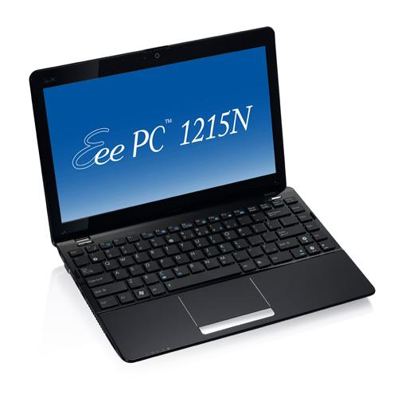
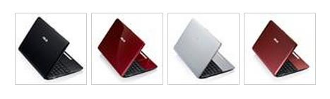
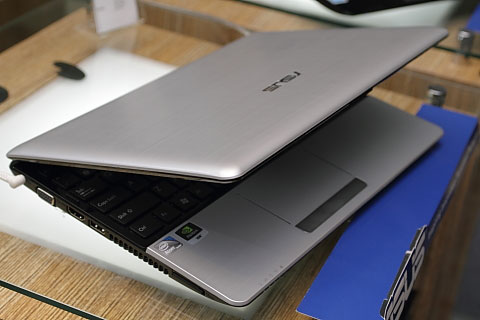
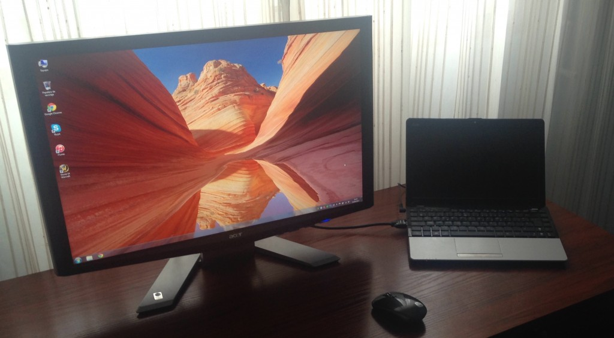
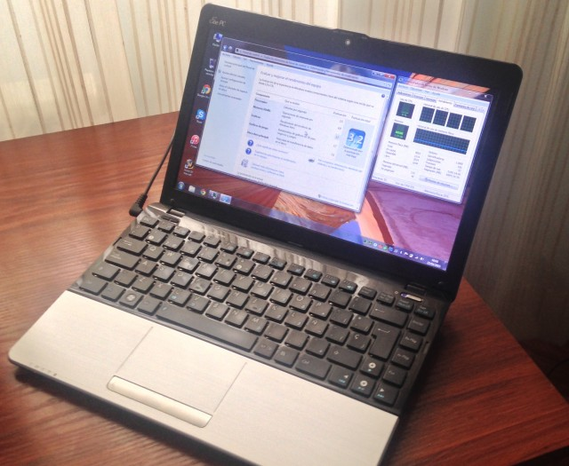
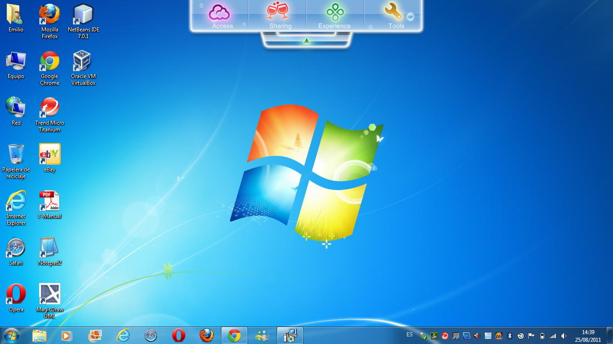
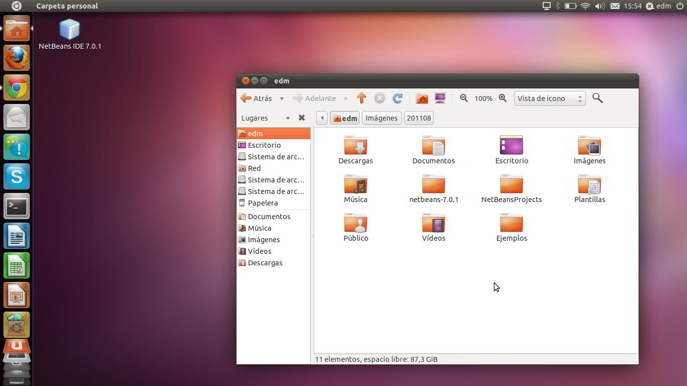
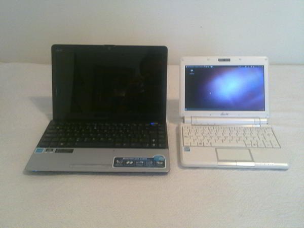
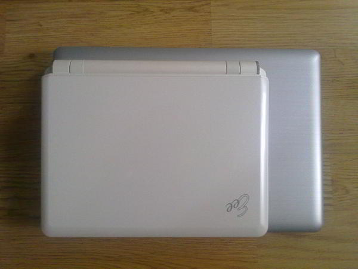
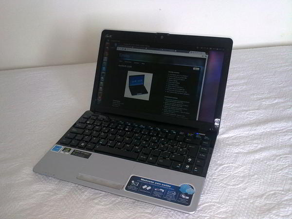

**Ficha Técnica:**  
Nombre: Eee PC 1215N  
Fabricante: Asus  
Precio: 425 €  
Página web: http://eeepc.asus.com/

Ya tengo en mis manos el nuevo Eee PC 1215N, un equipo fabricado por Asus a medio camino entre un netbook y un ordenador ultra-portatil. Como el [Eee PC 901](../../../2008/10/asus-eee-pc-901/) que tenía ya estaba mayorcito (aunque era aún perfecto para muchas cosas), me puse a la búsqueda de un equipo con más potencia y no tardé mucho en decantarme por este 1215N con las siguientes características principales:  
- Pantalla LED de 12 pulgadas con resolución 1366x768 
- Procesador Intel Atom D525 (doble núcleo, 1.8GHz, 1MB caché L2) 
- 2 GB DDR3 
- Gráfica híbrida Intel/Nvidia ION2 (tecnología Optimus) 
- 500 GB de disco duro de 5200 rpm + 500 GB en la nube (Asus Web Storage) 
- Microsoft Windows 7 64-bit Home Premium (con Microsoft Office 2010 Starter) 
- Batería de 6 celdas 5200mAh

Mi elección final ha sido el color plata que, aun tratándose de plástico, le confiere un aspecto de aluminio cepillado (como el de los MacBooks, por ejemplo) que podéis ver en las fotos. También lo hay disponible en negro mate, rojo mate y rojo brillante, aunque en esos acabados se quedan más marcadas las huellas de los dedos. Pero tengo que preguntaros: ¿ninguno de vosotros echa de menos los colores blanco perla, verde pistacho o rosa chicle de la primera generación de EeePCs? Yo sí.

El primer vistazo al equipo es impresionante: las 12 pulgadas permiten que el teclado tenga un tamaño mucho más cómodo que el de la mayoría de los netbooks. Es de tipo chiclet (teclas aisladas unas de otras) y su respuesta es agradable. El touchpad es de un tamaño considerable también, su tacto es muy bueno y permite gestos multitáctiles (acercar, alejar, despejar, etc.). La pantalla es brillante (Glossy) y desgraciadamente esto puede dificultar su uso en exteriores con imágenes oscuras. La webcam trae un deslizador mecánico con el que puedes taparla o destaparla, además de un LED que indica cuando está captando video. Junto a ella también está el pequeño micrófono. Como todos los netbooks de la compañía desde hace un par de años, este viene dentro de una carcasa tipo "Seashell" (concha marina) lo que se traduce en un equipo más fino y con una ligera inclinación del teclado hacia el usuario. No obstante tiene un par de inconvenientes. Lo primero es que estas carcasas pesan tan poco que, en ausencia de la batería, se puede volcar el pc con un ligero empujoncito en la pantalla. No es que vayamos a jugar a los bolos con el ordenador, pero le resta estabilidad. El segundo es que la pantalla precisamente no puede abrirse más allá de unos 130º, aproximadamente. El equipo pesa 1,45 Kg con la batería puesta, lo cual lo convierte en un pc bastante liviano comparado con cualquier ordenador portatil y tampoco es un aumento considerable sobre la media del resto de netbooks ya que estos rondan los 1,25 o 1,30 Kg.

La conectividad está cubierta con creces, como en casi todos los netbooks de la marca; empezando por una tarjeta inalámbrica compatible con redes Wifi b/g/n. También dispone de Bluetooth 3.0 y el clásico conector RJ-45 para redes Ethernet cableadas compatibles con 10/100, pero no Gigabit LAN, lo cual tampoco es un problema dado que su principal atractivo es su movilidad. Incluye un lector de tarjetas de memoria SD/MMC. Tambien tiene los dos clásicos conectores de audio jack (auriculares y micrófono), tres puertos USB 2.0, un conector VGA y un puerto HDMI (para sacar video y audio en alta definición). Precisamente este ultimo es quizás la novedad frente al resto de opciones del mercado, de hecho mi intención es conectarlo al televisor de mi salón cuando me apetezca disfrutar de alguna película en mi Home Cinema.

Esto no sería posible si el Asus Eee PC 1215n no entregase potencia suficiente para realizar tales tareas. No se trata del primer netbook con procesador de doble núcleo, pero sí del primero que incorpora el D525, más avanzado y rápido que los anteriores. Tambien soporta instrucciones de 64-bit. Cada uno de los núcleos puede alcanzar una frecuencia de 1,8 Ghz en carga máxima y dispone de 1 MB de memoria caché de nivel 2, un avance muy importante sobre los 512 KB de los anteriores Atom. Con este chip, el ordenador no se ralentizará por tener abiertas varias pestañas del navegador, un programa ofimático y un reproductor de música como ocurría hasta ahora. Su capacidad le permite eso y más. El sistema dispone de una tarjeta gráfica Intel de bajo rendimiento que, mediante Optimus, se deshabilita para dejar paso a la Nvidia ION2 cuando se requiere mayor procesamiento gráfico. Esto hace posible ejecutar juegos más o menos actuales con calidades medias o bajas; pero es bastante más de lo que hasta ahora permitían otros ordenadores similares. Los 2 GB de memoria RAM DDR-3 harán que todo vaya también más fluido, sobretodo en multitarea bajo un sistema operativo moderno como el propio Windows 7 Home Premium que viene preinstalado.

Todas estas especificaciones están sujetas a pequeñas variaciones. Por ejemplo, hay unidades que no incorporan Bluetooth u otras que en lugar de discos duros de 500 GB, tienen tan solo unidades de 250 GB. La revisión concreta de mi Eee PC 1215N es la SIV-128M. La revisión SIV-06M, por ejemplo, tiene menos disco duro; asi que si vas a comprar el netbook, mejor ponte primero en contacto con la tienda para que te aclaren la revisión del producto o puedes también consultarlo en la etiqueta del lateral de la caja.

Ya que hablamos de discos duros, el particionado de fábrica es el siguiente: C: 100 GB destinados al sistema operativo y a los programas Sin letra: 15 GB correspondientes a la partición de recuperación del sistema D: Aproximadamente 350 GB completamente libres destinados a que el usuario almacene sus datos Sin letra: 16 MB de partición EFI (para acelerar el arranque) Como más tarde instalé Ubuntu, eliminé la partición D: desde el administrador de discos de Windows, para luego crear una partición D: con 250 GB aproximadamente. De los 100 GB restantes, 98 GB fueron a parar al directorio raíz / y 2 GB a la partición de intercambio.

**Rendimiento en Windows 7**  
De partida, hay que decir que Windows 7 es un sistema ávido de recursos. La versión Home Premium trata de cubrir las necesidades de los usuarios domésticos y desde luego que las cubre. Microsoft presiona para popularizar el SO y por eso tambien ha proporcionado a Asus una versión reducida del paquete Office. De modo que nada más encender el Eee PC dispones de un sistema listo para trabajar, navegar por internet y reproducir archivos multimedia. Sin embargo, muchas de esas cosas se podían hacer en Windows XP, por ejemplo, lo que hubiese resultado en un equipo más ágil, pero la falta de drivers lo hace imposible. Lo cierto es que un software capaz, como Windows 7 y Office, dotan al Eee PC de una funcionalidad muy amplia: lo convierten en un PC competente para todo el que necesite una máquina ligera para trabajar con los documentos de una pequeña oficina. Office 2010 Starter está compuesto por las versiones reducidas de Word y Excel 2010, y no hay que pagar nada por ellos. Algo que no me gusta mucho es la cantidad de software que innecesariamente instalan los fabricantes por defecto. Asus ha incorporado bastantes utilidades al 1215N, tanto propias como de terceras partes. Por ejemplo, incluye el antivirus Trend Micro Titanium con licencia para 30 días. En general, tras ejecutar todas las actualizaciones sugeridas por Windows Update, el pc se desenvolvía sin mayores problemas tanto con el perfil de alto rendimiento como con el de ahorro de energía (gestionados con el Asus Super Hybrid Engine). De todas formas el tiempo de arranque seguramente se pueda optimizar relajando el número de aplicaciones que se cargan automáticamente en segundo plano al inciar sesión. Los programas se abren con bastante soltura y los contenidos Flash, como videos de Youtube, se reproducen sin problemas, incluso en alta definición. Obviamente el contenido multimedia se maneja sin problemas y la función de Optimus se hace notar. Todavía no he probado juegos, pero si lo hago, lo comentaré en un artículo aparte, porque no es la función principal de esta máquina.

**Rendimiento en GNU/Linux (Ubuntu 11.04)**  
Ubuntu 11.04 supone un gran paso para esta distribución de GNU/Linux. Es heredera de la interfaz Netbook Remix, ahora transformada en un concepto mucho más elaborado, más allá de una simple capa de la interfaz: Unity pretende funcionar como un dock abierto e integrado en el SO. No obstante, requiere más potencia de proceso que la interfaz clásica de Gnome 2; y todavía hay algunos problemas de estabilidad en determinadas situaciones. Eso sí, en general, se mueve con mayor facilidad que Windows 7 cuando la compatibilidad de hardware lo permite. En la otra mano, tenemos a favor la buena gestión de recursos de Linux y una cantidad de software que quita el hipo. Desde LibreOffice hasta The Gimp, con Banshee, Firefox y un largo etcétera de aplicaciones de contrastada calidad. Nada más instalar y actualizar el SO todo funcionaba como la seda. No hubo incompatibilidad con la tarjeta Wifi, ni con el adaptador Bluetooth. Unity 3D se mueve cómodamente aunque la falta de soporte Optimus obliga a la tarjeta Intel a trabajar sin descanso. En cualquier caso, no hay retardos ni errores; y ni que decir tiene que el escritorio clásico de Gnome 2 funciona también a la perfección. La mayor potencia en memoria y procesador también hacen posible que los contenidos Flash funcionen fluídos y la reproducción multimedia se lleva a cabo sin problemas. Todos los programas ofimáticos corren ligeros en el Asus (como ya lo hacían el en 901) y no se echa en falta mayor potencia en practicamente ningún momento. Ubuntu ha avanzado mucho dando un gran soporte a los netbooks desde hace un par de años. Incluso ha llegado a acuerdos con Asus recientemente para que los Eee PC's lleven Ubuntu preinstalado en lugar de Windows 7. Pero eso no significa que todo sea de color rosa. En el caso del Eee PC 1215N con Ubuntu 11.04, el pc se colgaba al intentar salir del estado de suspensión. Seguramente esto sea un problema menor y fácilmente solucionable, pero pone de relieve que los fabricantes todavía no las tienen todas consigo a la hora de escribir drivers libres para sus dispositivos. Hubo algo mucho peor aún: la unidad dejó de arrancar completeamente tras instalar la utilidad eee-control, seguramente porque el programa aún no soporta el nuevo netbook. Tuve que recurrir a la garantía y por suerte la tienda me proporcionó una unidad nueva.

**Asus Eee PC 1215N VS Asus Eee PC 901**  
Lo primero a lo que se tiene que enfrentar uno en el cambio de 9 a 12 pulgadas es precisamente esas tres que hay de diferencia entre ambos PCs. Cerrados, solo aparenta ser ligeramente más alargado. Ahora bien, abierto ante tí el 1215N resulta imponente. La pantalla es enorme en comparación, más aún con la mayor y mejor resolución. El teclado es muchísimo más cómodo y el touchpad parece venido del futuro. Los gestos con varios dedos ya estaban disponibles en el 901, pero ahora cobran sentido porque antes apenas habia superficie sobre la que desplazarlos. En el 1215N todo es más espacioso; lo cual me lleva a pensar que probablemente 11 o 12 pulgadas sean el tamaño ideal de ordenador portatil.

Algo que se echa en falta son las 4 teclas dedicadas de las que disponía el 901, ahora reducidas a dos: perfil de rendimiento y activar/desactivar Wifi. Tampoco el nuevo ordenador trae aquellos grandes (y buenos) manuales, ni la gamuza para limpiarlo, ni la funda para guardarlo, y eso sí que es algo imprescindible. En el uso para trabajar notas la diferencia cuando has cargado varios programas, pero sin duda lo que más se agradece es una pantalla mucho mejor.

**Conclusión**  
Si ya tienes un netbook, estarás preguntándote si merece la pena actualizarse. La respuesta para la gran mayoría de la gente es: No. Simple y llanamente. Los netbook de la anterior generación (901, 1000H, 1005HA, etc.) siguen siendo perfectamente capaces de ejecutar con soltura las tareas cotidianas de muchos de nosotros. Navegan con soltura por internet, reproducen multimedia sin problemas y, en general, son ordenadores muy capaces. Por eso el desembolso estaría injustificado. La diferencia la notarán aquellos a los que la potencia del típico Atom N270 se les queda corta. Manejar un editor avanzado (en mi caso Netbeans), virtualizar máquinas o poder tener abiertas muchas pestañas de un navegador son tareas costosas para aquellos. En estos casos la respuesta es rotunda: Si. Para este último perfil de usuario, el extra de rendimiento y de pantalla serán grandes beneficios con tan solo unas pocas y pequeñas pegas. El 1215N es un perfecto híbrido entre los manejables netbooks y los potentes portátiles donde usar todas tus aplicaciones habituales. Si buscas un ordenador con esas características, ya tienes a un buen candidato.

**NOTA: 9.5**

**Lo mejor de Asus Eee PC 1215N:**  
El rendimiento es superior al del resto de netbooks actuales  
Gran resolución de pantalla, teclado y touchpad muy cómodos  
El software competente hace que sea un buen híbrido entre netbook y portátil

**Lo peor de Asus Eee PC 1215N:**  
La pantalla es brillante (glossy) y no se abre más de 120º  
Compatibilidad con GNU/Linux (tecnología Optimus, eee-control, suspensión) y que no se pueda encargar con un SSD  
El precio puede resultar alto para un netbook

