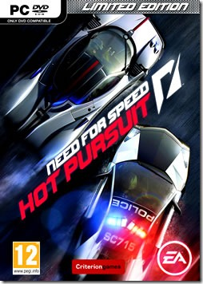
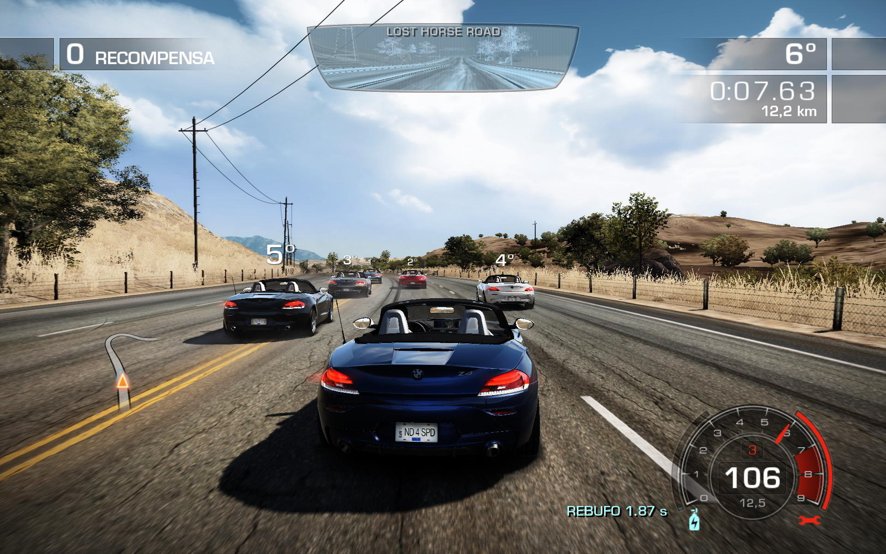
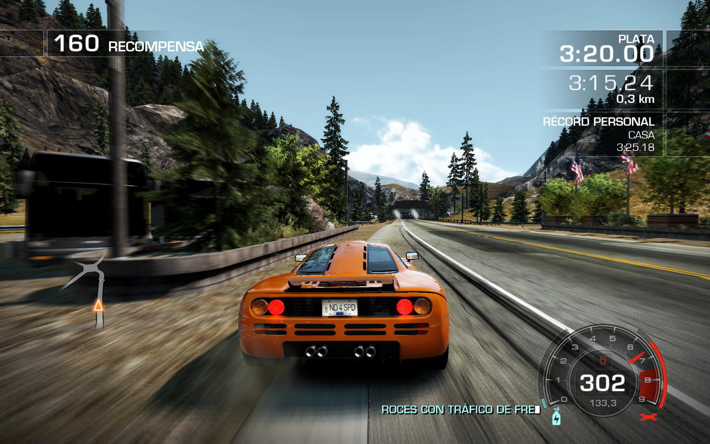
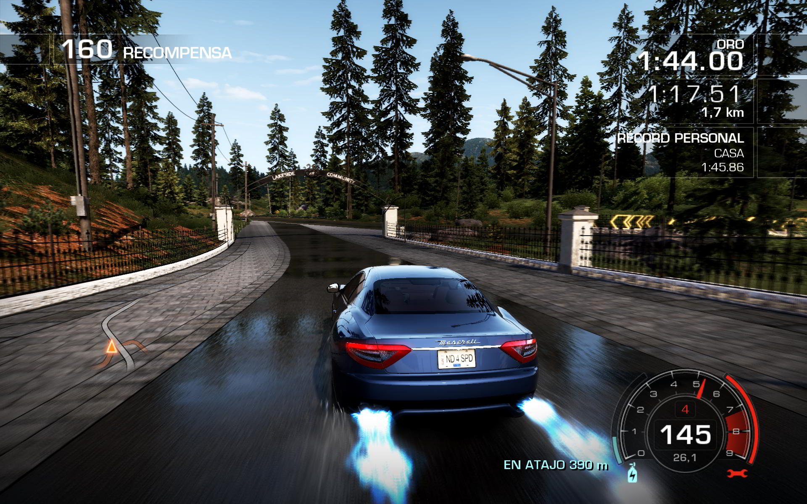
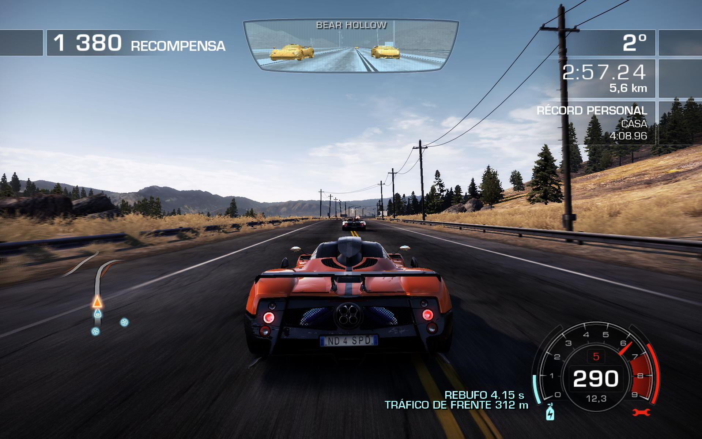

**Ficha Técnica:**  
Título: Need for Speed Hot Pursuit 2011  
Desarrollador: Criterion Games, DICE  
Editor: Electronic Arts  
Pegi: +12  
Precio: 50.95 €  
Página web: http://hotpursuit.needforspeed.com/es

Hacía tiempo que no veíamos un "Hot Pursuit". Enzarzados en carreras callejeras, tunnings y otras modas varias, no nos llevábamos un buen Need For Speed de polis y fugitivos desde hacía ya muchos años. Esta nueva versión viene para remediarlo: ¿lo conseguirá?

El desarrollo ha estado a cargo de Criterion Games, desarrolladores de otro arcade reciente como es Burnout Paradise. Y hay una de cal y otra de arena. Las buenas noticias son que el motor gráfico sigue siendo excelente: los gráficos son muy buenos sin perjudicar mucho el rendimiento, de forma que incluso un PC que ya tenga un par de años podrá correrlo probablemente con todos los ajustes de calidad al máximo o casi. La mala noticia es que esto no es Burnout.

La cantidad de coches disponibles es altísima: desde Ford hasta Mercedes, desde Porsche hasta Pagani. Todos ellos (Lamborgini, Audi, BMW, McLaren, Aston Martin, etc.) gozan de un grado de detalle superrealista y se pueden escoger en diferentes colores, dentro de una paleta propia de cada fabricante. Sin embargo, se echan en falta los Ferrari, o algunos modelos más de Nissan, Bentley, Alfa... De muchos de ellos existen versiones para que la policía de Seacrest County te dé caza.

Éste es el alma del juego: no ser arrollado por los policías... o arrollar a los corredores, porque aquí también puedes ponerte en la piel de las autoridades. Lástima que las misiones "Hot Pursuit" sean tan escasas y que haya un número elevadísimo de carreras al estilo de las de toda la vida: varios corredores y una meta. Para detenerte, la pasma usará bandas de clavos, impulsos electromagnéticos que te hagan perder el control, helicópteros, barreras... ¡hasta se la jugarán ellos mismos a base de empujones! En este sentido, aunque son muy previsibles, son siempre buenos rivales. A tu favor cuentas con sistemas de nitro, turbo, inhibidores, clavos, impulsos, atajos y rutas alternativas con las que poder librarte de ellos durante unos segundos. Por cierto, algunos trucos muy efectivos para llenar la barra de "nitro" son conducir por el carril contrario, tomar atajos, hacer derrapes o conducir al rebufo de tus adversarios. Incluso pasar rozando a otros coches sin chocar es algo bonificado. Todo esto contribuye a potenciar aún más la experiencia arcade. ¿Aún no estás impresionado?

Los circuitos son muy bellos, pero se echan en falta más localizaciones urbanas. Pasas por los desiertos y los puertos de montaña como alma que lleva el diablo, visitas fugazmente alguna que otra playa; pero nunca llegas a un atasco por un semáforo o un cruce de calles. Ahí es cuando te acuerdas de Burnout. Quizás las postales no fuesen tan bonitas; pero la ciudad era mucho más intensa, sobretodo cuando había mucho tráfico. Vistos los coches, los modos de juego y los circuitos, queda repasar lo que ofrece a nivel sonoro. Y la verdad es que los efectos están a la altura de los gráficos, pero lamentablemente la banda sonora no. Las canciones se repiten más que el ajo y no son nada "enrolladas"; más bien todo lo contrario. Apenas encontrarás dos o tres rescatables, y aun así, quedarás insatisfecho.

En el apartado de la jugabilidad es donde el juego puede sorprender o hundirse. Para empezar el control es muy poco realista. El freno está muy exagerado, y el freno de mano es una auténtica lotería. Por suerte, un pad con 10 o 12 botones puede ponerte al cargo de la mayoría de las acciones disponibles y el joystick analógico te proporcionará mayor control sobre la trazada. Por desgracia, aunque el número de misiones es alto y su dificultad está muy bien calibrada, el juego no invita a ser rejugado teniendo en cuenta que, como dije, resulta muy repetitivo. Menos aún sin un sistema de pantalla partida para 2 jugadores. En su lugar se recurre a una especie de "red social para jugadores" llamada Autolog, omnipresente en el juego y que si no te registras, te dará la vara continuamente recordándote que en ella puedes ver los tiempos de tus amigos, competir contra ellos, etc... Por internet. Algo imperdonable para un juego que en modo carrera para dos (por ejemplo, uno policía, el otro fugitivo) podría ser una fuente inagotable de diversión en el salón de tu casa. Olvídate también de mejoras para tus coches o de simplemente conducir sin competir.

De modo que nos encontramos de nuevo ante un producto multiplataforma bueno a nivel técnico pero fatalmente ejecutado. A pesar de contar con una buena base tecnológica, su falta de variedad y su jugabilidad aquejada de varios problemas de consideración lo relegan a un segundo puesto en el ranking de arcades de conducción actuales; justo por detrás de su hermano Burnout Paradise.

**NOTA: 7**

**Lo mejor de Need for Speed Hot Pursuit 2011:**  
Gran nivel técnico gráfico y sonoro  
Las carreras Hot Pursuit y la sensación de arcade puro  
Muchísimos coches diferentes

**Lo peor de Need for Speed Hot Pursuit 2011:**  
Escenarios poco transitados, mecánica repetitiva  
El control, la falta de modo para dos y que no se pueda desactivar Autolog  
Se echan en falta posibilidad de modificaciones, mejor música, más circuitos...

**Requisitos mínimos:**  
Windows XP  
Procesador Intel Core2Duo 1.8 GHZ ó AMD Athlon X2 64 2.4GHZ  
1.5 GB de RAM  
6.5 GB de disco duro  
Tarjeta gráfica de 256 MB compatible con DirectX 9.0 con Shader Model 3.0

**Requisitos recomendados:**  
Windows XP (SP3) / Windows Vista / Windows 7  
Procesador Intel Core2Duo E6700 a 2.6 GHz ó AMD Athlon 64 X2 6000+  
2 GB de RAM  
8 GB de disco duro  
Tarjeta Nvidia GeForce 8800 GT ó ATI Radeon HD 4700