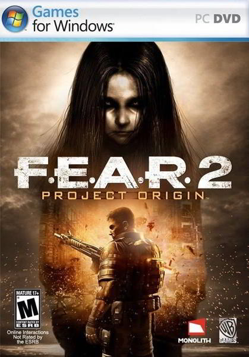
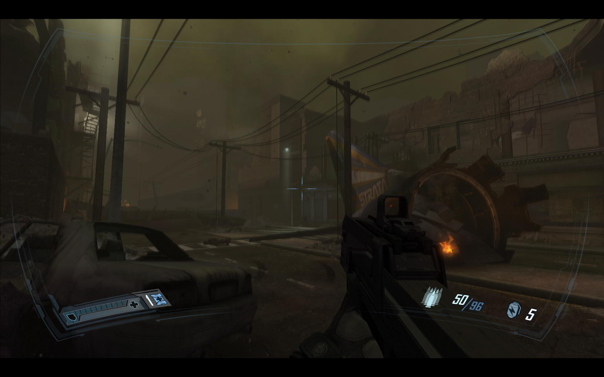
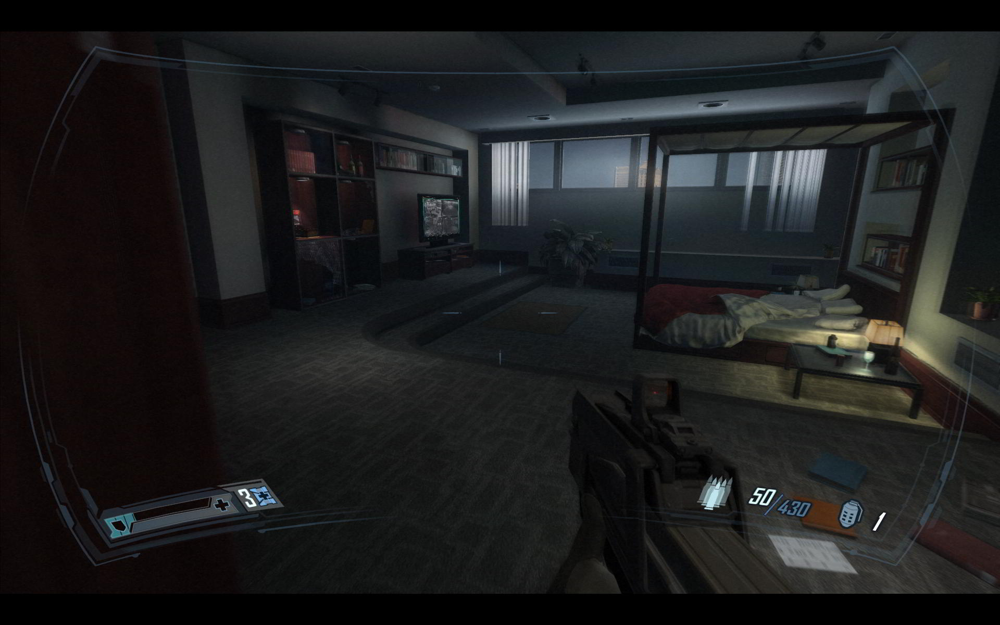
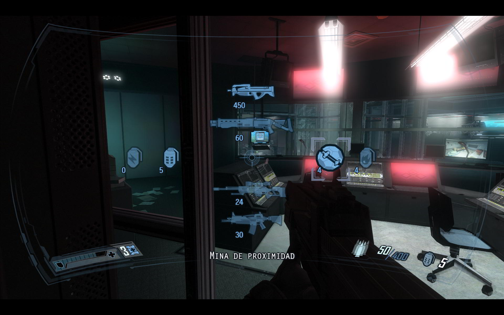
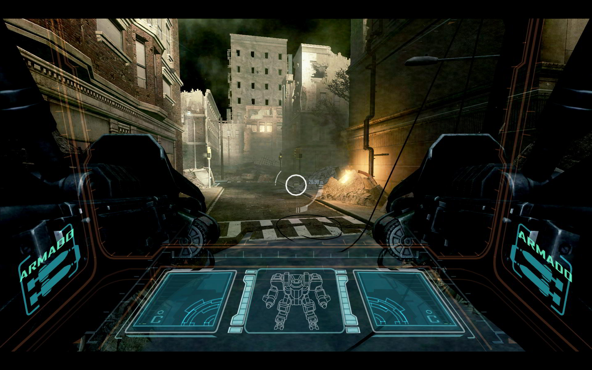
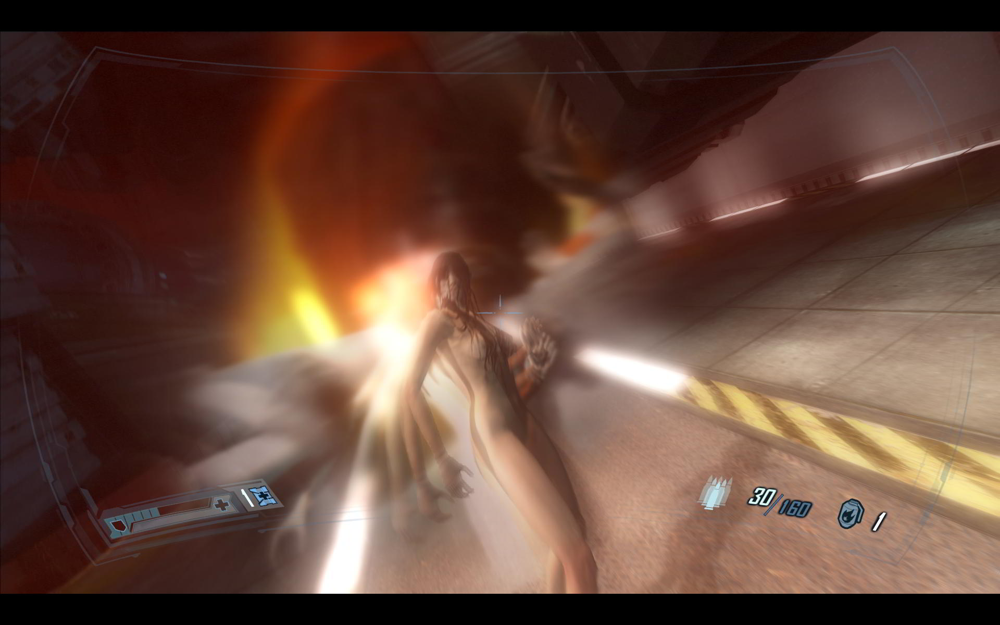
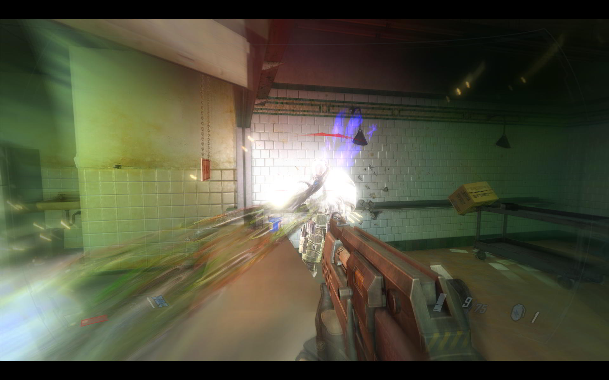
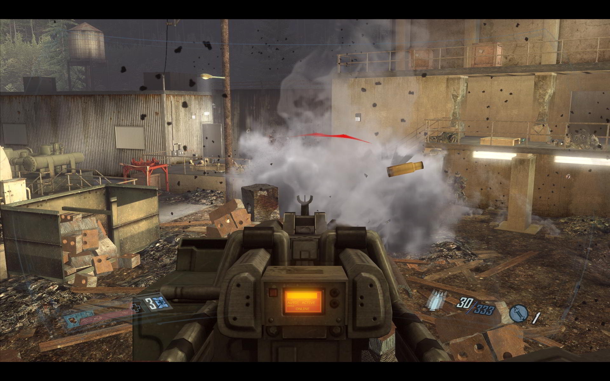
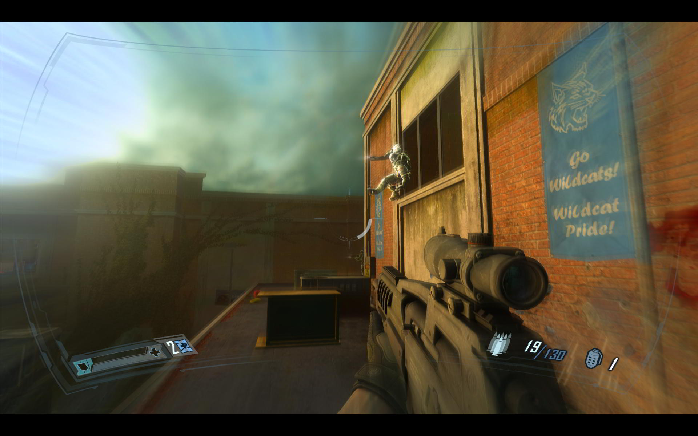

**Ficha Técnica:**  
Título: F.E.A.R. 2 Project Origin  
Desarrollador: Monolith Productions  
Editor: Warner Games  
Pegi: +18  
Precio: 49.95 €  
Página web: http://www.whatisfear.com/

**Una review sencilla...**  
Analizar F.E.A.R. 2 va a ser algo muy sencillo tratándose de la secuela de un juego bien conocido; pero antes de entrar en detalles, pongámonos en contexto: Creíamos que volando por los aires el complejo de Origen todo terminaría y Alma se iría al fin a dormir el sueño de los justos; pero algo había salido mal y, en el último suspiro del juego, volvía para darnos justicia. A partir de ahí, la historia fue continuada ligeramente en “Extraction Point” y otras ideas se soslayaron con “Perseus Mandate”, dos expansiones más bien discretas y a las que F.E.A.R. 2 no va prestar ni la menor atención. En su lugar, nos sitúa en la piel de Becket, parte de un cuerpo de operaciones especiales que media hora antes de la explosión nuclear intenta localizar a una señorita que posee información vital sobre el caos desatado en la ciudad. Buen punto de partida para un nuevo enfoque al juego de sustos que fue [F.E.A.R.](../../../2005/11/fear/) Monolith, los desarrolladores del primero, fueron comprados por Warner Games poco después de que fuese publicado el juego. Desgraciadamente los derechos sobre su título recaían en Activision (luego fusionada con los responsables de [World of Warcraft](../../../2007/02/world-of-warcraft/) para dar Activision/Blizzard) y no fue hasta pocas semanas antes de su lanzamiento que Warner recuperó el título. El juego podría llamarse F.E.A.R. 2 aunque por si las moscas ya tenían lo de “Project Origin” en la manga. Entre tanto bailoteo, otras cosas se fueron quedando atrás. Para empezar, el motor tecnológico del primer F.E.A.R., que cuatro años después ya no estaba para más trotes. Es una lástima porque su física, efectos y cantidad de ajustes eran envidiables. F.E.A.R. 2 camina con una tecnología más avanzada, pero que presta un poco menos de atención a los detalles.

**Sobre raíles...**  
En la mecánica de juego ha habido variaciones. Para empezar, el ritmo es mucho más elevado, algo que todos agradeceremos: el juego está más orientado al combate que antes y hay soldados enemigos hasta debajo de las piedras. Me dirás: “Ya, pero también los había en el original...”; y es cierto. Sin embargo, y especialmente en las pantallas de las oficinas y del complejo industrial, pasábamos mucho tiempo de aquí para allá por pasillos interminables, monótonos y faltos de expresividad. Muchas veces incluso aburridos. Ahora el escenario está mucho mejor presentado y eso facilita que haya muchos más combates. En lugar de tantos pasillos, hay muchas más puertas tras las que disparar o mesas que usar como barricadas. Sin ser [Crysis](../../../2007/12/crysis/), F.E.A.R. 2 ahonda en una de las mayores virtudes de su antecesor: el combate armado.

Son precisamente esos escenarios los que han ganado cientos de puntos a favor entre un juego y otro. Aunque sean menos destructibles, son mucho más vivos y quiero hacer mención especial al nivel del hospital y al de la escuela. En el primero obtienes mucho de F.E.A.R.: pasillos, cristales translúcidos, ascensores, camillas, herramientas quirúrgicas... consigue que te rechinen los dientes con solo verlo. De libro. La escuela infantil, por su parte, es la mejor expresión de la locura enfermiza de Alma, que vuelve a ser la protagonista en la sombra. Taquillas abriéndose, risas lejanas, crípticos dibujos en las pizarras... En contra de este mejor diseño artístico tenemos una linealidad especialmente marcada. Es un juego tan atado por su historia que queda a merced de que el jugador camine siempre por la ruta marcada; y los desarrolladores no han sabido implementar un mayor grado de libertad de acción: los pasillos y las habitaciones son ratoneras de un solo sentido. Vamos con armas y enemigos: de las primeras poco podemos decir, ya que apenas hay incorporaciones. Y si son como el cañón de Napalm, tan divertido como poco útil, mejor tirar de lo conocido: escopetas, rifle de asalto, francotirador, rayo láser, lanzamisiles, etc. No está mal pero no ha habido evolución.

En los enemigos se ha cometido un total despropósito. Siendo la IA uno de los puntos fuertes del anterior F.E.A.R., aquí apenas son algo más listos. Se parapetan, saben lanzar granadas, corren cuando pueden y demás. Pero no han desplegado más tácticas de grupo que intentar acorralarte cortándote el paso en el mismo punto del pasillo o atravesando la habitación contigua. No organizan buenas escabechinas como lanzarte objetos a su alcance para derribarte o destruir elementos del escenario que te perjudiquen; algo ya visto en otros juegos. El avance es prácticamente nulo en este aspecto. En espacios abiertos, esta carencia es realmente palpable; incluso jugando en el modo difícil. Algo que sí me ha gustado mucho ha sido el poder utilizar uno de esos “mech” de Armacham para aniquilar soldados a diestro y siniestro. Se manejan fácilmente tienen la capacidad destructiva justa y además ofrecen un combate mucho más frenético aún. También superados los tres cuartos del juego podemos tomar los mandos de una torreta armada del vehículo del equipo para dar fuego de cobertura a los compañeros. Porque sí, amigo, en este F.E.A.R. 2 tienes algo más de compañía que en el original; y eso es un puntazo en las fases de combate.

**En compañía**  
Si la IA enemiga no es para echar cohetes, la aliada tampoco. Aún así, cumple las expectativas de ser moderadamente autosuficiente cuando tiene que combatir a tu lado. Los modelos de personajes han dado un gran salto de calidad y las animaciones también están bastante conseguidas. Las caras no llegan a ser totalmente expresivas, pero es algo perdonable: generalmente no os vais a detener a contar chistes virtuales sobre un soldado de las fuerzas de Réplica que entra en un bar y dice... En realidad, el escaso combate cooperativo que hay se presenta bien repartido a lo largo de la aventura y no tienes la sensación del original de que eres tú contra el mundo: los encuentros son fugaces pero están bien diseminados.

**Bhuuu!**  
¡Doble de sustos para el caballero! La tensión que despierta Alma a su alrededor está potenciada en F.E.A.R. 2, con apariciones mucho más siniestras y directas; pero sobre todo, frecuentes. Prácticamente no hay ese toma y daca del original entre niveles de puro combate y niveles de puro miedo. Ahora se han fusionado ambos obteniendo una mezcla mucho más consistente, dinámica y menos previsible. Tenemos desde las típicas sombras o las puertas que nadie ha cerrado hasta las apariciones demoníacas o las visiones febriles del protagonista. Por supuesto no faltan fantasmas, saltimbanquis eléctricos, monstruos, unos zombies que invocan soldados de la nada, etc. En el imaginario de esta entrega, los sustos son algo más que lámparas de araña oscilando para proyectar inquietantes sombras. Hay lúgubres pasillos, pero se han incorporado formas de miedo más viscerales y contra las que combatir rifle en ristre.

Todo este paquete de acción, terror y combate viene envuelto en unos gráficos de gran calidad que parecen mejores aún gracias al uso de muchos efectos avanzados y filtros. Imágenes borrosas, sombras en tiempo real, desenfoque, etc. Uno de los puntos clave es el cambio en la paleta de colores: tan pronto estás en un frío entorno donde predominan blanco y negro como en un desierto de sulfato y roca ardiente. También las animaciones siguen siendo bastante convincentes, en especial las de saltar por encima de un parapeto o por una ventana. Los enemigos harán gala de este ballet que, usando los reflejos del protagonista son todavía más espectaculares. La acción a cámara lenta es necesaria para completar con éxito la aventura y su efecto es visualmente increíble: rastros de balas, toda una habitación haciéndose en pedazos según vacías tus cargadores y los soldados derribando mesas para cubrirse... Es espectáculo puro; más aún que en el primer F.E.A.R. Por suerte, todo el juego puede correr fluido en cualquier equipo de gama media a alta resolución y con un nivel de detalle considerable. No obstante, la música no ha variado prácticamente en nada, porque la mayor parte de la banda sonora es exactamente la misma empleada en F.E.A.R. La duración tampoco ha cambiado mucho, situándose en torno a las 15 horas de juego.

En definitiva: si te gustó el primer F.E.A.R., esta nueva entrega será la alegría de tu disco duro durante un par de días más, lo justo para que disfrutes de su poderío visual y de su combate. El guión conseguirá de nuevo mantenerte intranquilo, pero ahora la descarga de adrenalina es muy superior gracias a los más frecuentes tiroteos, que ya eran la gran baza de su antecesor. El trabajo artístico es de sobresaliente pero también aqueja una ligera falta de originalidad en unos y otros apartados que le impiden obtener la misma valoración en el global. Bastante recomendable.

**NOTA: 7.75**

**Lo mejor de F.E.A.R. 2 Project Origin:**  
Los combates siguen siendo espectaculares, y ahora también son cooperativos.  
El avance en el diseño artístico es enorme y la historia se desarrolla mucho mejor.  
La tecnología sobre la que se sustenta es muy efectiva

**Lo peor de F.E.A.R. 2 Project Origin:**  
En algunos aspectos ha habido poca o nula evolución  
Excesiva linealidad  
Las nuevas armas no aportan nada destacable.

**Requisitos mínimos:**  
Procesador Pentium 4 2.8GHz (3.2GHz en Vista) o AMD Athlon 64 3000+ (3200+ en Vista)  
Tarjeta gráfica NVidia 6800 o ATI X700 con 256 Mb  
1 Gb de memoria RAM (1.5 Gb en Windows Vista)  
12 GB de espacio libre en el disco duro  
DirectX 9.0

**Requisitos recomendados:**  
Procesador Intel Core 2 Duo 2.2GHz o AMD Athlon 64 X2 4400+  
Tarjeta Gráfica NVidia 8600 GTS o ATI HD 2900 XT con 512 Mb  
1.5 Gb de memoria RAM  
12 Gb de espacio libre en el disco duro  
DirectX: 9.0