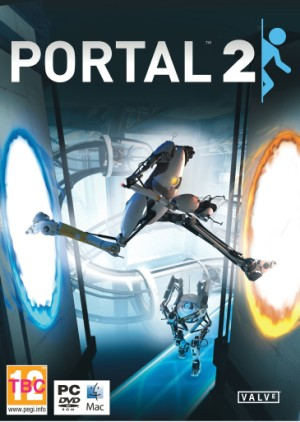
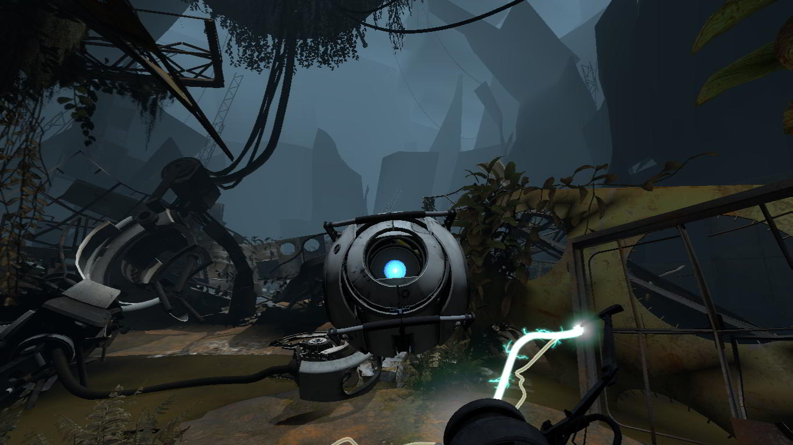
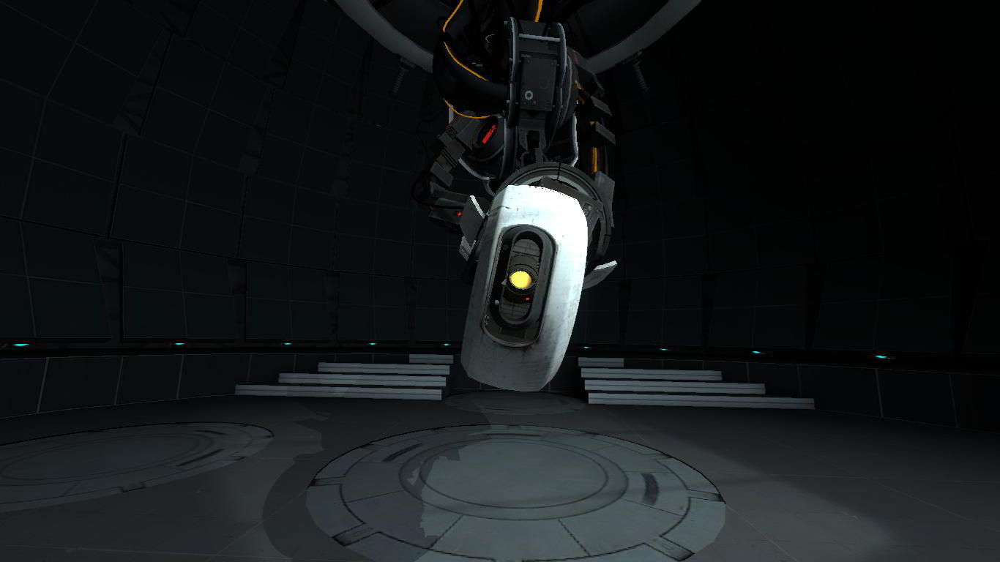
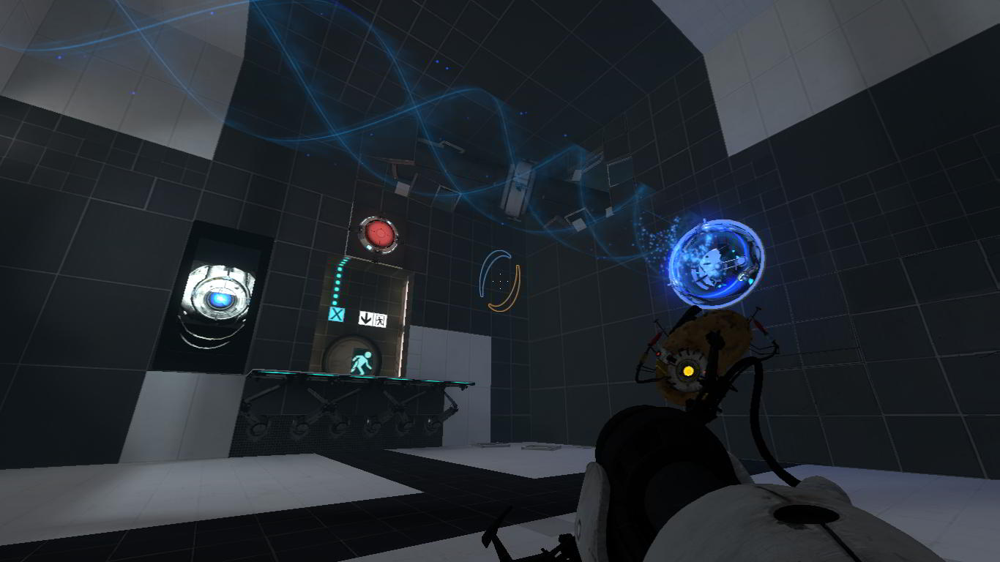
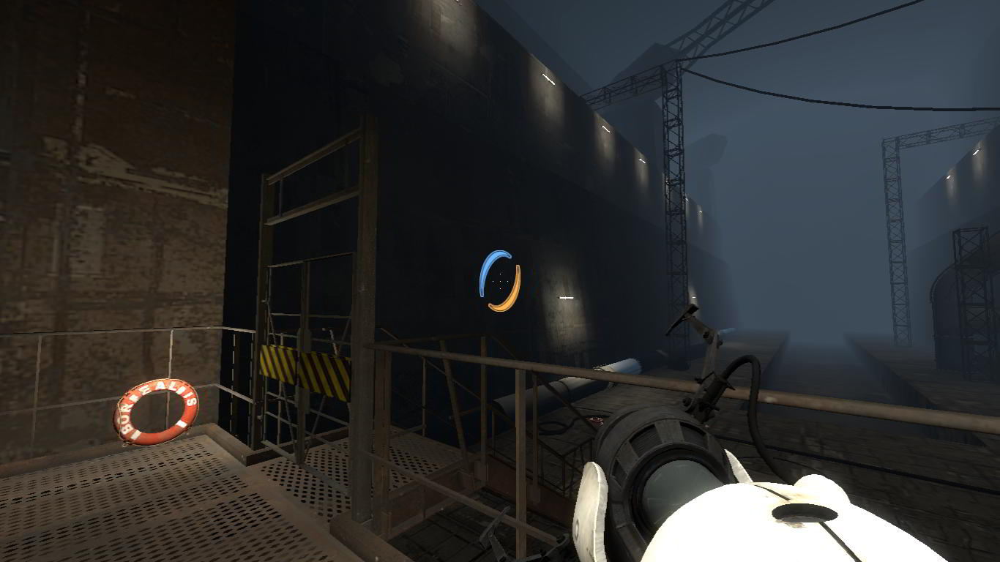
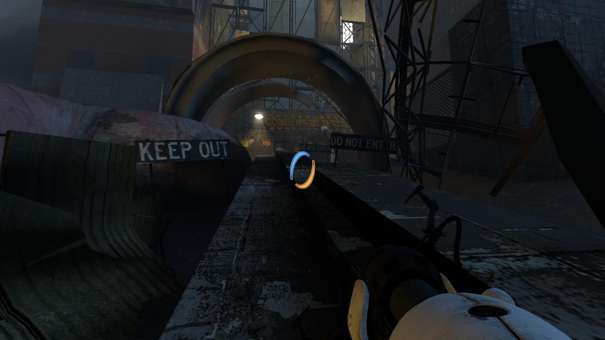
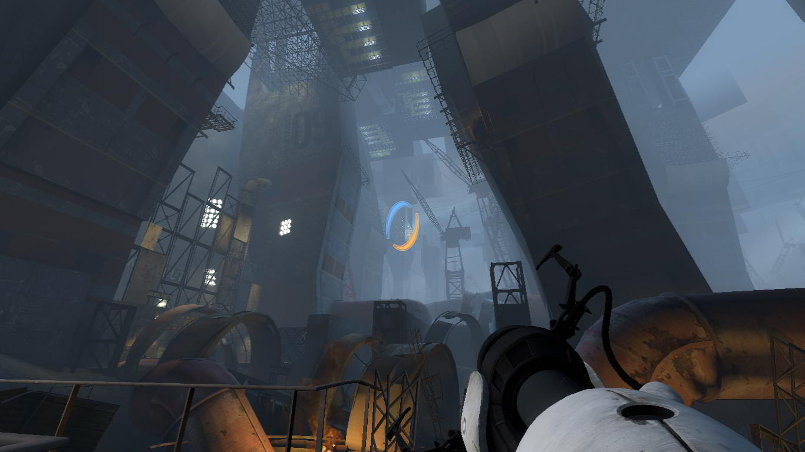

**Ficha Técnica:**  
Título: Portal  
Desarrollador: Valve Software  
Editor: Electronic Arts  
Precio: 69.95 €  
Página web: http://www.thinkwithportals.com/

Han pasado ya varios días desde que terminé Portal 2 y aún no salgo de mi asombro. El salto de calidad desde la [primera entrega](../../../2007/10/portal-orange-box/) a esta ha sido enorme y te aseguro que las capturas de pantalla que pongo ni tan siquiera te darán una idea del tremendo cambio sufrido. La sensación ahora de que Portal tan solo fue un experimento de Valve se hace aún más palpable; porque sólo en Portal 2 se nos ha mostrado todo el potencial de esta mecánica de puzzles, portales de teletransporte y cámaras de prueba...

**Amigos**  
Comienzas con la protagonista despertándose para unas operaciones de rutina. Aperture Laboratories saca de su letargo a sus sujetos de prueba cada 50 días para mantenerlos en condiciones óptimas. Una vez te has movido un poco y has recibido estímulos básicos, vuelves a dormirte. Cuando te despiertas definitivamente, ha pasado mucho más tiempo del previsto; pero Wheatley, un pequeño robot, viene a salvarte del caos en el que está sumido Aperture. Instalaciones ruinosas, inundadas de agua y plantas; cientos de mecanismos averiados, paredes rotas y suelos desplomados... ¿Qué queda de aquellas cámaras pulcras y asépticas?

Wheatley es el primer estocazo que Portal 2 te asesta: el personaje, aún sin cara, es de los más expresivos que yo recuerde. El trabajo de doblaje es tan abrumador que no hay palabras para describir cómo te encariñas con el personaje desde el primer segundo. Escuchar sus indicaciones a través de esa alegre y dubitativa voz se erige como una de las claves para que el juego resulte tan divertido.

Según te abres paso por las instalaciones, descubres que Aperture ya no está regido por Glados... de momento, porque enseguida se produce el reencuentro: la difunta máquina se despierta y recompone; pero no puedo contarte nada más: la historia cuenta con unos fantásticos giros argumentales dignos de la mayor aventura jamás jugada 😀 En estos giros, conocerás a Cave Johnson y a Caroline. Sobretodo al primero. Y te reirás, ¡vaya que si te reirás! Este hombre es tan palpable, tan real, tan caricaturesco y a la vez sólido, que a él si que lo echarás de menos cuando termines el juego (espera a acabarlo para ver los videos promocionales incluídos en los extras).

**Los Puzzles**  
La mecánica en Portal 2 sigue prácticamente inalterada: el juego te va encerrando en diferentes escenarios con una única salida a la que debes acceder resolviendo un bello rompecabezas. Cuentas con la pistola de portales, cajas e interruptores; todo ello heredado de Portal. Pero ahora también te las tendrás que ver con unos geles especiales que potencian un evento físico: el azul te hace saltar más lejos, el naranja te proporciona más velocidad y el blanco te permite abrir portales en cualquier superficie que impregne. El otro añadido más interesante son los puentes de luz y los pozos de gravedad. Los primeros son largas pasarelas mientras que los segundos son unos cilindros luminosos que te empujan en una única dirección. Estos elementos son los que, a la postre, componen los puzzles de Portal 2, más intrincados, imaginativos y satisfactorios que los de su antecesor.

En tu contra, obviamente, torretas que disparan, rayos que te queman, aguas en las que ahogarse, precipicios que no tienen fin... El constante reto y la adictiva sensación que te deja el superar pantallas hacen que siempre el juego te empuje a jugar un poco más. También en algún momento no hay que hacer nada (pequeñas secuencias cinemáticas interactivas que conectan diferentes partes del argumento) y que en otras cámaras hay mucho por hacer. Por ejemplo, descubrir pequeños entresijos como el dique seco del Borealis, barco que todos creemos que habrá que visitar en Half-Life 3 (¡si es que sale algún día, demonios!).

A propósito de Half-Life, en Portal 2 las referencias a la franquicia son mucho más abundantes y esclarecedoras. Además apuntan a cual será el punto de partida del guión de una nueva entrega de Gordon Freeman; pero eso sí, no esperes encontrar aquí las respuestas a tus preguntas. Lo que sí se puede entrever es la competencia existente entre Aperture y Black Mesa que ya suscitaba el primer Portal; así como el detalle del barco.

**Las tripas de Aperture**  
Bajo el capó de Portal 2 se encuentra el inmortal motor de Half-Life 2. El rendimiento es sobresaliente y sus gráficos son lo que todos esperamos: muy buenos. Mejor aún, la iluminación y el trabajo artístico hacen que todavía parezca la última tecnología del mercado. No da la sensación de que se vaya a quedar atrás tan fácilmente, a pesar de que Source lleva ya 8 años entre nosotros. Sí, ocho. ¿Como te quedas?

El control y la jugabilidad siguen perfectamente calibrados, así como el ritmo de juego, que se distribuye perfectamente a lo largo de unas 15 horas de juego aproximadamente. La dificultad está bastante afinada, aunque no siempre la salida es evidente y precisamente éso es lo que debe ser un juego de puzzles: un juego con el que estrujarse los sesos y no correr como un loco pegando tiros a diestro y siniestro.

Por otro lado tenemos un divertido modo cooperativo en el que resolver aún más puzzles, pero que se aleja de la mecánica inicial; pareciendo otro juego completamente diferente y, al final, como metido con calzador. Portal 2 es un juego que necesita o bien de otro modo cooperativo o bien de ninguno.

Pero sin duda el Óscar se lo lleva a la mejor interpretación y al diseño artístico. Portal 2 es un juego con mucha mucha mucha personalidad. Desde las voces de Wheatley o Cave hasta la canción del final del juego. ¿Y que decir del final? Bueno, ejem, juégalo y me cuentas...

**Dando el salto**  
En definitiva: sigo sin poder explicarte con palabras lo que es exactamente Portal 2. Y menos posible aún me resulta explicarte la sensación con la que le deja a uno. Juégalo, no lo dudes. Merece la pena hasta el último rincón, hasta el último diálogo y hasta que Valve se digne a entregarnos más carne a quienes la estamos esperando.

**NOTA: 9.5**

**Lo mejor de Portal 2:**  
Gran diseño de puzzles  
Gran guión con un tremendo trabajo artístico y de doblaje  
Mecánica mejor explotada

**Lo peor de Portal 2:**  
El modo cooperativo no es del todo satisfactorio  
El motor gráfico está llegando al fin de su vida útil  
No hay elementos de oposición nuevos, solo las torretas

**Requisitos mínimos:**  
Procesador a 1.7 GHz  
512 MB de RAM  
Tarjeta de video compatible con DirectX 8  
Windows 2000/XP/Vista  
Conexión a Internet

**Requisitos recomendados:**  
Pentium 4 a 3.0 GHz  
1 GB de RAM  
Tarjeta de video compatible con DirectX 9  
Windows 2000/XP/Vista  
Conexión a Internet

**NOTA:** Dado que se trata del mismo motor de Portal, si has jugado al primero podrás jugar a este, aunque la carga gráfica es más elevada en algunos puntos...