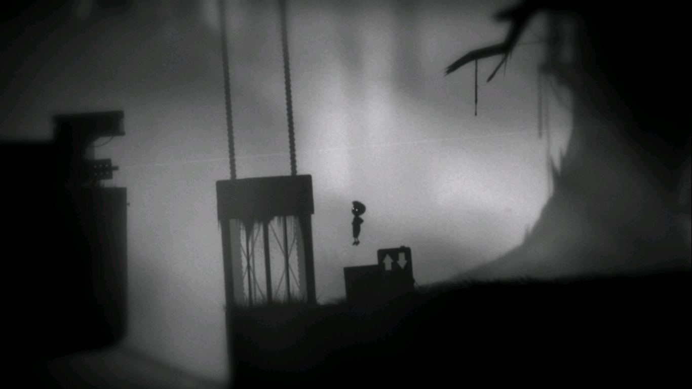
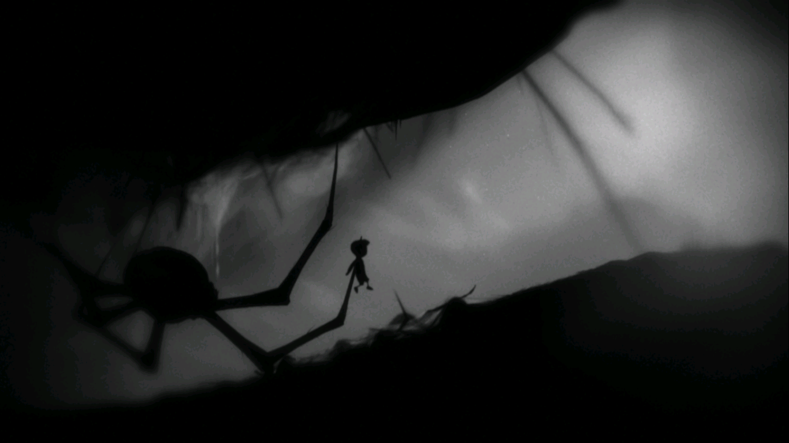
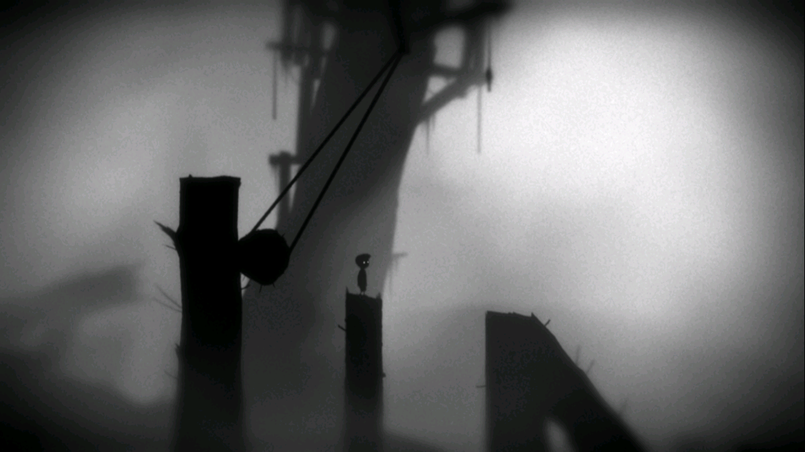

**Ficha Técnica:**  
Título: Limbo  
Desarrollador: Playdead  
Precio: 7.99 €  
Página web: http://limbogame.org/

Ya habia oído hablar de Limbo hace unas semanas, pero todavía me preguntaba lo que era en realidad. Ahora que forma parte del [Humble Indie Bundle V](http://www.humblebundle.com/), la oportunidad para disfrutarlo no se puede dejar pasar.

Confieso que en los últimos años me he desconectado (por unos motivos u otros) del mundo del videojuego. De estar a la última, a ser el último en enterarme. Ahora he vuelto a instalar [Steam](http://store.steampowered.com), a jugar a algunos títulos y a estar algo más al corriente de las novedades. El mercado ha cambiado mucho: ahora te pre-compras el juego, se va descargando, luego te lo terminas enseguida y vuelta a empezar porque hay mogollón de contenidos descargables adicionales sin los cuales no puedes vivir. Y en esta industria altamente fortificada, muchos buscan vías de escape en los juegos independientes. Nace así el concepto de Humble Indie Bundle. Y triunfa.

Limbo es exactamente eso, un juego indie. Un título independiente, atemporal, simple, directo y compacto. No hay DLCs, no hay fusión de cientos de géneros, no hay presión. Y así, sin comerlo ni beberlo, te sume en un mundo post-mortem más cercano a Tim Burton que a The Walking Dead. Gráficos simples, plataformas bien diseñadas y puzzles muy competentes.

Eres un niño. No sabes quien. Y buscas a tu hermana perdida. Esa búsqueda te llevará a visitar bosques infestados de trampas, de arañas, de moscas... cavernas subterráneas donde hay pasadizos oscuros, escenarios industriales con cuchillas que te pueden convertir en zorza o pesada maquinaria que te puede aplastar a la mínima de cambio. También chispazos eléctricos, ascensores, imanes, cambios de gravedad, etc.

Todo ello son los ingredientes de Limbo, un juego que no llegará más allá de las 4 o 5 horas de juego y que activará tus neuronas sin necesidad de mayores fuegos de artificio a lo largo de 39 retos. Uno de los grandes atractivos es su estética sombría. Además de la acertadísima paleta de color (o la ausencia de ella), los escenarios conseguirán transmitirte una atmósfera coherente en la que es fácil dejarse llevar y avanzar hasta el siguiente objetivo.

En cierta manera, Limbo goza de la personalidad que [muchos otros juegos](../../../2005/11/fear/) quisieran para sí. Da la sensación que los daneses de Playdead sabían bien lo que querían; y la ausencia de un editor les ha otorgado toda la libertad posible. Quizá esa sea la clave: es un juego hecho por jugadores para jugadores, sin hombres trajeados de maletín de por medio, ni [franquicias a las que exprimir cada vez un poco más allá](../../../2008/12/call-of-duty-5-world-at-war/)...

Algo que funciona de maravilla es el tandem puzzle-plataforma. En incontables ocasiones, te enfrentarás a los escenarios por partida doble: primero averiguando su solución y luego intentando sincronizarla con la mecánica de correr y saltar. La dificultad de superarlos no es excesiva, aunque te puede obligar a intentar algunas cosas más de una o de dos o de... diez veces. Dependerá de tu habilidad y de tu capacidad para resolver los niveles. Y qué decir de los intentos fallidos... nuestro avatar puede ser trinchado, aplastado, despedazado, empalado, electrocutado, ahogado, quemado, arrollado, ... las muertes son violentas, brutales; y los efectos de sonido, viscerales y orgánicos. Por todo lo largo y ancho del juego se perciben dosis bien calibradas de buen humor negro.

Todas estas eventualidades las resolverás nada más que con las teclas de dirección y la tecla de acción (Ctrl). Con esta tecla puedes arrastrar objetos o tirar de ellos, activar botones y mover palancas. Simple pero eficaz.

Ténicamente, el juego cumple sin más. Al no haber fuegos de artificio de ultimísima generación, bastará con un ordenador medio. Incluso se pudo ejecutar sin problemas en mi [ordenador](../../../2011/08/asus-eee-pc-1215n/). Los efectos sonoros ya los he comentado, pero practicamente aparte de estos sólo oiremos el suave viento y los ruidos sordos del bosque o de los escenarios industriales. Además, el juego se puede ejecutar bajo Windows, MacOS y Linux 🙂

**NOTA: 6.75**

**Lo mejor de Limbo:**  
Combinación de puzzles y plataformas  
Los escenarios y los retos  
Rendimiento bien optimizado y compatibilidad MacOS y Linux

**Lo peor de Limbo:**  
Falta de una banda sonora más dinámica en determinadas situaciones  
La dificultad es principalmente baja  
Duración muy escasa

**Requisitos mínimos:**  
Procesador a 2 GHz  
512 MB de RAM  
Tarjeta de video compatible con DirectX 9 y Shader Model 3.0  
Windows XP/Vista/7

**NOTA:** No se han publicado de forma oficial unos requisitos recomendados