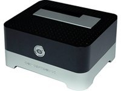
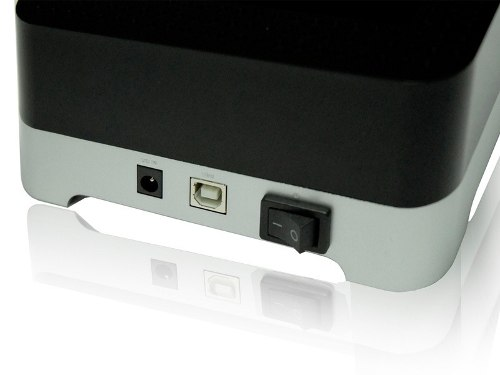
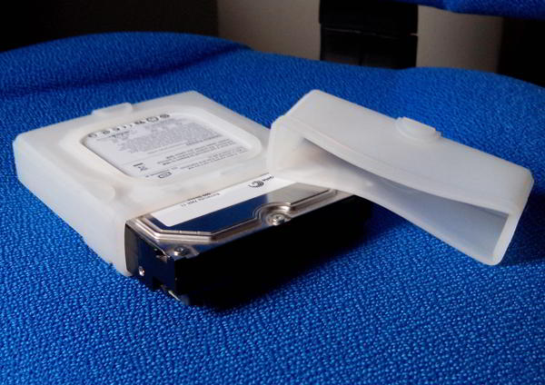

**Ficha técnica:**  
Nombre: Conceptronic C05-503  
Fabricante: Conceptronic  
Precio: 26.37 €

Hace un par de semanas compré [este dock en Amazon](http://www.amazon.es/dp/B004KQ9CYK). Mi idea era poder aprovechar el disco duro de mi anterior PC, un [Seagate Barracuda 7200.11](../../../2008/06/seagate-barracuda-720011) de 500 GB todavía en buen estado y con conexión S-ATA II. Las dos características más importantes de este periférico es que se conecta mediante USB (escogí la versión con USB 2.0 por cuestiones de compatibilidad con mi ordenador) y que tanto puede alojar discos S-ATA de 2.5 como de 3.5 pulgadas.

Además su aspecto combina a la perfección con el resto de elementos que hay en mi escritorio (como por ejemplo [mis altavoces](../../../2006/01/logitech-z-4/)); pero también existe una versión en blanco, de pinta un poco más "mac". Eso sí, para que el disco duro quedase un poco protegido, acompañé la compra con [ésta funda de silicona](http://www.amazon.es/dp/B002GWO8OY), que tiene una tapa del mismo material que al retirarla permite el acceso a los conectores.

La caja contiene el dock, el cable de corriente y un cable USB de una longitud realmente ridícula, además de un testimonial e inútil manual de usuario. En la parte delantera del periférico no hay nada que destacar excepto el logotipo que se ilumina cuando la unidad está operando. Como se ve en la imagen, en la parte trasera encontramos el conector para el alimentador y para el USB, así como un interruptor. El dock está construido en plástico en su totalidad, lo que no transmite una sensación de resistencia especialmente buena, pero reposa estable sobre sus cuatro esquinas.

Los discos duros de 2.5 pulgadas (típicos de portátiles) quedan perfectamente sujetos y la tapa cubre el espacio sobrante de la bahía. Los de 3.5'' sin embargo, parece que se vayan a tambalear un poco más, pero aguantan en su sitio.

He podido comprobar su funcionamiento con discos S-ATA (1,5 Gbit/s), S-ATA II (3 Gbit/s) y S-ATA III (6 Gbit/s). No he tenido problemas con ninguno y todos operaban a la velocidad esperada. Como al insertarlos en el dock la mayor parte de su cuerpo queda al descubierto, el calor generado se disipa sin problemas en la temperatura ambiente.

En definitiva, se trata de un periférico bastante útil. No tiene porqué ser necesariamente este, pero su atractivo precio lo sitúa dentro del abanico de opciones recomendables que yo barajaría. Si dispones de varios discos que, por lo que sea, no puedes o no quieres montar de forma interna, adelante 👍🏾

**NOTA: 6.5**

**Lo mejor de Conceptronic C05-503:**  
Compatibilidad con discos de 2.5 y 3.5 pulgadas  
Conexión USB 2.0 y compatibilidad con Windows/OS X/Linux  
Aspecto externo muy cuidado

**Lo peor de Conceptronic C05-503:**  
Los discos de 3.5'' no quedan tan firmemente sujetos como los pequeños  
Solo puedes conectar un disco a la vez  
Los materiales de construcción y el ridículo cable USB incluído